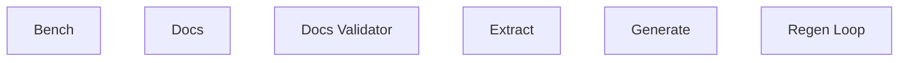

# Functional Analysis: Docs Validator

## Capability Inventory

| ID | Capability | Priority | Status | Description |
|----|-----------|----------|--------|-------------|
| CAP-1 | Bench | medium | ACTIVE | — |
| CAP-2 | Docs | medium | ACTIVE | — |
| CAP-3 | Docs Validator | medium | ACTIVE | — |
| CAP-4 | Extract | medium | ACTIVE | — |
| CAP-5 | Generate | medium | ACTIVE | — |
| CAP-6 | Regen Loop | medium | ACTIVE | — |

## Functional Decomposition

## Capability-Component Mapping

*No realizes relationships defined.*

## Behavioral Coverage

*No behaviors defined.*
