# Functional Analysis: System

## Capability Inventory

| ID | Capability | Priority | Status | Description |
|----|-----------|----------|--------|-------------|
| CAP-1 | Selector | medium | ACTIVE | — |
| CAP-2 | Templates | medium | ACTIVE | — |
| CAP-3 | Diagrams | medium | ACTIVE | — |
| CAP-4 | Cache | medium | ACTIVE | — |
| CAP-5 | Formatter | medium | ACTIVE | — |
| CAP-6 | Pipeline Bridge | medium | ACTIVE | — |
| CAP-7 | Patterns | medium | ACTIVE | — |
| CAP-8 | Resolution | medium | ACTIVE | — |
| CAP-9 | Quality | medium | ACTIVE | — |
| CAP-10 | Metrics | medium | ACTIVE | — |
| CAP-11 | Docs Validator | medium | ACTIVE | — |
| CAP-12 | Calibrate | medium | ACTIVE | — |
| CAP-13 | Spot Check | medium | ACTIVE | — |
| CAP-14 | CLI Main | medium | ACTIVE | — |

## Functional Decomposition

```mermaid
graph TD
    CAP-1["Selector"]
    CAP-2["Templates"]
    CAP-3["Diagrams"]
    CAP-4["Cache"]
    CAP-5["Formatter"]
    CAP-6["Pipeline Bridge"]
    CAP-7["Patterns"]
    CAP-8["Resolution"]
    CAP-9["Quality"]
    CAP-10["Metrics"]
    CAP-11["Docs Validator"]
    CAP-12["Calibrate"]
    CAP-13["Spot Check"]
    CAP-14["CLI Main"]
```

## Capability-Component Mapping

*No realizes relationships defined.*

## Behavioral Coverage

*No behaviors defined.*
