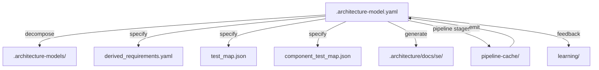
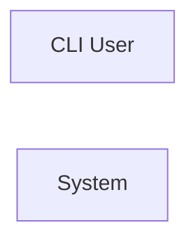
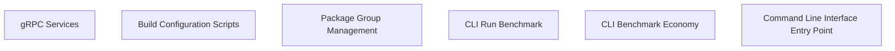
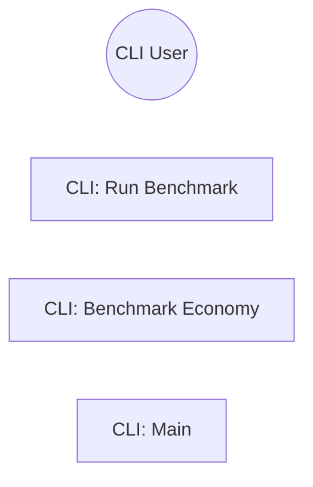

# Artifact Traceability Map: System

## 1. Entity Inventory

| Entity Type | Count | Feeds SE Documents |
|-------------|-------|--------------------|
| Components | 57 | Logical Architecture, Maintenance Manual, Operations Manual, Interface Specification |
| Capabilities | 6 | ConOps, Functional Analysis, Requirements Analysis |
| Behaviors | 3 | Use Cases, Functional Analysis, Verification & Validation |
| Interfaces | 1 | Interface Specification, Logical Architecture |
| Constraints | 0 | Requirements Analysis, Risk Assessment |
| Requirements | 0 | Requirements Analysis, Verification & Validation |
| Actors | 1 | ConOps, Use Cases |
| Layers | 2 | Logical Architecture |

## 2. Artifact Dependency Graph



## 3. Entity-to-Artifact Traceability Matrix

| Artifact | Components | Capabilities | Behaviors | Interfaces | Constraints | Requirements | Actors | Layers |
|---|---|---|---|---|---|---|---|---|
| ConOps | | **6** | | | | | **1** | |
| Functional Analysis | | **6** | **3** | | | | | |
| Interface Specification | **57** | | | **1** | | | | |
| Logical Architecture | **57** | | | **1** | | | | **2** |
| Maintenance Manual | **57** | | | | | | | |
| Operations Manual | **57** | | | | | | | |
| Requirements Analysis | | **6** | | | — | — | | |
| Risk Assessment | | | | | — | | | |
| Use Cases | | | **3** | | | | **1** | |
| Verification & Validation | | | **3** | | | — | | |

## 4. Relationship Distribution

| Relationship Type | Count | Connects |
|-------------------|-------|----------|
| depends-on | 168 | Component → Component, Unknown → Unknown |
| realizes | 55 | Component → Capability, Component → Unknown, Unknown → Capability |
| contains | 43 | Unknown → Component |
| uses | 4 | Component → Component |

## 5. Traceability Gaps

- **Constraints** — 0 entities; leaves gaps in: Requirements Analysis, Risk Assessment
- **Requirements** — 0 entities; leaves gaps in: Requirements Analysis, Verification & Validation
- **allocated-to** relationship type missing — weakens cross-entity traceability
- **constrained-by** relationship type missing — weakens cross-entity traceability

## 6. Architecture File Map

| Path | Purpose | Generated By |
|------|---------|-------------|
| `.architecture-model.yaml` | Canonical architecture model (source of truth) | Pipeline emit stage |
| `.architecture-models/` | Per-system sub-models from decomposition | Pipeline decompose stage |
| `.architecture/` | Root directory for all architecture artifacts | Pipeline |
| `.architecture/derived_requirements.yaml` | Requirements derived from model analysis | Pipeline specify stage |
| `.architecture/test_map.json` | Mapping of components to test files | Pipeline specify stage |
| `.architecture/component_test_map.json` | Component-level test coverage map | Pipeline specify stage |
| `.architecture/pipeline-cache/` | Cached intermediate pipeline stage results | Pipeline (all stages) |
| `.architecture/docs/se/` | Generated SE documents | SE doc generator |
| `.architecture/learning/` | Accumulated heuristics and learnings | Learning subsystem |

## LLM Review Status

| Artifact | Reviewed | Summary | Comments Count | Timestamp |
|----------|----------|---------|----------------|-----------|
| .architecture-model.yaml | Yes | This is a system-of-systems architecture model for an architecture tooling platform with MCP servers, CLI interfaces, and supporting libraries. The model is broad but suffers from mixing abstraction levels—subsystem references coexist with inline component definitions, and several components duplicate file references already covered by child model_path entries. | 4 | 2026-08-18T23:31:42.096546+00:00 |
| docs/se/artifact-traceability.md | Yes | This ConOps is essentially empty — a skeleton with 0% model completeness, no behavioral specifications, no requirements, no interface details, and no meaningful scenario descriptions, making it unusable as an architecture artifact. | 3 | 2026-08-18T23:31:46.095801+00:00 |
| docs/se/conops.md | Yes | This ConOps is essentially empty — it was auto-generated from a model with 0% completeness, containing no behavioral specifications, no interfaces, no requirements, and no actor goals, making it useless as an architecture artifact in its current state. | 2 | 2026-08-18T23:31:51.385068+00:00 |
| docs/se/data-model.md | Yes | This data model document is essentially empty of meaningful architectural content—it lists source file groupings but provides no actual data model information such as entities, relationships, schemas, or data flows, rendering it ineffective as an architecture artifact. | 2 | 2026-08-18T23:31:57.798259+00:00 |
| docs/se/functional-analysis.md | Yes | This functional analysis document is essentially a skeleton with 0% model completeness, containing auto-generated placeholder content where capabilities appear arbitrarily mapped to components with nonsensical names (e.g., "Quality," "Correct," "Decompose" realizing "gRPC Services" or "CLI Benchmark Economy"), suggesting the extraction pipeline produced meaningless associations rather than a genuine architectural decomposition. | 2 | 2026-08-18T23:32:05.109628+00:00 |
| docs/se/interface-specification.md | Yes | This interface specification is essentially empty, documenting only a single unnamed internal CLI interface with no protocol, provider, consumer, or behavioral details. At 0% model completeness, it provides no architectural value in its current state. | 2 | 2026-08-18T23:32:11.662985+00:00 |
| docs/se/logical-architecture.md | Yes | This logical architecture document is essentially a skeleton with 0% model completeness—no behavioral specifications, no interfaces, no requirements, and no responsibilities defined for any of the 57 components. The layer structure is minimal and most components are unassigned, indicating the extraction pipeline has not been meaningfully run or curated. | 4 | 2026-08-18T23:32:21.592576+00:00 |
| docs/se/maintenance-manual.md | Yes | This maintenance manual is essentially a skeleton with 0% model completeness—all 57 components lack behavioral specifications, interfaces, signatures, and test contracts, rendering it unusable for actual maintenance guidance. | 2 | 2026-08-18T23:32:27.941778+00:00 |
| docs/se/operations-manual.md | Yes | This operations manual is essentially empty, providing no actionable operational guidance. The Model Completeness score of F (0%) confirms that the underlying architecture model lacks the behavioral specifications, interfaces, and constraints needed to generate useful operational documentation. | 2 | 2026-08-18T23:32:33.871401+00:00 |
| docs/se/requirements-analysis.md | Yes | This requirements analysis document is essentially empty, serving only as a placeholder generated by tooling at 0% completeness, with no constraints, requirements, traceability, or coverage gaps defined despite 57 components existing in the model. | 2 | 2026-08-18T23:32:39.842535+00:00 |
| docs/se/risk-assessment.md | Yes | This risk assessment is largely hollow due to 0% model completeness — it captures only dependency fan-in/fan-out risks via static analysis, with no behavioral, interface, or constraint-based risks identified, making it insufficient for meaningful architectural decision-making. | 3 | 2026-08-18T23:32:47.243780+00:00 |
| docs/se/security-analysis.md | Yes | This security analysis document is essentially empty and provides no meaningful security insights. With 0% model completeness, no behavioral specifications, no interfaces, no requirements, and no security constraints defined, the document serves only as a placeholder indicating that security analysis has not yet been performed. | 2 | 2026-08-18T23:32:53.346221+00:00 |
| docs/se/use-cases.md | Yes | This use cases document is essentially a skeleton with no substantive content—use cases lack descriptions, preconditions, postconditions, steps, or any behavioral detail, and the actor-goal matrix is empty despite three use cases being listed. | 2 | 2026-08-18T23:32:58.168030+00:00 |
| docs/se/verification-validation.md | Yes | This verification & validation artifact reveals a completely untested system with 0% coverage across all 57 components, no requirements defined, no constraints, and no behavioral specifications—rendering it effectively useless as a V&V document in its current state. | 2 | 2026-08-18T23:33:04.012558+00:00 |

## LLM Enrichment Provenance

| Entity ID | Type | Stage | Old Value | New Value | Timestamp |
|-----------|------|-------|-----------|-----------|-----------|
| CAP-2 | capability | infer | Scripts | Build Configuration Scripts | 2026-08-18T18:31:15 |
| CAP-3 | capability | infer | Src | Package Group Management | 2026-08-18T18:31:16 |
| CAP-6 | capability | infer | CLI Main | Command Line Interface Entry Point | 2026-08-18T18:31:18 |
| COMP-2 | component | allocate | Scripts | Benchmark Scripts | 2026-08-18T18:31:20 |
| COMP-3-2 | component | allocate | Src (llm) | LLM Integration Layer | 2026-08-18T18:31:23 |
| COMP-3-7 | component | allocate | Src (mcp) | MCP Quality Server | 2026-08-18T18:31:25 |
| COMP-3-9 | component | allocate | Src (cli) | CLI Commands | 2026-08-18T18:31:27 |

## Review Details

### .architecture-model.yaml

**Summary:** This is a system-of-systems architecture model for an architecture tooling platform with MCP servers, CLI interfaces, and supporting libraries. The model is broad but suffers from mixing abstraction levels—subsystem references coexist with inline component definitions, and several components duplicate file references already covered by child model_path entries.

- Files like `src/opencode_arch/mcp/__main__.py` and `src/opencode_arch/mcp/server.py` appear in both `src-mcp-COMP-29` and `COMP-3-7`, creating ambiguous ownership that undermines traceability.
- The `COMP-3-*` components at the top level duplicate concerns that should live entirely within their respective subsystem models (referenced via `model_path`), violating the system-of-systems delegation pattern.
- Capabilities (CAP-1 through CAP-6) and behaviors (BEH-1 through BEH-3) are declared but have no explicit mappings to components or systems, making them structurally orphaned in this file.
- The MCP tools subsystem has 28+ individual tool components which may benefit from logical grouping (e.g., authoring tools, validation tools, analysis tools) to reduce cognitive load at this architectural level.

<details>
<summary>Prompt and response</summary>

**Prompt sent:**
```
Review the following architecture artifact '.architecture-model.yaml'.
Respond ONLY in this format:
SUMMARY: <one paragraph overall assessment>
COMMENT: <specific observation>
COMMENT: <another observation>

---
meta:
  schema_version: '2.0'
  system_of_systems: true
entities:
  systems:
  - id: SYS-src-(artifacts)
    name: Src (artifacts)
    model_path: src-artifacts/.architecture-model.yaml
  - id: SYS-src-(llm)
    name: Src (llm)
    model_path: src-llm/.architecture-model.yaml
  - id: SYS-src-(learning)
    name: Src (learning)
    model_path: src-learning/.architecture-model.yaml
  - id: SYS-src-(mcp)
    name: Src (mcp)
    model_path: src-mcp/.architecture-model.yaml
  - id: SYS-src-(cli)
    name: Src (cli)
    model_path: src-cli/.architecture-model.yaml
  - id: SYS-scripts
    name: Scripts
    model_path: scripts/.architecture-model.yaml
  - id: SYS-src-(context)
    name: Src (context)
    model_path: src-context/.architecture-model.yaml
  - id: SYS-src-(runner)
    name: Src (runner)
    model_path: src-runner/.architecture-model.yaml
  - id: SYS-src-(agent)
    name: Src (agent)
    model_path: src-agent/.architecture-model.yaml
  - id: SYS-src-(requirements)
    name: Src (requirements)
    model_path: src-requirements/.architecture-model.yaml
  - id: SYS-src-(prompts)
    name: Src (prompts)
    model_path: src-prompts/.architecture-model.yaml
  - id: SYS-src-(extract)
    name: Src (extract)
    model_path: src-extract/.architecture-model.yaml
  - id: SYS-src-(telemetry)
    name: Src (telemetry)
    model_path: src-telemetry/.architecture-model.yaml
  - id: SYS-src-(regen)
    name: Src (regen)
    model_path: src-regen/.architecture-model.yaml
  actors:
  - id: ACT-1
    name: CLI User
  capabilities:
  - id: CAP-1
    name: gRPC Services
  - id: CAP-2
    name: Build Configuration Scripts
  - id: CAP-3
    name: Package Group Management
  - id: CAP-4
    name: CLI Run Benchmark
  - id: CAP-5
    name: CLI Benchmark Economy
  - id: CAP-6
    name: Command Line Interface Entry Point
  behaviors:
  - id: BEH-1
    name: 'CLI: Run Benchmark'
  - id: BEH-2
    name: 'CLI: Benchmark Economy'
  - id: BEH-3
    name: 'CLI: Main'
  components:
  - id: src-mcp-COMP-1
    name: Quality
    files:
    - src/opencode_arch/mcp/quality.py
  - id: src-mcp-COMP-2
    name: Assess
    files:
    - src/opencode_arch/mcp/tools/assess.py
  - id: src-mcp-COMP-3
    name: Author
    files:
    - src/opencode_arch/mcp/tools/author.py
  - id: src-mcp-COMP-4
    name: Check
    files:
    - src/opencode_arch/mcp/tools/check.py
  - id: src-mcp-COMP-5
    name: Correct
    files:
    - src/opencode_arch/mcp/tools/correct.py
  - id: src-mcp-COMP-6
    name: Decompose
    files:
    - src/opencode_arch/mcp/tools/decompose.py
  - id: src-mcp-COMP-7
    name: Diff
    files:
    - src/opencode_arch/mcp/tools/diff.py
  - id: src-mcp-COMP-8
    name: Docs
    files:
    - src/opencode_arch/mcp/tools/docs.py
  - id: src-mcp-COMP-9
    name: Evaluate
    files:
    - src/opencode_arch/mcp/tools/evaluate.py
  - id: src-mcp-COMP-10
    name: Export
    files:
    - src/opencode_arch/mcp/tools/export.py
  - id: src-mcp-COMP-11
    name: Extract
    files:
    - src/opencode_arch/mcp/tools/extract.py
  - id: src-mcp-COMP-12
    name: Feedback
    files:
    - src/opencode_arch/mcp/tools/feedback.py
  - id: src-mcp-COMP-13
    name: Gate
    files:
    - src/opencode_arch/mcp/tools/gate.py
  - id: src-mcp-COMP-14
    name: Generate
    files:
    - src/opencode_arch/mcp/tools/generate.py
  - id: src-mcp-COMP-15
    name: Group
    files:
    - src/opencode_arch/mcp/tools/group.py
  - id: src-mcp-COMP-16
    name: Ingest
    files:
    - src/opencode_arch/mcp/tools/ingest.py
  - id: src-mcp-COMP-17
    name: Learn
    files:
    - src/opencode_arch/mcp/tools/learn.py
  - id: src-mcp-COMP-18
    name: Llm Audit
    files:
    - src/opencode_arch/mcp/tools/llm_audit.py
  - id: src-mcp-COMP-19
    name: Log
    files:
    - src/opencode_arch/mcp/tools/log.py
  - id: src-mcp-COMP-20
    name: Pipeline
    files:
    - src/opencode_arch/mcp/tools/pipeline.py
  - id: src-mcp-COMP-21
    name: Regen Score
    files:
    - src/opencode_arch/mcp/tools/regen_score.py
  - id: src-mcp-COMP-22
    name: Require
    files:
    - src/opencode_arch/mcp/tools/require.py
  - id: src-mcp-COMP-23
    name: Scan
    files:
    - src/opencode_arch/mcp/tools/scan.py
  - id: src-mcp-COMP-24
    name: Slice
    files:
    - src/opencode_arch/mcp/tools/slice.py
  - id: src-mcp-COMP-25
    name: Stats
    files:
    - src/opencode_arch/mcp/tools/stats.py
  - id: src-mcp-COMP-26
    name: Sync
    files:
    - src/opencode_arch/mcp/tools/sync.py
  - id: src-mcp-COMP-27
    name: Trace Requirements
    files:
    - src/opencode_arch/mcp/tools/trace_requirements.py
  - id: src-mcp-COMP-28
    name: Validate
    files:
    - src/opencode_arch/mcp/tools/validate.py
  - id: src-mcp-COMP-29
    name: Infrastructure
    files:
    - src/opencode_arch/mcp/__main__.py
    - src/opencode_arch/mcp/server.py
  - id: src-cli-COMP-1
    name: Bench
    files:
    - src/opencode_arch/cli/bench.py
  - id: src-cli-COMP-2
    name: Calibrate
    files:
    - src/opencode_arch/cli/calibrate.py
  - id: src-cli-COMP-3
    name: Confidence
    files:
    - src/opencode_arch/cli/confidence.py
  - id: src-cli-COMP-4
    name: Docs
    files:
    - src/opencode_arch/cli/docs.py
  - id: src-cli-COMP-5
    name: Docs Validator
    files:
    - src/opencode_arch/cli/docs_validator.py
  - id: src-cli-COMP-6
    name: Export Data
    files:
    - src/opencode_arch/cli/export_data.py
  - id: src-cli-COMP-7
    name: Extract
    files:
    - src/opencode_arch/cli/extract.py
  - id: src-cli-COMP-8
    name: Gap Analyzer
    files:
    - src/opencode_arch/cli/gap_analyzer.py
  - id: src-cli-COMP-9
    name: Generate
    files:
    - src/opencode_arch/cli/generate.py
  - id: src-cli-COMP-10
    name: Launch
    files:
    - src/opencode_arch/cli/launch.py
  - id: src-cli-COMP-11
    name: Main
    files:
    - src/opencode_arch/cli/main.py
  - id: src-cli-COMP-12
    name: Metrics
    files:
    - src/opencode_arch/cli/metrics.py
  - id: src-cli-COMP-13
    name: Regen Loop
    files:
    - src/opencode_arch/cli/regen_loop.py
  - id: src-cli-COMP-14
    name: Infrastructure
    files:
    - src/opencode_arch/cli/prompts.py
  - id: COMP-2
    name: Benchmark Scripts
    files:
    - scripts/benchmark_economy.py
    - scripts/run_benchmark.py
    layer: infra
  - id: COMP-3-1
    name: Src (artifacts)
    files:
    - src/opencode_arch/artifacts/__init__.py
    - src/opencode_arch/artifacts/context.py
    - src/opencode_arch/artifacts/diagrams.py
    - src/opencode_arch/artifacts/selector.py
    - src/opencode_arch/artifacts/templates.py
    layer: data
  - id: COMP-3-2
    name: LLM Integration Layer
    files:
    - src/opencode_arch/llm/cache.py
    - src/opencode_arch/llm/prompts/audit.py
    - src/opencode_arch/llm/prompts/matching.py
    - src/opencode_arch/llm/prompts/requirements.py
    - src/opencode_arch/llm/relay.py
    layer: data
  - id: COMP-3-3
    name: Src (context)
    files:
    - src/opencode_arch/context/__init__.py
    - src/opencode_arch/context/formatter.py
    - src/opencode_arch/context/pipeline_bridge.py
    layer: data
  - id: COMP-3-4
    name: Src (learning)
    files:
    - src/opencode_arch/learning/__init__.py
    - src/opencode_arch/learning/adapter.py
    - src/opencode_arch/learning/assessor.py
    - src/opencode_arch/learning/classifier.py
    - src/opencode_arch/learning/lessons.py
    - src/opencode_arch/learning/maintainer.py
    - src/opencode_arch/learning/patterns.py
    layer: data
  - id: COMP-3-5
    name: Src (runner)
    files:
    - src/opencode_arch/runner/base.py
    - src/opencode_arch/runner/opencode.py
    layer: data
  - id: COMP-3-6
    name: Src (agent)
    files:
    - src/opencode_arch/agent/resolution.py
    layer: data
  - id: COMP-3-7
    name: MCP Quality Server
    files:
    - src/opencode_arch/mcp/__main__.py
    - src/opencode_arch/mcp/quality.py
    - src/opencode_arch/mcp/server.py
    - src/opencode_arch/mcp/tools/assess.py
    - src/opencode_arch/mcp/tools/author.py
  
---
```

**Response received:**
```
SUMMARY: This is a system-of-systems architecture model for an architecture tooling platform with MCP servers, CLI interfaces, and supporting libraries. The model is broad but suffers from mixing abstraction levels—subsystem references coexist with inline component definitions, and several components duplicate file references already covered by child model_path entries.

COMMENT: Files like `src/opencode_arch/mcp/__main__.py` and `src/opencode_arch/mcp/server.py` appear in both `src-mcp-COMP-29` and `COMP-3-7`, creating ambiguous ownership that undermines traceability.

COMMENT: The `COMP-3-*` components at the top level duplicate concerns that should live entirely within their respective subsystem models (referenced via `model_path`), violating the system-of-systems delegation pattern.

COMMENT: Capabilities (CAP-1 through CAP-6) and behaviors (BEH-1 through BEH-3) are declared but have no explicit mappings to components or systems, making them structurally orphaned in this file.

COMMENT: The MCP tools subsystem has 28+ individual tool components which may benefit from logical grouping (e.g., authoring tools, validation tools, analysis tools) to reduce cognitive load at this architectural level.
```

</details>

### docs/se/artifact-traceability.md

**Summary:** This ConOps is essentially empty — a skeleton with 0% model completeness, no behavioral specifications, no requirements, no interface details, and no meaningful scenario descriptions, making it unusable as an architecture artifact.

- All 57 components lack behavioral specifications and interfaces, meaning this document communicates nothing about what the system actually does or how components interact.
- The mermaid context diagram shows the CLI User and System with no connection between them, failing to represent even the single defined interface.
- The six "capabilities" (gRPC Services, Scripts, Src, CLI Run Benchmark, CLI Benchmark Economy, CLI Main) mix implementation concerns (Src, Scripts) with actual capabilities, suggesting the model was auto-extracted from directory structure rather than intentionally architected.

<details>
<summary>Prompt and response</summary>

**Prompt sent:**
```
Review the following architecture artifact 'docs/se/artifact-traceability.md'.
Respond ONLY in this format:
SUMMARY: <one paragraph overall assessment>
COMMENT: <specific observation>
COMMENT: <another observation>

---
---
document: Artifact Traceability Map
system: System
system_id: SYS-unknown
generated_at: 2026-08-18T23:31:29Z
generator_version: 0.3.0
model_hash: efca59bc201d
edition: 6
---

> **Model Completeness: F (0%)**
> Some sections may be empty due to missing model entities.
> - 57/57 components have no behavioral specification
> - No interfaces defined on components → interface-spec doc empty
> - No requirements defined
> - Actors defined but missing goals/descriptions
> Run the extraction pipeline or manually add behaviors/interfaces/constraints.

# Artifact Traceability Map: System
## 1. Entity Inventory
| Entity Type | Count | Feeds SE Documents |
|-------------|-------|--------------------|
| Components | 57 | Logical Architecture, Maintenance Manual, Operations Manual, Interface Specification |
| Capabilities | 6 | ConOps, Functional Analysis, Requirements Analysis |
| Behaviors | 3 | Use Cases, Functional Analysis, Verification & Validation |
| Interfaces | 1 | Interface Specification, Logical Architecture |
| Constraints | 0 | Requirements Analysis, Risk Assessment |
| Requirements | 0 | Requirements Analysis, Verification & Validation |
| Actors | 1 | ConOps, Use Cases |
| Layers | 2 | Logical Architecture |
## 2. Artifact Dependency Graph

## 3. Entity-to-Artifact Traceability Matrix
| Artifact | Components | Capabilities | Behaviors | Interfaces | Constraints | Requirements | Actors | Layers |
|---|---|---|---|---|---|---|---|---|
| ConOps | | **6** | | | | | **1** | |
| Functional Analysis | | **6** | **3** | | | | | |
| Interface Specification | **57** | | | **1** | | | | |
| Logical Architecture | **57** | | | **1** | | | | **2** |
| Maintenance Manual | **57** | | | | | | | |
| Operations Manual | **57** | | | | | | | |
| Requirements Analysis | | **6** | | | — | — | | |
| Risk Assessment | | | | | — | | | |
| Use Cases | | | **3** | | | | **1** | |
| Verification & Validation | | | **3** | | | — | | |
## 4. Relationship Distribution
| Relationship Type | Count | Connects |
|-------------------|-------|----------|
| depends-on | 168 | Component → Component, Unknown → Unknown |
| realizes | 55 | Component → Capability, Component → Unknown, Unknown → Capability |
| contains | 43 | Unknown → Component |
| uses | 4 | Component → Component |
## 5. Traceability Gaps
- **Constraints** — 0 entities; leaves gaps in: Requirements Analysis, Risk Assessment
- **Requirements** — 0 entities; leaves gaps in: Requirements Analysis, Verification & Validation
- **allocated-to** relationship type missing — weakens cross-entity traceability
- **constrained-by** relationship type missing — weakens cross-entity traceability
## 6. Architecture File Map
| Path | Purpose | Generated By |
|------|---------|-------------|
| `.architecture-model.yaml` | Canonical architecture model (source of truth) | Pipeline emit stage |
| `.architecture-models/` | Per-system sub-models from decomposition | Pipeline decompose stage |
| `.architecture/` | Root directory for all architecture artifacts | Pipeline |
| `.architecture/derived_requirements.yaml` | Requirements derived from model analysis | Pipeline specify stage |
| `.architecture/test_map.json` | Mapping of components to test files | Pipeline specify stage |
| `.architecture/component_test_map.json` | Component-level test coverage map | Pipeline specify stage |
| `.architecture/pipeline-cache/` | Cached intermediate pipeline stage results | Pipeline (all stages) |
| `.architecture/docs/se/` | Generated SE documents | SE doc generator |
| `.architecture/learning/` | Accumulated heuristics and learnings | Learning subsystem |
## LLM Review Status
No LLM reviews available.
## LLM Enrichment Provenance
No LLM enrichment records available.
## Review Details
No review details available.

---
```

**Response received:**
```
SUMMARY: This traceability artifact reveals a severely incomplete architecture model (0% completeness) with 57 components but zero constraints, zero requirements, and minimal behaviors/interfaces, rendering most downstream SE documents effectively empty and breaking critical traceability chains for verification and risk assessment.
COMMENT: The circular dependency between CACHE and MODEL in the dependency graph (CACHE -->|emit| MODEL and MODEL -->|pipeline stages| CACHE) suggests a regenerative pipeline, but this cycle should be documented with clear stage ordering to prevent confusion about the actual source of truth.
COMMENT: 168 "depends-on" relationships dominating the relationship distribution versus only 4 "uses" relationships suggests the model may be over-relying on a single generic relationship type rather than precisely characterizing component interactions.
COMMENT: The "Unknown → Unknown" and "Unknown → Capability" entries in the Relationship Distribution table indicate orphaned or untyped entities in the model that need classification.
COMMENT: With 57 components feeding the Maintenance Manual and Operations Manual but zero behavioral specifications, those documents will contain only structural listings with no actionable operational or maintenance procedures.
```

</details>

### docs/se/conops.md

**Summary:** This ConOps is essentially empty — a skeleton with 0% model completeness, no behavioral specifications, no requirements, no interface details, and no meaningful scenario descriptions, making it unusable as an architecture artifact.

- All 57 components lack behavioral specifications and interfaces, meaning this document communicates nothing about what the system actually does or how components interact.
- The mermaid context diagram shows the CLI User and System with no connection between them, failing to represent even the single defined interface.
- The six "capabilities" (gRPC Services, Scripts, Src, CLI Run Benchmark, CLI Benchmark Economy, CLI Main) mix implementation concerns (Src, Scripts) with actual capabilities, suggesting the model was auto-extracted from directory structure rather than intentionally architected.

<details>
<summary>Prompt and response</summary>

**Prompt sent:**
```
Review the following architecture artifact 'docs/se/conops.md'.
Respond ONLY in this format:
SUMMARY: <one paragraph overall assessment>
COMMENT: <specific observation>
COMMENT: <another observation>

---
---
document: ConOps
system: System
system_id: SYS-unknown
generated_at: 2026-08-18T23:29:09Z
generator_version: 0.3.0
model_hash: efca59bc201d
edition: 6
---

> **Model Completeness: F (0%)**
> Some sections may be empty due to missing model entities.
> - 57/57 components have no behavioral specification
> - No interfaces defined on components → interface-spec doc empty
> - No requirements defined
> - Actors defined but missing goals/descriptions
> Run the extraction pipeline or manually add behaviors/interfaces/constraints.

# Concept of Operations: System
---
```

**Response received:**
```
<thinking>
Let me review this ConOps artifact.
</thinking>

SUMMARY: This ConOps is essentially empty — a skeleton with 0% model completeness, no behavioral specifications, no requirements, no interface details, and no meaningful scenario descriptions, making it unusable as an architecture artifact.

COMMENT: All 57 components lack behavioral specifications and interfaces, meaning this document communicates nothing about what the system actually does or how components interact.

COMMENT: The mermaid context diagram shows the CLI User and System with no connection between them, failing to represent even the single defined interface.

COMMENT: The six "capabilities" (gRPC Services, Scripts, Src, CLI Run Benchmark, CLI Benchmark Economy, CLI Main) mix implementation concerns (Src, Scripts) with actual capabilities, suggesting the model was auto-extracted from directory structure rather than intentionally architected.
```

</details>

### docs/se/conops.md

**Summary:** This ConOps is essentially empty — it was auto-generated from a model with 0% completeness, containing no behavioral specifications, no interfaces, no requirements, and no actor goals, making it useless as an architecture artifact in its current state.

- All 57 components lack behavioral specifications, meaning this document communicates nothing about what the system actually does or how it operates.
- The mermaid context diagram shows no connections between the CLI User and the System, indicating even the most basic interaction modeling is missing.

<details>
<summary>Prompt and response</summary>

**Prompt sent:**
```
Review the following architecture artifact 'docs/se/conops.md'.
Respond ONLY in this format:
SUMMARY: <one paragraph overall assessment>
COMMENT: <specific observation>
COMMENT: <another observation>

---
---
document: ConOps
system: System
system_id: SYS-unknown
generated_at: 2026-08-18T23:31:28Z
generator_version: 0.3.0
model_hash: efca59bc201d
edition: 7
---

> **Model Completeness: F (0%)**
> Some sections may be empty due to missing model entities.
> - 57/57 components have no behavioral specification
> - No interfaces defined on components → interface-spec doc empty
> - No requirements defined
> - Actors defined but missing goals/descriptions
> Run the extraction pipeline or manually add behaviors/interfaces/constraints.

# Concept of Operations: System
## System Overview
System provides 6 capabilities implemented across 57 components.

**Core Capabilities:**

- **gRPC Services**
- **Build Configuration Scripts**
- **Package Group Management**
- **CLI Run Benchmark**
- **CLI Benchmark Economy**
- **Command Line Interface Entry Point**
## Stakeholders
| Actor | Type | Goals |
|-------|------|-------|
| CLI User | human | — |
## Operational Scenarios
### System Workflows

- **CLI: Run Benchmark**: —
- **CLI: Benchmark Economy**: —
- **CLI: Main**: —
## System Context
### External Interfaces

| Interface | Type | Provider | Consumer |
|-----------|------|----------|----------|
| main CLI | internal | — | — |


## Operational Constraints
*No constraints defined in the model.*

---
---
```

**Response received:**
```
SUMMARY: This ConOps is essentially empty — it was auto-generated from a model with 0% completeness, containing no behavioral specifications, no interfaces, no requirements, and no actor goals, making it useless as an architecture artifact in its current state.
COMMENT: All 57 components lack behavioral specifications, meaning this document communicates nothing about what the system actually does or how it operates.
COMMENT: The mermaid context diagram shows no connections between the CLI User and the System, indicating even the most basic interaction modeling is missing.
```

</details>

### docs/se/data-model.md

**Summary:** This data model document is essentially empty of meaningful architectural content—it lists source file groupings but provides no actual data model information such as entities, relationships, schemas, or data flows, rendering it ineffective as an architecture artifact.

- The document is labeled "Data Model" but contains no data entities, attributes, relationships, or schemas; it merely lists component file paths, which belongs in a component inventory, not a data model document.
- The 0% model completeness score with 57/57 components lacking behavioral specification confirms this is a scaffold with no substantive content, providing no architectural value in its current state.

<details>
<summary>Prompt and response</summary>

**Prompt sent:**
```
Review the following architecture artifact 'docs/se/data-model.md'.
Respond ONLY in this format:
SUMMARY: <one paragraph overall assessment>
COMMENT: <specific observation>
COMMENT: <another observation>

---
---
document: Data Model
system: System
system_id: SYS-unknown
generated_at: 2026-08-18T23:31:29Z
generator_version: 0.3.0
model_hash: efca59bc201d
edition: 5
---

> **Model Completeness: F (0%)**
> Some sections may be empty due to missing model entities.
> - 57/57 components have no behavioral specification
> - No interfaces defined on components → interface-spec doc empty
> - No requirements defined
> - Actors defined but missing goals/descriptions
> Run the extraction pipeline or manually add behaviors/interfaces/constraints.

# Data Model: System
## Data Components
### Src (artifacts) (COMP-3-1)
**Files:** `src/opencode_arch/artifacts/__init__.py`, `src/opencode_arch/artifacts/context.py`, `src/opencode_arch/artifacts/diagrams.py`, `src/opencode_arch/artifacts/selector.py`, `src/opencode_arch/artifacts/templates.py`

### Src (llm) (COMP-3-2)
**Files:** `src/opencode_arch/llm/cache.py`, `src/opencode_arch/llm/prompts/audit.py`, `src/opencode_arch/llm/prompts/matching.py`, `src/opencode_arch/llm/prompts/requirements.py`, `src/opencode_arch/llm/relay.py`

### Src (context) (COMP-3-3)
**Files:** `src/opencode_arch/context/__init__.py`, `src/opencode_arch/context/formatter.py`, `src/opencode_arch/context/pipeline_bridge.py`

### Src (learning) (COMP-3-4)
**Files:** `src/opencode_arch/learning/__init__.py`, `src/opencode_arch/learning/adapter.py`, `src/opencode_arch/learning/assessor.py`, `src/opencode_arch/learning/classifier.py`, `src/opencode_arch/learning/lessons.py`

### Src (runner) (COMP-3-5)
**Files:** `src/opencode_arch/runner/base.py`, `src/opencode_arch/runner/opencode.py`

### Src (agent) (COMP-3-6)
**Files:** `src/opencode_arch/agent/resolution.py`

### Src (mcp) (COMP-3-7)
**Files:** `src/opencode_arch/mcp/__main__.py`, `src/opencode_arch/mcp/quality.py`, `src/opencode_arch/mcp/server.py`, `src/opencode_arch/mcp/tools/assess.py`, `src/opencode_arch/mcp/tools/author.py`

### Src (requirements) (COMP-3-8)
**Files:** `src/opencode_arch/requirements/llm_extractor.py`, `src/opencode_arch/requirements/matcher.py`, `src/opencode_arch/requirements/parser.py`, `src/opencode_arch/requirements/retroactive.py`

### Src (cli) (COMP-3-9)
**Files:** `src/opencode_arch/cli/bench.py`, `src/opencode_arch/cli/calibrate.py`, `src/opencode_arch/cli/confidence.py`, `src/opencode_arch/cli/docs.py`, `src/opencode_arch/cli/docs_validator.py`

### Src (prompts) (COMP-3-10)
**Files:** `src/opencode_arch/prompts/regen.py`

### Src (extract) (COMP-3-11)
**Files:** `src/opencode_arch/extract/__init__.py`

### Src (telemetry) (COMP-3-12)
**Files:** `src/opencode_arch/telemetry/collector.py`, `src/opencode_arch/telemetry/recorder.py`, `src/opencode_arch/telemetry/store.py`

### Src (regen) (COMP-3-13)
**Files:** `src/opencode_arch/regen/self_heal.py`, `src/opencode_arch/regen/spot_check.py`

---
---
```

**Response received:**
```
SUMMARY: This data model document is essentially empty of meaningful architectural content—it lists source file groupings but provides no actual data model information such as entities, relationships, schemas, or data flows, rendering it ineffective as an architecture artifact.

COMMENT: The document is labeled "Data Model" but contains no data entities, attributes, relationships, or schemas; it merely lists component file paths, which belongs in a component inventory, not a data model document.

COMMENT: The 0% model completeness score with 57/57 components lacking behavioral specification confirms this is a scaffold with no substantive content, providing no architectural value in its current state.
```

</details>

### docs/se/functional-analysis.md

**Summary:** This functional analysis document is essentially a skeleton with 0% model completeness, containing auto-generated placeholder content where capabilities appear arbitrarily mapped to components with nonsensical names (e.g., "Quality," "Correct," "Decompose" realizing "gRPC Services" or "CLI Benchmark Economy"), suggesting the extraction pipeline produced meaningless associations rather than a genuine architectural decomposition.

- The capability-component mapping appears incoherent — components like "Correct," "Decompose," and "Author" are mapped to capabilities they have no obvious semantic relationship with, indicating either a flawed auto-extraction or placeholder/synthetic data.
- All 3 defined behaviors are untraced to any requirement or test, and 57/57 components lack behavioral specifications, making this document unsuitable for any architectural decision-making in its current state.

<details>
<summary>Prompt and response</summary>

**Prompt sent:**
```
Review the following architecture artifact 'docs/se/functional-analysis.md'.
Respond ONLY in this format:
SUMMARY: <one paragraph overall assessment>
COMMENT: <specific observation>
COMMENT: <another observation>

---
---
document: Functional Analysis
system: System
system_id: SYS-unknown
generated_at: 2026-08-18T23:31:28Z
generator_version: 0.3.0
model_hash: efca59bc201d
edition: 7
---

> **Model Completeness: F (0%)**
> Some sections may be empty due to missing model entities.
> - 57/57 components have no behavioral specification
> - No interfaces defined on components → interface-spec doc empty
> - No requirements defined
> - Actors defined but missing goals/descriptions
> Run the extraction pipeline or manually add behaviors/interfaces/constraints.

# Functional Analysis: System
## Capability Inventory
| ID | Capability | Priority | Status | Description |
|----|-----------|----------|--------|-------------|
| CAP-1 | gRPC Services | medium | ACTIVE | — |
| CAP-2 | Build Configuration Scripts | medium | ACTIVE | — |
| CAP-3 | Package Group Management | medium | ACTIVE | — |
| CAP-4 | CLI Run Benchmark | medium | ACTIVE | — |
| CAP-5 | CLI Benchmark Economy | medium | ACTIVE | — |
| CAP-6 | Command Line Interface Entry Point | medium | ACTIVE | — |
## Functional Decomposition

## Capability-Component Mapping
| Capability | Realized By | Component Kind |
|-----------|------------|----------------|
| gRPC Services | Quality (src-mcp-COMP-1) | service |
| gRPC Services | Bench (src-cli-COMP-1) | service |
| Build Configuration Scripts | Assess (src-mcp-COMP-2) | service |
| Build Configuration Scripts | Calibrate (src-cli-COMP-2) | service |
| Package Group Management | Author (src-mcp-COMP-3) | service |
| Package Group Management | Confidence (src-cli-COMP-3) | service |
| CLI Run Benchmark | Check (src-mcp-COMP-4) | service |
| CLI Benchmark Economy | Correct (src-mcp-COMP-5) | service |
| CLI Benchmark Economy | Docs (src-cli-COMP-4) | service |
| CLI Benchmark Economy | Docs Validator (src-cli-COMP-5) | service |
| Command Line Interface Entry Point | Decompose (src-mcp-COMP-6) | service |
| Command Line Interface Entry Point | Export Data (src-cli-COMP-6) | service |
## Behavioral Coverage
Total behaviors: 3

**Untraced behaviors:** 3
- CLI: Run Benchmark (BEH-1)
- CLI: Benchmark Economy (BEH-2)
- CLI: Main (BEH-3)

---
---
```

**Response received:**
```
SUMMARY: This functional analysis document is essentially a skeleton with 0% model completeness, containing auto-generated placeholder content where capabilities appear arbitrarily mapped to components with nonsensical names (e.g., "Quality," "Correct," "Decompose" realizing "gRPC Services" or "CLI Benchmark Economy"), suggesting the extraction pipeline produced meaningless associations rather than a genuine architectural decomposition.

COMMENT: The capability-component mapping appears incoherent — components like "Correct," "Decompose," and "Author" are mapped to capabilities they have no obvious semantic relationship with, indicating either a flawed auto-extraction or placeholder/synthetic data.

COMMENT: All 3 defined behaviors are untraced to any requirement or test, and 57/57 components lack behavioral specifications, making this document unsuitable for any architectural decision-making in its current state.
```

</details>

### docs/se/interface-specification.md

**Summary:** This interface specification is essentially empty, documenting only a single unnamed internal CLI interface with no protocol, provider, consumer, or behavioral details. At 0% model completeness, it provides no architectural value in its current state.

- The single "main CLI" interface lacks critical details — no provider/consumer mapping, no protocol, no message formats, no error handling, and no contract definition, making it unusable for implementation or integration purposes.
- The document self-reports 57 components with no behavioral specification and no component-level interfaces, indicating the extraction pipeline has not been run or the source model is fundamentally incomplete.

<details>
<summary>Prompt and response</summary>

**Prompt sent:**
```
Review the following architecture artifact 'docs/se/interface-specification.md'.
Respond ONLY in this format:
SUMMARY: <one paragraph overall assessment>
COMMENT: <specific observation>
COMMENT: <another observation>

---
---
document: Interface Specification
system: System
system_id: SYS-unknown
generated_at: 2026-08-18T23:31:29Z
generator_version: 0.3.0
model_hash: efca59bc201d
edition: 7
---

> **Model Completeness: F (0%)**
> Some sections may be empty due to missing model entities.
> - 57/57 components have no behavioral specification
> - No interfaces defined on components → interface-spec doc empty
> - No requirements defined
> - Actors defined but missing goals/descriptions
> Run the extraction pipeline or manually add behaviors/interfaces/constraints.

# Interface Specification: System
## Interface Inventory
| ID | Interface | Type | Protocol | Provider | Consumer |
|----|-----------|------|----------|----------|----------|
| IF-1 | main CLI | internal | — | — | — |
## Interface Details
### main CLI

- **ID:** IF-1
- **Type:** internal
## Component-Level Interfaces
*No component-level interfaces defined.*

---
---
```

**Response received:**
```
SUMMARY: This interface specification is essentially empty, documenting only a single unnamed internal CLI interface with no protocol, provider, consumer, or behavioral details. At 0% model completeness, it provides no architectural value in its current state.
COMMENT: The single "main CLI" interface lacks critical details — no provider/consumer mapping, no protocol, no message formats, no error handling, and no contract definition, making it unusable for implementation or integration purposes.
COMMENT: The document self-reports 57 components with no behavioral specification and no component-level interfaces, indicating the extraction pipeline has not been run or the source model is fundamentally incomplete.
```

</details>

### docs/se/logical-architecture.md

**Summary:** This logical architecture document is essentially a skeleton with 0% model completeness—no behavioral specifications, no interfaces, no requirements, and no responsibilities defined for any of the 57 components. The layer structure is minimal and most components are unassigned, indicating the extraction pipeline has not been meaningfully run or curated.

- The "Quality" (src-mcp-COMP-1) and "Slice" (src-mcp-COMP-24) components are massive dependency hubs connecting to nearly every other component, suggesting a god-object anti-pattern or, more likely, that the automated extraction failed to differentiate true architectural boundaries from file-level imports.
- 43 of 57 components are in the "unassigned" category with only two layers defined (infra and data), both at order 0 with no technologies or directories specified—this renders the layer structure meaningless as an architectural guide.
- The dependency graph contains circular dependencies (e.g., Quality ↔ Check, Quality ↔ Ingest, Quality ↔ Generate) which either reflect actual coupling problems or inaccurate static analysis results that need manual review.
- The document appears truncated at the end (`src-mcp-COMP-27 --> src-mcp-COMP-`) indicating a generation error that should be fixed before this artifact is used for any architectural decision-making.

<details>
<summary>Prompt and response</summary>

**Prompt sent:**
```
Review the following architecture artifact 'docs/se/logical-architecture.md'.
Respond ONLY in this format:
SUMMARY: <one paragraph overall assessment>
COMMENT: <specific observation>
COMMENT: <another observation>

---
---
document: Logical Architecture
system: System
system_id: SYS-unknown
generated_at: 2026-08-18T23:31:28Z
generator_version: 0.3.0
model_hash: efca59bc201d
edition: 7
---

> **Model Completeness: F (0%)**
> Some sections may be empty due to missing model entities.
> - 57/57 components have no behavioral specification
> - No interfaces defined on components → interface-spec doc empty
> - No requirements defined
> - Actors defined but missing goals/descriptions
> Run the extraction pipeline or manually add behaviors/interfaces/constraints.

# Logical Architecture: System

## Layer Structure

| Order | Layer | Technologies | Directories |
|-------|-------|-------------|-------------|
| 0 | infra | — | — |
| 0 | data | — | — |

## Component Allocation

### data

| Component | Kind | Files | Responsibilities |
|-----------|------|-------|------------------|
| Src (artifacts) (COMP-3-1) | service | 5 files | — |
| LLM Integration Layer (COMP-3-2) | service | 5 files | — |
| Src (context) (COMP-3-3) | service | 3 files | — |
| Src (learning) (COMP-3-4) | service | 7 files | — |
| Src (runner) (COMP-3-5) | service | 2 files | — |
| Src (agent) (COMP-3-6) | service | 1 files | — |
| MCP Quality Server (COMP-3-7) | service | 30 files | — |
| Src (requirements) (COMP-3-8) | service | 4 files | — |
| CLI Commands (COMP-3-9) | service | 14 files | — |
| Src (prompts) (COMP-3-10) | service | 1 files | — |
| Src (extract) (COMP-3-11) | service | 1 files | — |
| Src (telemetry) (COMP-3-12) | service | 3 files | — |
| Src (regen) (COMP-3-13) | service | 2 files | — |

### infra

| Component | Kind | Files | Responsibilities |
|-----------|------|-------|------------------|
| Benchmark Scripts (COMP-2) | service | 2 files | — |

### unassigned

| Component | Kind | Files | Responsibilities |
|-----------|------|-------|------------------|
| Quality (src-mcp-COMP-1) | service | 1 files | — |
| Assess (src-mcp-COMP-2) | service | 1 files | — |
| Author (src-mcp-COMP-3) | service | 1 files | — |
| Check (src-mcp-COMP-4) | service | 1 files | — |
| Correct (src-mcp-COMP-5) | service | 1 files | — |
| Decompose (src-mcp-COMP-6) | service | 1 files | — |
| Diff (src-mcp-COMP-7) | service | 1 files | — |
| Docs (src-mcp-COMP-8) | service | 1 files | — |
| Evaluate (src-mcp-COMP-9) | service | 1 files | — |
| Export (src-mcp-COMP-10) | service | 1 files | — |
| Extract (src-mcp-COMP-11) | service | 1 files | — |
| Feedback (src-mcp-COMP-12) | service | 1 files | — |
| Gate (src-mcp-COMP-13) | service | 1 files | — |
| Generate (src-mcp-COMP-14) | service | 1 files | — |
| Group (src-mcp-COMP-15) | service | 1 files | — |
| Ingest (src-mcp-COMP-16) | service | 1 files | — |
| Learn (src-mcp-COMP-17) | service | 1 files | — |
| Llm Audit (src-mcp-COMP-18) | service | 1 files | — |
| Log (src-mcp-COMP-19) | service | 1 files | — |
| Pipeline (src-mcp-COMP-20) | service | 1 files | — |
| Regen Score (src-mcp-COMP-21) | service | 1 files | — |
| Require (src-mcp-COMP-22) | service | 1 files | — |
| Scan (src-mcp-COMP-23) | service | 1 files | — |
| Slice (src-mcp-COMP-24) | service | 1 files | — |
| Stats (src-mcp-COMP-25) | service | 1 files | — |
| Sync (src-mcp-COMP-26) | service | 1 files | — |
| Trace Requirements (src-mcp-COMP-27) | service | 1 files | — |
| Validate (src-mcp-COMP-28) | service | 1 files | — |
| Infrastructure (src-mcp-COMP-29) | service | 2 files | — |
| Bench (src-cli-COMP-1) | service | 1 files | — |
| Calibrate (src-cli-COMP-2) | service | 1 files | — |
| Confidence (src-cli-COMP-3) | service | 1 files | — |
| Docs (src-cli-COMP-4) | service | 1 files | — |
| Docs Validator (src-cli-COMP-5) | service | 1 files | — |
| Export Data (src-cli-COMP-6) | service | 1 files | — |
| Extract (src-cli-COMP-7) | service | 1 files | — |
| Gap Analyzer (src-cli-COMP-8) | service | 1 files | — |
| Generate (src-cli-COMP-9) | service | 1 files | — |
| Launch (src-cli-COMP-10) | service | 1 files | — |
| Main (src-cli-COMP-11) | service | 1 files | — |
| Metrics (src-cli-COMP-12) | service | 1 files | — |
| Regen Loop (src-cli-COMP-13) | service | 1 files | — |
| Infrastructure (src-cli-COMP-14) | service | 1 files | — |

## Inter-Component Interfaces

| Interface | Type | Protocol | Provider | Consumer |
|-----------|------|----------|----------|----------|
| main CLI | internal | — | — | — |

## Dependency Graph

```mermaid
graph TD
    src-mcp-COMP-1["Quality"]
    src-mcp-COMP-18["Llm Audit"]
    src-mcp-COMP-1 --> src-mcp-COMP-18
    src-mcp-COMP-24["Slice"]
    src-mcp-COMP-1 --> src-mcp-COMP-24
    src-mcp-COMP-16["Ingest"]
    src-mcp-COMP-29["Infrastructure"]
    src-mcp-COMP-16 --> src-mcp-COMP-29
    src-mcp-COMP-1 --> src-mcp-COMP-16
    src-mcp-COMP-28["Validate"]
    src-mcp-COMP-1 --> src-mcp-COMP-28
    src-mcp-COMP-10["Export"]
    src-mcp-COMP-10 --> src-mcp-COMP-1
    src-mcp-COMP-23["Scan"]
    src-mcp-COMP-23 --> src-mcp-COMP-29
    src-mcp-COMP-21["Regen Score"]
    src-mcp-COMP-1 --> src-mcp-COMP-21
    src-mcp-COMP-23 --> src-mcp-COMP-1
    src-mcp-COMP-4["Check"]
    src-mcp-COMP-24 --> src-mcp-COMP-4
    src-mcp-COMP-20["Pipeline"]
    src-mcp-COMP-20 --> src-mcp-COMP-1
    src-mcp-COMP-1 --> src-mcp-COMP-4
    src-mcp-COMP-11["Extract"]
    src-mcp-COMP-11 --> src-mcp-COMP-29
    src-mcp-COMP-3["Author"]
    src-mcp-COMP-24 --> src-mcp-COMP-3
    src-mcp-COMP-14["Generate"]
    src-mcp-COMP-1 --> src-mcp-COMP-14
    src-mcp-COMP-11 --> src-mcp-COMP-1
    src-mcp-COMP-2["Assess"]
    src-mcp-COMP-24 --> src-mcp-COMP-2
    src-mcp-COMP-15["Group"]
    src-mcp-COMP-24 --> src-mcp-COMP-15
    src-mcp-COMP-1 --> src-mcp-COMP-15
    src-mcp-COMP-12["Feedback"]
    src-mcp-COMP-24 --> src-mcp-COMP-12
    src-mcp-COMP-5["Correct"]
    src-mcp-COMP-24 --> src-mcp-COMP-5
    src-mcp-COMP-1 --> src-mcp-COMP-12
    src-mcp-COMP-4 --> src-mcp-COMP-29
    src-mcp-COMP-1 --> src-mcp-COMP-5
    src-mcp-COMP-14 --> src-mcp-COMP-29
    src-mcp-COMP-16 --> src-mcp-COMP-1
    src-mcp-COMP-27["Trace Requirements"]
    src-mcp-COMP-27 --> src-mcp-COMP-11
    src-mcp-COMP-22["Require"]
    src-mcp-COMP-27 --> src-mcp-COMP-22
    src-mcp-COMP-26["Sync"]
    src-mcp-COMP-24 --> src-mcp-COMP-26
    src-mcp-COMP-9["Evaluate"]
    src-mcp-COMP-24 --> src-mcp-COMP-9
    src-mcp-COMP-1 --> src-mcp-COMP-26
    src-mcp-COMP-24 --> src-mcp-COMP-22
    src-mcp-COMP-8["Docs"]
    src-mcp-COMP-24 --> src-mcp-COMP-8
    src-mcp-COMP-24 --> src-mcp-COMP-27
    src-mcp-COMP-1 --> src-mcp-COMP-27
    src-mcp-COMP-24 --> src-mcp-COMP-23
    src-mcp-COMP-15 --> src-mcp-COMP-29
    src-mcp-COMP-1 --> src-mcp-COMP-3
    src-mcp-COMP-1 --> src-mcp-COMP-23
    src-mcp-COMP-17["Learn"]
    src-mcp-COMP-24 --> src-mcp-COMP-17
    src-mcp-COMP-8 --> src-mcp-COMP-29
    src-mcp-COMP-15 --> src-mcp-COMP-1
    src-mcp-COMP-24 --> src-mcp-COMP-10
    src-mcp-COMP-1 --> src-mcp-COMP-2
    src-mcp-COMP-25["Stats"]
    src-mcp-COMP-24 --> src-mcp-COMP-25
    src-mcp-COMP-7["Diff"]
    src-mcp-COMP-24 --> src-mcp-COMP-7
    src-mcp-COMP-1 --> src-mcp-COMP-25
    src-mcp-COMP-1 --> src-mcp-COMP-7
    src-mcp-COMP-4 --> src-mcp-COMP-1
    src-mcp-COMP-6["Decompose"]
    src-mcp-COMP-24 --> src-mcp-COMP-6
    src-mcp-COMP-1 --> src-mcp-COMP-6
    src-mcp-COMP-18 --> src-mcp-COMP-29
    src-mcp-COMP-14 --> src-mcp-COMP-1
    src-mcp-COMP-18 --> src-mcp-COMP-1
    src-mcp-COMP-24 --> src-mcp-COMP-11
    src-mcp-COMP-1 --> src-mcp-COMP-9
    src-mcp-COMP-1 --> src-mcp-COMP-11
    src-mcp-COMP-1 --> src-mcp-COMP-22
    src-mcp-COMP-24 --> src-mcp-COMP-18
    src-mcp-COMP-1 --> src-mcp-COMP-8
    src-mcp-COMP-24 --> src-mcp-COMP-20
    src-mcp-COMP-24 --> src-mcp-COMP-16
    src-mcp-COMP-1 --> src-mcp-COMP-20
    src-mcp-COMP-24 --> src-mcp-COMP-28
    src-mcp-COMP-6 --> src-mcp-COMP-29
    src-mcp-COMP-1 --> src-mcp-COMP-17
    src-mcp-COMP-8 --> src-mcp-COMP-1
    src-mcp-COMP-1 --> src-mcp-COMP-10
    src-mcp-COMP-13["Gate"]
    src-mcp-COMP-24 --> src-mcp-COMP-13
    src-mcp-COMP-27 --> src-mcp-COMP-
---
```

**Response received:**
```
SUMMARY: This logical architecture document is essentially a skeleton with 0% model completeness—no behavioral specifications, no interfaces, no requirements, and no responsibilities defined for any of the 57 components. The layer structure is minimal and most components are unassigned, indicating the extraction pipeline has not been meaningfully run or curated.

COMMENT: The "Quality" (src-mcp-COMP-1) and "Slice" (src-mcp-COMP-24) components are massive dependency hubs connecting to nearly every other component, suggesting a god-object anti-pattern or, more likely, that the automated extraction failed to differentiate true architectural boundaries from file-level imports.

COMMENT: 43 of 57 components are in the "unassigned" category with only two layers defined (infra and data), both at order 0 with no technologies or directories specified—this renders the layer structure meaningless as an architectural guide.

COMMENT: The dependency graph contains circular dependencies (e.g., Quality ↔ Check, Quality ↔ Ingest, Quality ↔ Generate) which either reflect actual coupling problems or inaccurate static analysis results that need manual review.

COMMENT: The document appears truncated at the end (`src-mcp-COMP-27 --> src-mcp-COMP-`) indicating a generation error that should be fixed before this artifact is used for any architectural decision-making.
```

</details>

### docs/se/maintenance-manual.md

**Summary:** This maintenance manual is essentially a skeleton with 0% model completeness—all 57 components lack behavioral specifications, interfaces, signatures, and test contracts, rendering it unusable for actual maintenance guidance.

- The "Quality" and "Infrastructure" components are flagged HIGH impact risk yet have zero signatures or test contracts, meaning maintainers have no documented contract to verify correctness after changes.
- The CLI subsystem (Bench, Extract, Generate, Regen Loop) exhibits circular dependencies in the dependency impact table, suggesting either a modeling error or a tightly coupled design that needs refactoring.

<details>
<summary>Prompt and response</summary>

**Prompt sent:**
```
Review the following architecture artifact 'docs/se/maintenance-manual.md'.
Respond ONLY in this format:
SUMMARY: <one paragraph overall assessment>
COMMENT: <specific observation>
COMMENT: <another observation>

---
---
document: Maintenance Manual
system: System
system_id: SYS-unknown
generated_at: 2026-08-18T23:31:29Z
generator_version: 0.3.0
model_hash: efca59bc201d
edition: 7
---

> **Model Completeness: F (0%)**
> Some sections may be empty due to missing model entities.
> - 57/57 components have no behavioral specification
> - No interfaces defined on components → interface-spec doc empty
> - No requirements defined
> - Actors defined but missing goals/descriptions
> Run the extraction pipeline or manually add behaviors/interfaces/constraints.

# Maintenance Manual: System
## Component Inventory
| Component | Kind | Layer | Files | Signatures | Test Contracts |
|-----------|------|-------|-------|-----------|----------------|
| Quality (src-mcp-COMP-1) | service | — | 1 | 0 | 0 |
| Assess (src-mcp-COMP-2) | service | — | 1 | 0 | 0 |
| Author (src-mcp-COMP-3) | service | — | 1 | 0 | 0 |
| Check (src-mcp-COMP-4) | service | — | 1 | 0 | 0 |
| Correct (src-mcp-COMP-5) | service | — | 1 | 0 | 0 |
| Decompose (src-mcp-COMP-6) | service | — | 1 | 0 | 0 |
| Diff (src-mcp-COMP-7) | service | — | 1 | 0 | 0 |
| Docs (src-mcp-COMP-8) | service | — | 1 | 0 | 0 |
| Evaluate (src-mcp-COMP-9) | service | — | 1 | 0 | 0 |
| Export (src-mcp-COMP-10) | service | — | 1 | 0 | 0 |
| Extract (src-mcp-COMP-11) | service | — | 1 | 0 | 0 |
| Feedback (src-mcp-COMP-12) | service | — | 1 | 0 | 0 |
| Gate (src-mcp-COMP-13) | service | — | 1 | 0 | 0 |
| Generate (src-mcp-COMP-14) | service | — | 1 | 0 | 0 |
| Group (src-mcp-COMP-15) | service | — | 1 | 0 | 0 |
| Ingest (src-mcp-COMP-16) | service | — | 1 | 0 | 0 |
| Learn (src-mcp-COMP-17) | service | — | 1 | 0 | 0 |
| Llm Audit (src-mcp-COMP-18) | service | — | 1 | 0 | 0 |
| Log (src-mcp-COMP-19) | service | — | 1 | 0 | 0 |
| Pipeline (src-mcp-COMP-20) | service | — | 1 | 0 | 0 |
| Regen Score (src-mcp-COMP-21) | service | — | 1 | 0 | 0 |
| Require (src-mcp-COMP-22) | service | — | 1 | 0 | 0 |
| Scan (src-mcp-COMP-23) | service | — | 1 | 0 | 0 |
| Slice (src-mcp-COMP-24) | service | — | 1 | 0 | 0 |
| Stats (src-mcp-COMP-25) | service | — | 1 | 0 | 0 |
| Sync (src-mcp-COMP-26) | service | — | 1 | 0 | 0 |
| Trace Requirements (src-mcp-COMP-27) | service | — | 1 | 0 | 0 |
| Validate (src-mcp-COMP-28) | service | — | 1 | 0 | 0 |
| Infrastructure (src-mcp-COMP-29) | service | — | 2 | 0 | 0 |
| Bench (src-cli-COMP-1) | service | — | 1 | 0 | 0 |
| Calibrate (src-cli-COMP-2) | service | — | 1 | 0 | 0 |
| Confidence (src-cli-COMP-3) | service | — | 1 | 0 | 0 |
| Docs (src-cli-COMP-4) | service | — | 1 | 0 | 0 |
| Docs Validator (src-cli-COMP-5) | service | — | 1 | 0 | 0 |
| Export Data (src-cli-COMP-6) | service | — | 1 | 0 | 0 |
| Extract (src-cli-COMP-7) | service | — | 1 | 0 | 0 |
| Gap Analyzer (src-cli-COMP-8) | service | — | 1 | 0 | 0 |
| Generate (src-cli-COMP-9) | service | — | 1 | 0 | 0 |
| Launch (src-cli-COMP-10) | service | — | 1 | 0 | 0 |
| Main (src-cli-COMP-11) | service | — | 1 | 0 | 0 |
| Metrics (src-cli-COMP-12) | service | — | 1 | 0 | 0 |
| Regen Loop (src-cli-COMP-13) | service | — | 1 | 0 | 0 |
| Infrastructure (src-cli-COMP-14) | service | — | 1 | 0 | 0 |
| Benchmark Scripts (COMP-2) | service | infra | 2 | 0 | 0 |
| Src (artifacts) (COMP-3-1) | service | data | 5 | 0 | 0 |
| LLM Integration Layer (COMP-3-2) | service | data | 5 | 0 | 0 |
| Src (context) (COMP-3-3) | service | data | 3 | 0 | 0 |
| Src (learning) (COMP-3-4) | service | data | 7 | 0 | 0 |
| Src (runner) (COMP-3-5) | service | data | 2 | 0 | 0 |
| Src (agent) (COMP-3-6) | service | data | 1 | 0 | 0 |
| MCP Quality Server (COMP-3-7) | service | data | 30 | 0 | 0 |
| Src (requirements) (COMP-3-8) | service | data | 4 | 0 | 0 |
| CLI Commands (COMP-3-9) | service | data | 14 | 0 | 0 |
| Src (prompts) (COMP-3-10) | service | data | 1 | 0 | 0 |
| Src (extract) (COMP-3-11) | service | data | 1 | 0 | 0 |
| Src (telemetry) (COMP-3-12) | service | data | 3 | 0 | 0 |
| Src (regen) (COMP-3-13) | service | data | 2 | 0 | 0 |
## Dependency Impact Analysis
| Component | Depends On (fan-out) | Depended By (fan-in) | Impact Risk |
|-----------|---------------------|---------------------|-------------|
| Quality | Llm Audit, Slice, Ingest, Validate, Regen Score, Check, Generate, Group, Feedback, Correct, Sync, Trace Requirements, Author, Scan, Assess, Stats, Diff, Decompose, Evaluate, Extract, Require, Docs, Pipeline, Learn, Export, Gate, Log | Export, Scan, Pipeline, Extract, Ingest, Group, Check, Generate, Llm Audit, Docs, Decompose, Infrastructure, Trace Requirements | HIGH |
| Assess | — | Slice, Quality | MEDIUM |
| Author | — | Slice, Quality | MEDIUM |
| Check | Infrastructure, Quality | Slice, Quality | MEDIUM |
| Correct | — | Slice, Quality | MEDIUM |
| Decompose | Infrastructure, Quality | Slice, Quality | MEDIUM |
| Diff | — | Slice, Quality, Sync | MEDIUM |
| Docs | Infrastructure, Quality | Slice, Quality | MEDIUM |
| Evaluate | — | Slice, Quality | MEDIUM |
| Export | Quality, Infrastructure | Slice, Quality | MEDIUM |
| Extract | Infrastructure, Quality | Trace Requirements, Slice, Quality | MEDIUM |
| Feedback | — | Slice, Quality | MEDIUM |
| Gate | — | Slice, Quality | MEDIUM |
| Generate | Infrastructure, Quality | Quality, Slice | MEDIUM |
| Group | Infrastructure, Quality | Slice, Quality | MEDIUM |
| Ingest | Infrastructure, Quality | Quality, Slice | MEDIUM |
| Learn | — | Slice, Quality | MEDIUM |
| Llm Audit | Infrastructure, Quality | Quality, Slice | MEDIUM |
| Log | — | Slice, Quality | MEDIUM |
| Pipeline | Quality, Infrastructure | Slice, Quality | MEDIUM |
| Regen Score | — | Quality, Slice | MEDIUM |
| Require | — | Trace Requirements, Slice, Quality | MEDIUM |
| Scan | Infrastructure, Quality | Slice, Quality | MEDIUM |
| Slice | Check, Author, Assess, Group, Feedback, Correct, Sync, Evaluate, Require, Docs, Trace Requirements, Scan, Learn, Export, Stats, Diff, Decompose, Extract, Llm Audit, Pipeline, Ingest, Validate, Gate, Regen Score, Log, Generate | Quality | LOW |
| Stats | — | Slice, Quality | MEDIUM |
| Sync | Diff | Slice, Quality | MEDIUM |
| Trace Requirements | Extract, Require, Infrastructure, Quality | Slice, Quality | MEDIUM |
| Validate | — | Quality, Slice | MEDIUM |
| Infrastructure | Quality | Ingest, Scan, Extract, Check, Generate, Group, Docs, Llm Audit, Decompose, Trace Requirements, Export, Pipeline | HIGH |
| Bench | Infrastructure, Gap Analyzer, Confidence, Metrics, Docs Validator, Launch, Extract, Regen Loop, Export Data, Generate, Main, Docs | Regen Loop, Extract, Generate | MEDIUM |
| Calibrate | — | — | LOW |
| Confidence | — | Bench, Regen Loop, Extract, Generate | MEDIUM |
| Docs | — | Regen Loop, Extract, Generate, Bench | MEDIUM |
| Docs Validator | — | Extract, Generate, Bench, Regen Loop | MEDIUM |
| Export Data | — | Extract, Generate, Bench, Regen Loop | MEDIUM |
| Extract | Docs Validator, Regen Loop, Export Data, Generate, Main, Bench, Docs, Infrastructure, Gap Analyzer, Confidence, Metrics, Launch | Generate, Bench, Regen Loop | MEDIUM |
| Gap Analyzer | — | Bench, Regen Loop, Extract, Generate | MEDIUM |
| Generate | Metrics, Docs Validator, Launch, Extract, Regen Loop, Export Data, Bench, Main, Docs, Infrastructure, Gap Analyzer, Confidence | Extract, Bench, Regen Loop | MEDIUM |
| Launch | — | Generate, Bench, Regen Loop, Extract | MEDIUM |
| Main | — | Regen Loop, Extract, Generate, Bench | MEDIUM |
| Metrics | — | Generate, Bench, Regen Loop, Extract | MEDIUM |
| Regen Loop | Bench, Main, Docs, Infrastructure, Gap Analyzer, Confidence, Metrics, Docs Validator, Launch, Extract, Export Data, Generate | Extract, Generate, Bench | MEDIUM |
| Infrastructure | — | Bench, Regen Loop, Extract, Generate | MEDIUM |
| Benchmark Scripts | — | — | LOW |
| Src (artifacts) | — | — | LOW |
| LLM Integration Layer | — | — | LOW |
| Src (context) | — | — | LOW |
| Src (learning) | — | — | LOW |
| Src (runner) | — | — | LOW |
| Src (agent) | — | — | LOW |
| MCP Quality Server | — | — | LOW |
| Src (requirements) | 
---
```

**Response received:**
```
SUMMARY: This maintenance manual is essentially a skeleton with 0% model completeness—all 57 components lack behavioral specifications, interfaces, signatures, and test contracts, rendering it unusable for actual maintenance guidance.
COMMENT: The "Quality" and "Infrastructure" components are flagged HIGH impact risk yet have zero signatures or test contracts, meaning maintainers have no documented contract to verify correctness after changes.
COMMENT: The CLI subsystem (Bench, Extract, Generate, Regen Loop) exhibits circular dependencies in the dependency impact table, suggesting either a modeling error or a tightly coupled design that needs refactoring.
```

</details>

### docs/se/operations-manual.md

**Summary:** This operations manual is essentially empty, providing no actionable operational guidance. The Model Completeness score of F (0%) confirms that the underlying architecture model lacks the behavioral specifications, interfaces, and constraints needed to generate useful operational documentation.

- 57 components exist but none have behavioral specifications, making this document useless for operators who need to understand system behavior, failure modes, or recovery procedures.
- The absence of operational workflows, configuration constraints, and error handling sections means this document cannot support incident response or routine maintenance activities.

<details>
<summary>Prompt and response</summary>

**Prompt sent:**
```
Review the following architecture artifact 'docs/se/operations-manual.md'.
Respond ONLY in this format:
SUMMARY: <one paragraph overall assessment>
COMMENT: <specific observation>
COMMENT: <another observation>

---
---
document: Operations Manual
system: System
system_id: SYS-unknown
generated_at: 2026-08-18T23:31:29Z
generator_version: 0.3.0
model_hash: efca59bc201d
edition: 7
---

> **Model Completeness: F (0%)**
> Some sections may be empty due to missing model entities.
> - 57/57 components have no behavioral specification
> - No interfaces defined on components → interface-spec doc empty
> - No requirements defined
> - Actors defined but missing goals/descriptions
> Run the extraction pipeline or manually add behaviors/interfaces/constraints.

# Operations Manual: System
## Interface Catalog
### main CLI (internal)
## Operational Workflows
*No workflows with defined steps.*
## Configuration & Constraints
*No operational constraints defined.*
## Error Handling
*No explicit error handling behaviors defined.*

---
---
```

**Response received:**
```
SUMMARY: This operations manual is essentially empty, providing no actionable operational guidance. The Model Completeness score of F (0%) confirms that the underlying architecture model lacks the behavioral specifications, interfaces, and constraints needed to generate useful operational documentation.
COMMENT: 57 components exist but none have behavioral specifications, making this document useless for operators who need to understand system behavior, failure modes, or recovery procedures.
COMMENT: The absence of operational workflows, configuration constraints, and error handling sections means this document cannot support incident response or routine maintenance activities.
```

</details>

### docs/se/requirements-analysis.md

**Summary:** This requirements analysis document is essentially empty, serving only as a placeholder generated by tooling at 0% completeness, with no constraints, requirements, traceability, or coverage gaps defined despite 57 components existing in the model.

- The "No coverage gaps detected" statement is misleading — gaps aren't detected because no requirements exist to measure coverage against, not because coverage is adequate.
- With 57 components lacking behavioral specifications and no requirements defined, this document provides no architectural value until the extraction pipeline is run or manual entry is performed.

<details>
<summary>Prompt and response</summary>

**Prompt sent:**
```
Review the following architecture artifact 'docs/se/requirements-analysis.md'.
Respond ONLY in this format:
SUMMARY: <one paragraph overall assessment>
COMMENT: <specific observation>
COMMENT: <another observation>

---
---
document: Requirements Analysis
system: System
system_id: SYS-unknown
generated_at: 2026-08-18T23:31:28Z
generator_version: 0.3.0
model_hash: efca59bc201d
edition: 7
---

> **Model Completeness: F (0%)**
> Some sections may be empty due to missing model entities.
> - 57/57 components have no behavioral specification
> - No interfaces defined on components → interface-spec doc empty
> - No requirements defined
> - Actors defined but missing goals/descriptions
> Run the extraction pipeline or manually add behaviors/interfaces/constraints.

# Requirements Analysis: System
## Constraint Inventory
*No constraints defined.*
## Capability-Derived Requirements
*No explicit requirements on capabilities.*
## Requirements Traceability
*No traceability relationships defined.*
## Constraint Allocation

## Coverage Gaps
*No coverage gaps detected.*

---
---
```

**Response received:**
```
SUMMARY: This requirements analysis document is essentially empty, serving only as a placeholder generated by tooling at 0% completeness, with no constraints, requirements, traceability, or coverage gaps defined despite 57 components existing in the model.
COMMENT: The "No coverage gaps detected" statement is misleading — gaps aren't detected because no requirements exist to measure coverage against, not because coverage is adequate.
COMMENT: With 57 components lacking behavioral specifications and no requirements defined, this document provides no architectural value until the extraction pipeline is run or manual entry is performed.
```

</details>

### docs/se/risk-assessment.md

**Summary:** This risk assessment is largely hollow due to 0% model completeness — it captures only dependency fan-in/fan-out risks via static analysis, with no behavioral, interface, or constraint-based risks identified, making it insufficient for meaningful architectural decision-making.

- Quality (13 dependents, 27 dependencies) and Slice (26 dependencies) represent extreme coupling hotspots that warrant immediate architectural intervention beyond the generic "consider interface abstraction" mitigation.
- All MEDIUM-severity mitigations are identical boilerplate ("Monitor for breaking changes"), providing no actionable differentiation between components with varying risk profiles.
- The fan-out table reveals that Quality has nearly as many dependencies (27) as there are total components (57), suggesting it may be a god component that needs decomposition.

<details>
<summary>Prompt and response</summary>

**Prompt sent:**
```
Review the following architecture artifact 'docs/se/risk-assessment.md'.
Respond ONLY in this format:
SUMMARY: <one paragraph overall assessment>
COMMENT: <specific observation>
COMMENT: <another observation>

---
---
document: Risk Assessment
system: System
system_id: SYS-unknown
generated_at: 2026-08-18T23:31:29Z
generator_version: 0.3.0
model_hash: efca59bc201d
edition: 7
---

> **Model Completeness: F (0%)**
> Some sections may be empty due to missing model entities.
> - 57/57 components have no behavioral specification
> - No interfaces defined on components → interface-spec doc empty
> - No requirements defined
> - Actors defined but missing goals/descriptions
> Run the extraction pipeline or manually add behaviors/interfaces/constraints.

# Risk Assessment: System
## Risk Register
| Risk ID | Category | Severity | Description | Mitigation |
|---------|----------|----------|-------------|------------|
| RISK-DEP-src-mcp-COMP-1 | Dependency | HIGH | Quality has 13 dependents — single point of failure | Ensure thorough testing of Quality; consider interface abstraction |
| RISK-DEP-src-mcp-COMP-29 | Dependency | HIGH | Infrastructure has 12 dependents — single point of failure | Ensure thorough testing of Infrastructure; consider interface abstraction |
| RISK-DEP-src-mcp-COMP-7 | Dependency | MEDIUM | Diff has 3 dependents | Monitor for breaking changes |
| RISK-DEP-src-mcp-COMP-11 | Dependency | MEDIUM | Extract has 3 dependents | Monitor for breaking changes |
| RISK-DEP-src-mcp-COMP-22 | Dependency | MEDIUM | Require has 3 dependents | Monitor for breaking changes |
| RISK-DEP-src-cli-COMP-1 | Dependency | MEDIUM | Bench has 3 dependents | Monitor for breaking changes |
| RISK-DEP-src-cli-COMP-3 | Dependency | MEDIUM | Confidence has 4 dependents | Monitor for breaking changes |
| RISK-DEP-src-cli-COMP-4 | Dependency | MEDIUM | Docs has 4 dependents | Monitor for breaking changes |
| RISK-DEP-src-cli-COMP-5 | Dependency | MEDIUM | Docs Validator has 4 dependents | Monitor for breaking changes |
| RISK-DEP-src-cli-COMP-6 | Dependency | MEDIUM | Export Data has 4 dependents | Monitor for breaking changes |
| RISK-DEP-src-cli-COMP-7 | Dependency | MEDIUM | Extract has 3 dependents | Monitor for breaking changes |
| RISK-DEP-src-cli-COMP-8 | Dependency | MEDIUM | Gap Analyzer has 4 dependents | Monitor for breaking changes |
| RISK-DEP-src-cli-COMP-9 | Dependency | MEDIUM | Generate has 3 dependents | Monitor for breaking changes |
| RISK-DEP-src-cli-COMP-10 | Dependency | MEDIUM | Launch has 4 dependents | Monitor for breaking changes |
| RISK-DEP-src-cli-COMP-11 | Dependency | MEDIUM | Main has 4 dependents | Monitor for breaking changes |
| RISK-DEP-src-cli-COMP-12 | Dependency | MEDIUM | Metrics has 4 dependents | Monitor for breaking changes |
| RISK-DEP-src-cli-COMP-13 | Dependency | MEDIUM | Regen Loop has 3 dependents | Monitor for breaking changes |
| RISK-DEP-src-cli-COMP-14 | Dependency | MEDIUM | Infrastructure has 4 dependents | Monitor for breaking changes |
## Dependency Risks
Components with high dependency count (fragile to upstream changes):

| Component | Dependencies (fan-out) |
|-----------|----------------------|
| Quality | 27 |
| Slice | 26 |
| Bench | 12 |
| Extract | 12 |
| Generate | 12 |
| Regen Loop | 12 |
| Trace Requirements | 4 |
## Constraint Risks
*No constraints defined.*

---
---
```

**Response received:**
```
SUMMARY: This risk assessment is largely hollow due to 0% model completeness — it captures only dependency fan-in/fan-out risks via static analysis, with no behavioral, interface, or constraint-based risks identified, making it insufficient for meaningful architectural decision-making.

COMMENT: Quality (13 dependents, 27 dependencies) and Slice (26 dependencies) represent extreme coupling hotspots that warrant immediate architectural intervention beyond the generic "consider interface abstraction" mitigation.

COMMENT: All MEDIUM-severity mitigations are identical boilerplate ("Monitor for breaking changes"), providing no actionable differentiation between components with varying risk profiles.

COMMENT: The fan-out table reveals that Quality has nearly as many dependencies (27) as there are total components (57), suggesting it may be a god component that needs decomposition.
```

</details>

### docs/se/security-analysis.md

**Summary:** This security analysis document is essentially empty and provides no meaningful security insights. With 0% model completeness, no behavioral specifications, no interfaces, no requirements, and no security constraints defined, the document serves only as a placeholder indicating that security analysis has not yet been performed.

- The absence of any explicit security constraints is a critical gap—especially for a system that appears to involve MCP (Model Context Protocol) tools, which typically handle potentially sensitive operations like code authoring and execution.
- Only one component (Author) is listed under security-related components with no accompanying analysis of its threat surface, trust boundaries, or data handling properties, making this document ineffective for any architectural security review.

<details>
<summary>Prompt and response</summary>

**Prompt sent:**
```
Review the following architecture artifact 'docs/se/security-analysis.md'.
Respond ONLY in this format:
SUMMARY: <one paragraph overall assessment>
COMMENT: <specific observation>
COMMENT: <another observation>

---
---
document: Security Analysis
system: System
system_id: SYS-unknown
generated_at: 2026-08-18T23:31:29Z
generator_version: 0.3.0
model_hash: efca59bc201d
edition: 5
---

> **Model Completeness: F (0%)**
> Some sections may be empty due to missing model entities.
> - 57/57 components have no behavioral specification
> - No interfaces defined on components → interface-spec doc empty
> - No requirements defined
> - Actors defined but missing goals/descriptions
> Run the extraction pipeline or manually add behaviors/interfaces/constraints.

# Security Analysis: System
## Security Constraints
*No explicit security constraints defined.*
## Security-Related Components
### Author (src-mcp-COMP-3)
Files: `src/opencode_arch/mcp/tools/author.py`

---
---
```

**Response received:**
```
SUMMARY: This security analysis document is essentially empty and provides no meaningful security insights. With 0% model completeness, no behavioral specifications, no interfaces, no requirements, and no security constraints defined, the document serves only as a placeholder indicating that security analysis has not yet been performed.

COMMENT: The absence of any explicit security constraints is a critical gap—especially for a system that appears to involve MCP (Model Context Protocol) tools, which typically handle potentially sensitive operations like code authoring and execution.

COMMENT: Only one component (Author) is listed under security-related components with no accompanying analysis of its threat surface, trust boundaries, or data handling properties, making this document ineffective for any architectural security review.
```

</details>

### docs/se/use-cases.md

**Summary:** This use cases document is essentially a skeleton with no substantive content—use cases lack descriptions, preconditions, postconditions, steps, or any behavioral detail, and the actor-goal matrix is empty despite three use cases being listed.

- The mermaid diagram defines nodes but has no edges connecting the actor to use cases, rendering it meaningless as a use case diagram.
- The Actor-Goal Matrix shows "—" for CLI User despite three use cases existing, indicating a broken linkage between actors and behaviors in the generation pipeline.

<details>
<summary>Prompt and response</summary>

**Prompt sent:**
```
Review the following architecture artifact 'docs/se/use-cases.md'.
Respond ONLY in this format:
SUMMARY: <one paragraph overall assessment>
COMMENT: <specific observation>
COMMENT: <another observation>

---
---
document: Use Cases
system: System
system_id: SYS-unknown
generated_at: 2026-08-18T23:31:29Z
generator_version: 0.3.0
model_hash: efca59bc201d
edition: 7
---

> **Model Completeness: F (0%)**
> Some sections may be empty due to missing model entities.
> - 57/57 components have no behavioral specification
> - No interfaces defined on components → interface-spec doc empty
> - No requirements defined
> - Actors defined but missing goals/descriptions
> Run the extraction pipeline or manually add behaviors/interfaces/constraints.

# Use Cases: System
## Actor-Goal Matrix
| Actor | Goals |
|-------|-------|
| CLI User | — |
## Use Case Specifications
### UC: CLI: Run Benchmark

**ID:** BEH-1

### UC: CLI: Benchmark Economy

**ID:** BEH-2

### UC: CLI: Main

**ID:** BEH-3
## Use Case Diagram


---
---
```

**Response received:**
```
SUMMARY: This use cases document is essentially a skeleton with no substantive content—use cases lack descriptions, preconditions, postconditions, steps, or any behavioral detail, and the actor-goal matrix is empty despite three use cases being listed.

COMMENT: The mermaid diagram defines nodes but has no edges connecting the actor to use cases, rendering it meaningless as a use case diagram.

COMMENT: The Actor-Goal Matrix shows "—" for CLI User despite three use cases existing, indicating a broken linkage between actors and behaviors in the generation pipeline.
```

</details>

### docs/se/verification-validation.md

**Summary:** This verification & validation artifact reveals a completely untested system with 0% coverage across all 57 components, no requirements defined, no constraints, and no behavioral specifications—rendering it effectively useless as a V&V document in its current state.

- The 0% test contract coverage across all 57 components indicates either a very early-stage project or a model extraction pipeline that hasn't been configured to discover existing tests.
- Three behaviors exist but have no defined steps, preconditions, or postconditions, making them unverifiable and suggesting the behavioral modeling is placeholder-only.

<details>
<summary>Prompt and response</summary>

**Prompt sent:**
```
Review the following architecture artifact 'docs/se/verification-validation.md'.
Respond ONLY in this format:
SUMMARY: <one paragraph overall assessment>
COMMENT: <specific observation>
COMMENT: <another observation>

---
---
document: Verification & Validation
system: System
system_id: SYS-unknown
generated_at: 2026-08-18T23:31:28Z
generator_version: 0.3.0
model_hash: efca59bc201d
edition: 7
---

> **Model Completeness: F (0%)**
> Some sections may be empty due to missing model entities.
> - 57/57 components have no behavioral specification
> - No interfaces defined on components → interface-spec doc empty
> - No requirements defined
> - Actors defined but missing goals/descriptions
> Run the extraction pipeline or manually add behaviors/interfaces/constraints.

# Verification & Validation: System
## Verification Matrix
*No test contracts found on components.*
## Validation Coverage
- **Components with tests:** 0/57 (0%)
- **Total test contracts:** 0

### Constraint Verification Status

*No constraints to verify.*
## Behavior Validation
- **Total behaviors:** 3
- **Behaviors with defined steps:** 0
- **Behaviors with preconditions:** 0
- **Behaviors with postconditions:** 0
## Unverified Items
- Component **Quality** (src-mcp-COMP-1) has no test contracts
- Component **Assess** (src-mcp-COMP-2) has no test contracts
- Component **Author** (src-mcp-COMP-3) has no test contracts
- Component **Check** (src-mcp-COMP-4) has no test contracts
- Component **Correct** (src-mcp-COMP-5) has no test contracts
- Component **Decompose** (src-mcp-COMP-6) has no test contracts
- Component **Diff** (src-mcp-COMP-7) has no test contracts
- Component **Docs** (src-mcp-COMP-8) has no test contracts
- Component **Evaluate** (src-mcp-COMP-9) has no test contracts
- Component **Export** (src-mcp-COMP-10) has no test contracts
- Component **Extract** (src-mcp-COMP-11) has no test contracts
- Component **Feedback** (src-mcp-COMP-12) has no test contracts
- Component **Gate** (src-mcp-COMP-13) has no test contracts
- Component **Generate** (src-mcp-COMP-14) has no test contracts
- Component **Group** (src-mcp-COMP-15) has no test contracts
- Component **Ingest** (src-mcp-COMP-16) has no test contracts
- Component **Learn** (src-mcp-COMP-17) has no test contracts
- Component **Llm Audit** (src-mcp-COMP-18) has no test contracts
- Component **Log** (src-mcp-COMP-19) has no test contracts
- Component **Pipeline** (src-mcp-COMP-20) has no test contracts
- Component **Regen Score** (src-mcp-COMP-21) has no test contracts
- Component **Require** (src-mcp-COMP-22) has no test contracts
- Component **Scan** (src-mcp-COMP-23) has no test contracts
- Component **Slice** (src-mcp-COMP-24) has no test contracts
- Component **Stats** (src-mcp-COMP-25) has no test contracts
- Component **Sync** (src-mcp-COMP-26) has no test contracts
- Component **Trace Requirements** (src-mcp-COMP-27) has no test contracts
- Component **Validate** (src-mcp-COMP-28) has no test contracts
- Component **Infrastructure** (src-mcp-COMP-29) has no test contracts
- Component **Bench** (src-cli-COMP-1) has no test contracts
- Component **Calibrate** (src-cli-COMP-2) has no test contracts
- Component **Confidence** (src-cli-COMP-3) has no test contracts
- Component **Docs** (src-cli-COMP-4) has no test contracts
- Component **Docs Validator** (src-cli-COMP-5) has no test contracts
- Component **Export Data** (src-cli-COMP-6) has no test contracts
- Component **Extract** (src-cli-COMP-7) has no test contracts
- Component **Gap Analyzer** (src-cli-COMP-8) has no test contracts
- Component **Generate** (src-cli-COMP-9) has no test contracts
- Component **Launch** (src-cli-COMP-10) has no test contracts
- Component **Main** (src-cli-COMP-11) has no test contracts
- Component **Metrics** (src-cli-COMP-12) has no test contracts
- Component **Regen Loop** (src-cli-COMP-13) has no test contracts
- Component **Infrastructure** (src-cli-COMP-14) has no test contracts
- Component **Scripts** (COMP-2) has no test contracts
- Component **Src (artifacts)** (COMP-3-1) has no test contracts
- Component **Src (llm)** (COMP-3-2) has no test contracts
- Component **Src (context)** (COMP-3-3) has no test contracts
- Component **Src (learning)** (COMP-3-4) has no test contracts
- Component **Src (runner)** (COMP-3-5) has no test contracts
- Component **Src (agent)** (COMP-3-6) has no test contracts
- Component **Src (mcp)** (COMP-3-7) has no test contracts
- Component **Src (requirements)** (COMP-3-8) has no test contracts
- Component **Src (cli)** (COMP-3-9) has no test contracts
- Component **Src (prompts)** (COMP-3-10) has no test contracts
- Component **Src (extract)** (COMP-3-11) has no test contracts
- Component **Src (telemetry)** (COMP-3-12) has no test contracts
- Component **Src (regen)** (COMP-3-13) has no test contracts

---
---
```

**Response received:**
```
SUMMARY: This verification & validation artifact reveals a completely untested system with 0% coverage across all 57 components, no requirements defined, no constraints, and no behavioral specifications—rendering it effectively useless as a V&V document in its current state.
COMMENT: The 0% test contract coverage across all 57 components indicates either a very early-stage project or a model extraction pipeline that hasn't been configured to discover existing tests.
COMMENT: Three behaviors exist but have no defined steps, preconditions, or postconditions, making them unverifiable and suggesting the behavioral modeling is placeholder-only.
```

</details>

