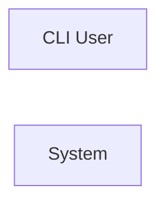

> **Model Completeness: F (0%)**
> Some sections may be empty due to missing model entities.
> - 57/57 components have no behavioral specification
> - No interfaces defined on components → interface-spec doc empty
> - No requirements defined
> - Actors defined but missing goals/descriptions
> Run the extraction pipeline or manually add behaviors/interfaces/constraints.

# Concept of Operations: System
## System Overview
System provides 6 capabilities implemented across 57 components.

**Core Capabilities:**

- **gRPC Services**
- **Build Configuration Scripts**
- **Package Group Management**
- **CLI Run Benchmark**
- **CLI Benchmark Economy**
- **Command Line Interface Entry Point**
## Stakeholders
| Actor | Type | Goals |
|-------|------|-------|
| CLI User | human | — |
## Operational Scenarios
### System Workflows

- **CLI: Run Benchmark**: —
- **CLI: Benchmark Economy**: —
- **CLI: Main**: —
## System Context
### External Interfaces

| Interface | Type | Provider | Consumer |
|-----------|------|----------|----------|
| main CLI | internal | — | — |


## Operational Constraints
*No constraints defined in the model.*

---

---

## LLM Review

*Reviewed: 2026-08-18T23:31:51.385068+00:00 | Duration: 5288ms*

**Summary:** This ConOps is essentially empty — it was auto-generated from a model with 0% completeness, containing no behavioral specifications, no interfaces, no requirements, and no actor goals, making it useless as an architecture artifact in its current state.

- All 57 components lack behavioral specifications, meaning this document communicates nothing about what the system actually does or how it operates.
- The mermaid context diagram shows no connections between the CLI User and the System, indicating even the most basic interaction modeling is missing.

<details>
<summary>Review details</summary>

**Prompt sent (truncated):**
```
Review the following architecture artifact 'docs/se/conops.md'.
Respond ONLY in this format:
SUMMARY: <one paragraph overall assessment>
COMMENT: <specific observation>
COMMENT: <another observation>

---
---
document: ConOps
system: System
system_id: SYS-unknown
generated_at: 2026-08-18T23:31:28Z
generator_version: 0.3.0
model_hash: efca59bc201d
edition: 7
---

> **Model Completeness: F (0%)**
> Some sections may be empty due to missing model entities.
> - 57/57 components have no behavioral sp
```

**Full LLM response:**
```
SUMMARY: This ConOps is essentially empty — it was auto-generated from a model with 0% completeness, containing no behavioral specifications, no interfaces, no requirements, and no actor goals, making it useless as an architecture artifact in its current state.
COMMENT: All 57 components lack behavioral specifications, meaning this document communicates nothing about what the system actually does or how it operates.
COMMENT: The mermaid context diagram shows no connections between the CLI User and the System, indicating even the most basic interaction modeling is missing.
```

</details>
