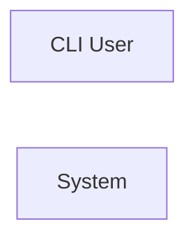

> **Model Completeness: F (0%)**
> Some sections may be empty due to missing model entities.
> - 56/56 components have no behavioral specification
> - No interfaces defined on components → interface-spec doc empty
> - No requirements defined
> - Actors defined but missing goals/descriptions
> Run the extraction pipeline or manually add behaviors/interfaces/constraints.

# Concept of Operations: System

## System Overview

System provides 6 capabilities implemented across 56 components.

**Core Capabilities:**

- **gRPC Services**
- **Package Group Management**
- **Package Group Management**
- **CLI Run Benchmark**
- **CLI Benchmark Economy**
- **Command Line Interface Handler**

## Stakeholders

| Actor | Type | Goals |
|-------|------|-------|
| CLI User | human | — |

## Operational Scenarios

### System Workflows

- **CLI: Run Benchmark**: —
- **CLI: Benchmark Economy**: —
- **CLI: Main**: —

## System Context

### External Interfaces

| Interface | Type | Provider | Consumer |
|-----------|------|----------|----------|
| main CLI | internal | — | — |

## Operational Constraints

*No constraints defined in the model.*
