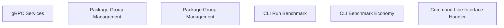

> **Model Completeness: F (0%)**
> Some sections may be empty due to missing model entities.
> - 56/56 components have no behavioral specification
> - No interfaces defined on components → interface-spec doc empty
> - No requirements defined
> - Actors defined but missing goals/descriptions
> Run the extraction pipeline or manually add behaviors/interfaces/constraints.

# Functional Analysis: System

## Capability Inventory

| ID | Capability | Priority | Status | Description |
|----|-----------|----------|--------|-------------|
| CAP-1 | gRPC Services | medium | ACTIVE | — |
| CAP-2 | Package Group Management | medium | ACTIVE | — |
| CAP-3 | Package Group Management | medium | ACTIVE | — |
| CAP-4 | CLI Run Benchmark | medium | ACTIVE | — |
| CAP-5 | CLI Benchmark Economy | medium | ACTIVE | — |
| CAP-6 | Command Line Interface Handler | medium | ACTIVE | — |

## Functional Decomposition

## Capability-Component Mapping

| Capability | Realized By | Component Kind |
|-----------|------------|----------------|
| gRPC Services | Quality (src-mcp-COMP-1) | service |
| gRPC Services | Bench (src-cli-COMP-1) | service |
| Package Group Management | Assess (src-mcp-COMP-2) | service |
| Package Group Management | Calibrate (src-cli-COMP-2) | service |
| Package Group Management | Author (src-mcp-COMP-3) | service |
| Package Group Management | Confidence (src-cli-COMP-3) | service |
| CLI Run Benchmark | Check (src-mcp-COMP-4) | service |
| CLI Benchmark Economy | Correct (src-mcp-COMP-5) | service |
| CLI Benchmark Economy | Docs (src-cli-COMP-4) | service |
| CLI Benchmark Economy | Docs Validator (src-cli-COMP-5) | service |
| Command Line Interface Handler | Decompose (src-mcp-COMP-6) | service |
| Command Line Interface Handler | Extract (src-cli-COMP-6) | service |

## Behavioral Coverage

Total behaviors: 3

**Untraced behaviors:** 3
- CLI: Run Benchmark (BEH-1)
- CLI: Benchmark Economy (BEH-2)
- CLI: Main (BEH-3)
