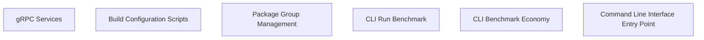

> **Model Completeness: F (0%)**
> Some sections may be empty due to missing model entities.
> - 57/57 components have no behavioral specification
> - No interfaces defined on components → interface-spec doc empty
> - No requirements defined
> - Actors defined but missing goals/descriptions
> Run the extraction pipeline or manually add behaviors/interfaces/constraints.

# Functional Analysis: System
## Capability Inventory
| ID | Capability | Priority | Status | Description |
|----|-----------|----------|--------|-------------|
| CAP-1 | gRPC Services | medium | ACTIVE | — |
| CAP-2 | Build Configuration Scripts | medium | ACTIVE | — |
| CAP-3 | Package Group Management | medium | ACTIVE | — |
| CAP-4 | CLI Run Benchmark | medium | ACTIVE | — |
| CAP-5 | CLI Benchmark Economy | medium | ACTIVE | — |
| CAP-6 | Command Line Interface Entry Point | medium | ACTIVE | — |
## Functional Decomposition

## Capability-Component Mapping
| Capability | Realized By | Component Kind |
|-----------|------------|----------------|
| gRPC Services | Quality (src-mcp-COMP-1) | service |
| gRPC Services | Bench (src-cli-COMP-1) | service |
| Build Configuration Scripts | Assess (src-mcp-COMP-2) | service |
| Build Configuration Scripts | Calibrate (src-cli-COMP-2) | service |
| Package Group Management | Author (src-mcp-COMP-3) | service |
| Package Group Management | Confidence (src-cli-COMP-3) | service |
| CLI Run Benchmark | Check (src-mcp-COMP-4) | service |
| CLI Benchmark Economy | Correct (src-mcp-COMP-5) | service |
| CLI Benchmark Economy | Docs (src-cli-COMP-4) | service |
| CLI Benchmark Economy | Docs Validator (src-cli-COMP-5) | service |
| Command Line Interface Entry Point | Decompose (src-mcp-COMP-6) | service |
| Command Line Interface Entry Point | Export Data (src-cli-COMP-6) | service |
## Behavioral Coverage
Total behaviors: 3

**Untraced behaviors:** 3
- CLI: Run Benchmark (BEH-1)
- CLI: Benchmark Economy (BEH-2)
- CLI: Main (BEH-3)

---

---

## LLM Review

*Reviewed: 2026-08-18T23:32:05.109628+00:00 | Duration: 7310ms*

**Summary:** This functional analysis document is essentially a skeleton with 0% model completeness, containing auto-generated placeholder content where capabilities appear arbitrarily mapped to components with nonsensical names (e.g., "Quality," "Correct," "Decompose" realizing "gRPC Services" or "CLI Benchmark Economy"), suggesting the extraction pipeline produced meaningless associations rather than a genuine architectural decomposition.

- The capability-component mapping appears incoherent — components like "Correct," "Decompose," and "Author" are mapped to capabilities they have no obvious semantic relationship with, indicating either a flawed auto-extraction or placeholder/synthetic data.
- All 3 defined behaviors are untraced to any requirement or test, and 57/57 components lack behavioral specifications, making this document unsuitable for any architectural decision-making in its current state.

<details>
<summary>Review details</summary>

**Prompt sent (truncated):**
```
Review the following architecture artifact 'docs/se/functional-analysis.md'.
Respond ONLY in this format:
SUMMARY: <one paragraph overall assessment>
COMMENT: <specific observation>
COMMENT: <another observation>

---
---
document: Functional Analysis
system: System
system_id: SYS-unknown
generated_at: 2026-08-18T23:31:28Z
generator_version: 0.3.0
model_hash: efca59bc201d
edition: 7
---

> **Model Completeness: F (0%)**
> Some sections may be empty due to missing model entities.
> - 57/57 compon
```

**Full LLM response:**
```
SUMMARY: This functional analysis document is essentially a skeleton with 0% model completeness, containing auto-generated placeholder content where capabilities appear arbitrarily mapped to components with nonsensical names (e.g., "Quality," "Correct," "Decompose" realizing "gRPC Services" or "CLI Benchmark Economy"), suggesting the extraction pipeline produced meaningless associations rather than a genuine architectural decomposition.

COMMENT: The capability-component mapping appears incoherent — components like "Correct," "Decompose," and "Author" are mapped to capabilities they have no obvious semantic relationship with, indicating either a flawed auto-extraction or placeholder/synthetic data.

COMMENT: All 3 defined behaviors are untraced to any requirement or test, and 57/57 components lack behavioral specifications, making this document unsuitable for any architectural decision-making in its current state.
```

</details>
