# Logical Architecture: opencode-arch
## Layer Structure
*No layers defined.*
## Component Allocation
### unassigned

| Component | Kind | Files | Responsibilities |
|-----------|------|-------|------------------|
| Extraction Tools (COMP-1) | service | 5 files | — |
| Artifacts (COMP-2) | service | 4 files | — |
| CLI Commands (COMP-3) | service | 13 files | — |
| Requirements (COMP-4) | service | 5 files | — |
| Resolution (COMP-5) | service | 6 files | — |
| Context Tools (COMP-6) | service | 3 files | — |
| Model Management Tools (COMP-7) | service | 4 files | — |
| Documentation Tools (COMP-8) | service | 3 files | — |
| Quality Gate Tools (COMP-9) | service | 4 files | — |
| Requirements Tools (COMP-10) | service | 3 files | — |
| Live Analysis Tools (COMP-11) | service | 5 files | — |
| Runner (COMP-12) | service | 2 files | — |
| Telemetry (COMP-13) | service | 3 files | — |
| Learning (COMP-14) | service | 6 files | — |
| MCP Server (COMP-15) | service | 3 files | — |
## Inter-Component Interfaces
| Interface | Type | Protocol | Provider | Consumer |
|-----------|------|----------|----------|----------|
| run_benchmark CLI | internal | — | — | — |
| benchmark_economy CLI | internal | — | — | — |
| main CLI | internal | — | — | — |
| COMP-3-1 Library API | internal | — | — | — |
| COMP-3-2 Library API | internal | — | — | — |
| COMP-3-3 Library API | internal | — | — | — |
| COMP-3-4 Library API | internal | — | — | — |
| COMP-3-5 Library API | internal | — | — | — |
| COMP-3-6 Library API | internal | — | — | — |
| COMP-3-7 Library API | internal | — | — | — |
| COMP-3-8 Library API | internal | — | — | — |
| COMP-3-12 Library API | internal | — | — | — |
| COMP-3-13 Library API | internal | — | — | — |
| Extraction Tools API | internal | — | — | — |
| Requirements API | internal | — | — | — |
| Resolution API | internal | — | — | — |
| Context Tools API | internal | — | — | — |
| Model Management Tools API | internal | — | — | — |
| Documentation Tools API | internal | — | — | — |
| Quality Gate Tools API | internal | — | — | — |
| Requirements Tools API | internal | — | — | — |
| Live Analysis Tools API | internal | — | — | — |
| Runner API | internal | — | — | — |
| Telemetry API | internal | — | — | — |
| Learning API | internal | — | — | — |
| MCP Server API | internal | — | — | — |
## Dependency Graph

```mermaid
graph TD
    src-mcp-COMP-1["Quality"]
    src-mcp-COMP-18["Llm Audit"]
    src-mcp-COMP-1 --> src-mcp-COMP-18
    src-mcp-COMP-24["Slice"]
    src-mcp-COMP-1 --> src-mcp-COMP-24
    src-mcp-COMP-16["Ingest"]
    src-mcp-COMP-29["Infrastructure"]
    src-mcp-COMP-16 --> src-mcp-COMP-29
    src-mcp-COMP-1 --> src-mcp-COMP-16
    src-mcp-COMP-28["Validate"]
    src-mcp-COMP-1 --> src-mcp-COMP-28
    src-mcp-COMP-10["Export"]
    src-mcp-COMP-10 --> src-mcp-COMP-1
    src-mcp-COMP-23["Scan"]
    src-mcp-COMP-23 --> src-mcp-COMP-29
    src-mcp-COMP-21["Regen Score"]
    src-mcp-COMP-1 --> src-mcp-COMP-21
    src-mcp-COMP-23 --> src-mcp-COMP-1
    src-mcp-COMP-4["Check"]
    src-mcp-COMP-24 --> src-mcp-COMP-4
    src-mcp-COMP-20["Pipeline"]
    src-mcp-COMP-20 --> src-mcp-COMP-1
    src-mcp-COMP-1 --> src-mcp-COMP-4
    src-mcp-COMP-11["Extract"]
    src-mcp-COMP-11 --> src-mcp-COMP-29
    src-mcp-COMP-3["Author"]
    src-mcp-COMP-24 --> src-mcp-COMP-3
    src-mcp-COMP-14["Generate"]
    src-mcp-COMP-1 --> src-mcp-COMP-14
    src-mcp-COMP-11 --> src-mcp-COMP-1
    src-mcp-COMP-2["Assess"]
    src-mcp-COMP-24 --> src-mcp-COMP-2
    src-mcp-COMP-15["Group"]
    src-mcp-COMP-24 --> src-mcp-COMP-15
    src-mcp-COMP-1 --> src-mcp-COMP-15
    src-mcp-COMP-12["Feedback"]
    src-mcp-COMP-24 --> src-mcp-COMP-12
    src-mcp-COMP-5["Correct"]
    src-mcp-COMP-24 --> src-mcp-COMP-5
    src-mcp-COMP-1 --> src-mcp-COMP-12
    src-mcp-COMP-4 --> src-mcp-COMP-29
    src-mcp-COMP-1 --> src-mcp-COMP-5
    src-mcp-COMP-14 --> src-mcp-COMP-29
    src-mcp-COMP-16 --> src-mcp-COMP-1
    src-mcp-COMP-27["Trace Requirements"]
    src-mcp-COMP-27 --> src-mcp-COMP-11
    src-mcp-COMP-22["Require"]
    src-mcp-COMP-27 --> src-mcp-COMP-22
    src-mcp-COMP-26["Sync"]
    src-mcp-COMP-24 --> src-mcp-COMP-26
    src-mcp-COMP-9["Evaluate"]
    src-mcp-COMP-24 --> src-mcp-COMP-9
    src-mcp-COMP-1 --> src-mcp-COMP-26
    src-mcp-COMP-24 --> src-mcp-COMP-22
    src-mcp-COMP-8["Docs"]
    src-mcp-COMP-24 --> src-mcp-COMP-8
    src-mcp-COMP-24 --> src-mcp-COMP-27
    src-mcp-COMP-1 --> src-mcp-COMP-27
    src-mcp-COMP-24 --> src-mcp-COMP-23
    src-mcp-COMP-15 --> src-mcp-COMP-29
    src-mcp-COMP-1 --> src-mcp-COMP-3
    src-mcp-COMP-1 --> src-mcp-COMP-23
    src-mcp-COMP-17["Learn"]
    src-mcp-COMP-24 --> src-mcp-COMP-17
    src-mcp-COMP-8 --> src-mcp-COMP-29
    src-mcp-COMP-15 --> src-mcp-COMP-1
    src-mcp-COMP-24 --> src-mcp-COMP-10
    src-mcp-COMP-1 --> src-mcp-COMP-2
    src-mcp-COMP-25["Stats"]
    src-mcp-COMP-24 --> src-mcp-COMP-25
    src-mcp-COMP-7["Diff"]
    src-mcp-COMP-24 --> src-mcp-COMP-7
    src-mcp-COMP-1 --> src-mcp-COMP-25
    src-mcp-COMP-1 --> src-mcp-COMP-7
    src-mcp-COMP-4 --> src-mcp-COMP-1
    src-mcp-COMP-6["Decompose"]
    src-mcp-COMP-24 --> src-mcp-COMP-6
    src-mcp-COMP-1 --> src-mcp-COMP-6
    src-mcp-COMP-18 --> src-mcp-COMP-29
    src-mcp-COMP-14 --> src-mcp-COMP-1
    src-mcp-COMP-18 --> src-mcp-COMP-1
    src-mcp-COMP-24 --> src-mcp-COMP-11
    src-mcp-COMP-1 --> src-mcp-COMP-9
    src-mcp-COMP-1 --> src-mcp-COMP-11
    src-mcp-COMP-1 --> src-mcp-COMP-22
    src-mcp-COMP-24 --> src-mcp-COMP-18
    src-mcp-COMP-1 --> src-mcp-COMP-8
    src-mcp-COMP-24 --> src-mcp-COMP-20
    src-mcp-COMP-24 --> src-mcp-COMP-16
    src-mcp-COMP-1 --> src-mcp-COMP-20
    src-mcp-COMP-24 --> src-mcp-COMP-28
    src-mcp-COMP-6 --> src-mcp-COMP-29
    src-mcp-COMP-1 --> src-mcp-COMP-17
    src-mcp-COMP-8 --> src-mcp-COMP-1
    src-mcp-COMP-1 --> src-mcp-COMP-10
    src-mcp-COMP-13["Gate"]
    src-mcp-COMP-24 --> src-mcp-COMP-13
    src-mcp-COMP-27 --> src-mcp-COMP-29
    src-mcp-COMP-6 --> src-mcp-COMP-1
    src-mcp-COMP-29 --> src-mcp-COMP-1
    src-mcp-COMP-1 --> src-mcp-COMP-13
    src-mcp-COMP-27 --> src-mcp-COMP-1
    src-mcp-COMP-10 --> src-mcp-COMP-29
    src-mcp-COMP-24 --> src-mcp-COMP-21
    src-mcp-COMP-26 --> src-mcp-COMP-7
    src-mcp-COMP-19["Log"]
    src-mcp-COMP-24 --> src-mcp-COMP-19
    src-mcp-COMP-20 --> src-mcp-COMP-29
    src-mcp-COMP-1 --> src-mcp-COMP-19
    src-mcp-COMP-24 --> src-mcp-COMP-14
    src-cli-COMP-7["Extract"]
    src-cli-COMP-5["Docs Validator"]
    src-cli-COMP-7 --> src-cli-COMP-5
    src-cli-COMP-13["Regen Loop"]
    src-cli-COMP-1["Bench"]
    src-cli-COMP-13 --> src-cli-COMP-1
    src-cli-COMP-11["Main"]
    src-cli-COMP-13 --> src-cli-COMP-11
    src-cli-COMP-7 --> src-cli-COMP-13
    src-cli-COMP-14["Infrastructure"]
    src-cli-COMP-1 --> src-cli-COMP-14
    src-cli-COMP-8["Gap Analyzer"]
    src-cli-COMP-1 --> src-cli-COMP-8
    src-cli-COMP-4["Docs"]
    src-cli-COMP-13 --> src-cli-COMP-4
    src-cli-COMP-9["Generate"]
    src-cli-COMP-12["Metrics"]
    src-cli-COMP-9 --> src-cli-COMP-12
    src-cli-COMP-13 --> src-cli-COMP-14
    src-cli-COMP-6["Export Data"]
    src-cli-COMP-7 --> src-cli-COMP-6
    src-cli-COMP-3["Confidence"]
    src-cli-COMP-1 --> src-cli-COMP-3
    src-cli-COMP-9 --> src-cli-COMP-5
    src-cli-COMP-13 --> src-cli-COMP-8
    src-cli-COMP-10["Launch"]
    src-cli-COMP-9 --> src-cli-COMP-10
    src-cli-COMP-9 --> src-cli-COMP-7
    src-cli-COMP-9 --> src-cli-COMP-13
    src-cli-COMP-13 --> src-cli-COMP-3
    src-cli-COMP-7 --> src-cli-COMP-9
    src-cli-COMP-1 --> src-cli-COMP-12
    src-cli-COMP-1 --> src-cli-COMP-5
    src-cli-COMP-1 --> src-cli-COMP-10
    src-cli-COMP-7 --> src-cli-COMP-11
    src-cli-COMP-7 --> src-cli-COMP-1
    src-cli-COMP-9 --> src-cli-COMP-6
    src-cli-COMP-1 --> src-cli-COMP-7
    src-cli-COMP-1 --> src-cli-COMP-13
    src-cli-COMP-13 --> src-cli-COMP-12
    src-cli-COMP-13 --> src-cli-COMP-5
    src-cli-COMP-13 --> src-cli-COMP-10
    src-cli-COMP-7 --> src-cli-COMP-4
    src-cli-COMP-1 --> src-cli-COMP-6
    src-cli-COMP-7 --> src-cli-COMP-14
    src-cli-COMP-9 --> src-cli-COMP-1
    src-cli-COMP-7 --> src-cli-COMP-8
    src-cli-COMP-13 --> src-cli-COMP-7
    src-cli-COMP-9 --> src-cli-COMP-11
    src-cli-COMP-7 --> src-cli-COMP-3
    src-cli-COMP-9 --> src-cli-COMP-4
    src-cli-COMP-13 --> src-cli-COMP-6
    src-cli-COMP-1 --> src-cli-COMP-9
    src-cli-COMP-9 --> src-cli-COMP-14
    src-cli-COMP-1 --> src-cli-COMP-11
    src-cli-COMP-9 --> src-cli-COMP-8
    src-cli-COMP-13 --> src-cli-COMP-9
    src-cli-COMP-7 --> src-cli-COMP-12
    src-cli-COMP-9 --> src-cli-COMP-3
    src-cli-COMP-1 --> src-cli-COMP-4
    src-cli-COMP-7 --> src-cli-COMP-10
```

---