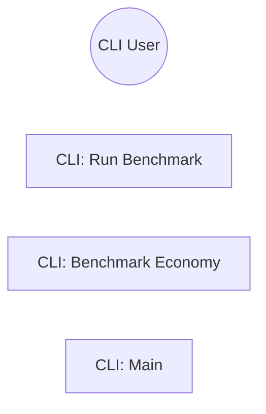

# Use Cases: opencode-arch
## Actor-Goal Matrix
| Actor | Goals |
|-------|-------|
| CLI User | Use opencode-arch effectively |
## Use Case Specifications
### UC: CLI: Run Benchmark

**ID:** BEH-1
**Main Flow:**
  1. ArgumentParser
  2. add_argument
  3. parse_args
  4. print
  5. run_benchmark

### UC: CLI: Benchmark Economy

**ID:** BEH-2
**Main Flow:**
  1. ArgumentParser
  2. add_argument
  3. parse_args
  4. run
  5. print_report

### UC: CLI: Main

**ID:** BEH-3
**Main Flow:**
  1. ArgumentParser
  2. add_subparsers
  3. add_parser
  4. add_argument
  5. parse_args
## Use Case Diagram

---

---