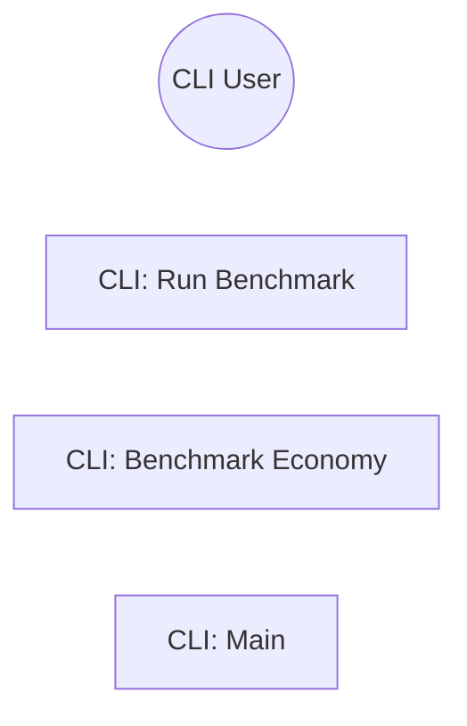

> **Model Completeness: F (0%)**
> Some sections may be empty due to missing model entities.
> - 56/56 components have no behavioral specification
> - No interfaces defined on components → interface-spec doc empty
> - No requirements defined
> - Actors defined but missing goals/descriptions
> Run the extraction pipeline or manually add behaviors/interfaces/constraints.

# Use Cases: System

## Actor-Goal Matrix

| Actor | Goals |
|-------|-------|
| CLI User | — |

## Use Case Specifications

### UC: CLI: Run Benchmark

**ID:** BEH-1

### UC: CLI: Benchmark Economy

**ID:** BEH-2

### UC: CLI: Main

**ID:** BEH-3

## Use Case Diagram

