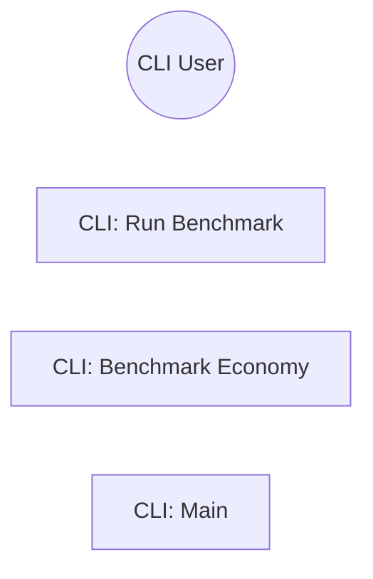

> **Model Completeness: F (0%)**
> Some sections may be empty due to missing model entities.
> - 57/57 components have no behavioral specification
> - No interfaces defined on components → interface-spec doc empty
> - No requirements defined
> - Actors defined but missing goals/descriptions
> Run the extraction pipeline or manually add behaviors/interfaces/constraints.

# Use Cases: System
## Actor-Goal Matrix
| Actor | Goals |
|-------|-------|
| CLI User | — |
## Use Case Specifications
### UC: CLI: Run Benchmark

**ID:** BEH-1

### UC: CLI: Benchmark Economy

**ID:** BEH-2

### UC: CLI: Main

**ID:** BEH-3
## Use Case Diagram


---

---

## LLM Review

*Reviewed: 2026-08-18T23:32:58.168030+00:00 | Duration: 4821ms*

**Summary:** This use cases document is essentially a skeleton with no substantive content—use cases lack descriptions, preconditions, postconditions, steps, or any behavioral detail, and the actor-goal matrix is empty despite three use cases being listed.

- The mermaid diagram defines nodes but has no edges connecting the actor to use cases, rendering it meaningless as a use case diagram.
- The Actor-Goal Matrix shows "—" for CLI User despite three use cases existing, indicating a broken linkage between actors and behaviors in the generation pipeline.

<details>
<summary>Review details</summary>

**Prompt sent (truncated):**
```
Review the following architecture artifact 'docs/se/use-cases.md'.
Respond ONLY in this format:
SUMMARY: <one paragraph overall assessment>
COMMENT: <specific observation>
COMMENT: <another observation>

---
---
document: Use Cases
system: System
system_id: SYS-unknown
generated_at: 2026-08-18T23:31:29Z
generator_version: 0.3.0
model_hash: efca59bc201d
edition: 7
---

> **Model Completeness: F (0%)**
> Some sections may be empty due to missing model entities.
> - 57/57 components have no behavio
```

**Full LLM response:**
```
SUMMARY: This use cases document is essentially a skeleton with no substantive content—use cases lack descriptions, preconditions, postconditions, steps, or any behavioral detail, and the actor-goal matrix is empty despite three use cases being listed.

COMMENT: The mermaid diagram defines nodes but has no edges connecting the actor to use cases, rendering it meaningless as a use case diagram.

COMMENT: The Actor-Goal Matrix shows "—" for CLI User despite three use cases existing, indicating a broken linkage between actors and behaviors in the generation pipeline.
```

</details>
