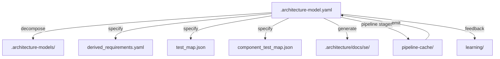

> **Model Completeness: F (2%)**
> Some sections may be empty due to missing model entities.
> - 13/13 components have no behavioral specification
> - No interfaces defined on components → interface-spec doc empty
> - No requirements defined
> - Actors defined but missing goals/descriptions
> Run the extraction pipeline or manually add behaviors/interfaces/constraints.

# Artifact Traceability Map: Src (cli)

## 1. Entity Inventory

| Entity Type | Count | Feeds SE Documents |
|-------------|-------|--------------------|
| Components | 13 | Logical Architecture, Maintenance Manual, Operations Manual, Interface Specification |
| Capabilities | 13 | ConOps, Functional Analysis, Requirements Analysis |
| Behaviors | 1 | Use Cases, Functional Analysis, Verification & Validation |
| Interfaces | 1 | Interface Specification, Logical Architecture |
| Constraints | 0 | Requirements Analysis, Risk Assessment |
| Requirements | 0 | Requirements Analysis, Verification & Validation |
| Actors | 1 | ConOps, Use Cases |
| Layers | 1 | Logical Architecture |

## 2. Artifact Dependency Graph

## 3. Entity-to-Artifact Traceability Matrix

| Artifact | Components | Capabilities | Behaviors | Interfaces | Constraints | Requirements | Actors | Layers |
|---|---|---|---|---|---|---|---|---|
| ConOps | | **13** | | | | | **1** | |
| Functional Analysis | | **13** | **1** | | | | | |
| Interface Specification | **13** | | | **1** | | | | |
| Logical Architecture | **13** | | | **1** | | | | **1** |
| Maintenance Manual | **13** | | | | | | | |
| Operations Manual | **13** | | | | | | | |
| Requirements Analysis | | **13** | | | — | — | | |
| Risk Assessment | | | | | — | | | |
| Use Cases | | | **1** | | | | **1** | |
| Verification & Validation | | | **1** | | | — | | |

## 4. Relationship Distribution

| Relationship Type | Count | Connects |
|-------------------|-------|----------|
| depends-on | 44 | Component → Component |
| contains | 13 | Unknown → Component |
| realizes | 12 | Component → Capability |
| uses | 4 | Component → Component |

## 5. Traceability Gaps

- **Constraints** — 0 entities; leaves gaps in: Requirements Analysis, Risk Assessment
- **Requirements** — 0 entities; leaves gaps in: Requirements Analysis, Verification & Validation
- **allocated-to** relationship type missing — weakens cross-entity traceability
- **constrained-by** relationship type missing — weakens cross-entity traceability

## 6. Architecture File Map

| Path | Purpose | Generated By |
|------|---------|-------------|
| `.architecture-model.yaml` | Canonical architecture model (source of truth) | Pipeline emit stage |
| `.architecture-models/` | Per-system sub-models from decomposition | Pipeline decompose stage |
| `.architecture/` | Root directory for all architecture artifacts | Pipeline |
| `.architecture/derived_requirements.yaml` | Requirements derived from model analysis | Pipeline specify stage |
| `.architecture/test_map.json` | Mapping of components to test files | Pipeline specify stage |
| `.architecture/component_test_map.json` | Component-level test coverage map | Pipeline specify stage |
| `.architecture/pipeline-cache/` | Cached intermediate pipeline stage results | Pipeline (all stages) |
| `.architecture/docs/se/` | Generated SE documents | SE doc generator |
| `.architecture/learning/` | Accumulated heuristics and learnings | Learning subsystem |
