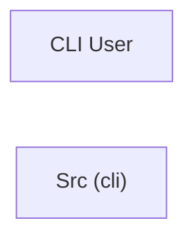

> **Model Completeness: F (1%)**
> Some sections may be empty due to missing model entities.
> - 14/14 components have no behavioral specification
> - No interfaces defined on components → interface-spec doc empty
> - No requirements defined
> - Actors defined but missing goals/descriptions
> Run the extraction pipeline or manually add behaviors/interfaces/constraints.

# Concept of Operations: Src (cli)

## System Overview

Src (cli) provides 14 capabilities implemented across 14 components.

**Core Capabilities:**

- **Bench**
- **Calibrate**
- **Confidence**
- **Docs**
- **Docs Validator**
- **Export Data**
- **Extract**
- **Gap Analyzer**
- **Generate**
- **Launch**
- **Main**
- **Metrics**
- **Regen Loop**
- **CLI Main**

## Stakeholders

| Actor | Type | Goals |
|-------|------|-------|
| CLI User | human | — |

## Operational Scenarios

### System Workflows

- **CLI: Main**: ArgumentParser -> add_subparsers -> add_parser -> add_argument -> parse_args

## System Context

### External Interfaces

| Interface | Type | Provider | Consumer |
|-----------|------|----------|----------|
| main CLI | internal | — | — |

## Operational Constraints

*No constraints defined in the model.*
