> **Model Completeness: F (1%)**
> Some sections may be empty due to missing model entities.
> - 14/14 components have no behavioral specification
> - No interfaces defined on components → interface-spec doc empty
> - No requirements defined
> - Actors defined but missing goals/descriptions
> Run the extraction pipeline or manually add behaviors/interfaces/constraints.

# Functional Analysis: Src (cli)

## Capability Inventory

| ID | Capability | Priority | Status | Description |
|----|-----------|----------|--------|-------------|
| CAP-1 | Bench | medium | ACTIVE | — |
| CAP-2 | Calibrate | medium | ACTIVE | — |
| CAP-3 | Confidence | medium | ACTIVE | — |
| CAP-4 | Docs | medium | ACTIVE | — |
| CAP-5 | Docs Validator | medium | ACTIVE | — |
| CAP-6 | Export Data | medium | ACTIVE | — |
| CAP-7 | Extract | medium | ACTIVE | — |
| CAP-8 | Gap Analyzer | medium | ACTIVE | — |
| CAP-9 | Generate | medium | ACTIVE | — |
| CAP-10 | Launch | medium | ACTIVE | — |
| CAP-11 | Main | medium | ACTIVE | — |
| CAP-12 | Metrics | medium | ACTIVE | — |
| CAP-13 | Regen Loop | medium | ACTIVE | — |
| CAP-14 | CLI Main | medium | ACTIVE | — |

## Functional Decomposition

```mermaid
graph TD
    CAP-1["Bench"]
    CAP-2["Calibrate"]
    CAP-3["Confidence"]
    CAP-4["Docs"]
    CAP-5["Docs Validator"]
    CAP-6["Export Data"]
    CAP-7["Extract"]
    CAP-8["Gap Analyzer"]
    CAP-9["Generate"]
    CAP-10["Launch"]
    CAP-11["Main"]
    CAP-12["Metrics"]
    CAP-13["Regen Loop"]
    CAP-14["CLI Main"]
```

## Capability-Component Mapping

| Capability | Realized By | Component Kind |
|-----------|------------|----------------|
| Bench | Bench (src-cli-COMP-1) | service |
| Calibrate | Calibrate (src-cli-COMP-2) | service |
| Confidence | Confidence (src-cli-COMP-3) | service |
| Docs | *unrealized* | — |
| Docs Validator | Docs (src-cli-COMP-4) | service |
| Docs Validator | Docs Validator (src-cli-COMP-5) | service |
| Export Data | Export Data (src-cli-COMP-6) | service |
| Extract | Extract (src-cli-COMP-7) | service |
| Gap Analyzer | Gap Analyzer (src-cli-COMP-8) | service |
| Generate | Generate (src-cli-COMP-9) | service |
| Launch | Launch (src-cli-COMP-10) | service |
| Main | *unrealized* | — |
| Metrics | Metrics (src-cli-COMP-12) | service |
| Regen Loop | Regen Loop (src-cli-COMP-13) | service |
| CLI Main | Main (src-cli-COMP-11) | service |

## Behavioral Coverage

Total behaviors: 1

**Untraced behaviors:** 1
- CLI: Main (BEH-1)
