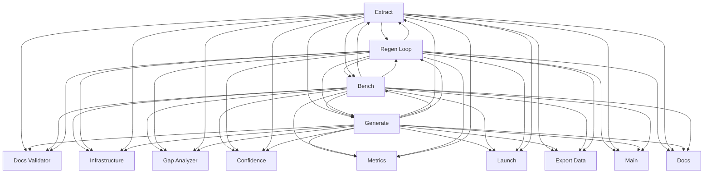

> **Model Completeness: F (1%)**
> Some sections may be empty due to missing model entities.
> - 14/14 components have no behavioral specification
> - No interfaces defined on components → interface-spec doc empty
> - No requirements defined
> - Actors defined but missing goals/descriptions
> Run the extraction pipeline or manually add behaviors/interfaces/constraints.

# Logical Architecture: Src (cli)

## Layer Structure

| Order | Layer | Technologies | Directories |
|-------|-------|-------------|-------------|
| 0 | infra | — | — |

## Component Allocation

### unassigned

| Component | Kind | Files | Responsibilities |
|-----------|------|-------|------------------|
| Bench (src-cli-COMP-1) | service | 1 files | — |
| Calibrate (src-cli-COMP-2) | service | 1 files | — |
| Confidence (src-cli-COMP-3) | service | 1 files | — |
| Docs (src-cli-COMP-4) | service | 1 files | — |
| Docs Validator (src-cli-COMP-5) | service | 1 files | — |
| Export Data (src-cli-COMP-6) | service | 1 files | — |
| Extract (src-cli-COMP-7) | service | 1 files | — |
| Gap Analyzer (src-cli-COMP-8) | service | 1 files | — |
| Generate (src-cli-COMP-9) | service | 1 files | — |
| Launch (src-cli-COMP-10) | service | 1 files | — |
| Main (src-cli-COMP-11) | service | 1 files | — |
| Metrics (src-cli-COMP-12) | service | 1 files | — |
| Regen Loop (src-cli-COMP-13) | service | 1 files | — |
| Infrastructure (src-cli-COMP-14) | service | 1 files | — |

## Inter-Component Interfaces

| Interface | Type | Protocol | Provider | Consumer |
|-----------|------|----------|----------|----------|
| main CLI | internal | — | — | — |

## Dependency Graph

