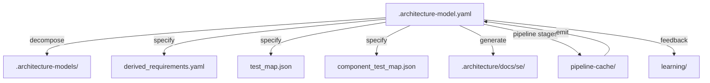

> **Model Completeness: F (0%)**
> Some sections may be empty due to missing model entities.
> - No components defined
> Run the extraction pipeline or manually add behaviors/interfaces/constraints.

# Artifact Traceability Map: Src (learning)

## 1. Entity Inventory

| Entity Type | Count | Feeds SE Documents |
|-------------|-------|--------------------|
| Components | 0 | Logical Architecture, Maintenance Manual, Operations Manual, Interface Specification |
| Capabilities | 6 | ConOps, Functional Analysis, Requirements Analysis |
| Behaviors | 0 | Use Cases, Functional Analysis, Verification & Validation |
| Interfaces | 0 | Interface Specification, Logical Architecture |
| Constraints | 0 | Requirements Analysis, Risk Assessment |
| Requirements | 0 | Requirements Analysis, Verification & Validation |
| Actors | 1 | ConOps, Use Cases |
| Layers | 0 | Logical Architecture |

## 2. Artifact Dependency Graph

## 3. Entity-to-Artifact Traceability Matrix

| Artifact | Components | Capabilities | Behaviors | Interfaces | Constraints | Requirements | Actors | Layers |
|---|---|---|---|---|---|---|---|---|
| ConOps | | **6** | | | | | **1** | |
| Functional Analysis | | **6** | — | | | | | |
| Interface Specification | — | | | — | | | | |
| Logical Architecture | — | | | — | | | | — |
| Maintenance Manual | — | | | | | | | |
| Operations Manual | — | | | | | | | |
| Requirements Analysis | | **6** | | | — | — | | |
| Risk Assessment | | | | | — | | | |
| Use Cases | | | — | | | | **1** | |
| Verification & Validation | | | — | | | — | | |

## 4. Relationship Distribution

*No relationships defined.*

## 5. Traceability Gaps

- **Components** — 0 entities; leaves gaps in: Logical Architecture, Maintenance Manual, Operations Manual, Interface Specification
- **Behaviors** — 0 entities; leaves gaps in: Use Cases, Functional Analysis, Verification & Validation
- **Interfaces** — 0 entities; leaves gaps in: Interface Specification, Logical Architecture
- **Constraints** — 0 entities; leaves gaps in: Requirements Analysis, Risk Assessment
- **Requirements** — 0 entities; leaves gaps in: Requirements Analysis, Verification & Validation
- **Layers** — 0 entities; leaves gaps in: Logical Architecture
- **No relationships** — traceability between entities cannot be established

## 6. Architecture File Map

| Path | Purpose | Generated By |
|------|---------|-------------|
| `.architecture-model.yaml` | Canonical architecture model (source of truth) | Pipeline emit stage |
| `.architecture-models/` | Per-system sub-models from decomposition | Pipeline decompose stage |
| `.architecture/` | Root directory for all architecture artifacts | Pipeline |
| `.architecture/derived_requirements.yaml` | Requirements derived from model analysis | Pipeline specify stage |
| `.architecture/test_map.json` | Mapping of components to test files | Pipeline specify stage |
| `.architecture/component_test_map.json` | Component-level test coverage map | Pipeline specify stage |
| `.architecture/pipeline-cache/` | Cached intermediate pipeline stage results | Pipeline (all stages) |
| `.architecture/docs/se/` | Generated SE documents | SE doc generator |
| `.architecture/learning/` | Accumulated heuristics and learnings | Learning subsystem |
