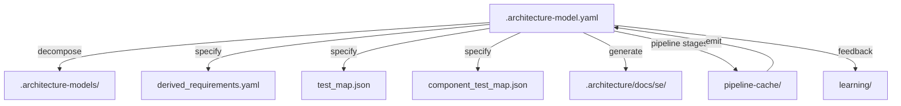

> **Model Completeness: F (0%)**
> Some sections may be empty due to missing model entities.
> - 29/29 components have no behavioral specification
> - No interfaces defined on components → interface-spec doc empty
> - No requirements defined
> - Actors defined but missing goals/descriptions
> Run the extraction pipeline or manually add behaviors/interfaces/constraints.

# Artifact Traceability Map: Src (mcp)

## 1. Entity Inventory

| Entity Type | Count | Feeds SE Documents |
|-------------|-------|--------------------|
| Components | 29 | Logical Architecture, Maintenance Manual, Operations Manual, Interface Specification |
| Capabilities | 28 | ConOps, Functional Analysis, Requirements Analysis |
| Behaviors | 0 | Use Cases, Functional Analysis, Verification & Validation |
| Interfaces | 0 | Interface Specification, Logical Architecture |
| Constraints | 0 | Requirements Analysis, Risk Assessment |
| Requirements | 0 | Requirements Analysis, Verification & Validation |
| Actors | 1 | ConOps, Use Cases |
| Layers | 2 | Logical Architecture |

## 2. Artifact Dependency Graph

## 3. Entity-to-Artifact Traceability Matrix

| Artifact | Components | Capabilities | Behaviors | Interfaces | Constraints | Requirements | Actors | Layers |
|---|---|---|---|---|---|---|---|---|
| ConOps | | **28** | | | | | **1** | |
| Functional Analysis | | **28** | — | | | | | |
| Interface Specification | **29** | | | — | | | | |
| Logical Architecture | **29** | | | — | | | | **2** |
| Maintenance Manual | **29** | | | | | | | |
| Operations Manual | **29** | | | | | | | |
| Requirements Analysis | | **28** | | | — | — | | |
| Risk Assessment | | | | | — | | | |
| Use Cases | | | — | | | | **1** | |
| Verification & Validation | | | — | | | — | | |

## 4. Relationship Distribution

| Relationship Type | Count | Connects |
|-------------------|-------|----------|
| depends-on | 81 | Component → Component |
| contains | 29 | Unknown → Component |
| realizes | 28 | Component → Capability |

## 5. Traceability Gaps

- **Behaviors** — 0 entities; leaves gaps in: Use Cases, Functional Analysis, Verification & Validation
- **Interfaces** — 0 entities; leaves gaps in: Interface Specification, Logical Architecture
- **Constraints** — 0 entities; leaves gaps in: Requirements Analysis, Risk Assessment
- **Requirements** — 0 entities; leaves gaps in: Requirements Analysis, Verification & Validation
- **allocated-to** relationship type missing — weakens cross-entity traceability
- **constrained-by** relationship type missing — weakens cross-entity traceability

## 6. Architecture Artifact Inventory

### Architecture Models

| Path | Size | LLM Reviewed |
|------|------|-------------|
| `.architecture/.architecture-models/.architecture-model.yaml` | 24.4KB | — |
| `.architecture-archive/.architecture-model.yaml` | 61.4KB | — |
| `.architecture-archive/dot-architecture-models/F2/.architecture-model.yaml` | 2.7KB | — |
| `.architecture-archive/dot-architecture-models/F5/.architecture-model.yaml` | 1.5KB | — |
| `.architecture-archive/dot-architecture-models/F6/.architecture-model.yaml` | 1.2KB | — |
| `.architecture-archive/dot-architecture-models/F7/.architecture-model.yaml` | 727B | — |
| `.architecture-archive/dot-architecture-models/F8/.architecture-model.yaml` | 734B | — |
| `.architecture-archive/dot-architecture-models/F9/.architecture-model.yaml` | 1.2KB | — |
| `.architecture-model.yaml` | 35.6KB | — |
| `.architecture-models/.architecture-model.yaml` | 10.9KB | — |
| `.architecture-models/src-artifacts/.architecture-model.yaml` | 355B | — |
| `.architecture-models/src-cli/.architecture-model.yaml` | 7.0KB | — |
| `.architecture-models/src-learning/.architecture-model.yaml` | 421B | — |
| `.architecture-models/src-llm/.architecture-model.yaml` | 271B | — |
| `.architecture-models/src-mcp/.architecture-model.yaml` | 12.2KB | — |

### System Manifests

| Path | Size | LLM Reviewed |
|------|------|-------------|
| `.architecture/manifest.json` | 304.5KB | — |
| `.architecture-archive/dot-architecture/manifest.json` | 303.9KB | — |
| `.architecture-archive/dot-architecture-models/S1/manifest.json` | 81.1KB | — |
| `.architecture-archive/dot-architecture-models/S10/manifest.json` | 7.8KB | — |
| `.architecture-archive/dot-architecture-models/S11/manifest.json` | 11.8KB | — |
| `.architecture-archive/dot-architecture-models/S12/manifest.json` | 5.0KB | — |
| `.architecture-archive/dot-architecture-models/S13/manifest.json` | 8.1KB | — |
| `.architecture-archive/dot-architecture-models/S2/manifest.json` | 19.5KB | — |
| `.architecture-archive/dot-architecture-models/S3/manifest.json` | 277.7KB | — |
| `.architecture-archive/dot-architecture-models/S4/manifest.json` | 277.7KB | — |
| `.architecture-archive/dot-architecture-models/S5/manifest.json` | 277.7KB | — |
| `.architecture-archive/dot-architecture-models/S6/manifest.json` | 20.8KB | — |
| `.architecture-archive/dot-architecture-models/S7/manifest.json` | 9.5KB | — |
| `.architecture-archive/dot-architecture-models/S8/manifest.json` | 95.8KB | — |
| `.architecture-archive/dot-architecture-models/S9/manifest.json` | 2.2KB | — |
| `.architecture-models/S1/manifest.json` | 81.6KB | — |
| `.architecture-models/S10/manifest.json` | 7.8KB | — |
| `.architecture-models/S11/manifest.json` | 11.8KB | — |
| `.architecture-models/S12/manifest.json` | 5.0KB | — |
| `.architecture-models/S13/manifest.json` | 8.1KB | — |
| `.architecture-models/S2/manifest.json` | 19.5KB | — |
| `.architecture-models/S3/manifest.json` | 278.6KB | — |
| `.architecture-models/S4/manifest.json` | 278.6KB | — |
| `.architecture-models/S5/manifest.json` | 278.6KB | — |
| `.architecture-models/S6/manifest.json` | 20.8KB | — |
| `.architecture-models/S7/manifest.json` | 9.5KB | — |
| `.architecture-models/S8/manifest.json` | 96.3KB | — |
| `.architecture-models/S9/manifest.json` | 2.2KB | — |
| `.architecture-models/src-artifacts/manifest.json` | 577B | — |
| `.architecture-models/src-cli/manifest.json` | 1.5KB | — |
| `.architecture-models/src-learning/manifest.json` | 793B | — |
| `.architecture-models/src-llm/manifest.json` | 565B | — |
| `.architecture-models/src-mcp/manifest.json` | 3.2KB | — |

### SE Documents

| Path | Size | LLM Reviewed |
|------|------|-------------|
| `.architecture-models/docs/se/artifact-traceability.md` | 21.2KB | — |
| `.architecture-models/docs/se/conops.md` | 2.2KB | — |
| `.architecture-models/docs/se/data-model.md` | 4.8KB | — |
| `.architecture-models/docs/se/deployment-guide.md` | 923B | — |
| `.architecture-models/docs/se/functional-analysis.md` | 526B | — |
| `.architecture-models/docs/se/index.md` | 677B | — |
| `.architecture-models/docs/se/interface-specification.md` | 3.8KB | — |
| `.architecture-models/docs/se/logical-architecture.md` | 8.9KB | — |
| `.architecture-models/docs/se/maintenance-manual.md` | 4.8KB | — |
| `.architecture-models/docs/se/operations-manual.md` | 1.6KB | — |
| `.architecture-models/docs/se/requirements-analysis.md` | 1.9KB | — |
| `.architecture-models/docs/se/risk-assessment.md` | 745B | — |
| `.architecture-models/docs/se/security-analysis.md` | 3.1KB | — |
| `.architecture-models/docs/se/use-cases.md` | 917B | — |
| `.architecture-models/docs/se/verification-validation.md` | 6.8KB | — |
| `.architecture/.architecture-models/docs/se/artifact-traceability.md` | 15.9KB | — |
| `.architecture/.architecture-models/docs/se/conops.md` | 2.2KB | — |
| `.architecture/.architecture-models/docs/se/deployment-guide.md` | 923B | — |
| `.architecture/.architecture-models/docs/se/functional-analysis.md` | 524B | — |
| `.architecture/.architecture-models/docs/se/index.md` | 677B | — |
| `.architecture/.architecture-models/docs/se/interface-specification.md` | 4.5KB | — |
| `.architecture/.architecture-models/docs/se/logical-architecture.md` | 2.7KB | — |
| `.architecture/.architecture-models/docs/se/maintenance-manual.md` | 4.8KB | — |
| `.architecture/.architecture-models/docs/se/operations-manual.md` | 1.6KB | — |
| `.architecture/.architecture-models/docs/se/requirements-analysis.md` | 2.0KB | — |
| `.architecture/.architecture-models/docs/se/risk-assessment.md` | 837B | — |
| `.architecture/.architecture-models/docs/se/use-cases.md` | 914B | — |
| `.architecture/.architecture-models/docs/se/verification-validation.md` | 4.2KB | — |
| `.architecture-models/src-artifacts/docs/se/artifact-traceability.md` | 16.1KB | — |
| `.architecture-models/src-artifacts/docs/se/conops.md` | 870B | — |
| `.architecture-models/src-artifacts/docs/se/functional-analysis.md` | 996B | — |
| `.architecture-models/src-artifacts/docs/se/index.md` | 603B | — |
| `.architecture-models/src-artifacts/docs/se/interface-specification.md` | 615B | — |
| `.architecture-models/src-artifacts/docs/se/logical-architecture.md` | 608B | — |
| `.architecture-models/src-artifacts/docs/se/maintenance-manual.md` | 706B | — |
| `.architecture-models/src-artifacts/docs/se/operations-manual.md` | 666B | — |
| `.architecture-models/src-artifacts/docs/se/requirements-analysis.md` | 920B | — |
| `.architecture-models/src-artifacts/docs/se/risk-assessment.md` | 1.2KB | — |
| `.architecture-models/src-artifacts/docs/se/use-cases.md` | 601B | — |
| `.architecture-models/src-artifacts/docs/se/verification-validation.md` | 768B | — |
| `.architecture-models/src-cli/docs/se/artifact-traceability.md` | 4.2KB | — |
| `.architecture-models/src-cli/docs/se/conops.md` | 1.4KB | — |
| `.architecture-models/src-cli/docs/se/functional-analysis.md` | 2.6KB | — |
| `.architecture-models/src-cli/docs/se/index.md` | 603B | — |
| `.architecture-models/src-cli/docs/se/interface-specification.md` | 930B | — |
| `.architecture-models/src-cli/docs/se/logical-architecture.md` | 4.1KB | — |
| `.architecture-models/src-cli/docs/se/maintenance-manual.md` | 5.3KB | — |
| `.architecture-models/src-cli/docs/se/operations-manual.md` | 889B | — |
| `.architecture-models/src-cli/docs/se/requirements-analysis.md` | 954B | — |
| `.architecture-models/src-cli/docs/se/risk-assessment.md` | 2.6KB | — |
| `.architecture-models/src-cli/docs/se/use-cases.md` | 902B | — |
| `.architecture-models/src-cli/docs/se/verification-validation.md` | 1.9KB | — |
| `.architecture-models/src-learning/docs/se/artifact-traceability.md` | 16.1KB | — |
| `.architecture-models/src-learning/docs/se/conops.md` | 899B | — |
| `.architecture-models/src-learning/docs/se/functional-analysis.md` | 1.1KB | — |
| `.architecture-models/src-learning/docs/se/index.md` | 603B | — |
| `.architecture-models/src-learning/docs/se/interface-specification.md` | 613B | — |
| `.architecture-models/src-learning/docs/se/logical-architecture.md` | 606B | — |
| `.architecture-models/src-learning/docs/se/maintenance-manual.md` | 704B | — |
| `.architecture-models/src-learning/docs/se/operations-manual.md` | 664B | — |
| `.architecture-models/src-learning/docs/se/requirements-analysis.md` | 1.0KB | — |
| `.architecture-models/src-learning/docs/se/risk-assessment.md` | 1.4KB | — |
| `.architecture-models/src-learning/docs/se/use-cases.md` | 599B | — |
| `.architecture-models/src-learning/docs/se/verification-validation.md` | 766B | — |
| `.architecture-models/src-llm/docs/se/artifact-traceability.md` | 16.1KB | — |
| `.architecture-models/src-llm/docs/se/conops.md` | 816B | — |
| `.architecture-models/src-llm/docs/se/functional-analysis.md` | 838B | — |
| `.architecture-models/src-llm/docs/se/index.md` | 603B | — |
| `.architecture-models/src-llm/docs/se/interface-specification.md` | 603B | — |
| `.architecture-models/src-llm/docs/se/logical-architecture.md` | 596B | — |
| `.architecture-models/src-llm/docs/se/maintenance-manual.md` | 694B | — |
| `.architecture-models/src-llm/docs/se/operations-manual.md` | 654B | — |
| `.architecture-models/src-llm/docs/se/requirements-analysis.md` | 780B | — |
| `.architecture-models/src-llm/docs/se/risk-assessment.md` | 912B | — |
| `.architecture-models/src-llm/docs/se/use-cases.md` | 589B | — |
| `.architecture-models/src-llm/docs/se/verification-validation.md` | 756B | — |
| `.architecture-models/src-mcp/docs/se/artifact-traceability.md` | 4.4KB | — |
| `.architecture-models/src-mcp/docs/se/conops.md` | 1.3KB | — |
| `.architecture-models/src-mcp/docs/se/data-model.md` | 626B | — |
| `.architecture-models/src-mcp/docs/se/functional-analysis.md` | 4.1KB | — |
| `.architecture-models/src-mcp/docs/se/index.md` | 709B | — |
| `.architecture-models/src-mcp/docs/se/interface-specification.md` | 778B | — |
| `.architecture-models/src-mcp/docs/se/logical-architecture.md` | 6.5KB | — |
| `.architecture-models/src-mcp/docs/se/maintenance-manual.md` | 9.2KB | — |
| `.architecture-models/src-mcp/docs/se/operations-manual.md` | 829B | — |
| `.architecture-models/src-mcp/docs/se/requirements-analysis.md` | 868B | — |
| `.architecture-models/src-mcp/docs/se/risk-assessment.md` | 1.6KB | — |
| `.architecture-models/src-mcp/docs/se/security-analysis.md` | 759B | — |
| `.architecture-models/src-mcp/docs/se/use-cases.md` | 764B | — |
| `.architecture-models/src-mcp/docs/se/verification-validation.md` | 2.7KB | — |
| `docs/se/api-detail-cap-docs.md` | 5.2KB | — |
| `docs/se/api-detail-cap-extract.md` | 3.1KB | — |
| `docs/se/api-detail-cap-generate-telemetry.md` | 4.5KB | — |
| `docs/se/api-detail-cap-learn.md` | 4.9KB | — |
| `docs/se/api-detail-cap-mcp.md` | 5.0KB | — |
| `docs/se/api-detail-cap-regen.md` | 5.2KB | — |
| `docs/se/api-reference.md` | 16.0KB | — |
| `docs/se/behavior-flows.md` | 8.3KB | — |
| `docs/se/capability-map.md` | 3.9KB | — |
| `docs/se/component-catalog.md` | 4.9KB | — |
| `docs/se/constraint-register.md` | 7.4KB | — |
| `docs/se/dependency-graph.md` | 3.8KB | — |
| `docs/se/deployment-view.md` | 6.3KB | — |
| `docs/se/functional-architecture.md` | 15.4KB | — |
| `docs/se/index.md` | 1.5KB | — |
| `docs/se/integration-guide.md` | 9.9KB | — |
| `docs/se/layer-architecture.md` | 8.2KB | — |
| `docs/se/metrics-dashboard.md` | 1.4KB | — |
| `docs/se/system-overview.md` | 5.8KB | — |

### Pipeline Cache

| Path | Size | LLM Reviewed |
|------|------|-------------|
| `.architecture/pipeline-cache/allocate.json` | 8.6KB | — |
| `.architecture/pipeline-cache/contract.json` | 16.7KB | — |
| `.architecture/pipeline-cache/decompose.json` | 15.8KB | — |
| `.architecture/pipeline-cache/emit.json` | 4.2KB | — |
| `.architecture/pipeline-cache/enrichment_log.json` | 4.6KB | — |
| `.architecture/pipeline-cache/infer.json` | 28.7KB | — |
| `.architecture/pipeline-cache/llm_calls.json` | 4.3KB | — |
| `.architecture/pipeline-cache/meta.json` | 259B | — |
| `.architecture/pipeline-cache/observe.json` | 877.2KB | — |
| `.architecture/pipeline-cache/relate.json` | 19.9KB | — |
| `.architecture/pipeline-cache/reviews.json` | 81.8KB | — |
| `.architecture/pipeline-cache/specify.json` | 1.5KB | — |
| `.architecture/pipeline-cache/synthesize.json` | 657.6KB | — |
| `.architecture/pipeline-cache/validate.json` | 1.9KB | — |

### Test Mapping

| Path | Size | LLM Reviewed |
|------|------|-------------|
| `.architecture/test_map.json` | 5.2KB | — |
| `.architecture/component_test_map.json` | 2.6KB | — |

### Requirements

| Path | Size | LLM Reviewed |
|------|------|-------------|
| `.architecture/derived_requirements.yaml` | 6.5KB | — |

### Learning

| Path | Size | LLM Reviewed |
|------|------|-------------|
| `.architecture/learning/history.json` | 2.9KB | — |

**Total:** 175 files, 4.9MB

## LLM Review Status

No LLM reviews available.

## LLM Enrichment Provenance

No LLM enrichment records available.

## Review Details

No review details available.
