> **Model Completeness: F (0%)**
> Some sections may be empty due to missing model entities.
> - 29/29 components have no behavioral specification
> - No interfaces defined on components → interface-spec doc empty
> - No requirements defined
> - Actors defined but missing goals/descriptions
> Run the extraction pipeline or manually add behaviors/interfaces/constraints.

# Logical Architecture: Src (mcp)

## Layer Structure

| Order | Layer | Technologies | Directories |
|-------|-------|-------------|-------------|
| 0 | infra | — | — |
| 0 | data | — | — |

## Component Allocation

### unassigned

| Component | Kind | Files | Responsibilities |
|-----------|------|-------|------------------|
| Quality (src-mcp-COMP-1) | service | 1 files | — |
| Assess (src-mcp-COMP-2) | service | 1 files | — |
| Author (src-mcp-COMP-3) | service | 1 files | — |
| Check (src-mcp-COMP-4) | service | 1 files | — |
| Correct (src-mcp-COMP-5) | service | 1 files | — |
| Decompose (src-mcp-COMP-6) | service | 1 files | — |
| Diff (src-mcp-COMP-7) | service | 1 files | — |
| Docs (src-mcp-COMP-8) | service | 1 files | — |
| Evaluate (src-mcp-COMP-9) | service | 1 files | — |
| Export (src-mcp-COMP-10) | service | 1 files | — |
| Extract (src-mcp-COMP-11) | service | 1 files | — |
| Feedback (src-mcp-COMP-12) | service | 1 files | — |
| Gate (src-mcp-COMP-13) | service | 1 files | — |
| Generate (src-mcp-COMP-14) | service | 1 files | — |
| Group (src-mcp-COMP-15) | service | 1 files | — |
| Ingest (src-mcp-COMP-16) | service | 1 files | — |
| Learn (src-mcp-COMP-17) | service | 1 files | — |
| Llm Audit (src-mcp-COMP-18) | service | 1 files | — |
| Log (src-mcp-COMP-19) | service | 1 files | — |
| Pipeline (src-mcp-COMP-20) | service | 1 files | — |
| Regen Score (src-mcp-COMP-21) | service | 1 files | — |
| Require (src-mcp-COMP-22) | service | 1 files | — |
| Scan (src-mcp-COMP-23) | service | 1 files | — |
| Slice (src-mcp-COMP-24) | service | 1 files | — |
| Stats (src-mcp-COMP-25) | service | 1 files | — |
| Sync (src-mcp-COMP-26) | service | 1 files | — |
| Trace Requirements (src-mcp-COMP-27) | service | 1 files | — |
| Validate (src-mcp-COMP-28) | service | 1 files | — |
| Infrastructure (src-mcp-COMP-29) | service | 2 files | — |

## Inter-Component Interfaces

*No interfaces defined.*

## Dependency Graph

```mermaid
graph TD
    src-mcp-COMP-27["Trace Requirements"]
    src-mcp-COMP-29["Infrastructure"]
    src-mcp-COMP-27 --> src-mcp-COMP-29
    src-mcp-COMP-1["Quality"]
    src-mcp-COMP-23["Scan"]
    src-mcp-COMP-1 --> src-mcp-COMP-23
    src-mcp-COMP-24["Slice"]
    src-mcp-COMP-13["Gate"]
    src-mcp-COMP-24 --> src-mcp-COMP-13
    src-mcp-COMP-19["Log"]
    src-mcp-COMP-24 --> src-mcp-COMP-19
    src-mcp-COMP-25["Stats"]
    src-mcp-COMP-1 --> src-mcp-COMP-25
    src-mcp-COMP-6["Decompose"]
    src-mcp-COMP-24 --> src-mcp-COMP-6
    src-mcp-COMP-22["Require"]
    src-mcp-COMP-27 --> src-mcp-COMP-22
    src-mcp-COMP-9["Evaluate"]
    src-mcp-COMP-1 --> src-mcp-COMP-9
    src-mcp-COMP-1 --> src-mcp-COMP-22
    src-mcp-COMP-14["Generate"]
    src-mcp-COMP-14 --> src-mcp-COMP-29
    src-mcp-COMP-27 --> src-mcp-COMP-1
    src-mcp-COMP-28["Validate"]
    src-mcp-COMP-1 --> src-mcp-COMP-28
    src-mcp-COMP-11["Extract"]
    src-mcp-COMP-24 --> src-mcp-COMP-11
    src-mcp-COMP-11 --> src-mcp-COMP-29
    src-mcp-COMP-1 --> src-mcp-COMP-14
    src-mcp-COMP-24 --> src-mcp-COMP-27
    src-mcp-COMP-4["Check"]
    src-mcp-COMP-1 --> src-mcp-COMP-4
    src-mcp-COMP-17["Learn"]
    src-mcp-COMP-24 --> src-mcp-COMP-17
    src-mcp-COMP-26["Sync"]
    src-mcp-COMP-7["Diff"]
    src-mcp-COMP-26 --> src-mcp-COMP-7
    src-mcp-COMP-24 --> src-mcp-COMP-7
    src-mcp-COMP-8["Docs"]
    src-mcp-COMP-24 --> src-mcp-COMP-8
    src-mcp-COMP-18["Llm Audit"]
    src-mcp-COMP-24 --> src-mcp-COMP-18
    src-mcp-COMP-29 --> src-mcp-COMP-1
    src-mcp-COMP-3["Author"]
    src-mcp-COMP-24 --> src-mcp-COMP-3
    src-mcp-COMP-1 --> src-mcp-COMP-26
    src-mcp-COMP-23 --> src-mcp-COMP-29
    src-mcp-COMP-11 --> src-mcp-COMP-1
    src-mcp-COMP-12["Feedback"]
    src-mcp-COMP-24 --> src-mcp-COMP-12
    src-mcp-COMP-8 --> src-mcp-COMP-29
    src-mcp-COMP-24 --> src-mcp-COMP-23
    src-mcp-COMP-21["Regen Score"]
    src-mcp-COMP-1 --> src-mcp-COMP-21
    src-mcp-COMP-2["Assess"]
    src-mcp-COMP-1 --> src-mcp-COMP-2
    src-mcp-COMP-16["Ingest"]
    src-mcp-COMP-1 --> src-mcp-COMP-16
    src-mcp-COMP-24 --> src-mcp-COMP-25
    src-mcp-COMP-24 --> src-mcp-COMP-9
    src-mcp-COMP-20["Pipeline"]
    src-mcp-COMP-1 --> src-mcp-COMP-20
    src-mcp-COMP-23 --> src-mcp-COMP-1
    src-mcp-COMP-24 --> src-mcp-COMP-22
    src-mcp-COMP-8 --> src-mcp-COMP-1
    src-mcp-COMP-14 --> src-mcp-COMP-1
    src-mcp-COMP-6 --> src-mcp-COMP-29
    src-mcp-COMP-15["Group"]
    src-mcp-COMP-1 --> src-mcp-COMP-15
    src-mcp-COMP-5["Correct"]
    src-mcp-COMP-1 --> src-mcp-COMP-5
    src-mcp-COMP-24 --> src-mcp-COMP-28
    src-mcp-COMP-20 --> src-mcp-COMP-29
    src-mcp-COMP-10["Export"]
    src-mcp-COMP-10 --> src-mcp-COMP-29
    src-mcp-COMP-24 --> src-mcp-COMP-14
    src-mcp-COMP-24 --> src-mcp-COMP-4
    src-mcp-COMP-6 --> src-mcp-COMP-1
    src-mcp-COMP-1 --> src-mcp-COMP-24
    src-mcp-COMP-1 --> src-mcp-COMP-10
    src-mcp-COMP-15 --> src-mcp-COMP-29
    src-mcp-COMP-24 --> src-mcp-COMP-26
    src-mcp-COMP-4 --> src-mcp-COMP-29
    src-mcp-COMP-16 --> src-mcp-COMP-29
    src-mcp-COMP-18 --> src-mcp-COMP-29
    src-mcp-COMP-1 --> src-mcp-COMP-13
    src-mcp-COMP-20 --> src-mcp-COMP-1
    src-mcp-COMP-1 --> src-mcp-COMP-19
    src-mcp-COMP-24 --> src-mcp-COMP-21
    src-mcp-COMP-10 --> src-mcp-COMP-1
    src-mcp-COMP-24 --> src-mcp-COMP-2
    src-mcp-COMP-24 --> src-mcp-COMP-16
    src-mcp-COMP-1 --> src-mcp-COMP-6
    src-mcp-COMP-15 --> src-mcp-COMP-1
    src-mcp-COMP-24 --> src-mcp-COMP-20
    src-mcp-COMP-4 --> src-mcp-COMP-1
    src-mcp-COMP-16 --> src-mcp-COMP-1
    src-mcp-COMP-18 --> src-mcp-COMP-1
    src-mcp-COMP-27 --> src-mcp-COMP-11
    src-mcp-COMP-24 --> src-mcp-COMP-15
    src-mcp-COMP-24 --> src-mcp-COMP-5
    src-mcp-COMP-1 --> src-mcp-COMP-11
    src-mcp-COMP-1 --> src-mcp-COMP-27
    src-mcp-COMP-1 --> src-mcp-COMP-17
    src-mcp-COMP-1 --> src-mcp-COMP-7
    src-mcp-COMP-1 --> src-mcp-COMP-8
    src-mcp-COMP-1 --> src-mcp-COMP-18
    src-mcp-COMP-1 --> src-mcp-COMP-3
    src-mcp-COMP-24 --> src-mcp-COMP-10
    src-mcp-COMP-1 --> src-mcp-COMP-12
```

