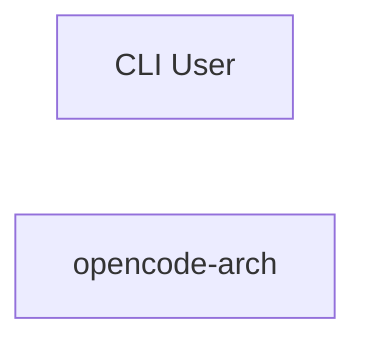

# Concept of Operations: opencode-arch

## System Overview

opencode-arch provides 0 capabilities implemented across 15 components.

## Stakeholders

| Actor | Type | Goals |
|-------|------|-------|
| CLI User | human | Use opencode-arch effectively |

## Operational Scenarios

### System Workflows

- **CLI: Run Benchmark**: ArgumentParser -> add_argument -> parse_args -> print -> run_benchmark
- **CLI: Benchmark Economy**: ArgumentParser -> add_argument -> parse_args -> run -> print_report
- **CLI: Main**: ArgumentParser -> add_subparsers -> add_parser -> add_argument -> parse_args

## System Context

### External Interfaces

| Interface | Type | Provider | Consumer |
|-----------|------|----------|----------|
| run_benchmark CLI | internal | — | — |
| benchmark_economy CLI | internal | — | — |
| main CLI | internal | — | — |
| COMP-3-1 Library API | internal | — | — |
| COMP-3-2 Library API | internal | — | — |
| COMP-3-3 Library API | internal | — | — |
| COMP-3-4 Library API | internal | — | — |
| COMP-3-5 Library API | internal | — | — |
| COMP-3-6 Library API | internal | — | — |
| COMP-3-7 Library API | internal | — | — |
| COMP-3-8 Library API | internal | — | — |
| COMP-3-12 Library API | internal | — | — |
| COMP-3-13 Library API | internal | — | — |
| Extraction Tools API | internal | — | — |
| Requirements API | internal | — | — |
| Resolution API | internal | — | — |
| Context Tools API | internal | — | — |
| Model Management Tools API | internal | — | — |
| Documentation Tools API | internal | — | — |
| Quality Gate Tools API | internal | — | — |
| Requirements Tools API | internal | — | — |
| Live Analysis Tools API | internal | — | — |
| Runner API | internal | — | — |
| Telemetry API | internal | — | — |
| Learning API | internal | — | — |
| MCP Server API | internal | — | — |

## Operational Constraints

### Technology & Regulatory

- **Python >=3.11** [technology]
- **CI/CD: GitHub Actions** [technology]
