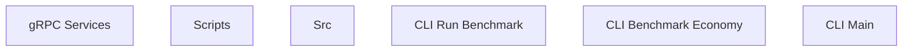

> **Model Completeness: F (0%)**
> Some sections may be empty due to missing model entities.
> - No components defined
> Run the extraction pipeline or manually add behaviors/interfaces/constraints.

# Functional Analysis: System

## Capability Inventory

| ID | Capability | Priority | Status | Description |
|----|-----------|----------|--------|-------------|
| CAP-1 | gRPC Services | medium | ACTIVE | — |
| CAP-2 | Scripts | medium | ACTIVE | — |
| CAP-3 | Src | medium | ACTIVE | — |
| CAP-4 | CLI Run Benchmark | medium | ACTIVE | — |
| CAP-5 | CLI Benchmark Economy | medium | ACTIVE | — |
| CAP-6 | CLI Main | medium | ACTIVE | — |

## Functional Decomposition

## Capability-Component Mapping

| Capability | Realized By | Component Kind |
|-----------|------------|----------------|
| gRPC Services | *unrealized* | — |
| CLI Run Benchmark | *unrealized* | — |
| CLI Benchmark Economy | *unrealized* | — |
| CLI Main | *unrealized* | — |

## Behavioral Coverage

*No behaviors defined.*
