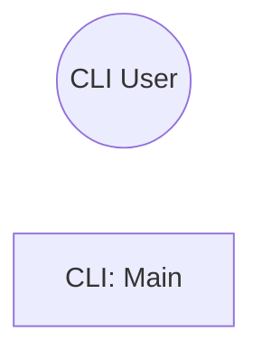

> **Model Completeness: F (2%)**
> Some sections may be empty due to missing model entities.
> - 13/13 components have no behavioral specification
> - No interfaces defined on components → interface-spec doc empty
> - No requirements defined
> - Actors defined but missing goals/descriptions
> Run the extraction pipeline or manually add behaviors/interfaces/constraints.

# Use Cases: Src (cli)

## Actor-Goal Matrix

| Actor | Goals |
|-------|-------|
| CLI User | — |

## Use Case Specifications

### UC: CLI: Main

**ID:** BEH-1
**Main Flow:**
  1. ArgumentParser
  2. add_subparsers
  3. add_parser
  4. add_argument
  5. parse_args

## Use Case Diagram

