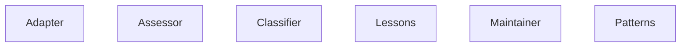

> **Model Completeness: F (0%)**
> Some sections may be empty due to missing model entities.
> - No components defined
> Run the extraction pipeline or manually add behaviors/interfaces/constraints.

# Functional Analysis: Src (learning)

## Capability Inventory

| ID | Capability | Priority | Status | Description |
|----|-----------|----------|--------|-------------|
| CAP-1 | Adapter | medium | ACTIVE | — |
| CAP-2 | Assessor | medium | ACTIVE | — |
| CAP-3 | Classifier | medium | ACTIVE | — |
| CAP-4 | Lessons | medium | ACTIVE | — |
| CAP-5 | Maintainer | medium | ACTIVE | — |
| CAP-6 | Patterns | medium | ACTIVE | — |

## Functional Decomposition

## Capability-Component Mapping

*No realizes relationships defined.*

## Behavioral Coverage

*No behaviors defined.*
