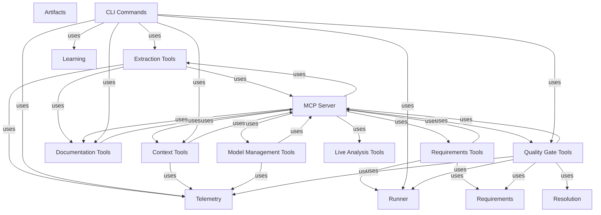

# Component Diagram

```mermaid
graph TD
    COMP-1[Extraction Tools]
    COMP-2[Artifacts]
    COMP-3[CLI Commands]
    COMP-4[Requirements]
    COMP-5[Resolution]
    COMP-6[Context Tools]
    COMP-7[Model Management Tools]
    COMP-8[Documentation Tools]
    COMP-9[Quality Gate Tools]
    COMP-10[Requirements Tools]
    COMP-11[Live Analysis Tools]
    COMP-12[Runner]
    COMP-13[Telemetry]
    COMP-14[Learning]
    COMP-15[MCP Server]
    COMP-1 -->|uses| COMP-13
    COMP-1 -->|uses| COMP-15
    COMP-1 -->|uses| COMP-8
    COMP-10 -->|uses| COMP-12
    COMP-10 -->|uses| COMP-15
    COMP-10 -->|uses| COMP-4
    COMP-15 -->|uses| COMP-1
    COMP-15 -->|uses| COMP-10
    COMP-15 -->|uses| COMP-11
    COMP-15 -->|uses| COMP-6
    COMP-15 -->|uses| COMP-7
    COMP-15 -->|uses| COMP-8
    COMP-15 -->|uses| COMP-9
    COMP-3 -->|uses| COMP-1
    COMP-3 -->|uses| COMP-12
    COMP-3 -->|uses| COMP-13
    COMP-3 -->|uses| COMP-14
    COMP-3 -->|uses| COMP-6
    COMP-3 -->|uses| COMP-8
    COMP-3 -->|uses| COMP-9
    COMP-6 -->|uses| COMP-13
    COMP-6 -->|uses| COMP-15
    COMP-7 -->|uses| COMP-13
    COMP-7 -->|uses| COMP-15
    COMP-8 -->|uses| COMP-15
    COMP-9 -->|uses| COMP-12
    COMP-9 -->|uses| COMP-13
    COMP-9 -->|uses| COMP-15
    COMP-9 -->|uses| COMP-4
    COMP-9 -->|uses| COMP-5
```
