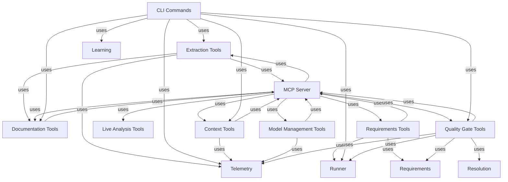

# Integration Flows: opencode-arch

## Extraction Tools → Telemetry (uses)
Extraction Tools imports from Telemetry

**Source:** COMP-1 (Extraction Tools)
**Target:** COMP-13 (Telemetry)

## Extraction Tools → MCP Server (uses)
Extraction Tools imports from MCP Server

**Source:** COMP-1 (Extraction Tools)
**Target:** COMP-15 (MCP Server)

## Extraction Tools → Documentation Tools (uses)
Extraction Tools imports from Documentation Tools

**Source:** COMP-1 (Extraction Tools)
**Target:** COMP-8 (Documentation Tools)

## Requirements Tools → Runner (uses)
Requirements Tools imports from Runner

**Source:** COMP-10 (Requirements Tools)
**Target:** COMP-12 (Runner)

## Requirements Tools → MCP Server (uses)
Requirements Tools imports from MCP Server

**Source:** COMP-10 (Requirements Tools)
**Target:** COMP-15 (MCP Server)

## Requirements Tools → Requirements (uses)
Requirements Tools imports from Requirements

**Source:** COMP-10 (Requirements Tools)
**Target:** COMP-4 (Requirements)

## MCP Server → Extraction Tools (uses)
MCP Server imports from Extraction Tools

**Source:** COMP-15 (MCP Server)
**Target:** COMP-1 (Extraction Tools)

## MCP Server → Requirements Tools (uses)
MCP Server imports from Requirements Tools

**Source:** COMP-15 (MCP Server)
**Target:** COMP-10 (Requirements Tools)

## MCP Server → Live Analysis Tools (uses)
MCP Server imports from Live Analysis Tools

**Source:** COMP-15 (MCP Server)
**Target:** COMP-11 (Live Analysis Tools)

## MCP Server → Context Tools (uses)
MCP Server imports from Context Tools

**Source:** COMP-15 (MCP Server)
**Target:** COMP-6 (Context Tools)

## MCP Server → Model Management Tools (uses)
MCP Server imports from Model Management Tools

**Source:** COMP-15 (MCP Server)
**Target:** COMP-7 (Model Management Tools)

## MCP Server → Documentation Tools (uses)
MCP Server imports from Documentation Tools

**Source:** COMP-15 (MCP Server)
**Target:** COMP-8 (Documentation Tools)

## MCP Server → Quality Gate Tools (uses)
MCP Server imports from Quality Gate Tools

**Source:** COMP-15 (MCP Server)
**Target:** COMP-9 (Quality Gate Tools)

## CLI Commands → Extraction Tools (uses)
CLI Commands imports from Extraction Tools

**Source:** COMP-3 (CLI Commands)
**Target:** COMP-1 (Extraction Tools)

## CLI Commands → Runner (uses)
CLI Commands imports from Runner

**Source:** COMP-3 (CLI Commands)
**Target:** COMP-12 (Runner)

## CLI Commands → Telemetry (uses)
CLI Commands imports from Telemetry

**Source:** COMP-3 (CLI Commands)
**Target:** COMP-13 (Telemetry)

## CLI Commands → Learning (uses)
CLI Commands imports from Learning

**Source:** COMP-3 (CLI Commands)
**Target:** COMP-14 (Learning)

## CLI Commands → Context Tools (uses)
CLI Commands imports from Context Tools

**Source:** COMP-3 (CLI Commands)
**Target:** COMP-6 (Context Tools)

## CLI Commands → Documentation Tools (uses)
CLI Commands imports from Documentation Tools

**Source:** COMP-3 (CLI Commands)
**Target:** COMP-8 (Documentation Tools)

## CLI Commands → Quality Gate Tools (uses)
CLI Commands imports from Quality Gate Tools

**Source:** COMP-3 (CLI Commands)
**Target:** COMP-9 (Quality Gate Tools)

## Context Tools → Telemetry (uses)
Context Tools imports from Telemetry

**Source:** COMP-6 (Context Tools)
**Target:** COMP-13 (Telemetry)

## Context Tools → MCP Server (uses)
Context Tools imports from MCP Server

**Source:** COMP-6 (Context Tools)
**Target:** COMP-15 (MCP Server)

## Model Management Tools → Telemetry (uses)
Model Management Tools imports from Telemetry

**Source:** COMP-7 (Model Management Tools)
**Target:** COMP-13 (Telemetry)

## Model Management Tools → MCP Server (uses)
Model Management Tools imports from MCP Server

**Source:** COMP-7 (Model Management Tools)
**Target:** COMP-15 (MCP Server)

## Documentation Tools → MCP Server (uses)
Documentation Tools imports from MCP Server

**Source:** COMP-8 (Documentation Tools)
**Target:** COMP-15 (MCP Server)

## Quality Gate Tools → Runner (uses)
Quality Gate Tools imports from Runner

**Source:** COMP-9 (Quality Gate Tools)
**Target:** COMP-12 (Runner)

## Quality Gate Tools → Telemetry (uses)
Quality Gate Tools imports from Telemetry

**Source:** COMP-9 (Quality Gate Tools)
**Target:** COMP-13 (Telemetry)

## Quality Gate Tools → MCP Server (uses)
Quality Gate Tools imports from MCP Server

**Source:** COMP-9 (Quality Gate Tools)
**Target:** COMP-15 (MCP Server)

## Quality Gate Tools → Requirements (uses)
Quality Gate Tools imports from Requirements

**Source:** COMP-9 (Quality Gate Tools)
**Target:** COMP-4 (Requirements)

## Quality Gate Tools → Resolution (uses)
Quality Gate Tools imports from Resolution

**Source:** COMP-9 (Quality Gate Tools)
**Target:** COMP-5 (Resolution)
