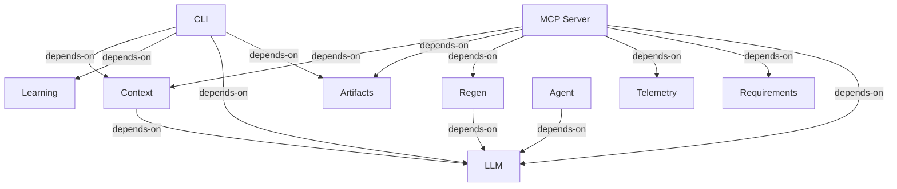

# System Boundary Diagram

```mermaid
graph TD
    COMP-MCP[MCP Server]
    COMP-CONTEXT[Context]
    COMP-ARTIFACTS[Artifacts]
    COMP-LEARNING[Learning]
    COMP-REGEN[Regen]
    COMP-CLI[CLI]
    COMP-REQUIREMENTS[Requirements]
    COMP-AGENT[Agent]
    COMP-LLM[LLM]
    COMP-TELEMETRY[Telemetry]
    COMP-MCP -->|depends-on| COMP-CONTEXT
    COMP-MCP -->|depends-on| COMP-ARTIFACTS
    COMP-MCP -->|depends-on| COMP-REGEN
    COMP-MCP -->|depends-on| COMP-TELEMETRY
    COMP-MCP -->|depends-on| COMP-REQUIREMENTS
    COMP-CLI -->|depends-on| COMP-CONTEXT
    COMP-CLI -->|depends-on| COMP-LEARNING
    COMP-CLI -->|depends-on| COMP-LLM
    COMP-CLI -->|depends-on| COMP-ARTIFACTS
    COMP-CONTEXT -->|depends-on| COMP-LLM
    COMP-REGEN -->|depends-on| COMP-LLM
    COMP-AGENT -->|depends-on| COMP-LLM
    COMP-MCP -->|depends-on| COMP-LLM
```
