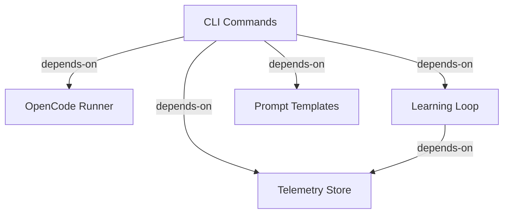

# Integration Flows: opencode-arch

## CLI Commands → OpenCode Runner (depends-on)
CLI uses runner to invoke LLM

**Source:** COMP-CLI (CLI Commands)
**Target:** COMP-RUNNER (OpenCode Runner)

## CLI Commands → Telemetry Store (depends-on)
CLI records metrics after operations

**Source:** COMP-CLI (CLI Commands)
**Target:** COMP-TELEMETRY (Telemetry Store)

## CLI Commands → Learning Loop (depends-on)
Regen-loop uses learning for adaptation

**Source:** COMP-CLI (CLI Commands)
**Target:** COMP-LEARNING (Learning Loop)

## CLI Commands → Prompt Templates (depends-on)
CLI uses prompt templates

**Source:** COMP-CLI (CLI Commands)
**Target:** COMP-PROMPTS (Prompt Templates)

## Learning Loop → Telemetry Store (depends-on)
Learning stores lessons and patterns

**Source:** COMP-LEARNING (Learning Loop)
**Target:** COMP-TELEMETRY (Telemetry Store)
