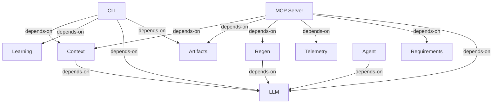

# Integration Flows: opencode-arch

## MCP Server → Context (depends-on)
—

**Source:** COMP-MCP (MCP Server)
**Target:** COMP-CONTEXT (Context)

## MCP Server → Artifacts (depends-on)
—

**Source:** COMP-MCP (MCP Server)
**Target:** COMP-ARTIFACTS (Artifacts)

## MCP Server → Regen (depends-on)
—

**Source:** COMP-MCP (MCP Server)
**Target:** COMP-REGEN (Regen)

## MCP Server → Telemetry (depends-on)
—

**Source:** COMP-MCP (MCP Server)
**Target:** COMP-TELEMETRY (Telemetry)

## MCP Server → Requirements (depends-on)
—

**Source:** COMP-MCP (MCP Server)
**Target:** COMP-REQUIREMENTS (Requirements)

## CLI → Context (depends-on)
—

**Source:** COMP-CLI (CLI)
**Target:** COMP-CONTEXT (Context)

## CLI → Learning (depends-on)
—

**Source:** COMP-CLI (CLI)
**Target:** COMP-LEARNING (Learning)

## CLI → LLM (depends-on)
—

**Source:** COMP-CLI (CLI)
**Target:** COMP-LLM (LLM)

## CLI → Artifacts (depends-on)
—

**Source:** COMP-CLI (CLI)
**Target:** COMP-ARTIFACTS (Artifacts)

## Context → LLM (depends-on)
—

**Source:** COMP-CONTEXT (Context)
**Target:** COMP-LLM (LLM)

## Regen → LLM (depends-on)
—

**Source:** COMP-REGEN (Regen)
**Target:** COMP-LLM (LLM)

## Agent → LLM (depends-on)
—

**Source:** COMP-AGENT (Agent)
**Target:** COMP-LLM (LLM)

## MCP Server → LLM (depends-on)
—

**Source:** COMP-MCP (MCP Server)
**Target:** COMP-LLM (LLM)
