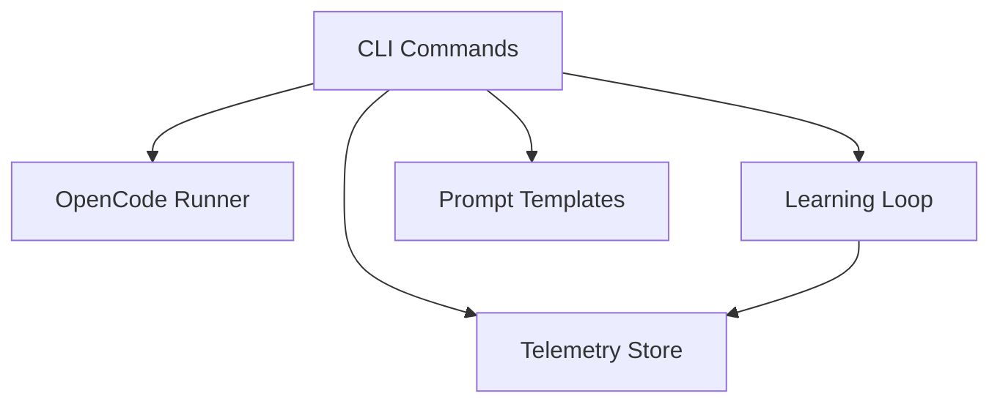

# System Design: opencode-arch

## Architecture Overview

—
Schema version: 1.4

## Component Inventory

| ID | Name | Status | Files | Behaviors |
|----|------|--------|-------|-----------|
| COMP-CLI | CLI Commands | Status.ACTIVE | 9 | 4 |
| COMP-MCP | MCP Server | Status.ACTIVE | 7 | 1 |
| COMP-RUNNER | OpenCode Runner | Status.ACTIVE | 2 | 0 |
| COMP-LEARNING | Learning Loop | Status.ACTIVE | 6 | 1 |
| COMP-TELEMETRY | Telemetry Store | Status.ACTIVE | 2 | 1 |
| COMP-PROMPTS | Prompt Templates | Status.ACTIVE | 2 | 0 |

## Layer Structure

- **CLI Layer** (LAYER-CLI)
- **MCP Server Layer** (LAYER-MCP)
- **Learning Layer** (LAYER-LEARNING)
- **Runner Layer** (LAYER-RUNNER)
- **Telemetry Layer** (LAYER-TELEMETRY)

## Key Behaviors

- **CRUD: 4 CRUD endpoints (1 AGENT, 3 CLI)** (BEH-CRUD-_unknown)

## Relationship Summary

| Type | Count |
|------|-------|
| constrained-by | 3 |
| consumes | 1 |
| depends-on | 5 |
| realizes | 7 |

## Architecture Diagram

