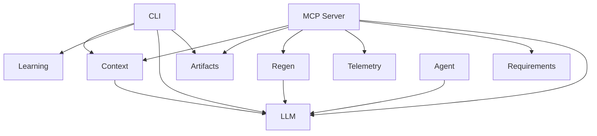

# System Design: opencode-arch

## Architecture Overview

—
Schema version: 2.0

## Component Inventory

| ID | Name | Status | Files | Behaviors |
|----|------|--------|-------|-----------|
| COMP-MCP | MCP Server | Status.ACTIVE | 25 | 1 |
| COMP-CONTEXT | Context | Status.ACTIVE | 3 | 1 |
| COMP-ARTIFACTS | Artifacts | Status.ACTIVE | 5 | 1 |
| COMP-LEARNING | Learning | Status.ACTIVE | 7 | 1 |
| COMP-REGEN | Regen | Status.ACTIVE | 3 | 1 |
| COMP-CLI | CLI | Status.ACTIVE | 15 | 2 |
| COMP-REQUIREMENTS | Requirements | Status.ACTIVE | 3 | 1 |
| COMP-AGENT | Agent | Status.ACTIVE | 2 | 1 |
| COMP-LLM | LLM | Status.ACTIVE | 6 | 0 |
| COMP-TELEMETRY | Telemetry | Status.ACTIVE | 3 | 0 |

## Layer Structure

- **MCP Layer** (LYR-MCP)
- **CLI Layer** (LYR-CLI)
- **Domain Layer** (LYR-DOMAIN)
- **Infrastructure Layer** (LYR-INFRA)

## Key Behaviors

- **Full Extraction Flow** (BEH-EXTRACT)
- **Regen Loop Execution** (BEH-REGEN)
- **Spot Check Flow** (BEH-SPOT)

## Relationship Summary

| Type | Count |
|------|-------|
| constrained-by | 4 |
| consumes | 4 |
| contains | 10 |
| depends-on | 13 |
| exposes | 2 |
| realizes | 9 |
| traces-to | 3 |

## Architecture Diagram

