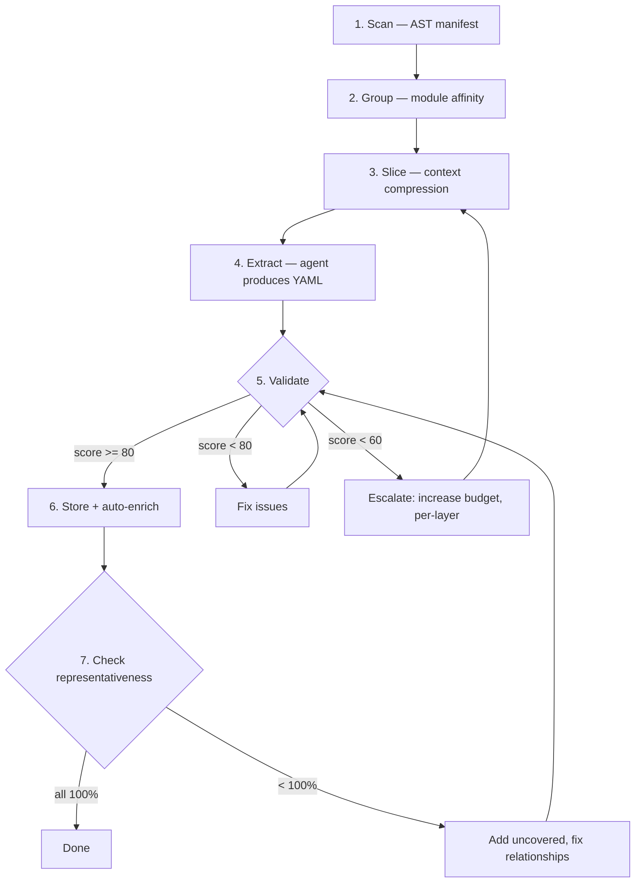
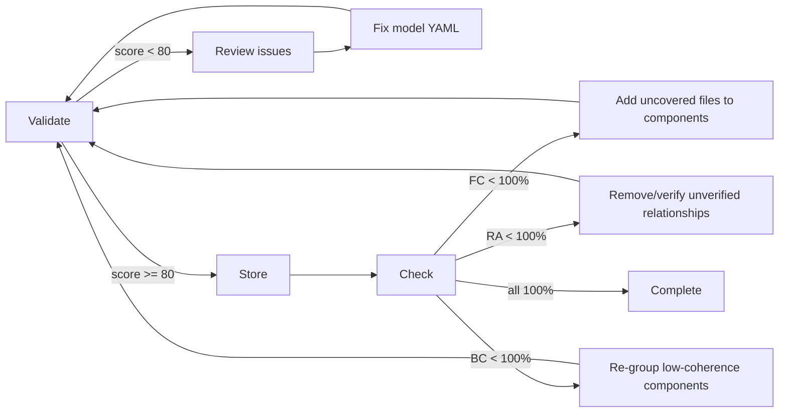

# Architecture Extraction Flow

## Overview

The extraction flow transforms a raw codebase into a validated architecture model through progressive decomposition. Two principles govern the design:

1. **Agent-as-oracle** — Tools never call external models. They compress context for the frontier model already present in the conversation.
2. **Token arbitrage** — A full repository's structure compresses into ~430 tokens of dense context, enabling high-quality architecture reasoning without reading every file.

## Pipeline Diagram



---

## 1. Scan — Reality Manifest

**Tool:** `architect_scan(repo_path)`

### Dual Scanner Architecture

The scan runs **two scanners alongside each other** on every invocation:

| Scanner | Scope | Returns | Mechanism | Config Required |
|---------|-------|---------|-----------|-----------------|
| `generate_manifest()` | Python-only | `Manifest` (rich: metrics, functional_blocks, modules, interfaces, scan_report) | `ast.parse()` (stdlib) | Optional (auto-discovers blocks) |
| `scan_all_languages()` | Python + Kotlin + Java + TypeScript | `SourceGraph` (language-agnostic: units + dependency edges) | tree-sitter (with regex fallback for TS/JS) | None |

The `Manifest` provides Python-specific depth (functional blocks, metrics, per-function detail). The `SourceGraph` provides cross-language coverage. Both are merged into the tool response.

**References:**
- `src/opencode_arch/mcp/tools/scan.py` — MCP tool entry point
- `architecture-model-standard/src/architecture_model/manifest/generator.py` — `generate_manifest()`
- `architecture-model-standard/src/architecture_model/manifest/multi_scanner.py` — `scan_all_languages()`
- `architecture-model-standard/src/architecture_model/manifest/kt_scanner.py` — tree-sitter Kotlin/Java
- `architecture-model-standard/src/architecture_model/manifest/ts_scanner.py` — TypeScript/JS regex fallback

### Functional Blocks — Two Paths

Functional blocks define the high-level logical groupings that modules belong to.

#### Path A: Manual Config (`.architecture-model.yaml`)

```yaml
functional_blocks:
  - id: F1
    name: User Management
    dirs: [src/auth/, src/users/]
    description_source: docs/auth.md
  - id: F2
    name: API Layer
    dirs: [src/api/]
    files: [src/middleware.py]
```

Defined in `config/schema.py:62-70` (`FunctionalBlockConfig` dataclass). Loaded by `config/loader.py:80`. Each block maps an ID to directories/files it "owns".

#### Path B: Auto-Discovery (no config exists)

When no `.architecture-model.yaml` is present:

1. `_discover_functional_blocks()` (`config/loader.py:342-398`) — scans directory structure
2. Groups by top-level source directories (one F-block per directory with >1 source file)
3. Falls back to `_source_blocks_from_top_level_dirs()` (`config/loader.py:509-536`)

Result: reasonable defaults based on project layout, but may not match your mental model of the architecture.

### Scan Quality Metrics

Quality is reported at three levels, plus a composite score:

#### Level 1: Coverage — what was reached

| Metric | Meaning | Status |
|--------|---------|--------|
| `files_attempted` | Source files the scanner tried to parse | `[exists]` in `ScanReport` |
| `files_succeeded` | Successfully parsed (valid AST / tree-sitter parse) | `[exists]` |
| `files_failed` | Parse errors (syntax issues, encoding problems) | `[exists]` |
| `success_rate` | `succeeded / attempted` | `[exists]` as property |

#### Level 2: Parse Depth — how well each file was understood

| Metric | Meaning | Status |
|--------|---------|--------|
| `functions_extracted` | Total function/method definitions found | `[exists]` |
| `classes_extracted` | Total class definitions found | `[exists]` |
| `constants_extracted` | Module-level constants found | `[exists]` |
| `symbols_per_file` | Avg extractable symbols per file (higher = richer understanding) | `[proposed]` |
| `docstring_coverage` | % of functions/classes with docstrings (self-documenting signal) | `[proposed]` |
| `call_graph_edges` | Internal function calls resolved (behavioral traceability) | `[proposed]` |

#### Level 3: Relationship Meaningfulness — how useful for architecture

| Metric | Meaning | Status |
|--------|---------|--------|
| `interfaces_derived` | Import edges successfully resolved (module A → module B) | `[exists]` |
| `unresolved_imports` | Dynamic/conditional imports that couldn't be traced | `[proposed]` |
| `resolution_rate` | `derived / (derived + unresolved)` — completeness of dependency picture | `[proposed]` |
| `cross_boundary_edges` | Imports crossing F-block boundaries (architecture-significant) | `[proposed]` |
| `internal_only_files` | Files with no outgoing/incoming edges (possibly dead code or entry points) | `[proposed]` |

#### Composite Scan Quality Score `[proposed]`

A single 0-100 number expressing confidence that the scan captured the true architecture:

```
scan_quality_score = (
    0.3 * coverage_score          # success_rate normalized
  + 0.3 * depth_score             # symbols_per_file + docstring_coverage
  + 0.4 * relationship_score      # resolution_rate + cross_boundary_edge density
)
```

Interpretation:
- **90-100**: Rich, well-understood codebase — high confidence in derived architecture
- **70-89**: Good coverage, some gaps in relationships or documentation
- **50-69**: Partial understanding — may need manual config or focused re-scan
- **< 50**: Sparse output — consider adding language support or fixing parse errors

### File Lists (with per-file richness)

The scan output includes three file categories:

#### Scanned Files (successfully parsed, symbols extracted)

```
scanned_files:
  - src/auth/login.py       (12 functions, 3 classes, 8 edges)
  - src/api/routes.py       (6 functions, 0 classes, 4 edges)
  - src/db/models.py        (2 functions, 8 classes, 3 edges)
  - src/services/payment.kt (4 functions, 2 classes, 5 edges)
```

Each entry shows parse richness — files with high symbol counts and many edges are architecturally significant. Files with 0 edges may be isolated utilities or entry points.

#### Unscanned Files (with reasons)

```
unscanned_files:
  excluded_by_config:         # vendor, generated, explicitly excluded
    - vendor/oauth2/client.py
    - src/generated/proto_pb2.py
    - node_modules/...

  unsupported_language:       # no scanner available for this extension
    - src/native/bridge.rs
    - scripts/deploy.go
    - infra/main.tf

  parse_failed:               # valid language, but scanner couldn't parse
    - src/legacy/old_module.py    (SyntaxError at line 42)
    - src/experimental/macro.kt   (tree-sitter timeout)
```

### Properties

| Property | Value |
|----------|-------|
| **Deterministic** | Yes — same code → same output, every time |
| **LLM calls** | Zero |
| **Cost** | Free (pure AST / tree-sitter parsing, no API calls) |
| **Speed** | <1s for ~50 files, 2-5s for ~500 files |
| **Config dependency** | Optional — works without config (auto-discovers blocks), richer with manual config |
| **Friction** | None — point at a path and run. No setup, no "finding" step required |

---

## 2. Group — Module Affinity Clustering

**Tool:** `architect_group(repo_path, target_groups)`

Clusters modules into logical architecture components. The goal: find boundaries where files inside a group import each other heavily, and files across groups import each other rarely.

### Algorithm (`grouping.py:71-183`)

#### Step 1: Filter Trivials

Remove noise files that don't carry architecture signal:
- `__version__.py`, `__main__.py`, empty `__init__.py`
- Modules with 0 functions + 0 classes
- Vendor directories

#### Step 2: Subdirectory Grouping

Group files by parent directory. Subdirectories with >1 file are "locked" — they won't be merged or split in later steps. This respects intentional developer organization.

#### Step 3: Prefix Grouping

Within directories, cluster by underscore prefix:
- `auth_login.py` + `auth_utils.py` + `auth_middleware.py` → "Auth" group
- `payment_processor.py` + `payment_webhook.py` → "Payment" group

#### Step 4: Target Calculation

**Formula:** `sqrt(total_files) * 0.8`, clamped to `[3, 12]`, plus locked group count, capped at 15.

| Repo Size | sqrt(n)*0.8 | Final Target |
|-----------|-------------|--------------|
| 4 files | 1.6 | 3 (minimum) |
| 10 files | 2.5 | 3 (minimum) |
| 25 files | 4.0 | 4 |
| 50 files | 5.6 | 5 |
| 100 files | 8.0 | 8 |
| 200 files | 11.3 | 11 |
| 500 files | 17.8 | 12 (maximum) |

**Why this formula?** It's a heuristic — no cited empirical basis. The reasoning:
- **Square root** — sublinear growth prevents explosion of components as repos grow
- **0.8 dampening** — biases toward fewer, larger components (easier to reason about)
- **Clamp [3, 12]** — cognitive limits. Fewer than 3 components is trivial; more than 12 is overwhelming for an architecture overview
- **Cap at 15** (including locked) — hard ceiling for human/agent comprehension

**Limitation:** This formula is arbitrary. A modularity-optimization approach from graph theory (e.g., Louvain algorithm on the import graph) would be more principled. However, the heuristic works well enough in practice for repos up to ~500 files.

**User override:** The `target_groups` parameter on `architect_group` lets you bypass the heuristic entirely. Set it explicitly if you know how many components your architecture should have.

#### Step 5: Import-Affinity Merge/Split

**What it does:** Adjusts the initial groups to match the target count using actual dependency data.

**Merge** (too many groups → target): Iteratively merge the pair with highest **normalized affinity**:

```
affinity(A, B) = actual_import_edges(A↔B) / possible_edges(|A| × |B|)
```

Normalization prevents large groups from always "winning" — a 2-file group with 3 mutual imports scores higher than a 20-file group with 5 scattered imports.

**Split** (too few groups → target): Find the file with lowest internal affinity (fewest imports to its groupmates), seed a new group with it, then reassign files that are more connected to the new group than the remainder.

**Does this actually help?** It prevents two specific failure modes:

1. **Mega-group attraction** — without normalization, large directories would absorb everything. Test evidence: `test_module_grouping.py:305` (`TestNormalizedAffinity`) creates 4 distinct import clusters and verifies the algorithm correctly separates them (no group gets >60% of files).

2. **Directory ≠ logical coupling** — subdirectories reflect developer file organization, which doesn't always match runtime coupling. A `utils/` directory might contain files that logically belong to `auth`, `payment`, or `api`. Import affinity reassigns them based on actual usage.

**Limitation:** There is no A/B benchmark quantifying the improvement over subdirectory-only grouping. The benefit is structural (prevents known bad patterns) but unquantified.

### Scoring

**At grouping time: Not scored.** The function returns groups with no quality metric attached. The only validation is a sanity check that the result count is in [3, 15].

**Post-hoc scoring via `boundary_coherence`** (in `architect_check`):

```
cohesion(component) = internal_edges / (internal_edges + external_edges)
boundary_coherence = avg(cohesion across all components) × 100
```

This is effectively the "was the grouping good?" score:
- **100%** — every component's files only import each other (perfect encapsulation)
- **50%** — half of each component's imports go to other components (leaky boundaries)
- **< 50%** — components marked as `low_coherence_components` in the check result

**The feedback loop:**

```
group_modules() ──creates──→ component boundaries
                                    ↓
                            architect_extract() stores model
                                    ↓
                            architect_check() computes boundary_coherence
                                    ↓
                    if coherence < threshold → re-group with different target
```

The grouping algorithm uses import affinity to *create* boundaries. `boundary_coherence` independently *evaluates* those same boundaries using the same import graph. One optimizes, the other verifies. If coherence is low, the remediation is: re-run grouping with a different `target_groups`, or manually adjust component membership.

### Output

`list[ModuleGroup]` — each with `{name, files, file_count, primary_file}`.

### Properties

| Property | Value |
|----------|-------|
| **Deterministic** | Yes |
| **LLM calls** | Zero |
| **Cost** | Free |
| **Speed** | <100ms for typical repos |
| **Scored** | Not at creation time; scored post-hoc by `boundary_coherence` |
| **User override** | Set `target_groups` to bypass heuristic |

**Reference:** `architecture-model-standard/src/architecture_model/manifest/grouping.py:71-183`

---

## 3. Slice — Context Compression

**Tool:** `architect_slice(repo_path, focus, budget, detail)`

The core token-arbitrage function. Compresses a repository's architecture into a dense context string that fits within a token budget — enabling the agent to reason about structure without reading every file.

**The value proposition:** A 50,000-line repo compresses to ~430-4000 tokens of structured context. The agent consumes these tokens in its context window and can then produce accurate architecture extractions.

### Two Paths

#### Rich Path (`.architecture-model.yaml` exists)

When a model already exists, the slice is precise and entity-aware:

```
1. SUBSET: Slicer selects entities matching the focus
   - slice_by_source_block(model, "F1") → all entities tagged to F1
   - slice_by_layer(model, "api") → components allocated to that layer
   - slice_for_artifact(model, "icd") → tailored subset per artifact type

2. FORMAT: Progressive summarization by priority
   - Priority 1 (always): Header + component list with file counts
   - Priority 2: Relationships grouped by type (max 10 per type shown)
   - Priority 3: Capabilities + actors + behaviors (compact or full)
   - Priority 4: Interfaces, layers, constraints
   - Stops at first section that would exceed budget
   - Never truncates mid-section

3. ENRICH: If budget remains and project_root given
   - Loads per-block manifest.json
   - Appends function signatures and class definitions
   - Fills remaining budget with code-level detail
```

**References:**
- `architecture-model-standard/src/architecture_model/core/slicer.py` — entity subsetting (542 lines, 4 public functions)
- `src/opencode_arch/context/formatter.py:37` — `format_model_context()` progressive summarization

#### Fallback Path (no model exists)

When no `.architecture-model.yaml` is present, falls back to manifest-based compression:

```
1. Generate manifest via scan (modules, imports, metrics)
2. Serialize to compact YAML within budget
3. No entity filtering possible — just budget-constrained dump
4. Includes: module list, import edges, metrics, suggested_components
```

This path is less precise — you get raw structure data rather than curated architecture entities. It's useful for the first extraction (bootstrapping), after which the rich path takes over.

### Focus Options

| Focus Value | What It Selects | Example |
|-------------|-----------------|---------|
| `"all"` | Full model formatted within budget | Overview of entire architecture |
| `"F1"`, `"F2"`, etc. | Source-block slice: capabilities, behaviors, components, interfaces, data, events, actors tagged to that block | Deep dive into one functional area |
| `"functional-architecture"` | Capabilities + behaviors + REALIZES/CONTAINS/DEPENDS_ON relationships | For producing functional arch doc |
| `"logical-architecture"` | Components + layers + CONTAINS/ALLOCATED_TO relationships | For producing logical arch doc |
| `"use-cases"` | Actors + behaviors (UC-*) + TRIGGERS relationships | For producing use-case catalog |
| `"icd"` | Interfaces + components + EXPOSES/USES relationships | For producing interface control doc |
| `"requirements-analysis"` | Constraints + capabilities + quality attributes | For requirements traceability |
| `"operations-manual"` | Components + interfaces + deployment info | For ops documentation |
| `"conops"` | Actors + capabilities + high-level behaviors | For concept of operations |
| `"testing"` | Behaviors + interfaces + constraints | For test planning |
| `"deployment-guide"` | Components + interfaces + layers | For deployment docs |
| `"data-dictionary"` | Data entities + relationships + interfaces | For data architecture |
| `"readme"` | Actors + capabilities + layers + decisions (minimal detail) | For project overview |
| Any other string | Tried as `layer_id`; if not found, falls back to full model | `"api"`, `"persistence"` |

**Limitation:** Cannot focus on individual components or files directly. You can only reach a specific component indirectly through the F-block or layer it belongs to. This is a gap — for large repos, you may want `focus="COMP-AUTH"` to get just that component's context, but this isn't currently supported.

### Budget Mechanics

#### How Budget Is Set

Three levels of adaptive logic determine the final token budget:

**Level 1: Base auto-compute** (when `budget <= 0`, i.e., default):
```
base = 4000
if modules > 20:
    extra = ((modules - 20) // 10) * 200
budget = min(base + extra, 16000)
```

**Level 2: Compression ratio guard** — ensures the budget isn't absurdly small relative to source:
```
min_budget = source_chars / (50 * 4)   # 50x compression max
budget = max(budget, min_budget)        # bumps up if needed, capped at 16K
```

**Level 3: Per-block scaling** — when focusing on an F-block, budget scales with block complexity:

| Block Complexity (signatures + files) | Budget Multiplier | Cap |
|--------------------------------------|-------------------|-----|
| < 10 | 1x (base: 4000) | 4000 |
| 10-30 | 1.5x | 8000 |
| > 30 | 2x | 16000 |

#### Token Cost

The slice tool itself consumes **zero LLM tokens** — it's pure computation. However, the output it produces is consumed by the agent's context window. This is the actual "cost":

| Slice Size | Agent Context Cost | Typical Use |
|-----------|-------------------|-------------|
| ~430 tokens | Minimal | Quick overview, `detail="minimal"` |
| ~2000 tokens | Low | Single F-block, `detail="standard"` |
| ~4000 tokens | Moderate | Full model, `detail="standard"` |
| ~8000 tokens | Significant | Complex block, `detail="full"` |
| ~16000 tokens | High | Very large repo, maximum budget |

### Compression Ratio Thresholds

Empirically derived from telemetry analysis of **389 regeneration outcomes** (tracked via `opencode-arch` telemetry):

| Ratio (source/output) | Level | Advisory | Empirical Pass Rate |
|----------------------|-------|----------|---------------------|
| < 50x | OK | None | ~80%+ |
| 50-200x | WARNING | "Consider per-block slicing or increasing budget" | Degraded |
| > 200x | CRITICAL | "At >200x compression, regeneration pass rate drops to ~19%" | ~19% |

These warnings are prepended to the slice output string — advisory only, not blocking.

### Quality Gaps — What Is NOT Checked

The slice currently has **no validation** that the output is correct or complete:

| Gap | Risk |
|-----|------|
| No check that all relevant entities for the focus area are present | Agent may reason about incomplete information |
| No measure of budget utilization efficiency | Tokens may be wasted on low-value content (e.g., trivial relationships) |
| No feedback on what was omitted | Agent doesn't know what it's missing |
| No semantic completeness check | A component might be included but its critical relationships omitted |
| No information density measure | Can't compare quality of two slices |

### Proposed: Slice Quality Metrics `[proposed]`

| Metric | Formula | Purpose |
|--------|---------|---------|
| `entity_coverage` | entities_in_output / entities_in_focus_area | Did everything fit? Target: 100% |
| `relationship_coverage` | relationships_in_output / relationships_in_focus_area | Are connections preserved? Target: 100% |
| `budget_utilization` | chars_used / char_budget | Is the budget well-spent? Target: >80% |
| `omitted_entities` | List of entity IDs that didn't fit | Transparency about what's missing |
| `token_cost` | Actual tokens the slice will consume in agent context | Explicit cost awareness |
| `cost_per_entity` | token_cost / entities_in_output | Efficiency: lower = better |
| `information_density` | (entities + relationships) / token_cost × 1000 | Higher = more architecture per token |

**Proposed composite score:**
```
slice_quality = (
    0.4 * entity_coverage
  + 0.3 * relationship_coverage
  + 0.2 * budget_utilization
  + 0.1 * (1 - (omitted_critical_entities / total_critical_entities))
)
```

Where "critical entities" = components + capabilities (always important) vs constraints + quality_attributes (nice-to-have).

### Properties

| Property | Value |
|----------|-------|
| **Deterministic** | Yes — same model + same params → same output |
| **LLM calls** | Zero (tool itself). Output consumed by agent's context window |
| **Cost** | Free to run. Token cost = output size in agent context |
| **Speed** | <50ms |
| **Scored** | Not currently. Proposed: entity_coverage + information_density |
| **Limitation** | Cannot focus on individual components/files |

**References:**
- `src/opencode_arch/mcp/tools/slice.py` — MCP tool entry point
- `src/opencode_arch/context/formatter.py` — progressive summarization
- `architecture-model-standard/src/architecture_model/core/slicer.py` — entity subsetting

---

## 4. Entity Decomposition

This is where raw code transforms into architecture entities. There are multiple decomposition paths depending on the source material.

**Critical gap:** Decomposition quality is not scored until the final `architect_check` step. By that point, restructuring is expensive. The lack of early scoring means bad decompositions propagate through the pipeline undetected.

**LLM calls:** Zero. The entire entity decomposition pipeline is 100% deterministic — AST parsing, regex matching, config lookups, graph traversal. LLM calls only exist in separate optional tools (`llm_audit`, `requirements/llm_extractor`), not in this pipeline.

### 4.1 Functions → Behaviors

Three mechanisms create behaviors from code functions. They run at different times and do NOT cross-validate each other.

#### A. Route-Based Behaviors

**Source:** `src/opencode_arch/extract/from_code.py:242-288`
**Function:** `_derive_route_behaviors(routes, config)`

**What's detected:**

| Framework | Mechanism | Reference |
|-----------|-----------|-----------|
| FastAPI | `@router.get`, `@app.post`, etc. | `route_detector.py:102-125` |
| Flask | `@app.route(...)` | `route_detector.py:245-269` |
| Django | `urlpatterns = [path(...)]` | `route_detector.py:325-353` |

Detection is limited to HTTP methods: `{get, post, put, delete, patch, options, head}`.

For each detected route:
- Creates `BEH-{METHOD}-{func_slug}`
- Sets trigger to `HTTP {method} {path}`
- Priority: HIGH for POST/PUT/DELETE, MEDIUM for GET
- Actor: `ACT-USER` if authenticated, else `ACT-ANON`

**What's NOT detected (gap):**

| Entry Point Type | Status |
|-----------------|--------|
| WebSocket handlers | Not detected |
| gRPC services | Not detected |
| CLI commands (Click/Typer) | Not detected |
| Event handlers (`@on_event`, `@signal`) | Recognized for **labeling only** (via `_TRIGGER_DECORATORS` regex in `auto_enrich.py:28-33`), but does NOT create behaviors |
| Scheduled tasks (Celery/cron) | Same — labeled but not discovered |
| Message queue consumers | Not detected |

**Consequence:** Non-HTTP entry points are invisible to the extraction unless they happen to live in a "service" directory (caught by path B below).

**Proposed:** Extend behavior creation to all recognized trigger decorators, not just HTTP routes.

#### B. Service-Layer Behaviors

**Source:** `src/opencode_arch/extract/from_code.py:291-356`
**Function:** `_detect_service_behaviors(project_root, config)`

**How service directories are discovered:**

| Method | Logic | When Used |
|--------|-------|-----------|
| **Config-driven** | Searches `ProjectConfig.layers` for any layer with "service" in its ID → uses that layer's `dirs` | `from_code.py:299-302` |
| **Hardcoded fallback** | Checks for `"services/"` or `"pipeline"` in file path | `auto_enrich.py:702-704` |

For each public function (no `_` prefix) in service-layer directories:
- Creates `BEH-SVC-{module_name}-{func_name}`
- Uses docstring first line as name/description
- Tags with `["internal", source_block]`

**Gap:** If your service layer uses non-standard names (`domain/`, `use_cases/`, `handlers/`, `interactors/`), the config-driven path works (if you define a matching layer), but the auto-enrich fallback path misses them entirely.

#### C. Post-Store Auto-Creation (Manifest-Based)

**Source:** `architecture-model-standard/src/architecture_model/orchestration/auto_enrich.py:657-807`
**Function:** `create_behaviors_from_manifest(model, manifest)`

Runs after the model is stored via `architect_extract`. **This is NOT a validator for A/B above** — it's a fallback that only fires when the stored model has zero behaviors (`if not existing_behaviors` guard in `extract.py:264-266`).

**Logic:**
1. **Router modules** (`routers/`, `routes/`, `views/` in path): creates a behavior for every non-private function
2. **Service modules** (`services/`, `pipeline` in path): creates behaviors **only** for functions with **5+ calls** (orchestrators)

Each behavior gets:
- Trigger inferred from function name via `_infer_http_trigger`
- Steps from the function's call list (up to 10)
- Involved components from import graph

**CRUD Collapse** (lines 763-805): If 3+ functions share CRUD prefixes (`create_`, `get_`, `update_`, `delete_`, `list_`, `remove_`) for the same resource, they collapse into a single `"{Resource} CRUD"` behavior.

**Deduplication:** Guard-based only. If the model already has behaviors (from A/B or from the agent), this step is skipped entirely. No cross-checking, no merge logic.

#### Behavior Creation — Scoring

**Not scored.** There is no metric for:
- Completeness (did we find all entry points?)
- Granularity (are behaviors at the right level of abstraction?)
- Coverage (what % of code has a corresponding behavior?)

**Proposed metrics:**

| Metric | Formula | Purpose |
|--------|---------|---------|
| `entry_point_coverage` | behaviors_created / total_public_functions_in_entry_layers | Are all entry points captured? |
| `trigger_diversity` | unique_trigger_types / total_behaviors | Are we seeing more than just HTTP? |
| `orphan_function_rate` | public_functions_without_behavior / total_public_functions | What's invisible? |

### 4.2 Behavior Classification & Artifacts

**Source:** `architecture-model-standard/src/architecture_model/orchestration/behavior_flows.py:33-58`
**Function:** `classify_behaviors(behaviors, relationships, call_graph, file_to_comp)`

After behaviors exist, they are classified into three buckets:

| Bucket | Condition | Artifacts Produced |
|--------|-----------|-------------------|
| **Cross-component** | Flow touches 2+ unique components | Sub-model + scoped manifest + spec document |
| **CRUD** | Single component, multiple verb operations | Summary (HTTP verb counts per component) |
| **Trivial** | 0-1 steps | Listed in index only, no artifacts |

#### Flow Tracing (`_trace_behavior`, line 61-70)

1. Constructs entry key: `"{source_file}:{behavior_name}"`
2. Traces through the call graph via `trace_flow()` → produces `FlowTrace`
3. Maps flow to components via `map_flow_to_components(flow, file_to_comp)`
4. If flow crosses 2+ components → cross-component

#### Artifact Storage

**Yes, each cross-component behavior gets its own files saved to disk:**

```
<repo>/
├── .architecture-models/
│   └── behaviors/
│       └── BEH-CROSS-001/
│           └── model.yaml          ← sub-model (only touched components + relationships)
├── docs/
│   └── architecture/
│       └── behaviors/
│           ├── index.md            ← index of all behaviors with classification
│           └── BEH-CROSS-001.md    ← spec (trigger, steps, components involved)
```

After compaction, leaf behaviors are offloaded to per-component sub-models:
```
.architecture-models/
└── COMP-AUTH/
    └── .architecture-model.yaml    ← all leaf behaviors for this component
```

#### Scoring

**Not scored.** No quality metric exists for:
- Are the behavior boundaries correct?
- Is the flow trace complete?
- Does the spec accurately represent the runtime behavior?

**Proposed metrics:**

| Metric | Formula | Purpose |
|--------|---------|---------|
| `classification_confidence` | traced_steps / total_function_calls | How much of the flow was actually traced? |
| `cross_component_ratio` | cross_component / total_behaviors | Architecture complexity indicator |
| `spec_completeness` | filled_fields / total_spec_fields | Is the spec useful? |

### 4.3 Modules → Components

Two paths create components. They serve different scenarios and do NOT interact.

#### A. Direct 1:1 File Mapping (from_code path)

**Source:** `src/opencode_arch/extract/from_code.py:359-402`
**Function:** `_derive_components(manifest, config)`

Creates one component per source file within F-block directories. Uses file path as ID slug, module docstring as description. Skips files outside F-block dirs.

**When does this run?** Only in the `extract_from_code()` path — when a project has config with F-blocks and layers defined. This is the config-aware backward-compatible path.

**Is it further decomposed?** No. After 1:1 mapping, there is no further decomposition within `from_code.py`. The post-store pipeline runs `decompose_model()` which splits by F-block into sub-models, but doesn't decompose components further.

**Why does this separate path exist?** It provides maximum granularity for config-aware projects — every file is traceable to exactly one component. This is useful for fine-grained impact analysis but is architecturally questionable: a single file is rarely a meaningful architecture component. Multiple files working together to provide a coherent capability is the norm.

**Assessment:** The 1:1 path exists for backward compatibility and traceability. The grouping path (B) is architecturally sounder. In practice, the agent should prefer the grouping path and only use 1:1 when the user explicitly wants file-level decomposition.

#### B. Multi-Signal Grouping (recommended path)

**Source:** `architecture-model-standard/src/architecture_model/manifest/grouping.py:384-420`
**Function:** `create_components_from_manifest(manifest, block_id, target_groups)`

Calls `group_modules()` (see Section 2) then creates one `Component` per group:
- ID: `COMP-1`, `COMP-2`, etc.
- Name: derived from group name (directory or prefix)
- Files: the group's file list

**This is what the agent uses** when interactively calling `architect_group` → then producing YAML with proper component boundaries.

**Should we decompose further first?** Currently the pipeline goes: group → accept → extract → check. There is no intermediate step where the agent evaluates whether a component should be split into sub-components before proceeding. This is a gap — for large components (20+ files), further decomposition into sub-components would produce a more useful architecture.

**Proposed: Decomposition decision gate** — after grouping, before extraction:
1. Check if any component has >15 files
2. If yes, recursively apply `group_modules()` within that component to produce sub-components
3. Let the agent decide: keep flat or accept hierarchy
4. Score the decision via `boundary_coherence` on sub-groups

### 4.4 F-Blocks → Capabilities

**Source:** `src/opencode_arch/extract/from_code.py:172-185`
**Function:** `_derive_capabilities(config)`

#### Current Implementation: 1:1 Mapping

Each functional block in the project config maps to exactly one Capability:

```
F-block "F1: User Management" → CAP-F1 (name: "User Management")
```

**Note:** `functional_block` and `source_block` are the **same concept** in different contexts:
- `functional_blocks` = the list in `ProjectConfig` defining the blocks
- `source_block` = the FK field on entities (Component, Behavior) referencing which `functional_block.id` they belong to

#### Component → Capability Relationship

**Source:** `src/opencode_arch/extract/from_code.py:547-559`

Each component with a `source_block` field gets a `realizes` relationship to `CAP-{source_block}`:

```yaml
relationships:
  - from: COMP-AUTH
    to: CAP-F1
    type: realizes
```

#### Sub-Capability Hierarchy

**Source:** `architecture-model-standard/src/architecture_model/orchestration/capability_inference.py:177-242`
**Function:** `build_capability_hierarchy()`

Adds `contains` relationships between capabilities based on URL path depth (e.g., `/users` contains `/users/settings`). Orphan behaviors without a clear capability mapping get grouped into an "Internal Operations" bucket (line 79).

#### Assessment: Why 1:1 Is Wrong

From a systems engineering perspective, the 1:1 mapping is insufficient:

| SE Expectation | Current Reality |
|---------------|-----------------|
| Capabilities form a proper decomposition tree | Flat list, one per F-block |
| Sub-capabilities decompose parent capabilities | Only URL-path-based hierarchy (limited) |
| Complete decomposition verified (no gaps) | No completeness check |
| Every behavior traces to a capability | Orphans silently grouped into "Internal Operations" |
| Capability hierarchy drives component allocation | Components allocated by file location, not capability |

**What's missing:**
1. **Hierarchical decomposition** — "User Management" should decompose into "Authentication", "Authorization", "Profile Management", "Session Management"
2. **Completeness verification** — all behaviors must trace to a leaf capability; gaps indicate missing decomposition
3. **Capability-driven component allocation** — components should exist because a capability needs them, not because files happen to be in the same directory
4. **Decomposition depth check** — a capability with 20+ behaviors likely needs sub-capabilities

**Proposed: Capability decomposition pipeline**
```
1. Start with F-block → Capability (current 1:1)
2. For each capability with >5 behaviors:
   - Cluster behaviors by semantic similarity (function names, shared imports)
   - Propose sub-capabilities from clusters
   - Agent validates/adjusts sub-capability names
3. Verify completeness:
   - Every behavior maps to exactly one leaf capability
   - No orphans (flag "Internal Operations" bucket as incomplete)
4. Score decomposition depth:
   - depth_score = leaf_capabilities / total_behaviors (target: 1:3 to 1:8 ratio)
```

### 4.5 Use-Cases (UC-* Behaviors)

**Source:** `src/opencode_arch/extract/from_artifacts.py:258-307`
**Function:** `_extract_behaviors(text)` — parses `use-cases.md`

Use-cases are the **same dataclass** as behaviors (`Behavior`) but serve a fundamentally different architectural role:

#### What Makes UC-* Different from BEH-*

| Aspect | UC-* (Use-Cases) | BEH-* (Behaviors) |
|--------|-------------------|-------------------|
| **Semantics** | End-to-end user journey (composite) | Single function/endpoint (leaf) |
| **Origin** | Parsed from `use-cases.md` artifact table, or inferred via `use_case_inference.py` | Auto-created from route handlers and service functions |
| **Granularity** | Coarse — spans multiple components and behaviors | Fine — one function, one entry point |
| **Lifecycle** | **Never offloaded** during compaction — stays in root model | Offloaded to per-component sub-models |
| **Relationships** | Can `contains` BEH-* (composite pattern) | Linked via `realizes` from components |
| **Typical fields** | `actor`, `frequency`, `postconditions`, `acceptance_criteria` | `source_file`, `source_line`, `steps` |
| **ID convention** | `UC-001`, `UC-002` | `BEH-SVC-auth-login`, `BEH-GET-users` |

#### Why This Distinction Matters

Use-cases are the **architectural anchor points** — they represent what the system does from the user's perspective. Leaf behaviors are the implementation detail of how each step is executed.

During compaction (`compaction.py:23-24`):
```python
use_cases = [b for b in behaviors if b.id.startswith("UC-")]      # preserved
leaf_behaviors = [b for b in behaviors if not b.id.startswith("UC-")]  # offloaded
```

This means the root model stays user-focused (what the system does) while implementation detail moves to sub-models (how it does it).

#### Use-Case Relationships

**Source:** `src/opencode_arch/extract/from_artifacts.py:94`

Parses `<<includes>>` and `<<extends>>` from use-cases.md:
```yaml
- from: UC-001
  to: UC-002
  type: triggers  # for <<includes>>
```

#### Scoring

**Not explicitly scored.** No metric for:
- Are all user journeys captured?
- Is the UC↔BEH traceability complete?
- Are UC boundaries at the right granularity?

**Proposed metrics:**

| Metric | Formula | Purpose |
|--------|---------|---------|
| `uc_behavior_coverage` | behaviors_linked_to_uc / total_behaviors | What % of implementation traces to a user journey? |
| `uc_completeness` | uc_with_steps / total_uc | Do all use-cases have defined flows? |
| `uc_component_span` | avg(components_per_uc) | Are UCs properly cross-cutting? (1 = too narrow, >5 = too broad) |

### 4.6 Entity Decomposition — Properties

| Property | Value |
|----------|-------|
| **Deterministic** | Yes — same code + config → same entities |
| **LLM calls** | Zero |
| **Cost** | Free |
| **Scored** | Not at decomposition time. Scored post-hoc by validation + representativeness |
| **Key gap** | No early quality gate — bad decompositions propagate to store/check before detection |

**Proposed: Decomposition quality score** (composite, evaluated before proceeding to validate/store):

```
decomposition_quality = (
    0.25 * entry_point_coverage      # did we find all behaviors?
  + 0.25 * component_granularity     # are components at right size? (5-15 files ideal)
  + 0.25 * capability_completeness   # do all behaviors trace to capabilities?
  + 0.25 * uc_behavior_coverage      # do behaviors link to user journeys?
)
```

Target: 80+ before proceeding to validate. Below 60: flag for agent review.

**References:**
- `src/opencode_arch/extract/from_code.py` — code-based extraction
- `src/opencode_arch/extract/from_artifacts.py` — artifact-based extraction
- `src/opencode_arch/extract/route_detector.py` — HTTP route detection
- `architecture-model-standard/src/architecture_model/orchestration/auto_enrich.py` — post-store behavior creation
- `architecture-model-standard/src/architecture_model/orchestration/behavior_flows.py` — behavior classification
- `architecture-model-standard/src/architecture_model/orchestration/compaction.py` — compaction logic
- `architecture-model-standard/src/architecture_model/orchestration/capability_inference.py` — capability hierarchy

---

## 5. Validate — Quality Gate

**Tool:** `architect_validate(model_yaml)`

Returns `{score, issues, entity_count, relationship_count, is_valid}`.

### What It Does

1. Parses YAML string via `yaml.safe_load()`
2. Converts raw dict to `ArchitectureModel` via `_parse_raw()`
3. Runs 11 validation checks (structural + light semantic)
4. Returns score, issues list, and entity/relationship counts

### Scoring Formula

```
score = max(0, 100 - (errors × 10) - (warnings × 2))
is_valid = (error_count == 0)
```

Simple deduction model. No weights, no nuance. A model with 5 warnings scores 90. A model with 1 error scores 90. INFO issues have zero penalty.

| Severity | Penalty | Meaning |
|----------|---------|---------|
| ERROR | -10 each | Model is structurally broken. `is_valid = False` if any exist |
| WARNING | -2 each | Issue exists but model is usable |
| INFO | 0 | Advisory only — improvement opportunity |

### The 11 Validation Checks

#### Structural Checks (well-formedness)

| # | Check | What It Validates | Severity |
|---|-------|-------------------|----------|
| 1 | ID uniqueness | No duplicate IDs across all 15 entity types | ERROR |
| 2 | Referential integrity | All relationship `from`/`to` IDs exist as entities | WARNING |
| 3 | Meta completeness | `meta.project` and `meta.schema_version` present | ERROR |
| 6 | Orphan entities | Behaviors/components with zero relationships | INFO |

#### Light Semantic Checks (architectural rules)

| # | Check | What It Validates | Severity |
|---|-------|-------------------|----------|
| 4 | Status consistency | ACTIVE entities shouldn't depend on PLANNED entities | WARNING |
| 5 | Capability realization | Every ACTIVE capability has ≥1 `realizes` relationship from a component | WARNING |
| 7 | v1.1 semantics | Data-model components have fields; state-machine states are reachable | INFO/WARNING |
| 8 | Regen readiness | Constant coverage ≥30% (ERROR), ≥70% (WARNING); signature coverage ≥50% (WARNING) | ERROR/WARNING |
| 9 | Domain profile | Profile-specific conditional required fields (e.g., web-api profile requires interfaces) | WARNING |
| 10 | Improvement opportunities | Components lacking signatures, test_contracts, or observability config | INFO |
| 11 | Requirements verification | Leaf constraints must have a `verifies` edge to a test/behavior | WARNING |

### What It Does NOT Check (gaps)

| Gap | Risk | Example |
|-----|------|---------|
| No relationship type validity | Nonsensical relationships pass | `actor → actor: realizes` accepted |
| No relationship direction semantics | Inverted containment accepted | `child → parent: contains` accepted |
| No cycle detection | Circular dependencies invisible | A → B → C → A `depends_on` accepted |
| No layer ordering validation | Layer violations undetected | Persistence layer depending on UI layer accepted |
| No duplicate relationship detection | Redundancy invisible | Same `from/to/type` triple can appear 100 times |
| No naming convention enforcement | Inconsistent IDs accepted | Mix of `COMP-1`, `foo`, `my_component` accepted |
| No file path validation | Phantom files undetected | `source_files: [src/does_not_exist.py]` accepted |
| No cardinality constraints | Explosions undetected | Component with 500 relationships accepted |
| No architectural quality assessment | Bad architecture can score 100 | Nonsensical decomposition with valid YAML scores perfectly |

### Assessment: What Validation Actually Answers

The validator answers: **"Is this YAML well-formed and internally consistent?"**

It does NOT answer:
- "Is this a good architecture model?"
- "Does this model accurately represent the code?"
- "Are the component boundaries sensible?"
- "Is the decomposition at the right level?"

**A score of 100 means:** All IDs are unique, all references resolve, meta is complete. It says nothing about whether the architecture makes sense.

**A score of 80 means:** There are some broken references or missing capabilities — but the model might still represent a brilliant decomposition.

### How Validation Interacts with the Pipeline

```
Agent produces YAML
     ↓
architect_validate(yaml)
     ↓
score >= 80 ────→ proceed to architect_extract (store)
     ↓
score 60-79 ────→ agent reviews issues, fixes model, re-validates
     ↓
score < 60 ─────→ escalation:
                    - Increase slice budget to 8000
                    - Use detail="full"
                    - Extract per-layer and merge
                    - Re-scan with narrower focus
```

The iteration loop between validate and fix is **agent-driven** in interactive MCP mode. The CLI fires once (no retry).

### Validate vs Check — Two Different Quality Gates

| Aspect | `architect_validate` | `architect_check` |
|--------|---------------------|-------------------|
| **Question** | "Is the YAML well-formed?" | "Does it match the code?" |
| **When** | Before storing | After storing |
| **Checks** | Structural consistency | Code representativeness |
| **Score** | 0-100 (deduction from errors/warnings) | Three sub-scores (FC/RA/BC) |
| **Can score 100 with bad architecture?** | Yes | No — file_coverage catches missing files |
| **LLM calls** | Zero | Zero |

Both gates are necessary. Validation catches broken YAML. Check catches accurate-but-incomplete or well-formed-but-wrong models.

### Proposed Improvements `[proposed]`

| Improvement | What It Would Add |
|-------------|-------------------|
| Relationship direction semantics | `contains` must go parent → child; `realizes` must go component → capability |
| Cycle detection | Flag circular `depends_on` chains |
| Layer ordering | Verify dependency direction respects declared layer hierarchy |
| Duplicate relationship detection | Warn on identical from/to/type triples |
| Naming convention check | Enforce `{TYPE}-{NAME}` pattern (INFO level) |
| Architectural quality heuristics | Component size (files), relationship fan-out, capability coverage as soft signals |

### Properties

| Property | Value |
|----------|-------|
| **Deterministic** | Yes |
| **LLM calls** | Zero |
| **Cost** | Free |
| **Speed** | <10ms |
| **What it proves** | Structural well-formedness |
| **What it doesn't prove** | Architectural quality or code accuracy |

**Reference:** `src/opencode_arch/mcp/tools/validate.py` → wraps `architecture-model-standard/src/architecture_model/core/validator.py` (639 lines, 11 checks)

---

## 6. Store — Persistence + Auto-Generation Pipeline

**Tool:** `architect_extract(repo_path, model_yaml, context_tokens)`

After storing the validated model, an extensive auto-generation pipeline runs:

### Post-Store Pipeline (`mcp/tools/extract.py:251-460`)

| Step | What It Does |
|------|--------------|
| 1. Snapshot | Backs up prior model (caps at 10 snapshots) |
| 2. Project snapshot | `save_project()` with representativeness scores |
| 3. SE Docs | Generates component specs, ICD, dependency matrix, health index |
| 4. Diagrams | Architecture diagrams (Mermaid/DOT) |
| 5. Decompose | Splits into per-F-block sub-models + recursive manifests |
| 6. Behaviors | `create_behaviors_from_manifest()` — granular behaviors from functions |
| 7. Interfaces | Extracts cross-component interfaces from import edges |
| 8. Behavior flows | Classifies behaviors, generates cross-component specs |
| 9. Compaction | Offloads leaf behaviors to sub-models, keeps root model lean |

---

## 7. Check — Representativeness Verification

**Tool:** `architect_check(repo_path, model_yaml)`

Three mechanical sub-scores verify the model matches code reality:

| Sub-Score | What It Measures | Target |
|-----------|-----------------|--------|
| `file_coverage` | % of source files mapped to components | 100% |
| `relationship_accuracy` | % of model relationships backed by real import edges | 100% |
| `boundary_coherence` | Average internal cohesion of component file groupings | 100% |

### Modes (tried in order)

1. **Hierarchical (config)** — uses pre-existing `source_block_dict` from config
2. **Hierarchical (auto)** — auto-generates F-blocks from module grouping
3. **Flat** — direct comparison against all modules/interfaces

### Remediation

| Issue | Fix |
|-------|-----|
| Uncovered files | Add to existing component or create new one |
| Unverified relationships | Remove from model or verify with deeper scan |
| Low-coherence components | Re-group: split or merge based on import affinity |

**Reference:** `src/opencode_arch/mcp/tools/check.py`

---

## 8. Iteration & Escalation

The agent drives iteration in interactive MCP mode (the CLI fires once):



### Escalation Triggers

| Condition | Strategy |
|-----------|----------|
| Score < 60 after first attempt | Increase budget to 8000, set `detail="full"` |
| Persistent low score | Extract one layer at a time, then merge |
| Large codebase (>200 modules) | Focus on one F-block at a time |

---

## 9. Compaction Model

**Source:** `architecture-model-standard/src/architecture_model/orchestration/compaction.py:18-74`
**Function:** `compact_for_storage(model)`

After behaviors are created and classified, compaction keeps the root model lean:

### Algorithm

1. **Separate** use-cases (`UC-*` prefix) from leaf behaviors (everything else)
2. **Map** leaf behaviors to components via `realizes` relationships
3. **Group** leaf behaviors by component ID
4. **Summarize** — create one `BEH-SUMMARY-{comp_id}` per component group:
   - Name: `"{ComponentName} Operations"`
   - Steps: first 10 behavior names as summary
5. **Prune** — remove `realizes` relationships to offloaded leaf IDs
6. **Offload** — write leaf behaviors to per-component sub-models

### File Layout After Compaction

```
.architecture-model.yaml              ← root model (UC-* + summaries only)
.architecture-models/
├── COMP-AUTH/
│   └── .architecture-model.yaml      ← leaf behaviors for Auth component
├── COMP-API/
│   └── .architecture-model.yaml      ← leaf behaviors for API component
└── behaviors/
    └── BEH-CROSS-001/
        ├── model.yaml                ← cross-component sub-model
        └── spec.md                   ← flow specification
```

### What Stays in Root vs What Gets Offloaded

| Entity Type | Location |
|-------------|----------|
| Components | Root model |
| Capabilities | Root model |
| Use-Cases (`UC-*`) | Root model |
| Summary behaviors (`BEH-SUMMARY-*`) | Root model |
| Cross-component behaviors | `.architecture-models/behaviors/{ID}/` |
| Leaf behaviors (CRUD, trivial) | `.architecture-models/{COMP-ID}/` |

---

## 10. CLI vs Interactive MCP Mode

| Aspect | CLI (`opencode-arch extract`) | Interactive MCP |
|--------|-------------------------------|-----------------|
| Iteration | Single-shot (iterations=1) | Agent-driven loop |
| Tool calls | Agent uses tools within prompt | Agent calls tools conversationally |
| Retry | No automatic retry | Agent reviews issues and iterates |
| Escalation | Not automatic | Agent escalates on low scores |
| Output | Final metrics + stored model | Progressive refinement |
| Best for | Benchmarking, CI pipelines | Interactive development |

---

## Scoring Reference

| Gate | Metric | Target | Measured By |
|------|--------|--------|-------------|
| Structural validity | `validate.score` | 80+ | Entity/relationship schema conformance |
| File coverage | `check.file_coverage` | 100% | Source files mapped to components |
| Relationship accuracy | `check.relationship_accuracy` | 100% | Relationships backed by import edges |
| Boundary coherence | `check.boundary_coherence` | 100% | Internal cohesion of component groupings |
| Boundary violations | `check.boundary_violations` | 0 | Cross-boundary imports not in model |

---

## Entity Relationship Summary

```
F-Block ──1:1──→ Capability (CAP-*)
                     ↑ realizes
Module Group ──→ Component (COMP-*)
                     ↑ realizes
                 Behavior (BEH-*)
                     ├── Use-Case (UC-*) — from artifacts, never compacted
                     ├── Cross-Component — traced through call graph, gets sub-model
                     ├── CRUD — collapsed from verb-prefixed functions
                     └── Trivial — 0-1 steps, index only

Functions (AST) ──→ Behaviors (via routes, services, or post-store auto-creation)
Imports (AST)   ──→ Relationships (depends_on, uses)
Directories     ──→ Component boundaries (via affinity grouping)
```
