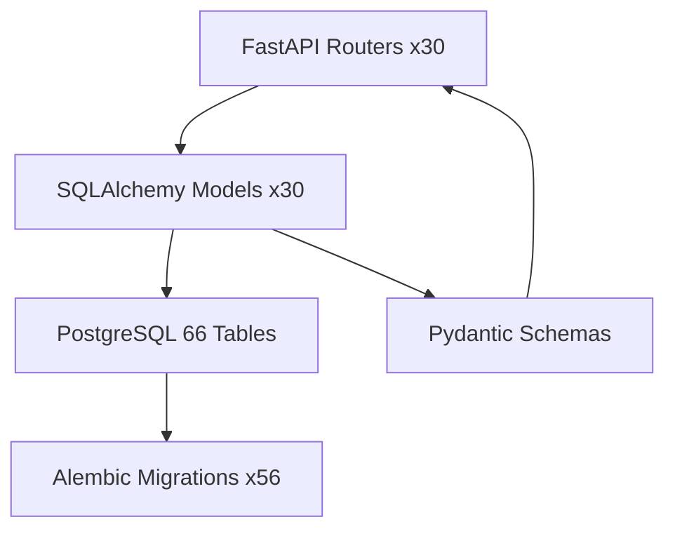
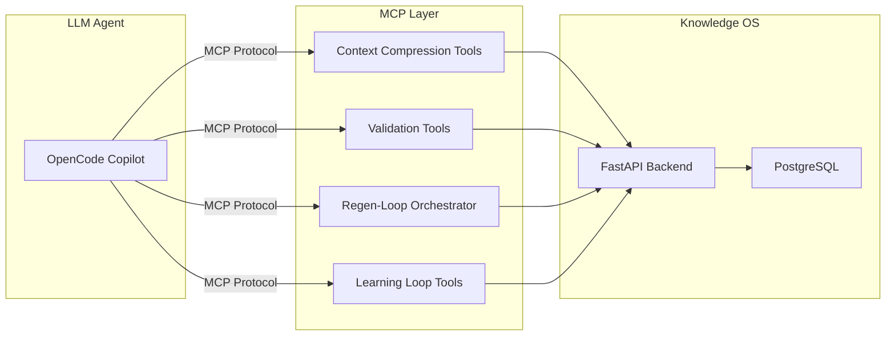
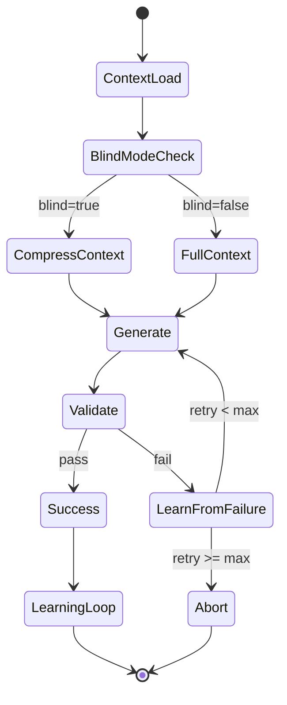
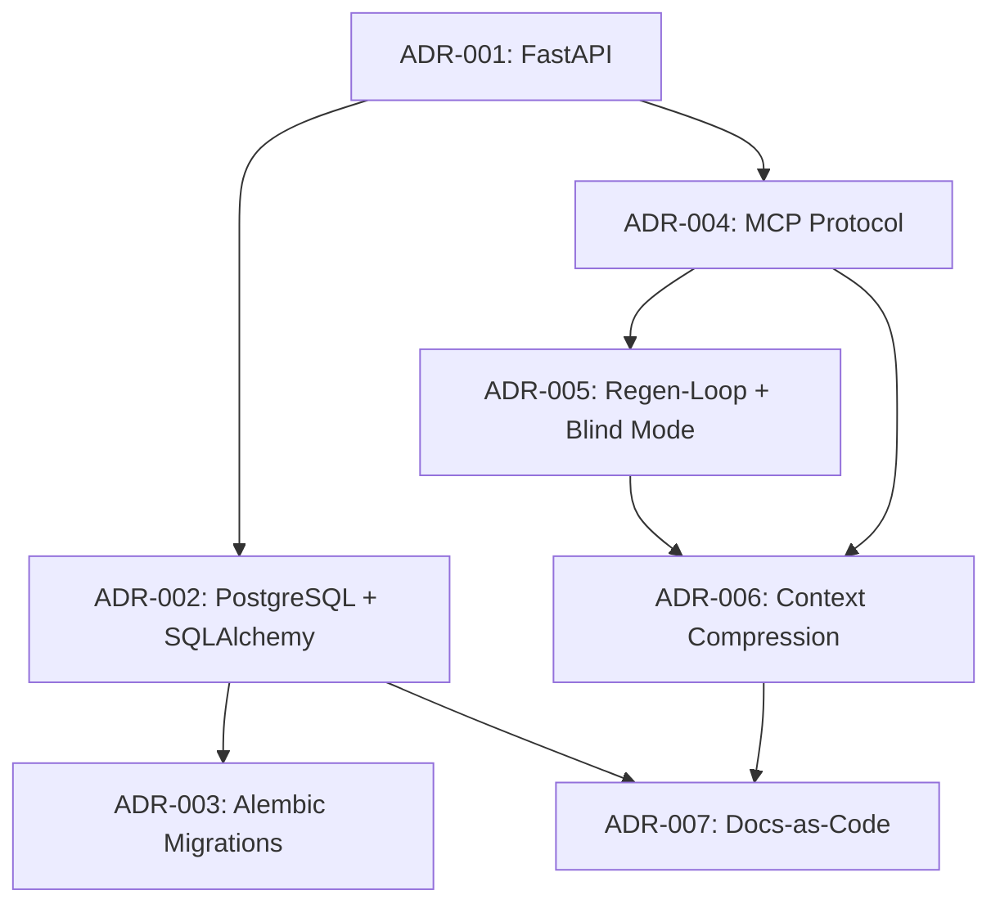

# Architecture Decision Records

| Field | Value |
|---|---|
| Version | 1.0-draft |
| Date | 2026-07-08 |
| Project | OpenCode Architecture Extension |
| System | Knowledge OS (logs-db) |
| Author | TBD |

## Revision History

| Version | Date | Description |
|---|---|---|
| 1.0-draft | 2026-07-08 | Initial draft from automated analysis |

## Project Profile: OpenCode Architecture Extension
Status: active | Type: new-build | Category: Developer Tooling / Knowledge Management

OpenCode MCP extension providing architecture context compression, validation tools, regen-loop orchestrator with blind mode, and learning loop for LLM-driven code regeneration.

### Live System Metrics (auto-generated at artifact build time)

| Metric | Value |
|---|---|
| Total logs | 0 |
| Database tables | 66 |
| Latest migration | 056 |
| Python source files | 448 |
| Test files | 148 |
| API routers | 30 |
| SQLAlchemy models | 30 |
| HTML templates | 18 |

---

## ADR Index

| ADR | Title | Status | Date |
|---|---|---|---|
| ADR-001 | FastAPI as Application Framework | Accepted | 2026-07-08 |
| ADR-002 | PostgreSQL with SQLAlchemy ORM | Accepted | 2026-07-08 |
| ADR-003 | Alembic for Schema Migration Management | Accepted | 2026-07-08 |
| ADR-004 | MCP Protocol for LLM Tool Integration | Accepted | 2026-07-08 |
| ADR-005 | Regen-Loop with Blind Mode Pattern | Accepted | 2026-07-08 |
| ADR-006 | Context Compression Architecture | Accepted | 2026-07-08 |
| ADR-007 | Documentation-as-Code with Automated Artifact Generation | Accepted | 2026-07-08 |

---

## ADR-001: FastAPI as Application Framework

### Context

The Knowledge OS requires a Python web framework capable of serving 30 API routers, rendering 18 HTML templates, supporting async database operations, and integrating with LLM pipelines. The solo developer needs high productivity with strong typing support and auto-generated API documentation. The system must support both synchronous CRUD operations and long-running async processes (e.g., regen-loop orchestration).

### Decision

Adopt **FastAPI** as the primary application framework, deployed via **uvicorn** ASGI server.

### Consequences

| Type | Consequence |
|---|---|
| ✅ Positive | Native async/await support enables non-blocking LLM API calls and pipeline orchestration |
| ✅ Positive | Automatic OpenAPI schema generation reduces documentation burden for 30 routers |
| ✅ Positive | Pydantic integration provides request/response validation aligned with SQLAlchemy models |
| ✅ Positive | Strong typing enables IDE autocompletion and static analysis across 448 source files |
| ⚠️ Negative | Template rendering (Jinja2) is secondary concern in FastAPI ecosystem vs. Django |
| ⚠️ Negative | Solo developer must manually implement auth, admin, and middleware patterns |

**Status:** Accepted

---

## ADR-002: PostgreSQL with SQLAlchemy ORM

### Context

The system manages 66 database tables spanning knowledge capture (logs, entities, relationships), pipeline orchestration (events, feedback), and architecture documentation. The data model requires complex relationships, JSON columns for flexible metadata, full-text search, and transactional integrity. The schema must support evolution over time as new knowledge domains are added.

### Decision

Use **PostgreSQL** as the primary relational database with **SQLAlchemy** as the ORM layer, defining 30 declarative models mapped to the 66-table schema.

### Consequences

| Type | Consequence |
|---|---|
| ✅ Positive | PostgreSQL JSON/JSONB columns enable flexible metadata without schema changes |
| ✅ Positive | SQLAlchemy relationship mapping handles complex junction tables across 66 tables |
| ✅ Positive | Mature ecosystem for full-text search, indexing, and query optimization |
| ✅ Positive | ACID compliance ensures data integrity for knowledge capture operations |
| ⚠️ Negative | 30 models covering 66 tables implies junction/auxiliary tables without dedicated model classes — increases raw SQL surface |
| ⚠️ Negative | PostgreSQL dependency requires managed infrastructure vs. embedded alternatives |

**Status:** Accepted

---

## ADR-003: Alembic for Schema Migration Management

### Context

With 66 tables and an actively evolving schema (56 migrations to date), the project requires reliable, versioned database evolution. Migrations must be reproducible across environments, support both additive changes and data transformations, and maintain referential integrity throughout. The solo developer workflow demands migrations that can be generated, reviewed, and applied with minimal ceremony.

### Decision

Adopt **Alembic** as the schema migration tool, maintaining a linear migration chain (001 through 056) with auto-generation from SQLAlchemy model changes.

### Consequences

| Type | Consequence |
|---|---|
| ✅ Positive | Linear migration history provides complete audit trail of schema evolution |
| ✅ Positive | Auto-generation from model diffs reduces manual migration authoring |
| ✅ Positive | Supports both online (ALTER) and offline (SQL script) migration modes |
| ✅ Positive | Integrates natively with SQLAlchemy model definitions |
| ⚠️ Negative | 56 migrations create long upgrade chain for fresh deployments — may need squash strategy |
| ⚠️ Negative | Complex data migrations (not just DDL) require manual intervention in auto-generated scripts |

**Status:** Accepted

---

## ADR-004: MCP Protocol for LLM Tool Integration

### Context

The OpenCode Architecture Extension must expose architecture context, validation tools, and orchestration capabilities to LLM agents (specifically OpenCode copilot). The integration requires a standardized protocol that LLMs can invoke programmatically, with well-defined tool contracts, parameter schemas, and response formats. The system must support multiple tool categories: context compression, gap analysis, regen-loop control, and learning loop queries.

### Decision

Implement the **Model Context Protocol (MCP)** as the integration layer between the Knowledge OS and LLM agents, exposing system capabilities as MCP tools with formal contracts.

### Consequences

| Type | Consequence |
|---|---|
| ✅ Positive | Standardized protocol enables tool discovery and invocation without custom integration |
| ✅ Positive | Formal tool contracts enforce input/output schemas — see MCP Tool Contract Synchronization process |
| ✅ Positive | Protocol-level separation allows Knowledge OS to evolve independently of LLM client |
| ✅ Positive | Supports multiple concurrent LLM agents without code changes |
| ⚠️ Negative | MCP protocol is emerging — contract stability risk requires active synchronization |
| ⚠️ Negative | Additional abstraction layer adds latency to tool invocations |

**Status:** Accepted

---

## ADR-005: Regen-Loop with Blind Mode Pattern

### Context

LLM-driven code regeneration requires an orchestration pattern that can iteratively generate, validate, and refine code artifacts. "Blind mode" addresses the scenario where the LLM must regenerate code without access to the current implementation — forcing generation purely from architectural context and requirements. This prevents the model from anchoring on existing (potentially flawed) implementations and enables clean-slate regeneration.

### Decision

Implement a **regen-loop orchestrator** with a configurable **blind mode** that withholds source code from the LLM context during regeneration, providing only architecture documents, requirements, and interface contracts as input.

### Consequences

| Type | Consequence |
|---|---|
| ✅ Positive | Prevents implementation anchoring — enables discovery of better solutions |
| ✅ Positive | Validates that architecture documentation is sufficient for regeneration |
| ✅ Positive | Learning loop captures failure patterns for future context improvement |
| ✅ Positive | Configurable mode allows A/B comparison between blind and informed generation |
| ⚠️ Negative | Blind mode increases regeneration iterations due to missing implementation details |
| ⚠️ Negative | Requires high-quality architecture context — failure may indicate documentation gaps, not code issues |
| ⚠️ Negative | Validation step must be robust to avoid false positives accepting incorrect regenerations |

**Status:** Accepted

---

## ADR-006: Context Compression Architecture

### Context

LLM context windows are finite. The Knowledge OS contains 66 tables, 448 source files, 30 routers, and extensive documentation. Providing raw system state to LLMs exceeds token limits and reduces response quality. Architecture context must be compressed into token-efficient representations that preserve semantic density while respecting model constraints.

### Decision

Implement a **context compression pipeline** that transforms raw system knowledge into tiered, compressed representations optimized for LLM consumption, with tunable compression ratios per use case.

### Consequences

| Type | Consequence |
|---|---|
| ✅ Positive | Enables LLM reasoning over full system scope within token constraints |
| ✅ Positive | Tiered compression allows tool-specific context granularity |
| ✅ Positive | Compression ratio serves as a measurable quality metric for documentation completeness |
| ✅ Positive | Supports Context Compression Tuning process for iterative optimization |
| ⚠️ Negative | Lossy compression risks omitting critical details — requires validation |
| ⚠️ Negative | Compression logic itself becomes a maintenance surface that must evolve with the schema |

**Status:** Accepted

---

## ADR-007: Documentation-as-Code with Automated Artifact Generation

### Context

The project maintains a comprehensive systems engineering artifact suite (ConOps, Requirements, Vision, ADRs, Data Dictionary, ICD, etc.) that must stay synchronized with the evolving codebase (448 Python files, 56 migrations, 148 tests). Manual documentation maintenance creates drift. The solo developer cannot sustain manual updates across all artifact types while actively developing features.

### Decision

Treat **documentation as code** — artifacts are generated from live system metrics and source analysis, stored as versioned markdown, and cross-referenced rather than duplicated. Automated processes extract metrics at build time and populate artifact templates.

### Consequences

| Type | Consequence |
|---|---|
| ✅ Positive | Live system metrics ensure documentation reflects actual system state |
| ✅ Positive | Cross-referencing eliminates duplication drift between artifacts |
| ✅ Positive | Markdown format enables version control, diffing, and LLM consumption |
| ✅ Positive | Automated generation scales documentation effort for solo developer |
| ⚠️ Negative | Automation gaps require [TBD] markers — partial artifacts until processes mature |
| ⚠️ Negative | Template-driven generation may produce boilerplate that obscures key decisions |
| ⚠️ Negative | Build-time extraction adds pipeline complexity |

**Status:** Accepted

---

## Decision Map

---

## Cross-References

| Artifact | Relevance |
|---|---|
| Logical Architecture | Technology allocation details for decisions made here |
| Requirements Analysis | Stakeholder needs driving ADR-004 through ADR-006 |
| Data Dictionary | Complete schema details referenced by ADR-002, ADR-003 |
| ICD | Interface contracts referenced by ADR-004 |
| System Vision | Design principles informing all ADRs |
| Testing | Validation approach referenced by ADR-005 |

---

## Future ADR Candidates

| Topic | Trigger |
|---|---|
| Test framework selection (pytest patterns) | 148 test files warrant formal decision record |
| HTML template engine choice | 18 templates — decision context [TBD] |
| Learning loop storage strategy | Feedback persistence pattern [TBD] |
| Gap analyzer threshold selection | Calibration process implies configurable thresholds [TBD] |
| Prompt template versioning strategy | Enumerated process without implementation details [TBD] |