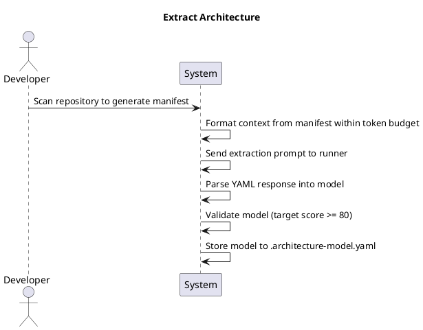
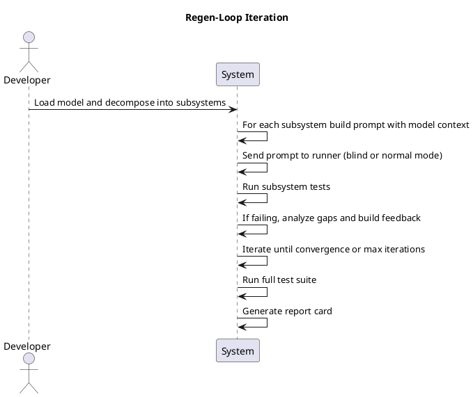
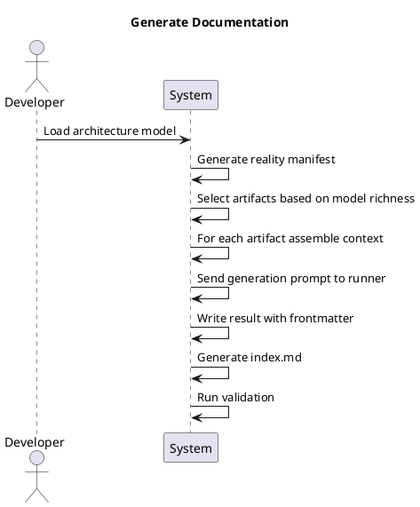

# Behavior Flows

## Overview

This document describes the key system behaviors, their triggers, interaction patterns, and step-by-step flows. Each behavior is documented with its trigger conditions, participating actors, preconditions, sequential steps, postconditions, and architectural pattern type.

---

## BEH-EXTRACT: Extract Architecture

| Attribute | Value |
|-----------|-------|
| **Trigger** | CLI command `opencode-arch extract` |
| **Actor** | Developer |
| **Pattern** | Sequential |

### Preconditions

- Target repository path is accessible
- Runner backend is configured and available
- `architecture-model-standard` package is installed

### Steps

1. **Scan repository to generate manifest** — Perform AST analysis on the target repository to produce a reality manifest containing modules, functions, classes, imports, and metrics.
2. **Format context from manifest within token budget** — Compress the manifest into a dense context string that fits within the configured token budget.
3. **Send extraction prompt to runner** — Assemble the extraction prompt with context and dispatch it to the configured runner backend (e.g., OpenCode subprocess).
4. **Parse YAML response into model** — Extract the YAML architecture model from the runner's output and parse it into an ArchitectureModel structure.
5. **Validate model (target score >= 80)** — Run structural validation checks (ID uniqueness, referential integrity, orphan detection, capability realization, meta completeness) and verify the score meets the target threshold.
6. **Store model to .architecture-model.yaml** — Persist the validated model to the repository root and record telemetry (score, tokens, time).

### Postconditions

- `.architecture-model.yaml` exists in the target repository
- Validation score is recorded in telemetry
- Model passes structural validation with score >= 80

### Sequence Diagram

---

## BEH-REGEN: Regen-Loop Iteration

| Attribute | Value |
|-----------|-------|
| **Trigger** | CLI command `opencode-arch regen-loop` |
| **Actor** | Developer |
| **Pattern** | Pipeline |

### Preconditions

- Architecture model (`.architecture-model.yaml`) exists for the target repository
- Test suite is configured and runnable
- Runner backend is configured and available

### Steps

1. **Load model and decompose into subsystems** — Read the architecture model and partition it into independent subsystems for targeted generation.
2. **For each subsystem build prompt with model context** — Assemble a generation prompt incorporating the relevant model slice as context for the current subsystem.
3. **Send prompt to runner (blind or normal mode)** — Dispatch the prompt to the runner backend. In blind mode, the runner operates without access to existing source; in normal mode, existing source is included as context.
4. **Run subsystem tests** — Execute the test suite scoped to the current subsystem to assess code quality.
5. **If failing, analyze gaps and build feedback** — When tests fail, analyze the failures to identify gaps between generated code and expected behavior, then construct targeted feedback for the next iteration.
6. **Iterate until convergence or max iterations** — Repeat the generation-test-feedback cycle until all subsystem tests pass or the maximum iteration count is reached.
7. **Run full test suite** — After all subsystems converge, execute the complete test suite to verify integration correctness.
8. **Generate report card** — Produce a summary report documenting pass rates, iteration counts, and quality metrics for each subsystem.

### Postconditions

- Generated code passes subsystem tests (or max iterations reached)
- Full test suite results are recorded
- Report card summarizing pass rates and iterations is produced
- Telemetry is recorded for each iteration

### Sequence Diagram

---

## BEH-DOCS: Generate Documentation

| Attribute | Value |
|-----------|-------|
| **Trigger** | CLI command `opencode-arch docs generate` |
| **Actor** | Developer |
| **Pattern** | Sequential |

### Preconditions

- Architecture model (`.architecture-model.yaml`) exists for the target repository
- Target repository is accessible for manifest generation
- Runner backend is configured and available

### Steps

1. **Load architecture model** — Read and parse the `.architecture-model.yaml` from the target repository.
2. **Generate reality manifest** — Perform AST scanning to produce an up-to-date manifest of the repository's actual structure.
3. **Select artifacts based on model richness** — Determine which documentation artifacts to generate based on the entities and relationships present in the model.
4. **For each artifact assemble context** — Build a focused context payload for each selected artifact, combining relevant model slices with manifest data.
5. **Send generation prompt to runner** — Dispatch the documentation generation prompt with assembled context to the runner backend.
6. **Write result with frontmatter** — Write the generated documentation to disk, prepending structured frontmatter metadata.
7. **Generate index.md** — Produce an index file linking all generated documentation artifacts.
8. **Run validation** — Validate the generated documentation for completeness and structural correctness.

### Postconditions

- Documentation artifacts are written to the target directory
- Each artifact includes frontmatter metadata
- `index.md` links all generated artifacts
- Validation confirms documentation completeness

### Sequence Diagram

---

## BEH-MCP-SCAN: MCP Scan Tool

| Attribute | Value |
|-----------|-------|
| **Trigger** | Agent calls `architect_scan` |
| **Actor** | Agent (frontier model) |
| **Pattern** | Sequential |

### Preconditions

- MCP server is running and registered with the agent environment
- Target repository path is valid and accessible

### Steps

1. **Receive repo_path from agent** — Accept the repository path parameter from the calling agent via the MCP protocol.
2. **Call generate_manifest on target** — Invoke the AST scanning function from `architecture-model-standard` on the specified repository path.
3. **Return manifest dict to agent** — Return the resulting manifest dictionary (modules, functions, classes, imports, metrics) to the agent for further reasoning.

### Postconditions

- Agent receives a complete manifest dictionary
- No state is persisted (stateless tool invocation)
- Telemetry is recorded for the invocation

---

## Pattern Summary

| Behavior | Pattern | Iteration | Feedback Loop |
|----------|---------|-----------|---------------|
| BEH-EXTRACT | Sequential | Single pass | No |
| BEH-REGEN | Pipeline | Multi-pass (until convergence) | Yes (test failures → feedback) |
| BEH-DOCS | Sequential | Single pass per artifact | No |
| BEH-MCP-SCAN | Sequential | Single pass | No |
