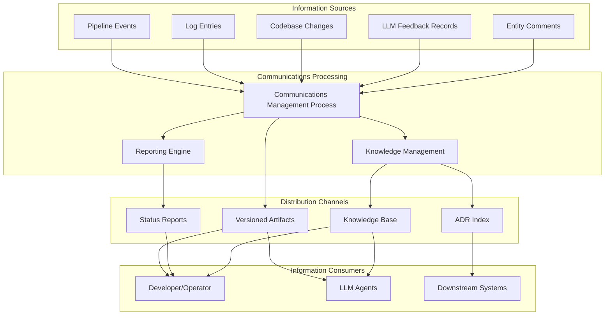
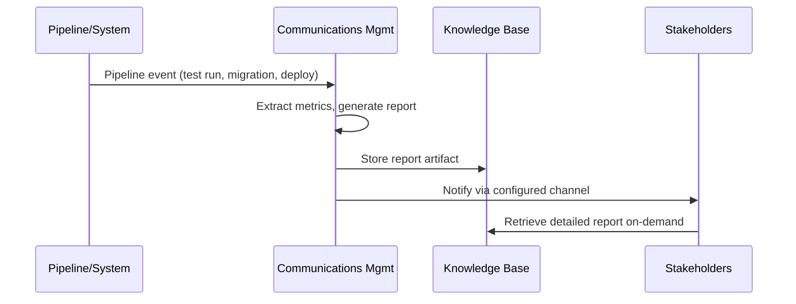
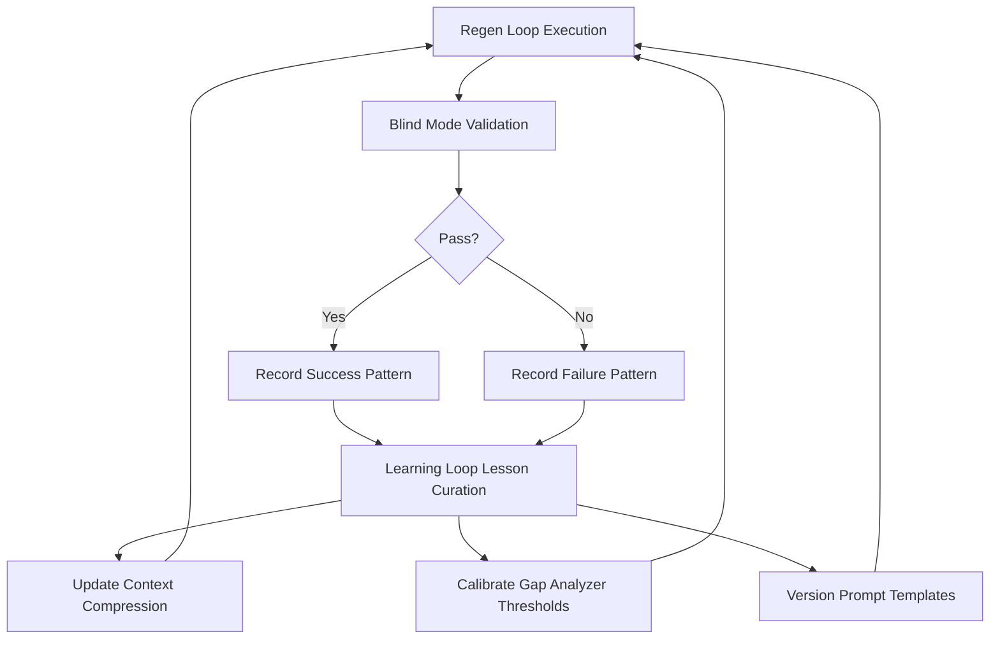

# Communications Plan

| Field | Value |
|---|---|
| Version | 1.0-draft |
| Date | 2026-07-08 |
| Project | OpenCode Architecture Extension |
| System | N/A |
| Author | TBD |

## Revision History

| Version | Date | Description |
|---|---|---|
| 1.0-draft | 2026-07-08 | Initial draft from automated analysis |

## Project Profile: OpenCode Architecture Extension
Status: active | Type: new-build | Category: 
OpenCode MCP extension providing architecture context compression, validation tools, regen-loop orchestrator with blind mode, and learning loop for LLM-driven code regeneration.

### Live System Metrics (auto-generated at artifact build time)
| Metric | Value |
|---|---|
| Total logs | 0 |
| Database tables | 66 |
| Latest migration | 056 |
| Python source files | 448 |
| Test files | 148 |
| API routers | 30 |
| SQLAlchemy models | 30 |
| HTML templates | 18 |

---

## 1. Communications Strategy

### 1.1 Strategy Overview

This project employs a **documentation-as-communication** strategy. Because the system is an LLM-driven architecture extension operating within a solo-developer resource model, traditional meeting-heavy communication plans are replaced by structured, artifact-driven knowledge flows. All project information is created, distributed, stored, and retrieved through versioned documents, automated pipeline events, and system-generated reports.

### 1.2 Communication Principles

| Principle | Implementation |
|---|---|
| Single source of truth | Each knowledge area owns one authoritative artifact; no duplication across documents |
| Automation-first | Pipeline events, log entries, and system metrics generate communication artifacts without manual intervention |
| Asynchronous by default | All stakeholder communication occurs through retrievable artifacts rather than synchronous meetings |
| Traceable decisions | ADRs capture technical decisions; change logs track scope/schedule/cost changes |
| Context-compressed | LLM-facing communications use architecture context compression to maximize signal density |

### 1.3 Information Flow Architecture

### 1.4 Information Lifecycle

1. **Creation** — Triggered by pipeline events, codebase changes, or explicit authoring sessions
2. **Distribution** — Artifacts are committed to version control; status data flows through the API layer (30 routers)
3. **Storage** — PostgreSQL database (66 tables), versioned markdown files, migration history (through migration 056)
4. **Retrieval** — MCP tools provide context-compressed access for LLM agents; API endpoints serve human consumers

---

## 2. Stakeholder Communications Matrix

> For complete stakeholder identification and engagement levels, see **Stakeholder Register**.

| Stakeholder | Information Need | Frequency | Format | Channel |
|---|---|---|---|---|
| Developer/Operator | System health, test results, schedule variance, scope changes | Per-session | Status reports, dashboards, pipeline logs | Knowledge Base, terminal output |
| LLM Agents (OpenCode) | Architecture context, validation results, regen-loop state, learning loop lessons | Per-invocation | Compressed context payloads, MCP tool responses | MCP protocol, API endpoints |
| Downstream Systems | Interface contracts, API schemas, migration state | Per-release | ICD updates, OpenAPI specs, migration logs | Version control, API schema endpoints |
| Future Contributors | Onboarding context, architectural decisions, operational procedures | On-demand | README, Operations Manual, ADRs | Repository documentation |
| Infrastructure Services | Configuration state, health checks, dependency status | Continuous | Health endpoint responses, deployment manifests | HTTP health endpoints, Docker configs |

### Communication Triggers

| Trigger Event | Communication Action | Target Audience |
|---|---|---|
| Migration applied | Update Data Dictionary cross-reference, notify via pipeline event | Developer, LLM Agents |
| Test failure | Generate defect report, update quality metrics | Developer |
| ADR created/superseded | Update ADR index, cross-reference in affected artifacts | All stakeholders |
| Scope change approved | Update scope baseline, notify schedule/cost impact | Developer |
| Regen-loop completion | Publish validation results, update learning loop | LLM Agents, Developer |
| New release deployed | Update Deployment Guide, ICD, README | All stakeholders |

---

## 3. Documentation Strategy

### 3.1 Document Architecture

The project maintains a structured artifact hierarchy where each systems engineering process owns specific documents. The Communications Management process coordinates information flow across all artifacts without duplicating content owned by other processes.

```mermaid
flowchart LR
    subgraph Tier1["Tier 1: Vision & Strategy"]
        SV[System Vision]
        CONOPS[Concept of Operations]
        PR[Product Roadmap]
    end

    subgraph Tier2["Tier 2: Architecture & Design"]
        FA[Functional Architecture]
        LA[Logical Architecture]
        SCD[System Context Diagram]
        SPA[Signal Path Atlas]
        ICD[Interface Control Document]
    end

    subgraph Tier3["Tier 3: Implementation & Operations"]
        DD[Data Dictionary]
        DG[Deployment Guide]
        OM[Operations Manual]
        MM[Maintenance Manual]
        TS[Testing Strategy]
    end

    subgraph Tier4["Tier 4: Management"]
        SEMP[SEMP]
        CP[Communications Plan]
        RM[Risk Management]
        SM[Schedule Management]
    end

    Tier1 --> Tier2
    Tier2 --> Tier3
    Tier4 -.->|governs| Tier1
    Tier4 -.->|governs| Tier2
    Tier4 -.->|governs| Tier3
```

### 3.2 Documentation Standards

| Standard | Specification |
|---|---|
| Format | Markdown with Mermaid diagrams |
| Versioning | Semantic (MAJOR.MINOR-status) tracked in revision history tables |
| Cross-referencing | By artifact name; no content duplication |
| Metrics | Sourced exclusively from live system metrics at build time |
| Gaps | Marked with `[TBD]` — never fabricated |
| Storage | Version-controlled alongside source code |

### 3.3 Artifact Ownership

Each SE process listed in the enriched process inventory owns its output artifacts. The Communications Management process does **not** own content produced by other processes but is responsible for:

- Ensuring artifacts are discoverable and retrievable
- Coordinating cross-references between artifacts
- Monitoring artifact currency and flagging stale documents
- Providing the communication channel definitions through which artifacts are distributed

### 3.4 LLM-Facing Documentation

A key differentiator of this project's documentation strategy is **context compression for LLM consumption**. The OpenCode Architecture Extension provides:

- **Architecture context compression** — Reduces full system documentation to token-efficient summaries
- **MCP tool contracts** — Formal interface definitions for tool invocations (see MCP Tool Contract Synchronization process)
- **Prompt template versioning** — Managed evolution of LLM-facing communication templates

---

## 4. Reporting

### 4.1 Status Reporting

| Report | Content | Frequency | Audience | Format |
|---|---|---|---|---|
| Pipeline Status | Test results (148 test files), migration state, build health | Per-session | Developer | Terminal/dashboard |
| System Metrics Summary | Table counts (66), model counts (30), router counts (30), source file count (448) | On-demand | Developer, LLM Agents | Structured data |
| Schedule Variance | Sprint progress vs. baseline, milestone tracking | [TBD — per Schedule Management] | Developer | Markdown report |
| Cost Variance | Infrastructure spend vs. budget baseline | [TBD — per Cost Management] | Developer | Earned value report |
| Quality Dashboard | Test coverage, defect trends, data integrity metrics | [TBD — per Quality Management] | Developer | Markdown + metrics |

### 4.2 Milestone Reviews

Milestone reviews are conducted at significant system state transitions:

| Milestone Type | Review Content | Gate Criteria |
|---|---|---|
| Migration milestone | Schema changes validated, Data Dictionary updated | All tests pass, ICD updated |
| Capability delivery | Feature complete against roadmap phase | V&V evidence recorded, ADR documented |
| Release | Deployment verified, documentation current | Deployment Guide executed, health checks pass |

### 4.3 Automated Reporting Pipeline

---

## 5. Knowledge Management

### 5.1 Knowledge Capture Mechanisms

| Knowledge Type | Capture Mechanism | Storage Location | Retrieval Method |
|---|---|---|---|
| Technical decisions | Architecture Decision Records (ADRs) | ADR index in repository | By ADR number, decision map |
| Lessons learned | Learning Loop Lesson Curation process | Knowledge base (database) | MCP tool query, search |
| Operational knowledge | Operations Manual, Maintenance Manual | Versioned documentation | Direct access, LLM context |
| Interface knowledge | ICD, Signal Path Atlas | Versioned documentation | Cross-reference lookup |
| Process knowledge | SEMP, individual process artifacts | Versioned documentation | Artifact hierarchy navigation |

### 5.2 Decision Traceability

All significant technical decisions follow the ADR process:

1. **Context** documented — what situation prompted the decision
2. **Decision** recorded with rationale
3. **Consequences** enumerated (positive and negative)
4. **Status** tracked (proposed → accepted → superseded)
5. **Cross-references** linked to affected artifacts

### 5.3 Learning Loop Integration

The OpenCode Architecture Extension implements a formal learning loop that captures:

- Regen-loop outcomes (success/failure patterns in blind mode validation)
- Gap analyzer findings (threshold calibration data)
- Context compression effectiveness metrics
- Prompt template performance across versions

This knowledge feeds back into the LLM-driven regeneration process, creating a closed-loop improvement cycle:

### 5.4 Knowledge Retrieval Strategy

| Consumer | Access Pattern | Optimization |
|---|---|---|
| Human developer | Browse artifact hierarchy, search by topic | Clear naming, cross-references, table of contents |
| LLM agent | MCP tool invocation with context window constraints | Architecture context compression, token-efficient summaries |
| Automated processes | API queries against 30 routers | Structured JSON responses, pagination |

### 5.5 Knowledge Currency

To prevent knowledge decay:

- Artifacts include live system metrics regenerated at build time (authoritative source)
- Stale artifact detection triggers update workflow
- Cross-references validate during artifact generation (broken links flagged)
- [TBD] — Automated staleness scoring mechanism details

---

## References

| Artifact | Relevance |
|---|---|
| Stakeholder Register | Complete stakeholder identification and engagement levels |
| Data Dictionary | Schema details for 66 tables, 30 models |
| Interface Control Document | API contracts across 30 routers |
| Systems Engineering Management Plan | Governance of all SE processes |
| Product Roadmap | Milestone and delivery schedule context |
| ADR Index | Complete decision history |