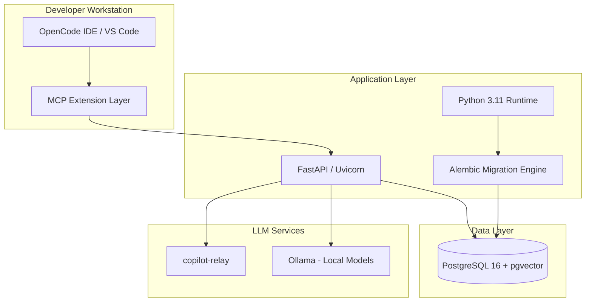
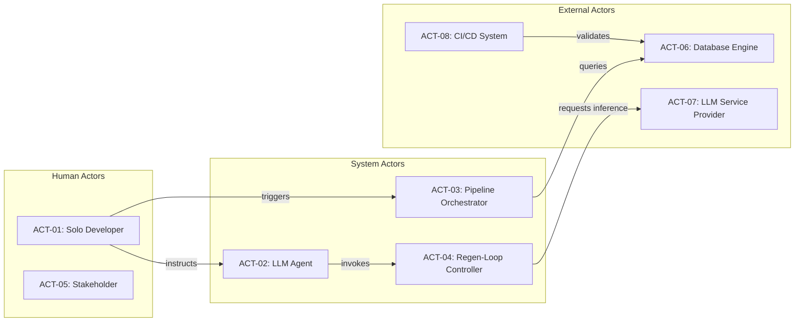
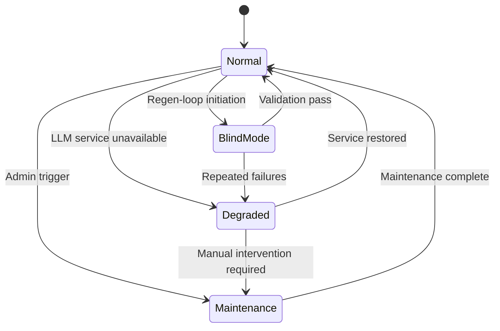

# Concept of Operations

| Field | Value |
|---|---|
| Version | 1.0-draft |
| Date | 2026-07-08 |
| Project | OpenCode Architecture Extension |
| System | Knowledge OS (logs-db) |
| Author | TBD |

## Revision History

| Version | Date | Description |
|---|---|---|
| 1.0-draft | 2026-07-08 | Initial draft from automated analysis |

## Project Profile: OpenCode Architecture Extension
Status: active | Type: new-build | Category: Developer Tooling / Knowledge Management

OpenCode MCP extension providing architecture context compression, validation tools, regen-loop orchestrator with blind mode, and learning loop for LLM-driven code regeneration.

### Live System Metrics (auto-generated at artifact build time)

| Metric | Value |
|---|---|
| Total logs | 0 |
| Database tables | 66 |
| Latest migration | 056 |
| Python source files | 448 |
| Test files | 148 |
| API routers | 30 |
| SQLAlchemy models | 30 |
| HTML templates | 18 |

---

## 1. System Purpose

The Knowledge OS exists to capture, enrich, interconnect, and serve project knowledge — functioning as institutional memory for LLM-driven software development workflows. It bridges the gap between ephemeral development context (sessions, decisions, observations) and persistent, queryable knowledge that enables automated code regeneration with architectural fidelity.

The system's value proposition is expressed through six functional capabilities:

| ID | Capability | Description |
|---|---|---|
| **F1** | Ingest Source Data | Capture logs, observations, decisions, and codebase events into structured storage |
| **F2** | Enrich Log Entities | Apply NLP/LLM pipelines to extract entities, relationships, and semantic embeddings |
| **F3** | Manage Knowledge Base | Curate, link, and version knowledge artifacts including ADRs, technologies, and entity graphs |
| **F4** | Serve API & UI | Expose RESTful endpoints and HTML interfaces for human and machine consumers |
| **F5** | Maintain Data Integrity | Ensure schema consistency, migration safety, backup/recovery, and data quality |
| **F6** | Generate Documentation | Synthesize formal systems engineering artifacts from accumulated knowledge |

Together, these capabilities enable the OpenCode Architecture Extension to compress architectural context for LLM consumption, validate generated outputs against known constraints, orchestrate regeneration loops (including blind mode), and accumulate lessons for continuous improvement.

---

## 2. Operational Environment

### Infrastructure Stack

### Component Details

| Component | Role | Notes |
|---|---|---|
| PostgreSQL 16 + pgvector | Primary data store with vector similarity search | 66 tables, migration 056 |
| Python 3.11 | Application runtime | 448 source files |
| FastAPI / Uvicorn | HTTP API server | 30 routers |
| copilot-relay | LLM gateway for hosted model access | Proxies requests to GitHub Copilot / OpenAI |
| Ollama | Local LLM inference | Embedding generation, entity extraction |
| Alembic | Database migration management | 56 migrations applied |
| MCP Protocol | Extension communication layer | Context compression + tool invocation |

### Deployment Topology

The system operates as a single-node deployment on a developer workstation or dedicated server. PostgreSQL runs as a containerized service (Docker Compose). The FastAPI application runs directly or within a container. LLM services (copilot-relay, Ollama) run as sidecar processes.

---

## 3. User Classes

### Actor Matrix

| Actor ID | Name | Type | Description | Primary F-Blocks |
|---|---|---|---|---|
| **ACT-01** | Solo Developer | Human | Primary user; creates logs, triggers pipelines, reviews outputs | F1, F3, F4 |
| **ACT-02** | LLM Agent (OpenCode) | System | Consumes compressed context, generates code, invokes MCP tools | F1, F2, F6 |
| **ACT-03** | Pipeline Orchestrator | System | Schedules and executes enrichment and validation workflows | F2, F5 |
| **ACT-04** | Regen-Loop Controller | System | Manages blind-mode regeneration cycles and convergence checks | F2, F4, F6 |
| **ACT-05** | Stakeholder / Reviewer | Human | Reads generated documentation, validates ADRs | F4, F6 |
| **ACT-06** | Database Engine | External | PostgreSQL executing queries, enforcing constraints | F5 |
| **ACT-07** | LLM Service Provider | External | copilot-relay / Ollama serving inference requests | F2, F6 |
| **ACT-08** | CI/CD System | External | Runs tests, validates migrations, deploys artifacts | F5 |

### Human vs. System Actor Boundaries

---

## 4. Operational Scenarios

### F1 — Ingest Source Data (UC-01 through UC-05)

| Scenario | UC-IDs | Actors | Description |
|---|---|---|---|
| Manual log capture | UC-01 | ACT-01, ACT-06 | Developer creates a log entry via API/UI capturing a decision, observation, or task |
| Codebase observation | UC-02 | ACT-02, ACT-01 | LLM agent records codebase exploration findings during a session |
| Pipeline event ingestion | UC-03 | ACT-03, ACT-06 | Automated pipeline events (migrations, test runs) captured into event store |
| Bulk import | UC-04 | ACT-01, ACT-06 | Historical data loaded from external sources (Google Sheets, markdown) |
| Session boundary logging | UC-05 | ACT-02, ACT-03 | Start/end of OpenCode sessions captured with context metadata |

### F2 — Enrich Log Entities (UC-06 through UC-08)

| Scenario | UC-IDs | Actors | Description |
|---|---|---|---|
| Entity extraction | UC-06 | ACT-03, ACT-07 | Pipeline sends log text to LLM for named entity recognition; results stored as entity links |
| Embedding generation | UC-07 | ACT-03, ACT-07 | Ollama generates vector embeddings for semantic search via pgvector |
| Relationship inference | UC-08 | ACT-03, ACT-06 | Pipeline identifies implicit relationships between entities and creates junction records |

### F3 — Manage Knowledge Base (UC-09 through UC-13)

| Scenario | UC-IDs | Actors | Description |
|---|---|---|---|
| ADR lifecycle | UC-09 | ACT-01, ACT-02 | Create, review, supersede architecture decision records |
| Technology tracking | UC-10 | ACT-01, ACT-06 | Register technologies, map to projects, update adoption status |
| Entity curation | UC-11 | ACT-01, ACT-03 | Merge duplicates, correct classifications, add metadata |
| Knowledge graph query | UC-12 | ACT-02, ACT-06 | LLM agent queries entity relationships for context assembly |
| Context compression | UC-13 | ACT-04, ACT-02 | Compress knowledge subgraphs into token-efficient representations for LLM consumption |

### F4 — Serve API & UI (UC-14 through UC-21)

| Scenario | UC-IDs | Actors | Description |
|---|---|---|---|
| REST API consumption | UC-14 | ACT-02, ACT-04 | System actors invoke endpoints for CRUD and search operations |
| Dashboard viewing | UC-15 | ACT-01, ACT-05 | Human actors view system state via 18 HTML templates |
| MCP tool invocation | UC-16 | ACT-02 | LLM agent calls registered MCP tools for architecture queries |
| Semantic search | UC-17 | ACT-01, ACT-02 | Vector similarity queries across log embeddings |
| Filtering and pagination | UC-18 | ACT-01 | Navigate large result sets via API query parameters |
| Artifact retrieval | UC-19 | ACT-02, ACT-05 | Fetch generated documentation artifacts by type/version |
| Health check | UC-20 | ACT-08 | CI/CD polls `/health` endpoint for service status |
| Feedback submission | UC-21 | ACT-01, ACT-02 | Record LLM output quality assessments for learning loop |

### F5 — Maintain Data Integrity (UC-22 through UC-24)

| Scenario | UC-IDs | Actors | Description |
|---|---|---|---|
| Migration execution | UC-22 | ACT-01, ACT-08 | Apply Alembic migrations (currently at 056) with rollback safety |
| Backup and recovery | UC-23 | ACT-01, ACT-06 | PostgreSQL dump/restore procedures for disaster recovery |
| Data quality audit | UC-24 | ACT-03, ACT-06 | Validate referential integrity, orphan detection, constraint enforcement |

### F6 — Generate Documentation (UC-25 through UC-26)

| Scenario | UC-IDs | Actors | Description |
|---|---|---|---|
| Artifact synthesis | UC-25 | ACT-04, ACT-07 | Regen-loop generates formal SE artifacts from knowledge base state |
| Blind-mode validation | UC-26 | ACT-04, ACT-08 | Regenerate artifacts without prior output reference; diff against baseline for drift detection |

---

## 5. Modes of Operation

### Mode Definitions

| Mode | Description | Available F-Blocks | Restricted F-Blocks |
|---|---|---|---|
| **Normal** | All services operational; full read/write/enrich capability | F1–F6 | None |
| **Maintenance** | Database migrations, backups, or schema changes in progress | F5 | F1, F2, F3, F4, F6 (read-only) |
| **Degraded** | LLM services (copilot-relay/Ollama) unavailable | F1, F3, F4, F5 | F2 (no enrichment), F6 (no generation) |
| **Blind Mode** | Regen-loop operating without access to prior outputs; measures regeneration fidelity | F1, F2, F4, F5, F6 | F3 (knowledge base frozen for test duration) |

### Mode Transitions

- **Normal → Maintenance**: Triggered by developer (ACT-01) or CI/CD (ACT-08) before migration execution.
- **Normal → Degraded**: Automatic detection via health checks when LLM service endpoints become unreachable.
- **Normal → Blind Mode**: ACT-04 (Regen-Loop Controller) initiates; prior artifact cache is sealed.
- **Degraded → Normal**: Automatic recovery when health checks confirm LLM service availability.
- **Blind Mode → Normal**: Validation pass confirms regenerated artifacts meet convergence thresholds.

---

## 6. System Lifecycle

| Phase | Status | Description | Key Deliverables |
|---|---|---|---|
| **Phase 0: Foundation** | [COMPLETE] | Initial schema design, FastAPI scaffold, core entity models | Database schema (30 models), basic CRUD API |
| **Phase 1: Data Capture** | [COMPLETE] | Log ingestion, entity relationships, migration framework | Alembic pipeline, 56 migrations, bulk import |
| **Phase 2: Enrichment Pipeline** | [ACTIVE] | LLM-based entity extraction, embedding generation, relationship inference | pgvector integration, Ollama connectivity, pipeline orchestrator |
| **Phase 3: Context Compression** | [ACTIVE] | MCP extension for architecture context delivery to LLM agents | Context compression tuning, MCP tool contracts, prompt templates |
| **Phase 4: Regen-Loop** | [ACTIVE] | Blind-mode regeneration orchestration with convergence validation | Regen-loop controller, blind mode validation, gap analyzer calibration |
| **Phase 5: Learning Loop** | [ACTIVE] | Feedback capture, lesson curation, threshold calibration | Learning loop lessons, E2E benchmark regression, quality metrics |
| **Phase 6: Documentation Synthesis** | [PLANNED] | Fully automated SE artifact generation from knowledge base | Artifact templates, cross-reference engine, version management |
| **Phase 7: Multi-Project Scale** | [PLANNED] | Support for multiple concurrent projects with shared knowledge graph | [TBD] |

---

## Cross-References

| Artifact | Relationship |
|---|---|
| Use Cases | Detailed actor flows, primary/alternate scenarios for UC-01 through UC-26 |
| Functional Architecture | F-block decomposition, interface definitions, data flow maps |
| Data Dictionary | Complete schema documentation for all 66 tables |
| System Context Diagram | External boundary definition, actor interfaces |
| Signal Path Atlas | End-to-end data flow tracing through all F-blocks |
| Operations Manual | Day-to-day procedures for each operational mode |

---

## Scope Boundaries

**This document owns**: system purpose, operational environment, user classes, operational scenarios, modes of operation, system lifecycle phases.

**This document does NOT cover**: implementation details (see Logical Architecture), test procedures (see Testing), detailed API contracts (see ICD), or entity schema specifics (see Data Dictionary).