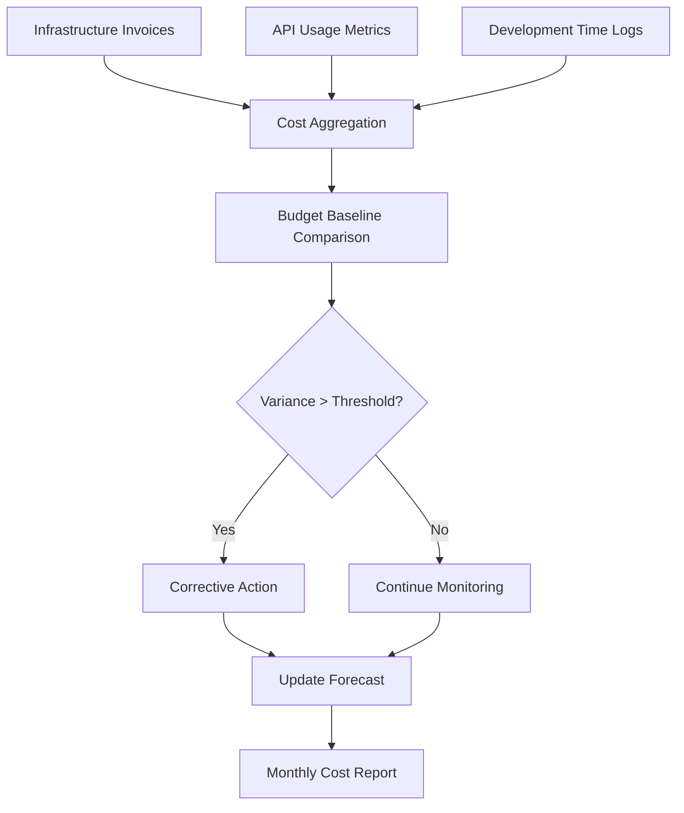
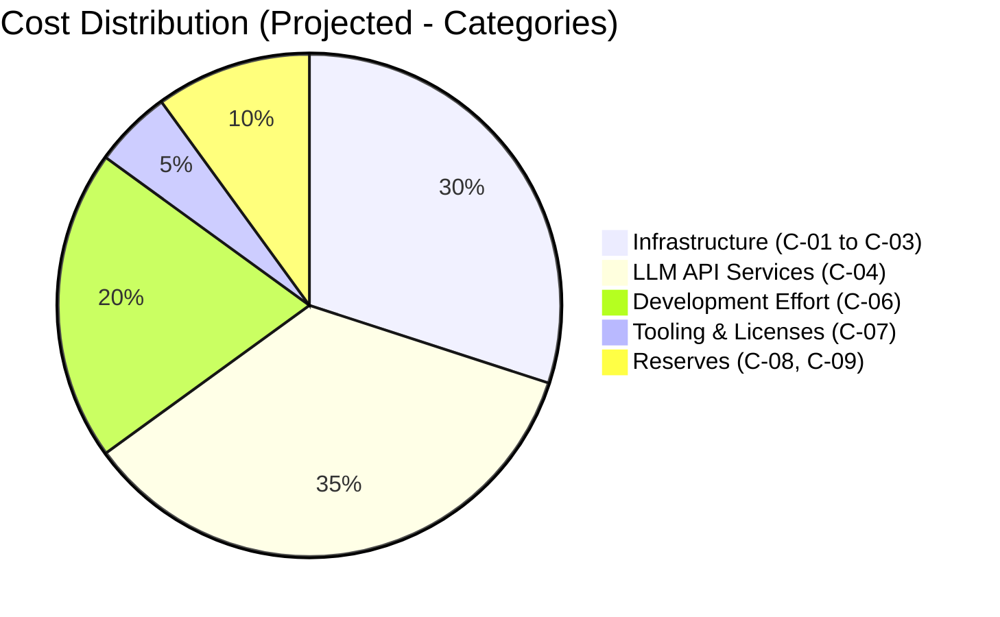
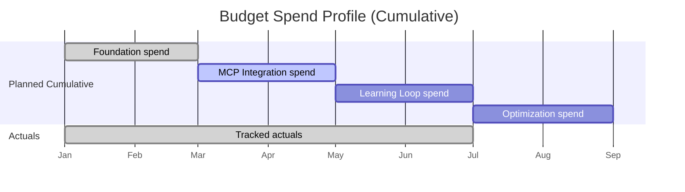
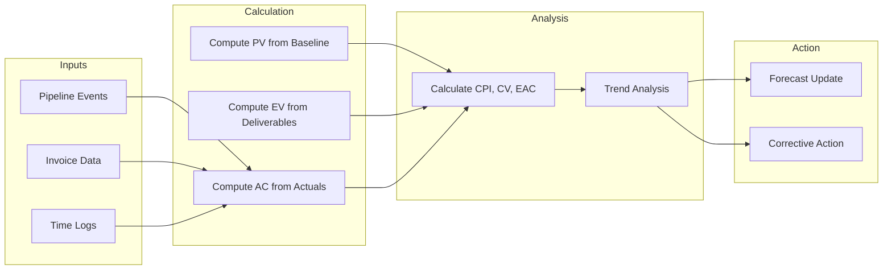
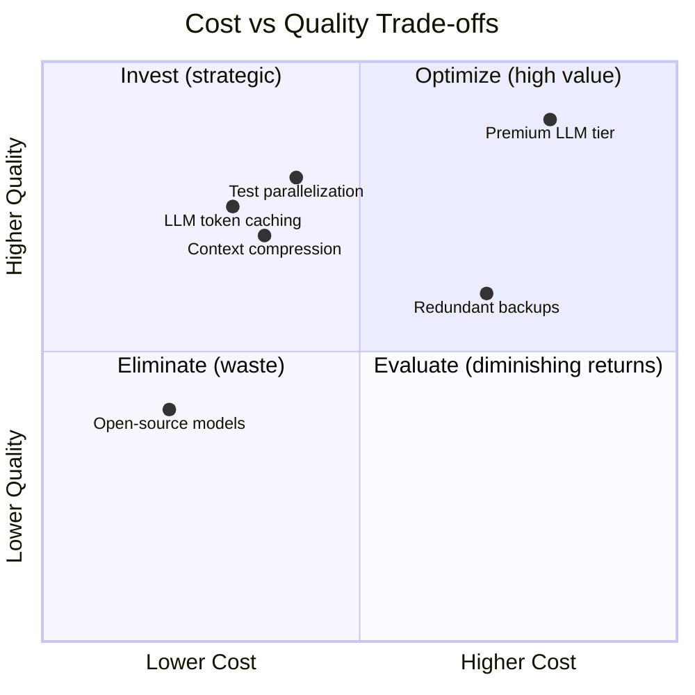

# Cost Baseline & Budget

| Field | Value |
|---|---|
| Version | 1.0-draft |
| Date | 2026-07-08 |
| Project | OpenCode Architecture Extension |
| System | N/A |
| Author | TBD |

## Revision History

| Version | Date | Description |
|---|---|---|
| 1.0-draft | 2026-07-08 | Initial draft from automated analysis |

## Project Profile: OpenCode Architecture Extension
Status: active | Type: new-build | Category: Developer Tooling / Knowledge Management

OpenCode MCP extension providing architecture context compression, validation tools, regen-loop orchestrator with blind mode, and learning loop for LLM-driven code regeneration.

### Live System Metrics (auto-generated at artifact build time)

| Metric | Value |
|---|---|
| Total logs | 0 |
| Database tables | 66 |
| Latest migration | 056 |
| Python source files | 448 |
| Test files | 148 |
| API routers | 30 |
| SQLAlchemy models | 30 |
| HTML templates | 18 |

---

## 1. Cost Management Approach

### 1.1 Estimation Method

Cost estimation for the Knowledge OS project follows a **hybrid bottom-up / analogous approach**:

- **Infrastructure costs** are estimated bottom-up from actual cloud service invoices and API usage metrics
- **Development effort** is estimated using time logs from solo-developer sessions tracked through the OpenCode pipeline
- **Third-party services** (LLM API providers) are estimated from historical usage patterns and projected growth

### 1.2 Cost Tracking Mechanism

### 1.3 Cost Control Principles

| Principle | Implementation |
|---|---|
| Threshold-based alerts | Trigger review when any category exceeds ±10% of baseline |
| Monthly reconciliation | Compare actuals to baseline on calendar-month cadence |
| Change control integration | Cost-impacting changes require updated baseline (see Integration Management) |
| Earned Value tracking | Apply CPI/SPI at milestone boundaries |

### 1.4 Roles & Responsibilities

| Role | Responsibility |
|---|---|
| Solo Developer (Primary) | Estimate, track, approve expenditures, update forecasts |
| Automated Pipeline | Collect usage metrics, generate cost event data |
| LLM Copilot | Flag anomalous spend patterns in pipeline events |

---

## 2. Cost Categories

### 2.1 Cost Breakdown Structure

| ID | Category | Subcategory | Estimate (Monthly) | Estimate (Annual) | Confidence |
|---|---|---|---|---|---|
| C-01 | Infrastructure | PostgreSQL hosting | [TBD] | [TBD] | Medium |
| C-02 | Infrastructure | Compute (FastAPI/uvicorn) | [TBD] | [TBD] | Medium |
| C-03 | Infrastructure | Storage (backups, logs) | [TBD] | [TBD] | Low |
| C-04 | Third-Party Services | LLM API usage (context compression, regen-loop) | [TBD] | [TBD] | Low |
| C-05 | Third-Party Services | External API integrations | [TBD] | [TBD] | Low |
| C-06 | Development Effort | Solo developer time (opportunity cost) | [TBD] | [TBD] | Medium |
| C-07 | Tooling & Licenses | IDE, CI/CD, monitoring tools | [TBD] | [TBD] | High |
| C-08 | Contingency Reserve | Unplanned infrastructure scaling | [TBD] | [TBD] | Low |
| C-09 | Management Reserve | Unknown-unknowns | [TBD] | [TBD] | Low |

### 2.2 Cost Category Hierarchy

> **Note:** Percentages above are projected estimates based on typical solo-developer AI-tooling projects. Actual distribution requires invoice data collection — see inputs defined in the Cost Management process.

### 2.3 Cost Drivers

| Driver | Impact | Affected Categories |
|---|---|---|
| LLM token consumption (regen-loop, blind mode) | High — scales with usage frequency | C-04 |
| Database table growth (66 tables, 056 migrations) | Medium — storage and query costs | C-01, C-03 |
| Test execution volume (148 test files) | Low — CI compute minutes | C-02 |
| Context compression tuning iterations | Medium — repeated API calls during calibration | C-04 |
| Schema migrations frequency | Low — brief compute spikes | C-02 |

---

## 3. Budget Baseline

### 3.1 Budget Allocation by Phase

| Phase | Description | Budget Allocation | Status |
|---|---|---|---|
| Phase 1: Foundation | Core schema (66 tables), API layer (30 routers), base models (30) | [TBD] | Complete |
| Phase 2: MCP Integration | Context compression, validation tools, regen-loop | [TBD] | Active |
| Phase 3: Learning Loop | Blind mode validation, learning loop curation | [TBD] | Planned |
| Phase 4: Optimization | Gap analyzer calibration, prompt template versioning | [TBD] | Planned |
| **Total** | | **[TBD]** | |

### 3.2 Monthly Budget Baseline

| Month | Planned Spend | Actual Spend | Variance | Notes |
|---|---|---|---|---|
| Month 1 | [TBD] | [TBD] | [TBD] | Infrastructure setup |
| Month 2 | [TBD] | [TBD] | [TBD] | API integration ramp |
| Month 3 | [TBD] | [TBD] | [TBD] | LLM usage scaling |
| Month 4 | [TBD] | [TBD] | [TBD] | Regen-loop active |
| Month 5 | [TBD] | [TBD] | [TBD] | Learning loop online |
| Month 6 | [TBD] | [TBD] | [TBD] | Steady-state operations |

### 3.3 Budget Baseline Diagram

### 3.4 Reserve Strategy

| Reserve Type | Allocation Rule | Current Amount | Trigger |
|---|---|---|---|
| Contingency Reserve | 10% of total baseline | [TBD] | Known risk materializes |
| Management Reserve | 5% of total baseline | [TBD] | Unknown risk emerges |

> **Cross-reference:** See Resource Management for resource cost inputs feeding this baseline.

---

## 4. Cost Performance

### 4.1 Earned Value Metrics

| Metric | Formula | Current Value | Interpretation |
|---|---|---|---|
| Planned Value (PV) | Budgeted cost of scheduled work | [TBD] | Baseline reference |
| Earned Value (EV) | Budgeted cost of completed work | [TBD] | Work accomplished |
| Actual Cost (AC) | Actual spend to date | [TBD] | Real expenditure |
| Cost Variance (CV) | $CV = EV - AC$ | [TBD] | Positive = under budget |
| Cost Performance Index (CPI) | $CPI = \frac{EV}{AC}$ | [TBD] | >1.0 = favorable |
| Estimate at Completion (EAC) | $EAC = \frac{BAC}{CPI}$ | [TBD] | Projected total cost |
| Variance at Completion (VAC) | $VAC = BAC - EAC$ | [TBD] | Budget health |

### 4.2 Cost Performance Measurement Process

### 4.3 Variance Thresholds & Escalation

| CPI Range | Status | Action Required |
|---|---|---|
| $CPI \geq 1.0$ | Green | Continue monitoring |
| $0.9 \leq CPI < 1.0$ | Yellow | Investigate root cause, adjust forecast |
| $CPI < 0.9$ | Red | Escalate, implement corrective action, rebaseline if needed |

### 4.4 Work Package Cost Mapping

| Work Package | Planned Budget | % Complete | EV | AC |
|---|---|---|---|---|
| Database schema (66 tables) | [TBD] | ~100% | [TBD] | [TBD] |
| API routers (30 endpoints) | [TBD] | ~100% | [TBD] | [TBD] |
| Test suite (148 files) | [TBD] | [TBD] | [TBD] | [TBD] |
| MCP tool contracts | [TBD] | [TBD] | [TBD] | [TBD] |
| Regen-loop orchestrator | [TBD] | [TBD] | [TBD] | [TBD] |
| Context compression engine | [TBD] | [TBD] | [TBD] | [TBD] |
| Learning loop | [TBD] | [TBD] | [TBD] | [TBD] |

---

## 5. Cost Optimization

### 5.1 Optimization Strategies

| Strategy | Category Targeted | Expected Savings | Trade-off |
|---|---|---|---|
| LLM token caching | C-04 (API Services) | 20–40% reduction in repeat queries | Cache staleness risk |
| Context compression tuning | C-04 (API Services) | Reduced token count per request | Potential information loss |
| Batch API calls (regen-loop) | C-04 (API Services) | Lower per-call overhead | Increased latency |
| Right-size compute | C-02 (Infrastructure) | Match instance to actual load | Scaling lag during spikes |
| Cold storage tiering | C-03 (Storage) | Archive inactive data cheaply | Retrieval latency |
| Open-source model evaluation | C-04 (API Services) | Eliminate per-token cost for some tasks | Quality/capability reduction |
| Test parallelization | C-02 (Infrastructure) | Faster CI = less compute time | Setup complexity |

### 5.2 Cost–Quality Trade-off Matrix

### 5.3 Implementation Priority

| Priority | Strategy | Implementation Effort | Timeframe |
|---|---|---|---|
| 1 | Context compression tuning | Low (parameter adjustment) | Immediate |
| 2 | LLM token caching | Medium (cache layer design) | Phase 2 |
| 3 | Batch API calls | Medium (queue implementation) | Phase 2 |
| 4 | Right-size compute | Low (monitoring + resize) | Phase 3 |
| 5 | Open-source model evaluation | High (benchmark suite needed) | Phase 4 |

### 5.4 Monitoring & Feedback Loop

Cost optimization feeds back into the Learning Loop process:
- Token usage per regen-loop cycle is tracked
- Cost-per-successful-regeneration serves as an efficiency KPI
- Blind mode validation outcomes inform whether cheaper model tiers maintain quality
- Gap Analyzer threshold calibration balances thoroughness against API spend

> **Cross-reference:** See Resource Management for detailed resource allocation underpinning these cost estimates. See Quality Management for quality constraints that bound cost reduction decisions.

---

## Appendix: Data Sources & Collection Schedule

| Data Source | Collection Frequency | Responsible |
|---|---|---|
| Infrastructure invoices | Monthly | Solo Developer |
| LLM API usage dashboard | Weekly | Automated Pipeline |
| Development time logs | Per session | OpenCode Pipeline |
| Pipeline event costs | Per event | Automated Pipeline |
| Budget variance report | Monthly | Solo Developer |