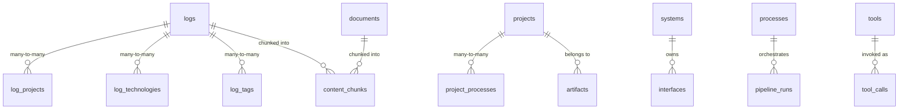

# Data Dictionary

| Field | Value |
|---|---|
| Version | 1.0-draft |
| Date | 2026-07-08 |
| Project | OpenCode Architecture Extension |
| System | Knowledge OS (logs-db) |
| Author | TBD |

## Revision History

| Version | Date | Description |
|---|---|---|
| 1.0-draft | 2026-07-08 | Initial draft from automated analysis |

---

## Overview

This document is the **canonical schema reference** for the Knowledge OS database. It documents all 66 tables across 56 migrations, organized by functional block ownership. For logical architecture context, see *Logical Architecture*.

---

## 1. Core Entities

### F1 — Ingest Source Data [ACTIVE]

#### `logs`

Primary entity for all captured knowledge entries.

| Column | Type | Nullable | Default | Constraints | Description |
|---|---|---|---|---|---|
| id | integer | NO | nextval sequence | PK | Auto-increment identifier |
| created_at | timestamptz | YES | now() | — | Row creation timestamp |
| date | date | NO | — | NOT NULL | Logical date of the log entry |
| title | varchar | NO | — | NOT NULL | Short summary title |
| description | text | YES | — | — | Extended narrative content |
| importance | smallint | YES | — | — | 1–5 importance score |
| type_id | integer | YES | — | FK → log_types.id | Classification type |
| target_date | date | YES | — | — | Deadline or target date |
| sprint | varchar | YES | — | — | Sprint label |
| done | boolean | YES | — | — | Completion flag |
| links | text[] | YES | — | — | External URL references |
| artifacts | text[] | YES | — | — | File path references |
| raw_input | text | YES | — | — | Original unprocessed text |
| source | varchar | YES | — | — | Ingestion source identifier |
| confidence | double precision | YES | — | — | LLM classification confidence |
| source_entry_index | integer | YES | — | — | Position in batch import |
| assignment_id | integer | YES | — | FK → assignments.id | Education link |
| source_file | varchar | YES | — | — | Origin file path |
| source_line | integer | YES | — | — | Line number in source |
| direction | varchar | YES | — | — | Communication direction |
| status | varchar | YES | — | — | Task status value |
| priority | varchar | YES | — | — | Priority level |
| due_at | timestamptz | YES | — | — | Due timestamp |
| closed_at | timestamptz | YES | — | — | Closure timestamp |
| parent_log_id | integer | YES | — | FK → logs.id (self) | Hierarchical parent |
| task_meta | jsonb | YES | — | — | Task-specific structured data |
| reviewed_at | timestamptz | YES | — | — | Human review timestamp |
| archived_at | timestamptz | YES | — | — | Archive timestamp |
| process_slugs | text[] | YES | — | — | Associated process identifiers |
| pipeline_status | varchar | NO | 'ingested' | NOT NULL | Pipeline progression state |

#### `documents`

| Column | Type | Nullable | Default | Constraints | Description |
|---|---|---|---|---|---|
| id | integer | NO | nextval | PK | Auto-increment identifier |
| title | varchar | NO | — | NOT NULL | Document title |
| file_path | text | NO | — | NOT NULL | Filesystem path |
| file_type | varchar | YES | — | — | MIME type or extension |
| file_size | integer | YES | — | — | Size in bytes |
| extracted_text | text | YES | '' | — | Full extracted content |
| summary | text | YES | '' | — | LLM-generated summary |
| source | varchar | YES | — | — | Origin system |
| project_id | integer | YES | — | FK → projects.id | Owning project |
| created_at | timestamptz | YES | now() | — | Row creation |
| file_modified_at | timestamptz | YES | — | — | Source file modification time |
| module_meta | json | YES | — | — | Module extraction metadata |
| process_slugs | text[] | YES | — | — | Associated processes |
| pipeline_status | varchar | NO | 'ingested' | NOT NULL | Pipeline state |
| content_hash | varchar | YES | — | UNIQUE | Deduplication hash |

#### `oura_daily`

| Column | Type | Nullable | Default | Constraints | Description |
|---|---|---|---|---|---|
| id | integer | NO | nextval | PK | Auto-increment |
| date | date | NO | — | UNIQUE, NOT NULL | Measurement date |
| readiness_score | smallint | YES | — | — | Oura readiness 0–100 |
| sleep_score | smallint | YES | — | — | Oura sleep 0–100 |
| activity_score | smallint | YES | — | — | Oura activity 0–100 |
| hrv_avg | double precision | YES | — | — | Heart rate variability |
| resting_hr | smallint | YES | — | — | Resting heart rate |
| body_temperature | double precision | YES | — | — | Temperature deviation |
| steps | integer | YES | — | — | Daily step count |
| raw_json | jsonb | YES | — | — | Full API response |

### F3 — Manage Knowledge Base [ACTIVE]

#### `projects`

| Column | Type | Nullable | Default | Constraints | Description |
|---|---|---|---|---|---|
| id | integer | NO | nextval | PK | Auto-increment |
| name | varchar | NO | — | UNIQUE, NOT NULL | Slug identifier |
| display_name | varchar | NO | — | NOT NULL | Human-readable name |
| description | text | YES | '' | — | Project description |
| status | varchar | YES | 'active' | — | Lifecycle status |
| category | varchar | YES | — | — | Classification category |
| location | varchar | YES | — | — | Physical/logical location |
| started_at | date | YES | — | — | Start date |
| completed_at | date | YES | — | — | Completion date |
| parent_id | integer | YES | — | FK → projects.id | Parent project |
| notes | text | YES | '' | — | Freeform notes |
| created_at | timestamptz | YES | now() | — | Row creation |
| completion_pct | integer | YES | 0 | — | Progress 0–100 |
| importance | varchar | YES | 'medium' | — | Priority tier |
| waiting_on | text | YES | — | — | Blocking dependency |
| milestones | jsonb | YES | '[]' | — | Milestone definitions |
| references_ | jsonb | YES | '[]' | — | External references |
| project_type | varchar | YES | 'new-build' | — | Project type class |
| scope | text | YES | '' | — | Scope statement |
| source_config | jsonb | YES | — | — | Ingestion source config |
| aliases | text[] | YES | '{}' | — | Alternative names |
| health_score | integer | YES | — | — | Computed health metric |
| state_updated_at | timestamptz | YES | — | — | Last state change |
| state_reason | varchar | YES | — | — | Reason for state change |

#### `systems`

| Column | Type | Nullable | Default | Description |
|---|---|---|---|---|
| id | integer | NO | nextval | Auto-increment PK |
| name | varchar | NO | — | Slug identifier |
| display_name | varchar | NO | — | Human-readable name |
| description | text | YES | '' | System description |
| system_type | varchar | YES | 'software' | Classification |
| location | varchar | YES | — | Deployment location |
| operational_status | varchar | YES | 'operational' | Current status |
| components | jsonb | YES | '{}' | Component breakdown |
| owner | varchar | YES | — | Responsible party |
| commissioned_at | date | YES | — | Go-live date |
| decommissioned_at | date | YES | — | Retirement date |
| parent_id | integer | YES | — | FK → systems.id |
| notes | text | YES | '' | Freeform notes |
| created_at | timestamptz | YES | now() | Row creation |
| aliases | text[] | YES | '{}' | Alternative names |

#### `processes`

| Column | Type | Nullable | Default | Description |
|---|---|---|---|---|
| id | integer | NO | nextval | PK |
| name / display_name | varchar | NO | — | Slug and display identifiers |
| description | text | YES | '' | Process description |
| process_type | varchar | YES | 'procedure' | Type classification |
| cadence | varchar | YES | — | Execution frequency |
| owner | varchar | YES | — | Responsible party |
| purpose | text | YES | '' | Why it exists |
| trigger | text | YES | — | Activation condition |
| inputs / outputs | text | YES | '' | I/O descriptions |
| tools | text | YES | '' | Required tooling |
| status | varchar | YES | 'active' | Lifecycle status |
| version | varchar | YES | '1.0' | Process version |
| parent_id | integer | YES | — | FK → processes.id |
| aliases | text[] | YES | '{}' | Alternative names |

#### `technologies`, `equipment`, `products`, `interfaces`

All follow the standard pattern: `id`, `name`, `display_name`, `description`, type field, `notes`, `created_at`, `aliases`. See full column listings in Database Schema section above. `interfaces` additionally has: `interface_type`, `protocol`, `direction`, `endpoint`, `system_id` (FK), `target_system_id` (FK).

### F4 — Serve API & UI [ACTIVE]

#### `entity_comments`

Polymorphic comment system for any entity type.

| Column | Type | Nullable | Default | Description |
|---|---|---|---|---|
| id | integer | NO | nextval | PK |
| entity_type | varchar | NO | — | Target entity table name |
| entity_id | integer | NO | — | Target row ID |
| raw_text | text | NO | — | User input text |
| llm_response | jsonb | YES | '{}' | LLM processing output |
| fields_updated | jsonb | YES | '{}' | Fields modified by comment |
| suggested_questions | jsonb | YES | '[]' | Follow-up suggestions |
| processed | boolean | YES | false | Processing status |
| reply | text | YES | — | System reply text |
| source | varchar | YES | 'user' | Origin (user/system) |
| hidden | boolean | YES | false | UI visibility flag |

#### `artifact_patches`

Section-level pending updates for artifacts awaiting approval.

Key columns: `artifact_id` (FK), `log_id` (FK), `section_heading`, `patch_type` (default 'replace'), `current_content`, `proposed_content`, `rationale`, `status` (default 'pending').

### F5 — Maintain Data Integrity [ACTIVE]

#### `alembic_version`

| Column | Type | Nullable | Default | Description |
|---|---|---|---|---|
| version_num | varchar | NO | — | Current migration version (latest: 056) |

#### `content_chunks`

Vector-indexed chunks for semantic search.

| Column | Type | Nullable | Default | Description |
|---|---|---|---|---|
| id | integer | NO | nextval | PK |
| source_type | varchar | NO | — | Origin table ('log', 'document') |
| source_id | integer | NO | — | Origin row ID |
| chunk_index | integer | NO | 0 | Position within source |
| chunk_text | text | NO | — | Text content |
| embedding | vector | YES | — | pgvector embedding (USER-DEFINED) |
| metadata_json | json | YES | — | Chunk-level metadata |
| project_id | integer | YES | — | FK → projects.id |

---

## 2. Supporting Entities

| Table | Description | Key Relationships |
|---|---|---|
| `people` | Contact directory (name, role, organization, aliases) | Via junction tables to logs, projects, systems, technologies, processes |
| `tags` | Flat tag taxonomy (id, name) | Via junction tables to logs, documents, projects, technologies |
| `log_types` | Log classification reference (name, trackable flag) | FK from logs.type_id |
| `artifacts` | Versioned SE documents (name, type, content, project_id, system_id) | FK to projects, systems |
| `artifact_constraints` | Persistent review constraints for artifact regeneration | FK to artifacts |
| `artifact_sources` | Traceability links from artifacts to source entities | FK to artifacts |
| `llm_feedback` | User corrections to LLM suggestions | FK to logs |
| `follow_ups` | Action items extracted from logs | FK to logs |
| `module_extractions` | Per-module LLM extraction results | FK to logs |
| `pipeline_events` | Observability records for pipeline steps | FK to logs, tool_calls |
| `pipeline_runs` | Pipeline execution envelopes | FK to processes |
| `tools` / `tool_calls` | Tool registry and invocation records | tool_calls FK to tools, pipeline_runs |
| `training_examples` | ML training data from user interactions | Standalone |
| `revision_cards` | Spaced-repetition flashcards | FK to logs |
| `process_requirements` | Automatic process-linking rules | By process_name |
| `project_architectures` | Synthesized architecture JSON/MD | FK to projects, systems |
| `project_graphs` | Materialized relationship graphs | FK to projects |
| `project_comments` / `system_comments` | Legacy comment tables | FK to projects/systems |
| `courses` / `assignments` / `course_materials` / `skills` | Education domain | Hierarchical FKs |

---

## 3. Junction Tables

All junction tables follow the pattern: two FK columns forming a composite primary key. Some include a `role` descriptor.

| Junction Table | Left Entity | Right Entity | Extra Columns |
|---|---|---|---|
| `log_projects` | logs | projects | — |
| `log_technologies` | logs | technologies | — |
| `log_tags` | logs | tags | — |
| `log_people` | logs | people | — |
| `log_processes` | logs | processes | — |
| `log_products` | logs | products | — |
| `log_equipment` | logs | equipment | — |
| `log_systems` | logs | systems | — |
| `log_courses` | logs | courses | — |
| `document_tags` | documents | tags | — |
| `document_technologies` | documents | technologies | — |
| `project_people` | projects | people | role (default 'member') |
| `project_processes` | projects | processes | role (default 'governance') |
| `project_products` | projects | products | — |
| `project_tags` | projects | tags | — |
| `system_people` | systems | people | role (default 'operator') |
| `system_processes` | systems | processes | role (default 'applicable') |
| `system_products` | systems | products | role (default 'manufactures') |
| `system_projects` | systems | projects | role (default 'target'), reviewed |
| `system_technologies` | systems | technologies | — |
| `technology_projects` | technologies | projects | — |
| `technology_people` | technologies | people | — |
| `technology_equipment` | technologies | equipment | — |
| `technology_tags` | technologies | tags | — |
| `process_people` | processes | people | role (default 'participant') |
| `course_technologies` | courses | technologies | — |
| `assignment_technologies` | assignments | technologies | — |
| `skill_projects` | skills | projects | — |

---

## 4. Structured Data Fields

### `logs.task_meta` (jsonb)

| Field | Type | Description |
|---|---|---|
| [TBD] | object | Task-specific metadata; schema varies by log type |

### `documents.module_meta` (json)

| Field | Type | Description |
|---|---|---|
| [TBD] | object | Module extraction metadata from LLM processing |

### `content_chunks.metadata_json` (json)

| Field | Type | Description |
|---|---|---|
| [TBD] | object | Chunk-level context (heading, section, position) |

### `pipeline_events.metadata` (jsonb)

| Field | Type | Description |
|---|---|---|
| [TBD] | object | Step-specific context; varies by pipeline |

### `projects.milestones` (jsonb)

Expected structure: array of milestone objects.

| Field | Type | Description |
|---|---|---|
| name | string | Milestone label |
| target_date | string (ISO date) | Target completion |
| status | string | open/completed |

### `systems.components` (jsonb)

| Field | Type | Description |
|---|---|---|
| [TBD] | object | Component decomposition; schema varies per system type |

### `entity_comments.llm_response` (jsonb)

| Field | Type | Description |
|---|---|---|
| [TBD] | object | Full LLM response payload including field updates |

---

## 5. Enum & Convention Reference

### `pipeline_status` Values

Applied to: `logs.pipeline_status`, `documents.pipeline_status`

| Value | Description |
|---|---|
| `ingested` | Raw entry captured, not yet classified |
| `classified` | Type/category assigned |
| `enriched` | Entity extraction and linking complete |
| `synthesized` | Knowledge synthesis applied |
| `exported` | Published to downstream consumers |
| `excluded` | Intentionally removed from pipeline |
| `obsolete` | Superseded by newer entry |

### Entity Status Markers

| Marker | Meaning |
|---|---|
| `[ACTIVE]` | Implemented, code exists in manifest |
| `[PLANNED]` | Designed, no code yet |
| `[DORMANT]` | Code exists but inactive/on-hold |

### `projects.status` Values

`active`, `on-hold`, `completed`, `archived`, `cancelled`

### `projects.importance` Values

`low`, `medium`, `high`, `critical`

### `projects.project_type` Values

`new-build`, `maintenance`, `research`, `learning`

### `artifact_patches.status` Values

`pending`, `approved`, `rejected`, `applied`

### `artifact_patches.patch_type` Values

`replace`, `append`, `prepend`, `delete`

### `processes.status` Values

`active`, `inactive`, `draft`, `deprecated`

### `pipeline_runs.status` Values

`running`, `completed`, `failed`

### `follow_ups.status` Values

`open`, `in-progress`, `done`, `cancelled`

### Naming Conventions

| Pattern | Examples | Rule |
|---|---|---|
| Junction tables | `log_projects`, `system_people` | `{left_entity}_{right_entity}` (alphabetical, except log-first) |
| Slug fields | `name` column | Lowercase, hyphen-separated |
| Display fields | `display_name` column | Human-readable, title case |
| Timestamps | `created_at`, `updated_at` | Always `timestamptz`, default `now()` |
| Arrays | `aliases`, `links` | PostgreSQL native `text[]` |
| JSON columns | `*_json`, `raw_json` | Use `jsonb` for queryable, `json` for archival |

---

*Total tables: 66 | SQLAlchemy models: 30 | Latest migration: 056*