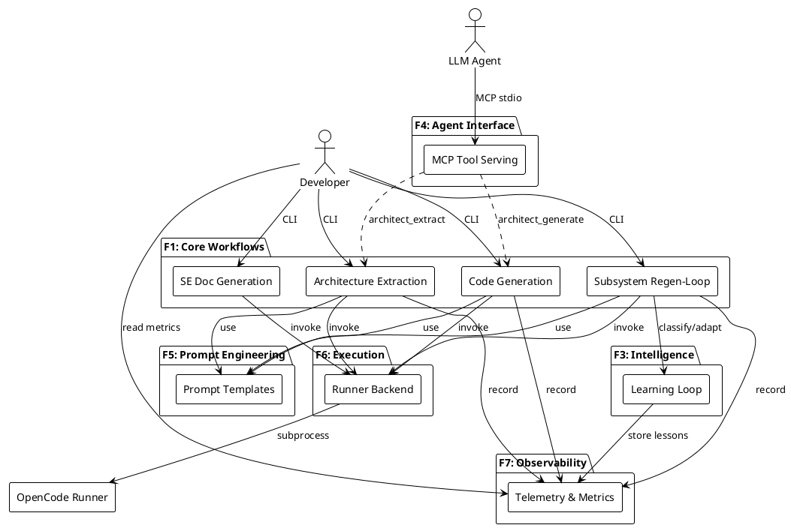
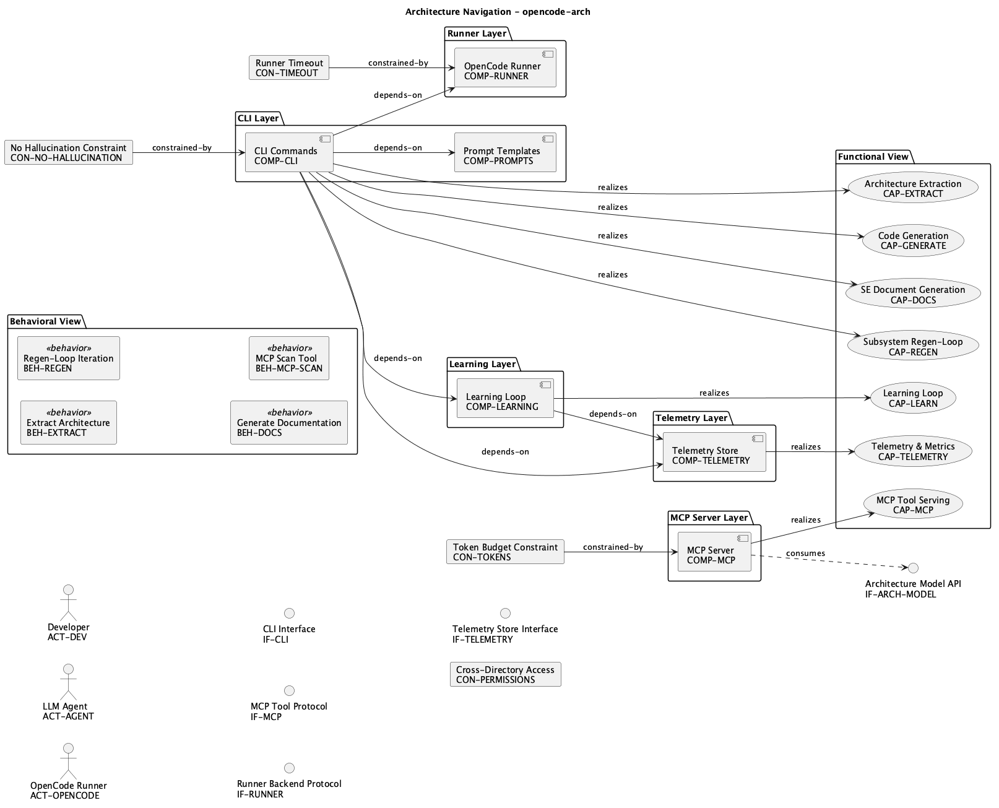
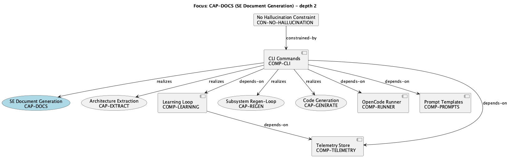

# Functional Architecture — opencode-arch

## 1. Purpose

This document describes the functional decomposition of the OpenCode Architecture Extension system. It maps actors to use cases, capabilities to functional blocks, and traces requirements through to their realizing components — providing a complete functional view of the system.

## 2. Functional Block Decomposition

The system is organized into functional blocks (F-blocks), each representing a cohesive area of functionality:

| F-Block | Name | Capabilities | Priority |
|---------|------|-------------|----------|
| F1 | Core Workflows | Architecture Extraction, Code Generation, SE Doc Generation, Subsystem Regen-Loop | High |
| F3 | Intelligence | Learning Loop (pattern classification, prompt adaptation, report cards) | Medium |
| F4 | Agent Interface | MCP Tool Serving (scan, slice, validate, extract, generate) | High |
| F5 | Prompt Engineering | Prompt Templates (extraction, regeneration) | High |
| F6 | Execution | Runner Backend (subprocess invocation, timeout handling) | High |
| F7 | Observability | Telemetry & Metrics (invocation recording, outcome tracking) | Medium |

### F1 — Core Workflows (Primary Value)

The largest functional block, containing the four main capabilities that deliver user-visible value:

```
F1: Core Workflows
├── CAP-EXTRACT: Architecture Extraction
│   ├── Scan repository AST
│   ├── Produce validated architecture model
│   └── Achieve score >= 80/100
├── CAP-GENERATE: Code Generation
│   ├── Regenerate code from model
│   ├── Run tests to validate
│   └── Iterate until pass rate met
├── CAP-DOCS: SE Document Generation
│   ├── Select artifacts based on model richness
│   ├── Assemble context from model and manifest
│   └── Generate grounded documentation
└── CAP-REGEN: Subsystem Regen-Loop
    ├── Decompose system into subsystems
    ├── Iterate per-subsystem until convergence
    └── Support blind mode (model-only context)
```

### F3 — Intelligence (Learning)

Closed-loop learning that improves generation quality over successive runs:

```
F3: Intelligence
└── CAP-LEARN: Learning Loop
    ├── Pattern Classifier (7 types, 14 regex rules)
    ├── Adaptive Prompt Optimizer (4 heuristic rules)
    ├── Report Card Assessor (A-F grading)
    └── Lesson Extractor (deduplication, storage)
```

### F4 — Agent Interface (MCP)

Token-arbitrage bridge between LLM agents and the architecture model:

```
F4: Agent Interface
└── CAP-MCP: MCP Tool Serving
    ├── architect_scan  → reality manifest
    ├── architect_slice → compressed context
    ├── architect_validate → model quality score
    ├── architect_extract → model persistence
    └── architect_generate → test verification
```

### F7 — Observability

Persistent metrics for tracking system evolution:

```
F7: Observability
└── CAP-TELEMETRY: Telemetry & Metrics
    ├── Tool invocation recording
    ├── Regen outcome logging
    └── Learning curve data
```

## 3. Actor Model

### 3.1 Actors

| Actor | Type | Interface | Primary Goals |
|-------|------|-----------|---------------|
| Developer (ACT-DEV) | Human | CLI (argparse) | Extract architecture, generate docs, validate code |
| LLM Agent (ACT-AGENT) | System | MCP (stdio) | Consume compressed context, produce models, regenerate code |
| OpenCode Runner (ACT-OPENCODE) | External Service | Subprocess | Execute LLM prompts on behalf of CLI |

### 3.2 Actor-Capability Access Matrix

| Capability | Developer | LLM Agent | Runner |
|------------|:---------:|:---------:|:------:|
| Architecture Extraction | Direct | - | Invoked |
| Code Generation | Direct | - | Invoked |
| SE Document Generation | Direct | - | Invoked |
| Subsystem Regen-Loop | Direct | - | Invoked |
| Learning Loop | Direct | - | - |
| MCP Tool Serving | - | Direct | - |
| Telemetry & Metrics | Direct (read) | - | - |

**Access patterns:**
- **Developer** triggers workflows via CLI, which delegate to the Runner for LLM inference
- **LLM Agent** consumes tools via MCP protocol — never invokes CLI directly
- **Runner** is a passive execution backend — invoked by CLI, has no autonomous behavior

## 4. Use-Case Mapping

### 4.1 Behavior Catalog

| ID | Use Case | Actor | Trigger | Pattern |
|----|----------|-------|---------|---------|
| BEH-EXTRACT | Extract Architecture | Developer | `opencode-arch extract` | Sequential |
| BEH-REGEN | Regen-Loop Iteration | Developer | `opencode-arch regen-loop` | Pipeline |
| BEH-DOCS | Generate Documentation | Developer | `opencode-arch docs generate` | Sequential |
| BEH-MCP-SCAN | MCP Scan Tool | LLM Agent | `architect_scan` call | Sequential |

### 4.2 Use-Case to Capability Mapping

| Use Case | Primary Capability | Supporting Capabilities |
|----------|-------------------|----------------------|
| Extract Architecture | CAP-EXTRACT | CAP-TELEMETRY |
| Regen-Loop Iteration | CAP-REGEN | CAP-LEARN, CAP-TELEMETRY |
| Generate Documentation | CAP-DOCS | CAP-TELEMETRY |
| MCP Scan Tool | CAP-MCP | - |

### 4.3 Detailed Use-Case Flows

#### BEH-EXTRACT: Extract Architecture

```
Developer                CLI Commands             Runner              Telemetry
   │                         │                      │                    │
   │──extract <repo>────────>│                      │                    │
   │                         │──scan manifest──────>│                    │
   │                         │<─────manifest────────│                    │
   │                         │──format context─────>│                    │
   │                         │──extraction prompt──>│                    │
   │                         │                      │──opencode run────> │
   │                         │<──────YAML model─────│                    │
   │                         │──validate (>=80)────>│                    │
   │                         │──store model────────>│                    │
   │                         │──record outcome─────────────────────────> │
   │<────result─────────────-│                      │                    │
```

#### BEH-REGEN: Regen-Loop Iteration

```
Developer            CLI Commands         Learning        Runner       Telemetry
   │                      │                  │              │              │
   │──regen-loop─────────>│                  │              │              │
   │                      │──load model─────>│              │              │
   │                      │──decompose──────>│              │              │
   │                      │──get strategies─>│              │              │
   │                      │<──adaptations────│              │              │
   │                      │──build prompt───────────────────>              │
   │                      │                                 │──run───>     │
   │                      │<────────generated code──────────│              │
   │                      │──run tests─────────────────────>│              │
   │                      │<──────test results──────────────│              │
   │                      │──classify failure>│              │              │
   │                      │<──pattern─────────│              │              │
   │                      │──(iterate if needed)            │              │
   │                      │──report card─────>│              │              │
   │                      │──record──────────────────────────────────────> │
   │<────report───────────│                  │              │              │
```

#### BEH-DOCS: Generate Documentation

```
Developer            CLI Commands              Runner
   │                      │                      │
   │──docs generate──────>│                      │
   │                      │──load model          │
   │                      │──generate manifest   │
   │                      │──select artifacts    │
   │                      │                      │
   │                      │──[for each artifact] │
   │                      │  ├─assemble context  │
   │                      │  ├─build prompt─────>│
   │                      │  │                   │──opencode run──>
   │                      │  │<──markdown────────│
   │                      │  └─write file        │
   │                      │                      │
   │                      │──generate index      │
   │                      │──run validation      │
   │<────result───────────│                      │
```

## 5. Traceability Matrix

Full requirements traceability from actor goals through to implementing components:

| Actor Goal | Behavior | Capability | Component | Interface | Constraint |
|-----------|----------|------------|-----------|-----------|------------|
| Extract architecture from repositories | BEH-EXTRACT | CAP-EXTRACT | COMP-CLI, COMP-RUNNER | IF-CLI, IF-RUNNER | CON-NO-HALLUCINATION |
| Generate SE documentation | BEH-DOCS | CAP-DOCS | COMP-CLI, COMP-RUNNER | IF-CLI, IF-RUNNER | CON-NO-HALLUCINATION, CON-TIMEOUT |
| Validate code against models | BEH-REGEN | CAP-REGEN | COMP-CLI, COMP-RUNNER, COMP-LEARNING | IF-CLI, IF-RUNNER | CON-TIMEOUT |
| Consume compressed context | BEH-MCP-SCAN | CAP-MCP | COMP-MCP | IF-MCP | CON-TOKENS |
| Produce architecture models | BEH-EXTRACT | CAP-EXTRACT | COMP-MCP | IF-MCP | CON-NO-HALLUCINATION |
| Regenerate code from models | BEH-REGEN | CAP-REGEN, CAP-GENERATE | COMP-CLI, COMP-RUNNER | IF-CLI, IF-RUNNER | CON-TIMEOUT |

## 6. Functional Interaction Diagram



## 7. Functional Constraints

| Constraint | Applies To | Metric | Threshold | Rationale |
|-----------|-----------|--------|-----------|-----------|
| CON-TOKENS | F4 (MCP) | context_tokens | 4000 default | LLM context windows are limited; compression enables larger repos |
| CON-NO-HALLUCINATION | F1 (Core) | grounding_accuracy | 100% | All claims must trace to model/manifest data |
| CON-TIMEOUT | F6 (Execution) | execution_time | 600s | Prevent hung subprocesses from blocking pipeline |
| CON-PERMISSIONS | F6 (Execution) | filesystem_access | CWD-scoped | Runner operates within specified working directory |

## 8. Capability Realization Summary

```
CAP-EXTRACT ──realizes──> COMP-CLI ──depends──> COMP-RUNNER ──depends──> ACT-OPENCODE
CAP-GENERATE ─realizes──> COMP-CLI ──depends──> COMP-RUNNER ──depends──> ACT-OPENCODE
CAP-DOCS ────realizes──> COMP-CLI ──depends──> COMP-RUNNER ──depends──> ACT-OPENCODE
CAP-REGEN ───realizes──> COMP-CLI ──depends──> COMP-RUNNER ──depends──> ACT-OPENCODE
                                    └─depends──> COMP-LEARNING ──depends──> COMP-TELEMETRY
CAP-LEARN ───realizes──> COMP-LEARNING ──depends──> COMP-TELEMETRY
CAP-MCP ─────realizes──> COMP-MCP ──consumes──> IF-ARCH-MODEL
CAP-TELEMETRY realizes──> COMP-TELEMETRY
```

## 9. Cross-Functional Dependencies

The system has a clear dependency hierarchy (no cycles):

| From (Consumer) | To (Provider) | Nature |
|----------------|---------------|--------|
| F1 (Core Workflows) | F5 (Prompt Engineering) | Prompt construction |
| F1 (Core Workflows) | F6 (Execution) | LLM invocation |
| F1 (Core Workflows) | F7 (Observability) | Metrics recording |
| F1 (Core Workflows) | F3 (Intelligence) | Pattern adaptation |
| F3 (Intelligence) | F7 (Observability) | Lesson/pattern storage |
| F4 (Agent Interface) | External: architecture-model-standard | Model APIs |

**Dependency direction:** F1 → {F3, F5, F6, F7}; F3 → F7; F4 → External

No circular dependencies exist. The system maintains strict layered dependency flow.

## 10. Navigational Traceability Diagram

The full-model navigation diagram shows all entities and relationships on one page. Use entity IDs to precisely identify work scope.



## 11. Focused View Example: CAP-DOCS

To isolate work on SE Document Generation, use `generate_focused_diagram(model, "CAP-DOCS", depth=2)`:



**Reading this diagram:** To work on CAP-DOCS in isolation, the developer needs:
- **Implementation scope:** COMP-CLI (specifically `src/opencode_arch/cli/docs.py`)
- **Direct dependencies:** COMP-RUNNER (execution), COMP-PROMPTS (prompt templates)
- **Transitive dependencies:** COMP-TELEMETRY (metrics), COMP-LEARNING (adaptation)
- **Constraints to satisfy:** CON-NO-HALLUCINATION (100% grounded in model data)
- **Behavioral spec:** BEH-DOCS (defines the step sequence)

### How to Use for Task Assignment

1. Pick the broken/target capability (e.g., CAP-DOCS)
2. Run `generate_focused_diagram(model, "CAP-DOCS")` to see its neighborhood
3. The "realizes" edge tells you WHICH component to modify
4. The "depends-on" edges tell you what APIs you can call
5. The "constrained-by" edges tell you invariants to maintain
6. Hand the developer: component files + behavior spec + dependency interfaces
