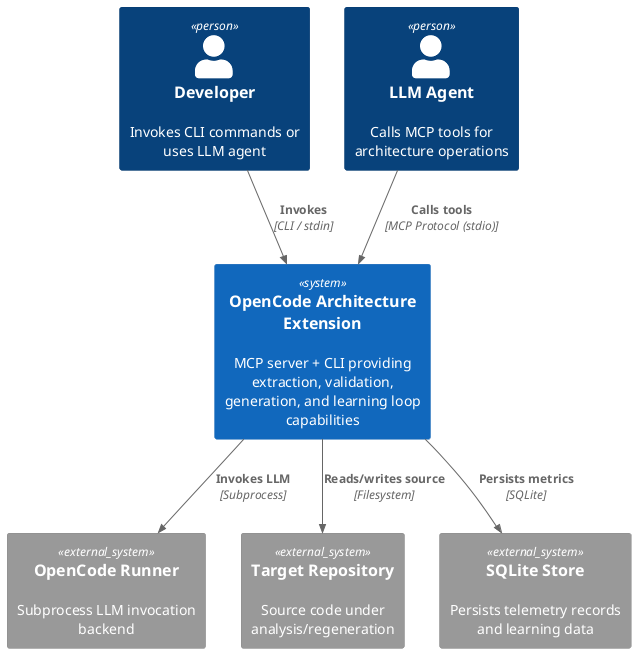
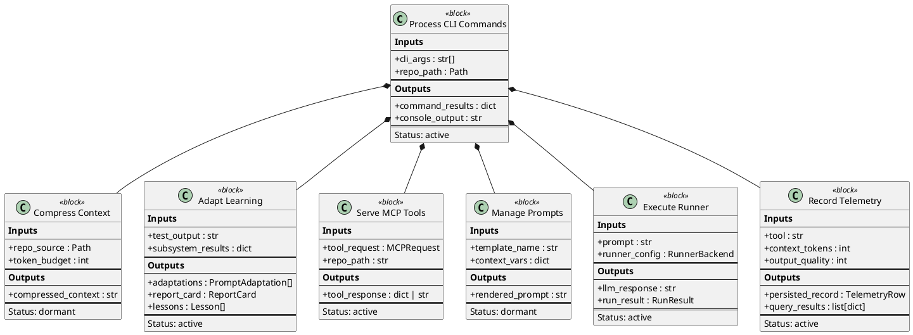
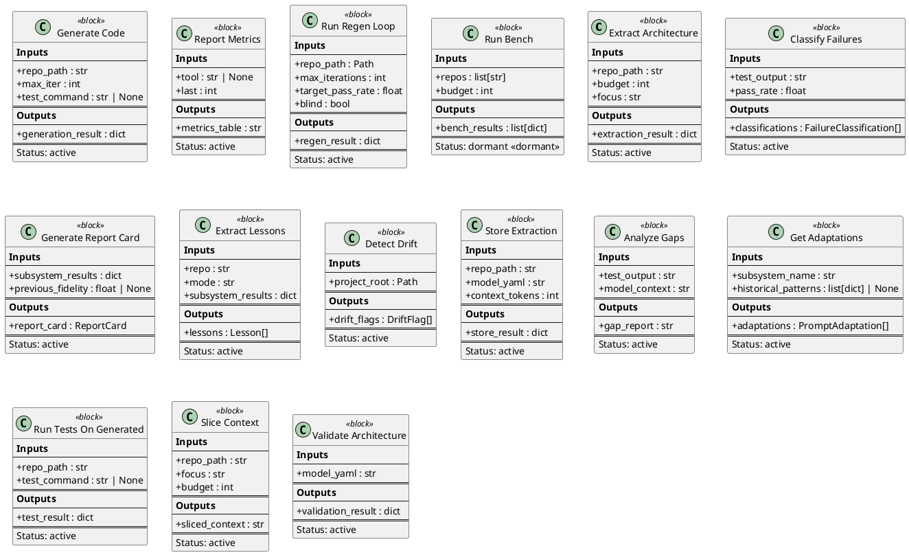
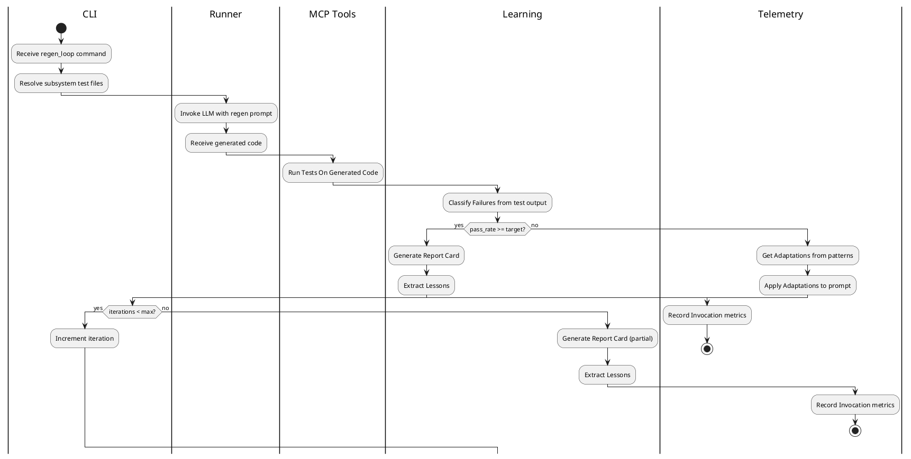
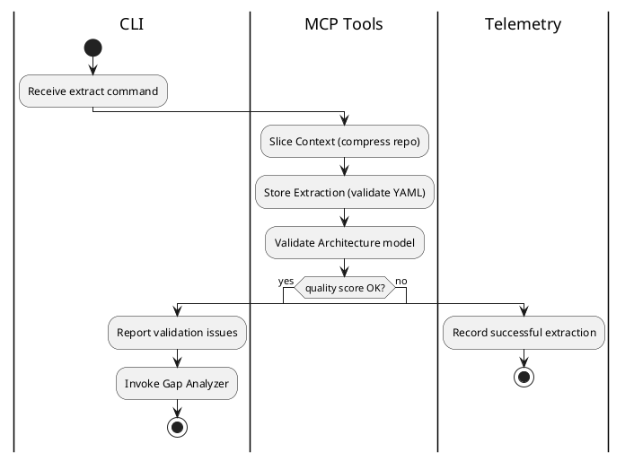
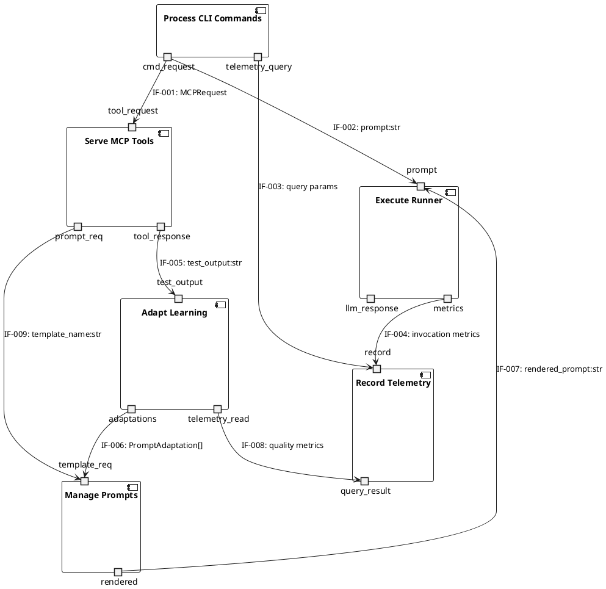

# Functional Architecture

| Field | Value |
|---|---|
| Version | 1.0-draft |
| Date | 2026-07-08 |
| Project | OpenCode Architecture Extension |
| System | opencode-arch |
| Author | TBD |

## Revision History

| Version | Date | Description |
|---|---|---|
| 1.0-draft | 2026-07-08 | Initial draft from automated analysis |

---

## 1. System Context

The OpenCode Architecture Extension operates as an MCP server providing architecture tools to LLM-based coding agents. It integrates with external LLM runners, the host filesystem (target repositories), and an internal SQLite telemetry store.

---

## 2. Functional Decomposition (Block Definition Diagram)

### Level 1 Overview

### Level 2 Decomposition

---

## 3. Functional Behavior (Activity Diagrams)

### Primary Regen Loop Flow

### Extraction and Validation Flow

---

## 4. Functional Interfaces (Internal Block Diagram)

| IF-ID | From | To | Data Type | Protocol |
|---|---|---|---|---|
| IF-001 | CLI | MCP Tools | MCPRequest | Python API / MCP stdio |
| IF-002 | CLI | Runner | str (prompt) | Python API |
| IF-003 | CLI | Telemetry | query params | Python API |
| IF-004 | Runner | Telemetry | invocation metrics | Python API |
| IF-005 | MCP Tools | Learning | test output str | Python API |
| IF-006 | Learning | Prompts | PromptAdaptation[] | Python API |
| IF-007 | Prompts | Runner | rendered prompt str | Python API |
| IF-008 | Learning | Telemetry | quality query | Python API |
| IF-009 | MCP Tools | Prompts | template name | Python API |

---

## 5. Service Boundaries

| Functional Block | Layer | File Count | Key Paths |
|---|---|---|---|
| Process CLI Commands (F1) | CLI scripts | 9 | `src/opencode_arch/cli/` |
| Compress Context (F2) | Library | 1 | `src/opencode_arch/context/__init__.py` |
| Adapt Learning (F3) | Library services | 7 | `src/opencode_arch/learning/` |
| Serve MCP Tools (F4) | MCP server + tools | 8 | `src/opencode_arch/mcp/`, `src/opencode_arch/mcp/tools/` |
| Manage Prompts (F5) | Templates | 2 | `src/opencode_arch/prompts/` |
| Execute Runner (F6) | Subprocess adapter | 3 | `src/opencode_arch/runner/` |
| Record Telemetry (F7) | Data persistence | 3 | `src/opencode_arch/telemetry/` |
| **Total** | | **65 Python files** | (includes `__init__.py` and scripts) |

Test coverage is provided by 148 test files spanning unit, integration, and E2E layers. See Testing artifact for details.

---

## 6. Cross-References

| Function | Requirements (see Requirements Analysis) | Logical Allocation (see Logical Architecture) |
|---|---|---|
| F1 – Process CLI Commands | CLI usability, command completeness | Click/Typer CLI framework |
| F3 – Adapt Learning | Adaptive improvement, pattern classification | Python dataclasses, SQLite |
| F4 – Serve MCP Tools | MCP protocol compliance, tool contracts | FastMCP server |
| F6 – Execute Runner | LLM invocation reliability, subprocess isolation | OpenCode subprocess runner |
| F7 – Record Telemetry | Observability, metrics persistence | SQLite via TelemetryStore |

Interface specifications by IF-ID are maintained in the ICD artifact. Technology allocation details are in the Logical Architecture artifact.