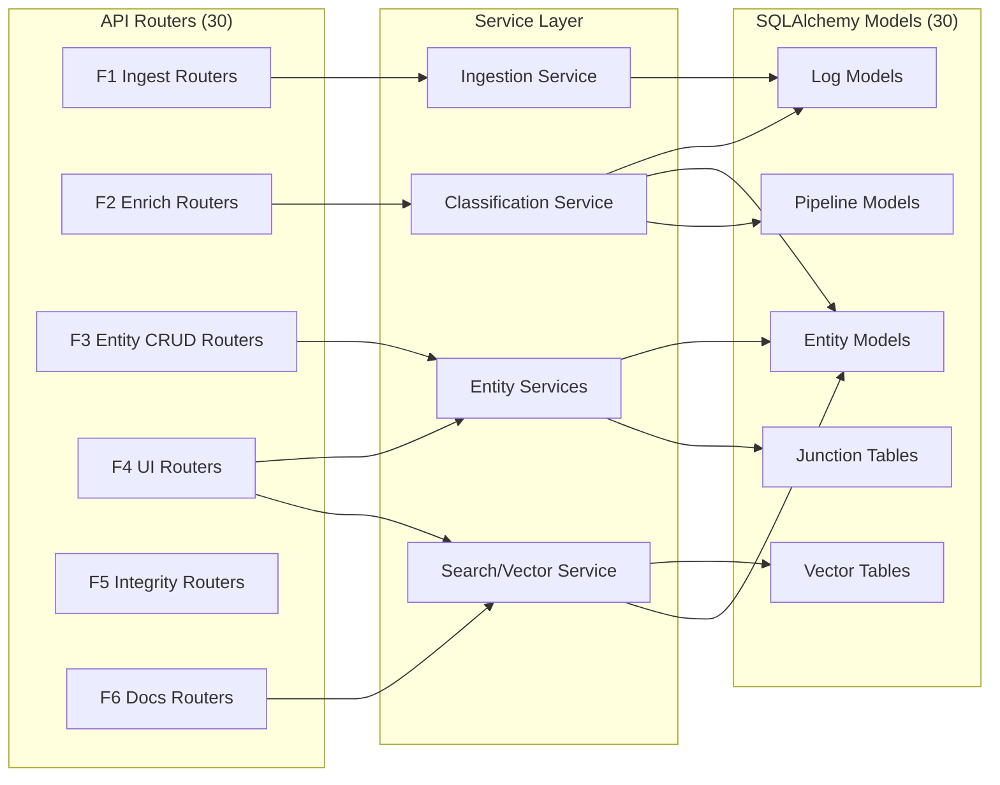
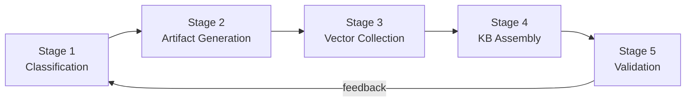

# Interface Control Document

| Field | Value |
|---|---|
| Version | 1.0-draft |
| Date | 2026-07-08 |
| Project | OpenCode Architecture Extension |
| System | Knowledge OS (logs-db) |
| Author | TBD |

## Revision History

| Version | Date | Description |
|---|---|---|
| 1.0-draft | 2026-07-08 | Initial draft from automated analysis |

---

## 1. Interface Inventory Matrix

All system interfaces grouped by type. This is the authoritative registry — every interface referenced in subsequent sections traces back here.

### REST Interfaces

| Interface ID | Type | Provider F-block | Consumer F-block(s) | Protocol | Status |
|---|---|---|---|---|---|
| IFC-001 | REST | F1 Ingest Source Data | F4 Serve API & UI | HTTP/JSON | [ACTIVE] |
| IFC-002 | REST | F2 Enrich Log Entities | F4 Serve API & UI | HTTP/JSON | [ACTIVE] |
| IFC-003 | REST | F3 Manage Knowledge Base | F4 Serve API & UI, F6 Generate Documentation | HTTP/JSON | [ACTIVE] |
| IFC-004 | REST | F4 Serve API & UI | External (Browser) | HTTP/HTML+HTMX | [ACTIVE] |
| IFC-005 | REST | F6 Generate Documentation | F4 Serve API & UI | HTTP/JSON | [ACTIVE] |
| IFC-006 | REST | F5 Maintain Data Integrity | F4 Serve API & UI | HTTP/JSON | [ACTIVE] |

### External Service Interfaces

| Interface ID | Type | Provider F-block | Consumer F-block(s) | Protocol | Status |
|---|---|---|---|---|---|
| IFC-010 | External | F2 Enrich Log Entities | LLM Relay (copilot-relay) | HTTP/JSON | [ACTIVE] |
| IFC-011 | External | F2 Enrich Log Entities | Ollama (local LLM) | HTTP/JSON | [ACTIVE] |
| IFC-012 | External | F6 Generate Documentation | HuggingFace sentence-transformers | Python API (local) | [ACTIVE] |
| IFC-013 | External | F1 Ingest Source Data | Oura API | HTTPS/JSON | [PLANNED] |
| IFC-014 | External | F1 Ingest Source Data | OneNote API | HTTPS/JSON | [PLANNED] |

### Database Interfaces

| Interface ID | Type | Provider F-block | Consumer F-block(s) | Protocol | Status |
|---|---|---|---|---|---|
| IFC-020 | DB | F5 Maintain Data Integrity | F1, F2, F3, F6 | SQLAlchemy async (asyncpg) | [ACTIVE] |
| IFC-021 | DB | F6 Generate Documentation | pgvector extension | SQL (vector ops) | [ACTIVE] |
| IFC-022 | DB | F5 Maintain Data Integrity | Alembic migrations | DDL/Python | [ACTIVE] |

### Pipeline Interfaces

| Interface ID | Type | Provider F-block | Consumer F-block(s) | Protocol | Status |
|---|---|---|---|---|---|
| IFC-030 | Pipeline | F1 Ingest Source Data | F2 Enrich Log Entities | Internal (Python call / event) | [ACTIVE] |
| IFC-031 | Pipeline | F2 Enrich Log Entities | F3 Manage Knowledge Base | Internal (JSON payload) | [ACTIVE] |
| IFC-032 | Pipeline | F3 Manage Knowledge Base | F6 Generate Documentation | Internal (model query) | [ACTIVE] |
| IFC-033 | Pipeline | F6 Generate Documentation | F5 Maintain Data Integrity | Internal (validation report) | [ACTIVE] |

---

## 2. REST API Surface

The system exposes **30 API routers** (per manifest). Organized by F-block allocation:

### F1 Ingest Source Data

Endpoints responsible for source capture, ingestion triggers, and external sync.

| Method | Path | Key Params | Response Shape | Error Contract |
|---|---|---|---|---|
| POST | `/api/logs/` | body: LogCreate | `{id, title, created_at, ...}` | 422 Validation / 500 |
| POST | `/api/logs/parse` | body: raw text | `{parsed_entries: [...]}` | 422 / 500 |
| POST | `/api/oura/sync` | query: date_range | `{synced_count, errors}` | 401 / 503 |
| POST | `/api/ingest/trigger` | body: source_config | `{job_id, status}` | 422 / 500 |

### F2 Enrich Log Entities

Classification, LLM pipeline, and feedback endpoints.

| Method | Path | Key Params | Response Shape | Error Contract |
|---|---|---|---|---|
| POST | `/api/pipeline/classify` | body: {log_id} | `{classifications: [...]}` | 404 / 503 |
| POST | `/api/pipeline/feedback` | body: {entity_id, correction} | `{updated: bool}` | 422 / 404 |
| GET | `/api/pipeline/suggestions/{log_id}` | path: log_id | `{suggestions: [...]}` | 404 |
| POST | `/api/pipeline/events` | body: PipelineEvent | `{event_id, status}` | 422 / 500 |

### F3 Manage Knowledge Base

Entity CRUD across 13+ domain models (30 SQLAlchemy models total). Representative patterns:

| Method | Path | Key Params | Response Shape | Error Contract |
|---|---|---|---|---|
| GET | `/api/{entity}/` | query: skip, limit, filters | `{items: [...], total: int}` | 400 / 500 |
| GET | `/api/{entity}/{id}` | path: id | `{entity object}` | 404 |
| POST | `/api/{entity}/` | body: EntityCreate | `{created entity}` | 422 / 409 |
| PUT | `/api/{entity}/{id}` | path: id, body: EntityUpdate | `{updated entity}` | 404 / 422 |
| DELETE | `/api/{entity}/{id}` | path: id | `{deleted: bool}` | 404 |

**Entity domains**: logs, people, projects, systems, processes, technologies, equipment, tasks, artifacts, documents, education, products, interfaces.

### F4 Serve API & UI

Presentation layer — dashboard, HTMX partials, HTML templates (18 templates per manifest).

| Method | Path | Key Params | Response Shape | Error Contract |
|---|---|---|---|---|
| GET | `/` | — | HTML (dashboard) | 500 |
| GET | `/entities/{type}` | path: type | HTML (list view) | 404 |
| GET | `/entities/{type}/{id}` | path: type, id | HTML (detail view) | 404 |
| GET | `/partials/{widget}` | query: context params | HTML fragment (HTMX) | 404 / 500 |

### F5 Maintain Data Integrity

Schema evolution status and backfill operations.

| Method | Path | Key Params | Response Shape | Error Contract |
|---|---|---|---|---|
| GET | `/api/health` | — | `{status, db_connected, migration_head}` | 503 |
| POST | `/api/backfill/{entity}` | path: entity | `{processed, errors}` | 422 / 500 |

### F6 Generate Documentation

Search, vector query, graph traversal, timeline, and knowledge synthesis.

| Method | Path | Key Params | Response Shape | Error Contract |
|---|---|---|---|---|
| GET | `/api/search` | query: q, filters | `{results: [...], total}` | 400 |
| POST | `/api/vectors/query` | body: {text, top_k} | `{matches: [{id, score, snippet}]}` | 422 / 503 |
| GET | `/api/graph/{entity_id}` | path: entity_id, query: depth | `{nodes: [...], edges: [...]}` | 404 |
| GET | `/api/timeline` | query: start, end, entity_type | `{events: [...]}` | 400 |
| POST | `/api/synthesis` | body: {query, context_ids} | `{output_markdown, sources}` | 422 / 503 |

---

## 3. External Service Interfaces

### IFC-010: LLM Relay (copilot-relay)

| Attribute | Specification |
|---|---|
| Protocol | HTTP/1.1 POST |
| Endpoint | `http://localhost:[TBD]/v1/chat/completions` |
| Request Format | OpenAI-compatible JSON `{model, messages[], temperature}` |
| Response Format | `{choices: [{message: {content}}]}` |
| Authentication | None (local network) |
| Timeout | [TBD] — estimated 60s |
| Failure Mode | 503 → degrade to Ollama fallback (IFC-011) |
| Retry Strategy | [TBD] |

### IFC-011: Ollama (Local Classification LLM)

| Attribute | Specification |
|---|---|
| Protocol | HTTP/1.1 POST |
| Endpoint | `http://localhost:11434/api/generate` |
| Model | [TBD] (classification-tuned) |
| Request Format | `{model, prompt, stream: false}` |
| Response Format | `{response: string}` |
| Authentication | None (localhost) |
| Timeout | 30s |
| Failure Mode | Log warning, skip classification, mark entity as `unclassified` |
| Retry Strategy | 1 retry with exponential backoff |

### IFC-012: Embedding Model (sentence-transformers)

| Attribute | Specification |
|---|---|
| Loading Method | `sentence_transformers.SentenceTransformer(model_name)` |
| Mode | Offline-capable (model cached locally) |
| Cache Path | [TBD] |
| Model | [TBD] (likely `all-MiniLM-L6-v2` or similar) |
| Vector Dimensions | [TBD] |
| Failure Mode | Application startup failure if model unavailable |

### IFC-013: Oura API [PLANNED]

| Attribute | Specification |
|---|---|
| Protocol | HTTPS REST |
| Authentication | OAuth2 Bearer Token |
| Data Format | JSON |
| Status | [PLANNED] |

### IFC-014: OneNote API [PLANNED]

| Attribute | Specification |
|---|---|
| Protocol | Microsoft Graph API (HTTPS) |
| Authentication | OAuth2 |
| Status | [PLANNED] |

---

## 4. Database Access Contracts

### Connection Specification (IFC-020)

| Attribute | Value |
|---|---|
| DBMS | PostgreSQL + pgvector extension |
| Driver | asyncpg (via SQLAlchemy async) |
| Tables | 66 |
| Models (ORM) | 30 |
| Latest Migration | 056 |
| Session Pattern | `async_session` with dependency injection |

### Layer-to-Model Access Matrix

### Access Pattern Conventions

| Pattern | Description |
|---|---|
| Read (list) | `select().options(selectinload(...)).offset().limit()` |
| Read (detail) | `get(id)` [UNVERIFIED: not found] with eager-loaded relationships |
| Write (create) | `session.add()` → `session.commit()` → `session.refresh()` |
| Write (update) | Load → mutate → `session.commit()` |
| Transaction Boundary | Per-request (FastAPI dependency yields session, commits/rollbacks at request end) |
| Relationship Loading | `selectinload` for collections, `joinedload` for single FK |

See **Data Dictionary** for complete schema details (66 tables, column types, constraints).

---

## 5. Pipeline Data Contracts

### Stage 1 → Stage 2 Boundary (IFC-030 → IFC-031)

| Attribute | Specification |
|---|---|
| Input | Raw log entry (text + metadata) |
| Output | Classification JSON |
| Format | `{log_id: int, entities: [{name, type, confidence}], relationships: [{source, target, type}]}` |
| Storage | `pipeline_events` table + in-memory pass |

### Stage 2 → Stage 3 Boundary (IFC-031 → IFC-032)

| Attribute | Specification |
|---|---|
| Input | Classified entities + log context |
| Output | Generated markdown artifacts |
| Format | `{artifact_id, content_md: string, metadata: {source_log_ids, generated_at}}` |
| Storage | `artifacts` table / filesystem |

### Stage 3 → Stage 4 Boundary

| Attribute | Specification |
|---|---|
| Input | Markdown content (artifact text) |
| Process | Sentence embedding via IFC-012 |
| Output | Vector embedding + metadata |
| Format | `{entity_id, embedding: float[N], chunk_text, source_artifact_id}` |
| Storage | pgvector-enabled table (IFC-021) |

### Stage 4 → Stage 5 Boundary

| Attribute | Specification |
|---|---|
| Input | Assembled KB state (entities + vectors + relationships) |
| Output | Validation/staleness report |
| Format | `{report_id, stale_entities: [...], missing_links: [...], coverage_pct: float}` |
| Feedback Loop | Stale entities re-queued to Stage 1 for re-classification |

---

## Cross-References

| Artifact | Relevance |
|---|---|
| Functional Architecture | F-block definitions (F1–F6) referenced throughout |
| Logical Architecture | Layer decomposition, technology mapping |
| Data Dictionary | Full schema for all 66 tables, 30 models |
| Signal Path Atlas | End-to-end data flow traces |
| Deployment Guide | Service startup, port allocations, environment config |