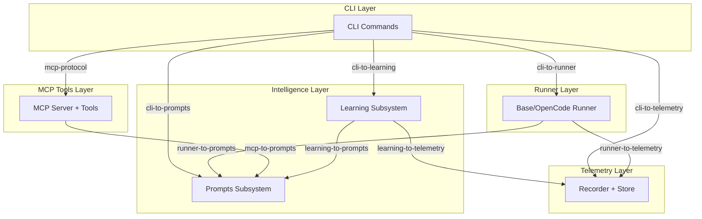
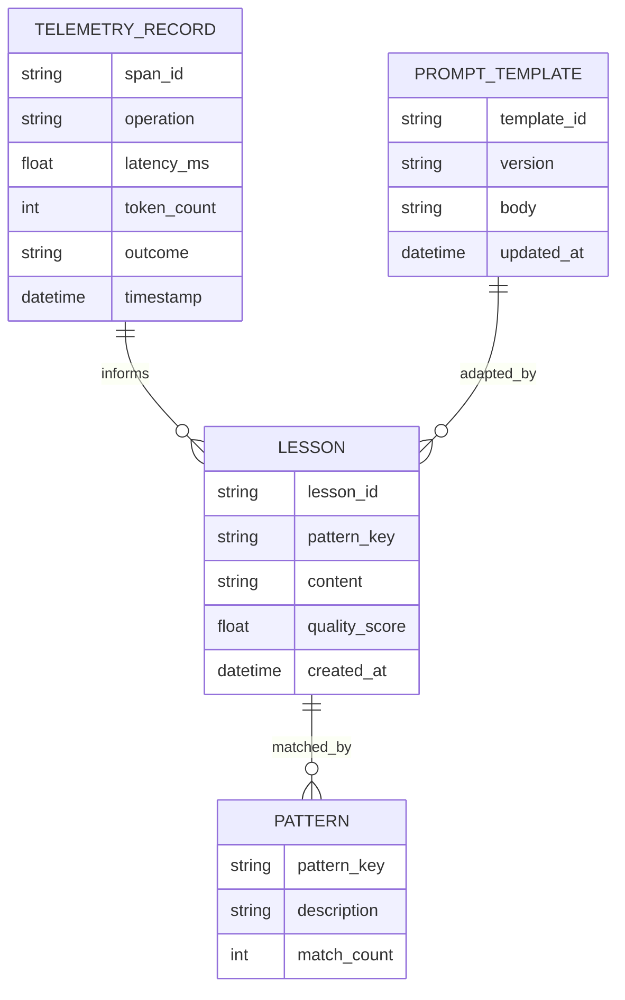
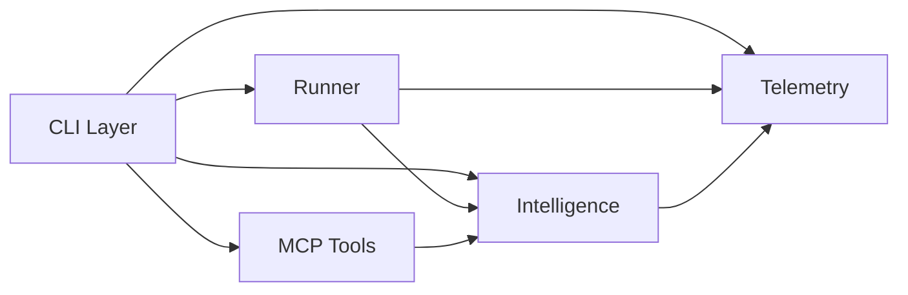

# Logical Architecture

| Field | Value |
|---|---|
| Version | 1.0-draft |
| Date | 2026-07-08 |
| Project | OpenCode Architecture Extension |
| System | N/A |
| Author | TBD |

## Revision History

| Version | Date | Description |
|---|---|---|
| 1.0-draft | 2026-07-08 | Initial draft from automated analysis |

---

## 1. Logical Layer Decomposition

The OpenCode Architecture Extension is organized into five logical layers derived from the verified code manifest. Each layer encapsulates a distinct architectural responsibility and maps to one or more functional blocks.

### Layer Summary

| Layer | Responsibility | Realizes | File Count |
|---|---|---|---|
| **CLI Layer** | User-facing command dispatch and orchestration | F1, F4, F6 | 9 |
| **MCP Tools Layer** | Structured tool interfaces for architecture operations | F1, F2, F3 | 8 |
| **Runner Layer** | Execution engine for LLM interactions and operation orchestration | F6 | 3 |
| **Intelligence Layer** | Adaptive learning, pattern classification, and prompt management | F2, F6 | 9 |
| **Telemetry Layer** | Metrics recording, persistence, and reporting | F5 | 3 |

*Total source files from manifest: 65 (includes tests and scripts beyond these layers)*

### Layer Details

**CLI Layer** (9 files) [ACTIVE]
- `main.py` (199 lines) — top-level command group and entry point
- `regen_loop.py` (1028 lines) — regeneration loop with blind mode orchestration
- `metrics.py` (186 lines) — telemetry reporting commands
- `gap_analyzer.py` (107 lines) — architecture conformance gap analysis
- `extract.py` (93 lines) — extraction command delegation
- `generate.py` (68 lines) — generation command delegation
- `bench.py` (25 lines) [DORMANT] — benchmark invocation
- `prompts.py` (20 lines) [DORMANT] — prompt template management CLI

**MCP Tools Layer** (8 files) [ACTIVE]
- `server.py` (83 lines) — MCP server registration and lifecycle
- `tools/extract.py`, `tools/scan.py`, `tools/validate.py`, `tools/slice.py`, `tools/generate.py` — individual tool implementations
- `__main__.py` (8 lines) [DORMANT] — direct execution entry point

**Intelligence Layer** (9 files) [ACTIVE]
- Learning subsystem: `classifier.py` (144), `assessor.py` (170), `adapter.py` (157), `lessons.py` (139), `maintainer.py` (281), `patterns.py` (51)
- Prompts subsystem: `regen.py` — prompt template construction

**Runner Layer** (3 files) [ACTIVE]
- `base.py` — abstract runner interface
- `opencode.py` — OpenCode-specific LLM invocation runner

**Telemetry Layer** (3 files) [ACTIVE]
- `recorder.py` — span-based metrics capture
- `store.py` — persistence backend for telemetry data

### Layer Dependency Diagram

---

## 2. Component-to-Function Traceability

Functional blocks are defined in the Functional Architecture artifact. The mapping below traces each function to its realizing layers and key components.

| Function | Realizing Layer(s) | Key Components | Notes |
|---|---|---|---|
| **F1: Extract Architecture** | CLI, MCP Tools | `cli/extract.py`, `mcp/tools/extract.py`, `mcp/tools/scan.py` | CLI delegates to MCP extract tool |
| **F2: Validate & Enrich** | MCP Tools, Intelligence | `mcp/tools/validate.py`, `learning/classifier.py`, `learning/assessor.py` | Validation cross-cuts with learning quality assessment |
| **F3: Manage Knowledge Base** | MCP Tools | `mcp/tools/slice.py`, `mcp/tools/scan.py` | Context slicing and scanning for KB operations |
| **F4: Serve CLI Interface** | CLI | `cli/main.py`, `cli/metrics.py`, `cli/gap_analyzer.py` | No web UI — CLI is the sole user interface |
| **F5: Maintain Data Integrity** | Telemetry | `telemetry/store.py`, `telemetry/recorder.py` | Telemetry store provides persistence integrity |
| **F6: Generate & Regenerate** | CLI, Runner, Intelligence, MCP Tools | `cli/regen_loop.py`, `runner/opencode.py`, `prompts/regen.py`, `mcp/tools/generate.py`, `learning/adapter.py` | Largest cross-cutting function; regen_loop is the primary orchestrator (1028 lines) |

### Impact Analysis Notes

- Changes to **F6** affect 4 of 5 layers — highest coupling in the system
- **F1** and **F3** are localized to CLI + MCP — low change propagation
- The Learning subsystem participates in both F2 and F6, making it a shared dependency

---

## 3. Database Schema

The OpenCode Architecture Extension operates as a **file-based / in-memory system** without a traditional relational database. The telemetry store persists metrics data, and the learning subsystem maintains lesson state, but these use local storage mechanisms rather than a managed RDBMS.

> **Note:** The project-level metrics (66 database tables, 30 SQLAlchemy models) pertain to the **parent Logs Database Application** that this extension serves. The extension itself does not own those tables — it reads and generates architecture documentation *about* that schema.

### Extension Data Model

### Parent System Schema (reference only)

The parent Logs Database Application contains **66 tables** across **56 Alembic migrations**. See *Data Dictionary* for complete column-level documentation. Key domain groups relevant to this extension's extraction targets:

| Domain Group | Approximate Tables | Relevance to Extension |
|---|---|---|
| Work Tracking | [TBD] | Extracted as project context |
| Ontology (systems, processes, tech) | [TBD] | Primary extraction targets |
| Pipeline/Training | [TBD] | Telemetry correlation |

---

## 4. Inter-layer Interfaces and Dependency Rules

### Interface Matrix

| Source Layer | Target Layer | Interface Name | Mechanism | Example |
|---|---|---|---|---|
| CLI | MCP Tools | `mcp-protocol` | MCP tool invocation | `cli/extract.py` → `mcp/tools/extract.py` |
| CLI | Runner | `cli-to-runner` | Python API (direct import) | `cli/regen_loop.py` → `runner/opencode.py` |
| CLI | Telemetry | `cli-to-telemetry` | Python API | `cli/metrics.py` → `telemetry/store.py` |
| CLI | Intelligence | `cli-to-learning` | Python API | `cli/regen_loop.py` → `learning/adapter.py` |
| CLI | Intelligence | `cli-to-prompts` | Python API | `cli/prompts.py` → `prompts/regen.py` |
| Runner | Telemetry | `runner-to-telemetry` | Python API | `runner/opencode.py` → `telemetry/recorder.py` |
| Runner | Intelligence | `runner-to-prompts` | Python API | `runner/opencode.py` → `prompts/regen.py` |
| MCP Tools | Intelligence | `mcp-to-prompts` | Python API | `mcp/tools/generate.py` → `prompts/regen.py` |
| Intelligence | Telemetry | `learning-to-telemetry` | Python API | `learning/assessor.py` → `telemetry/store.py` |
| Intelligence | Intelligence | `learning-internal` | Internal | Classifier → Patterns → Lessons → Adapter |

### Dependency Rules (Governance)

| Rule | Description | Rationale |
|---|---|---|
| **R1: No upward imports** | Telemetry MUST NOT import from CLI, Runner, or MCP | Telemetry is a leaf dependency |
| **R2: No lateral imports in tools** | MCP tools MUST NOT import from each other | Each tool is independently invocable |
| **R3: Intelligence is stateless at call boundary** | Learning functions receive state as arguments, do not hold global state | Enables testing and parallel execution |
| **R4: CLI orchestrates, never implements** | CLI files delegate to lower layers; business logic lives in Runner/MCP/Intelligence | Keeps CLI thin and testable |
| **R5: Scripts are isolated** | `scripts/` MUST NOT be imported by any `src/` module | Scripts are operational utilities only |

### Stateless vs. Stateful

| Layer | State Characteristic |
|---|---|
| CLI | Stateless (argument parsing + delegation) |
| MCP Tools | Stateless per invocation |
| Runner | Stateful during execution span (holds LLM session) |
| Intelligence | Stateful (lessons persist between invocations) |
| Telemetry | Stateful (append-only store) |

---

## 5. Technology Allocation

| Layer | Language/Runtime | Frameworks/Libraries | External Services |
|---|---|---|---|
| CLI | Python 3.x | Click/Typer [TBD], asyncio | None |
| MCP Tools | Python 3.x | MCP SDK, Pydantic | MCP-compatible LLM clients |
| Runner | Python 3.x | asyncio, httpx [TBD] | LLM API endpoints (OpenCode) |
| Intelligence | Python 3.x | Standard library, JSON | Local file storage |
| Telemetry | Python 3.x | Standard library | Local file storage |
| Test Suite | Python 3.x | pytest, pytest-asyncio | None |
| Scripts | Python 3.x | [TBD] | None |

### Build & Packaging

| Concern | Technology | Notes |
|---|---|---|
| Package management | pyproject.toml | [TBD: pip/uv/poetry] |
| Testing | pytest (148 test files per project metrics) | Unit + Integration + E2E |
| MCP protocol | Model Context Protocol SDK | Server mode with tool registration |

---

## Cross-References

| Artifact | Relevance |
|---|---|
| *Functional Architecture* | Defines F1–F6 functional blocks referenced in traceability matrix |
| *Data Dictionary* | Full column-level schema for the 66-table parent database |
| *ICD (Interface Control Document)* | Detailed MCP tool contracts, message schemas, error codes |
| *Deployment Guide* | Physical deployment topology and configuration |
| *Testing* | Test strategy mapping to layers and coverage targets |

---

## Appendix: File Inventory by Layer

| Layer | Path Prefix | Active Files | Dormant Files | Total |
|---|---|---|---|---|
| CLI | `src/opencode_arch/cli/` | 6 | 3 | 9 |
| MCP Tools | `src/opencode_arch/mcp/` | 3+ tools | 2 | 8 |
| Runner | `src/opencode_arch/runner/` | 2 | 1 | 3 |
| Intelligence | `src/opencode_arch/learning/` + `prompts/` | 7 | 2 | 9 |
| Telemetry | `src/opencode_arch/telemetry/` | 2 | 1 | 3 |
| Context | `src/opencode_arch/context/` | 0 | 1 | 1 |
| Tests | `tests/` | 26+ | 0 | 26+ |
| Scripts | `scripts/` | 1 | 0 | 1 |

*Total verified Python source files: **65** (from manifest)*