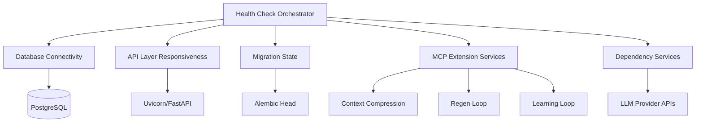
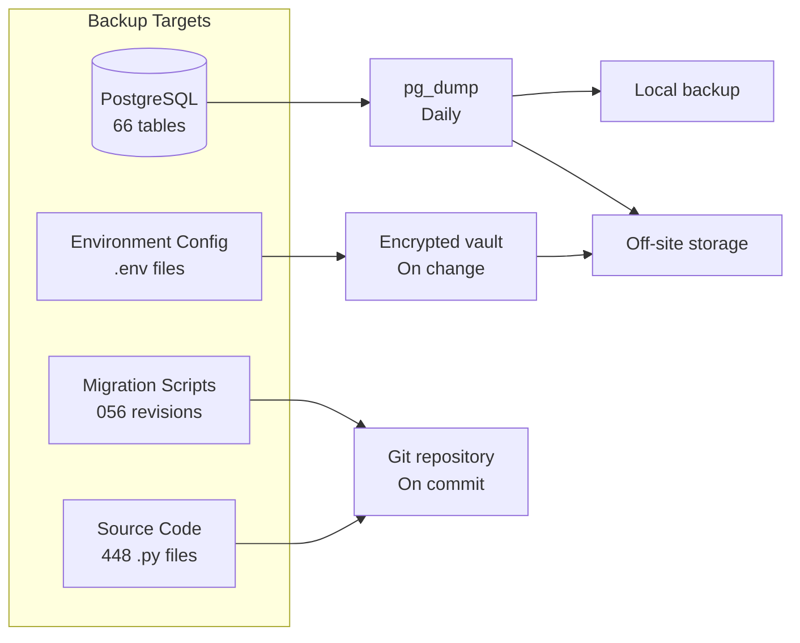
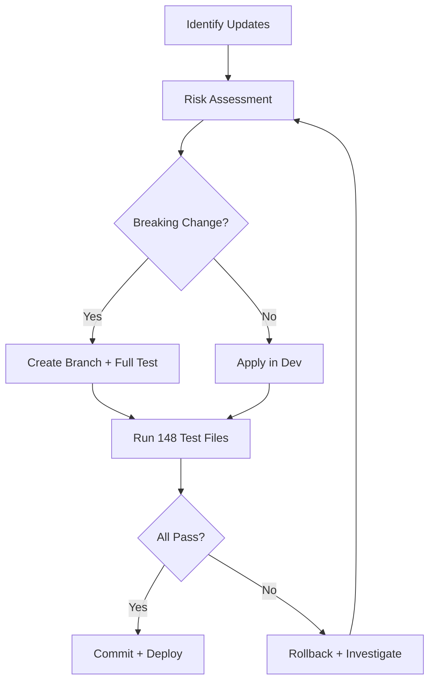
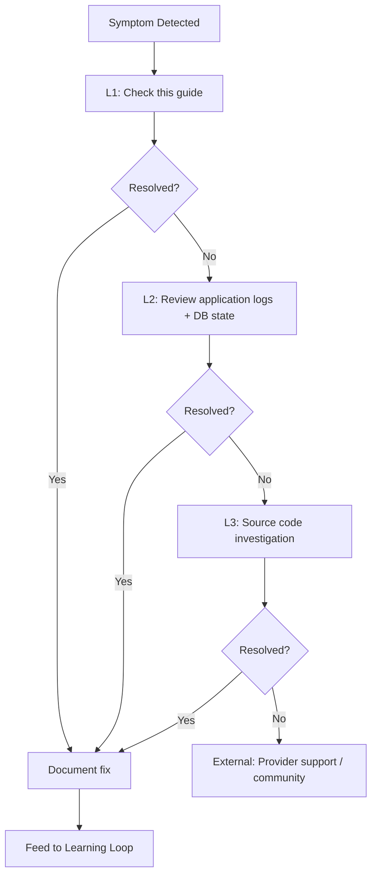

# Maintenance Manual

| Field | Value |
|---|---|
| Version | 1.0-draft |
| Date | 2026-07-08 |
| Project | OpenCode Architecture Extension |
| System | Knowledge OS (logs-db) |
| Author | TBD |

## Revision History

| Version | Date | Description |
|---|---|---|
| 1.0-draft | 2026-07-08 | Initial draft from automated analysis |

## Project Profile: OpenCode Architecture Extension
Status: active | Type: new-build | Category: Developer Tooling / Knowledge Management

OpenCode MCP extension providing architecture context compression, validation tools, regen-loop orchestrator with blind mode, and learning loop for LLM-driven code regeneration.

### Live System Metrics (auto-generated at artifact build time)

| Metric | Value |
|---|---|
| Total logs | 0 |
| Database tables | 66 |
| Latest migration | 056 |
| Python source files | 448 |
| Test files | 148 |
| API routers | 30 |
| SQLAlchemy models | 30 |
| HTML templates | 18 |

---

## 1. System Health Checks

### 1.1 Health Check Architecture



### 1.2 Subsystem Health Indicators

| Subsystem | Health Endpoint / Check | Healthy Condition | Check Frequency |
|---|---|---|---|
| PostgreSQL Database | `GET /health/db` | Connection pool active, query < 100ms | Every 60s |
| Alembic Migrations | Migration head comparison | Current revision matches `056` (latest) | On startup, daily |
| FastAPI / Uvicorn | `GET /health` | HTTP 200, response < 500ms | Every 30s |
| API Routers (30) | Route registration count | All 30 routers registered without error | On startup |
| MCP Context Compression | [TBD - tool-specific health endpoint] | Compression produces valid output | Every 5 min |
| Regen Loop Orchestrator | [TBD - tool-specific health endpoint] | Orchestrator responds to ping | Every 5 min |
| Learning Loop | [TBD - tool-specific health endpoint] | Feedback ingestion queue depth < threshold | Every 5 min |
| LLM Provider | External API ping | API key valid, latency < 2s | Every 5 min |

### 1.3 Health Check Procedure

1. **Automated**: Configure monitoring to poll `/health` and `/health/db` endpoints at specified intervals.
2. **Manual verification**:
   ```bash
   curl -s http://localhost:8000/health | jq .
   curl -s http://localhost:8000/health/db | jq .
   ```
3. **Migration state verification**:
   ```bash
   alembic current
   alembic heads
   # Verify output shows revision 056 with "(head)" marker
   ```
4. **Test suite as health indicator**:
   ```bash
   pytest --tb=short -q  # 148 test files should pass
   ```

---

## 2. Preventive Maintenance

### 2.1 Maintenance Schedule

| Task | Component | Frequency | Duration | Priority |
|---|---|---|---|---|
| Database VACUUM ANALYZE | PostgreSQL (66 tables) | Weekly | ~5 min | High |
| Index bloat check | PostgreSQL | Bi-weekly | ~2 min | Medium |
| Connection pool reset | SQLAlchemy pool | Monthly | <1 min | Low |
| Log rotation | Application logs | Daily | Automatic | Medium |
| Dependency vulnerability scan | Python packages | Weekly | ~3 min | High |
| Alembic migration integrity check | Database schema | After each deployment | ~1 min | High |
| LLM API key rotation | External services | Quarterly | ~10 min | High |
| Stale session cleanup | [TBD] | Daily | Automatic | Medium |
| Test suite full run | 148 test files | Daily (CI) | [TBD] | High |
| Disk space monitoring | Host filesystem | Continuous | Automatic | Critical |

### 2.2 Database Maintenance Procedures

**Weekly VACUUM:**
```sql
-- Run against logs_db
VACUUM ANALYZE;

-- For specific high-write tables (identify from pipeline activity):
VACUUM (VERBOSE, ANALYZE) logs;
VACUUM (VERBOSE, ANALYZE) pipeline_events;
```

**Bi-weekly Index Health:**
```sql
SELECT schemaname, tablename, indexname, 
       pg_size_pretty(pg_relation_size(indexrelid)) as index_size
FROM pg_stat_user_indexes
ORDER BY pg_relation_size(indexrelid) DESC
LIMIT 20;
```

### 2.3 Application Maintenance

- **Uvicorn worker recycling**: If running with multiple workers, configure `--max-requests 10000` to prevent memory leaks over extended runtime.
- **SQLAlchemy pool pre-ping**: Ensure `pool_pre_ping=True` is set to detect stale connections before query execution.
- **Template cache invalidation**: 18 HTML templates are served; clear template cache after updates.

---

## 3. Backup & Recovery

### 3.1 Backup Strategy



### 3.2 Backup Procedures

| Asset | Method | Frequency | Retention | Storage |
|---|---|---|---|---|
| PostgreSQL full dump | `pg_dump --format=custom` | Daily | 30 days | Local + off-site |
| PostgreSQL WAL archives | Continuous archiving | Continuous | 7 days | [TBD] |
| Environment configuration | Encrypted copy | On every change | All versions | Secure vault |
| Source code | Git push | On every commit | Indefinite | Remote repository |
| Alembic migrations | Git (included in source) | On every commit | Indefinite | Remote repository |

**Full database backup command:**
```bash
pg_dump --format=custom --file="backup_$(date +%Y%m%d_%H%M%S).dump" \
  --dbname="${DATABASE_URL}" --verbose
```

### 3.3 Recovery Procedures

**Scenario A — Full database restore:**
```bash
# 1. Stop application
systemctl stop logs-db  # or docker-compose down

# 2. Drop and recreate database
dropdb logs_db
createdb logs_db

# 3. Restore from backup
pg_restore --dbname=logs_db --verbose backup_YYYYMMDD_HHMMSS.dump

# 4. Verify migration state
alembic current  # Should show revision 056

# 5. Restart application
systemctl start logs-db
```

**Scenario B — Point-in-time recovery (if WAL archiving is configured):**
```bash
# [TBD — requires WAL archive configuration details]
```

**Scenario C — Schema-only recovery (re-apply migrations):**
```bash
createdb logs_db
alembic upgrade head  # Applies all 56 migrations sequentially
# Note: Data will not be restored — combine with data backup
```

### 3.4 Recovery Validation

After any recovery, execute:
1. Health check endpoints return HTTP 200
2. `alembic current` shows revision `056`
3. `pytest -x --tb=short` — critical path tests pass
4. Verify row counts on key tables match pre-backup expectations

---

## 4. Dependency Updates

### 4.1 Update Process



### 4.2 Python Dependencies

```bash
# Check for outdated packages
pip list --outdated

# Update with constraints
pip install --upgrade <package> --constraint constraints.txt

# Verify no regressions
pytest --tb=short

# Lock new versions
pip freeze > requirements.txt
```

### 4.3 Update Priority Matrix

| Dependency Type | Example | Update Urgency | Testing Required |
|---|---|---|---|
| Security patch (any) | All packages | Immediate (< 24h) | Smoke tests minimum |
| FastAPI / Uvicorn | Web framework | Within 1 week | Full test suite (148 files) |
| SQLAlchemy / Alembic | ORM + migrations | Within 2 weeks | Full suite + migration replay |
| LLM client libraries | [TBD] | Within 1 week | MCP tool integration tests |
| Dev/test dependencies | pytest, ruff | Within 1 month | Test suite self-validates |

### 4.4 Migration-Sensitive Updates

When updating SQLAlchemy or Alembic:
1. Back up database before update
2. Run `alembic check` to verify migration consistency
3. Test `alembic downgrade -1` then `alembic upgrade head` on a disposable database
4. Verify all 30 SQLAlchemy models load without deprecation errors

---

## 5. Corrective Maintenance

### 5.1 Common Failure Modes

| Failure Mode | Symptoms | Root Cause | MTTR |
|---|---|---|---|
| Database connection exhaustion | HTTP 500, "too many connections" | Pool misconfiguration or connection leak | 5–15 min |
| Migration drift | Startup failure, schema mismatch errors | Manual schema changes outside Alembic | 15–60 min |
| MCP tool timeout | Context compression returns empty/error | LLM provider latency or rate limit | 5–30 min |
| Regen loop hang | Blind mode produces no output | Orchestrator deadlock or malformed prompt | 10–30 min |
| Stale cache | Incorrect architecture context served | Cache TTL not expired after schema change | 2–5 min |

### 5.2 Diagnostic Procedures

**Database connection issues:**
```sql
-- Check active connections
SELECT count(*) FROM pg_stat_activity WHERE datname = 'logs_db';

-- Identify long-running queries
SELECT pid, now() - pg_stat_activity.query_start AS duration, query
FROM pg_stat_activity
WHERE (now() - pg_stat_activity.query_start) > interval '5 minutes';
```

**Migration drift detection:**
```bash
alembic current        # Shows applied revision
alembic heads          # Shows expected head (056)
alembic check          # Detects unapplied changes (Alembic 1.9+)
```

**MCP tool diagnostics:**
- Check LLM provider status page
- Verify API key validity and quota remaining
- Review MCP tool logs for timeout/retry patterns
- Test context compression with minimal input to isolate scope

### 5.3 Repair Steps

**Connection pool reset (no restart):**
```python
# If accessible via admin endpoint or shell:
from app.database import engine
engine.dispose()  # Releases all pooled connections
```

**Migration repair:**
```bash
# If drift detected — stamp current state, then upgrade
alembic stamp <actual_current_revision>
alembic upgrade head
```

---

## 6. Troubleshooting

### 6.1 Symptom-Based Troubleshooting Guide

| Symptom | Likely Cause | Diagnostic Step | Resolution |
|---|---|---|---|
| `/health` returns 503 | Uvicorn worker crashed | Check process list, review stderr | Restart service |
| `/health/db` returns 503 | PostgreSQL unreachable | `pg_isready -h localhost` | Verify PostgreSQL is running; check connection string |
| API returns 422 on valid input | Schema model mismatch | Compare Pydantic model to request body | Update model or request format |
| Alembic `upgrade head` fails | Conflicting migration branches | `alembic branches` | Merge branches or resolve conflict |
| Test suite fails after update | Breaking dependency change | `git diff requirements.txt` | Pin previous version; investigate compatibility |
| Context compression returns empty | LLM rate limit hit | Check provider dashboard | Implement backoff; queue requests |
| Regen loop produces invalid code | Stale architecture context | Verify context cache freshness | Invalidate cache; re-run compression |
| Slow query responses (> 2s) | Missing index or table bloat | `EXPLAIN ANALYZE` on slow query | Add index or run VACUUM FULL |
| HTML templates not rendering | Template path misconfiguration | Verify template directory in config | Correct `templates` path; 18 templates expected |

### 6.2 Escalation Path



### 6.3 Log Analysis

Application logs are the primary diagnostic tool. Key log patterns:

| Log Pattern | Indicates |
|---|---|
| `sqlalchemy.exc.OperationalError` | Database connectivity failure |
| `asyncio.TimeoutError` | External service timeout (likely LLM) |
| `alembic.util.exc.CommandError` | Migration state inconsistency |
| `pydantic.ValidationError` | Request/response schema mismatch |
| `ConnectionRefusedError` | Dependent service not running |

---

## Cross-References

| Topic | Reference Document |
|---|---|
| Initial deployment and setup | See **Deployment Guide** |
| Daily operations and SOPs | See **Operations Manual** |
| Test strategy and coverage targets | See **Testing** |
| Schema and table definitions | See **Data Dictionary** |
| Risk register and mitigations | See **Risk Management** |
| Architecture decisions context | See **Logical Architecture** |