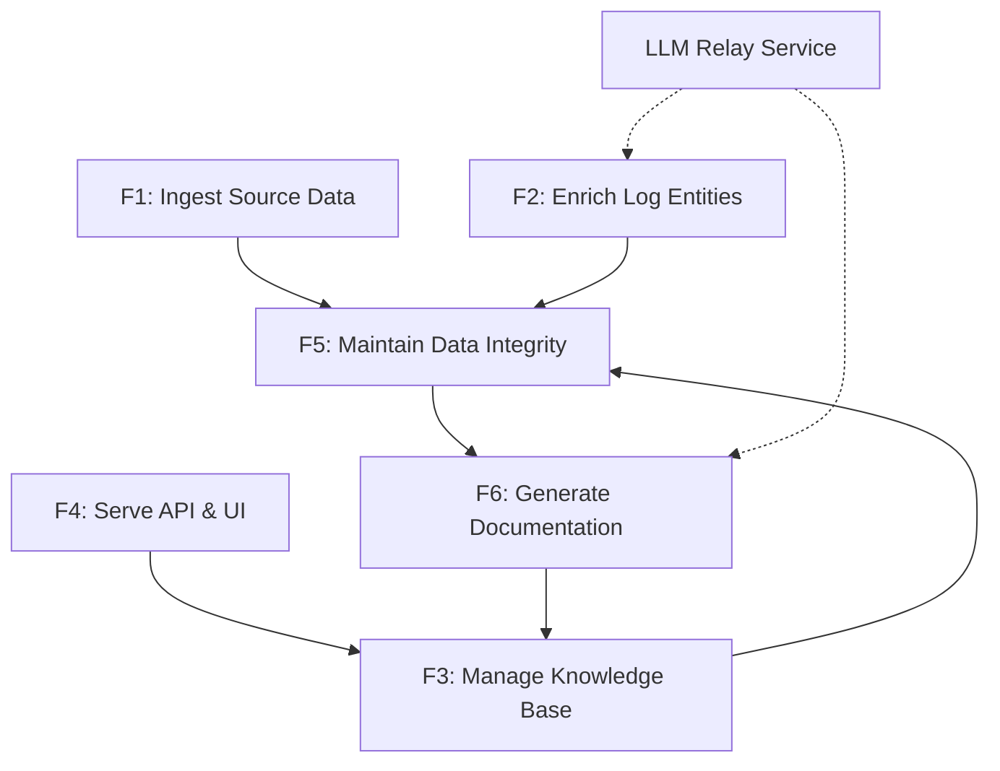
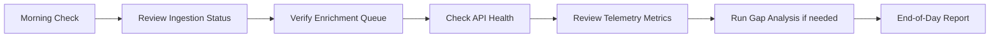
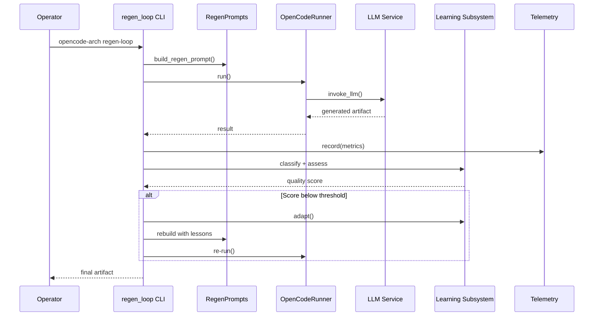
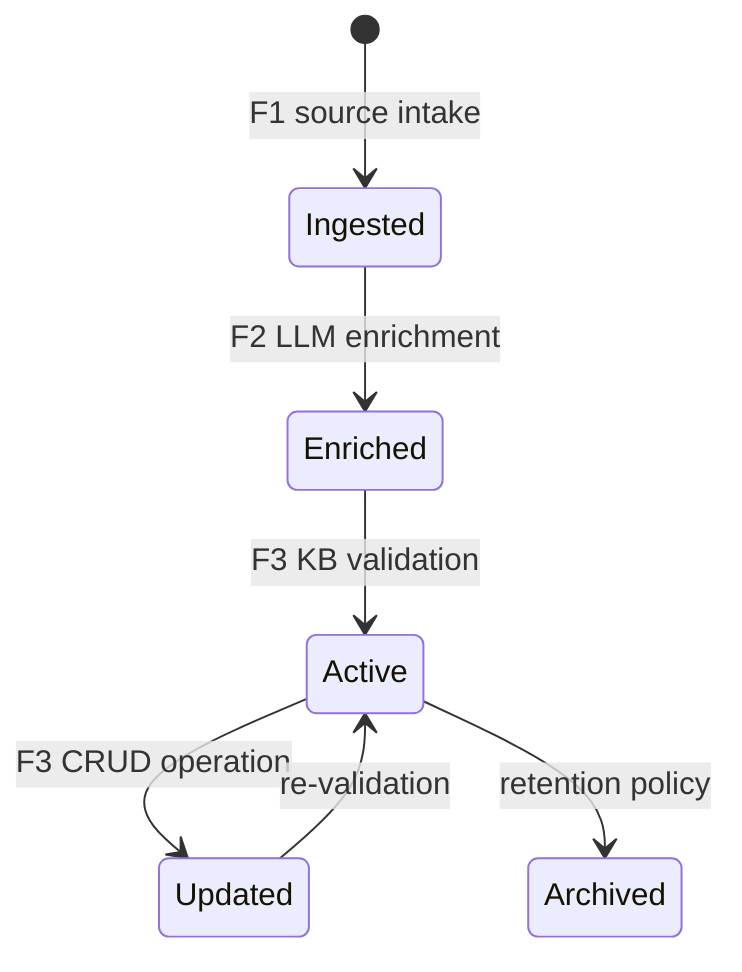
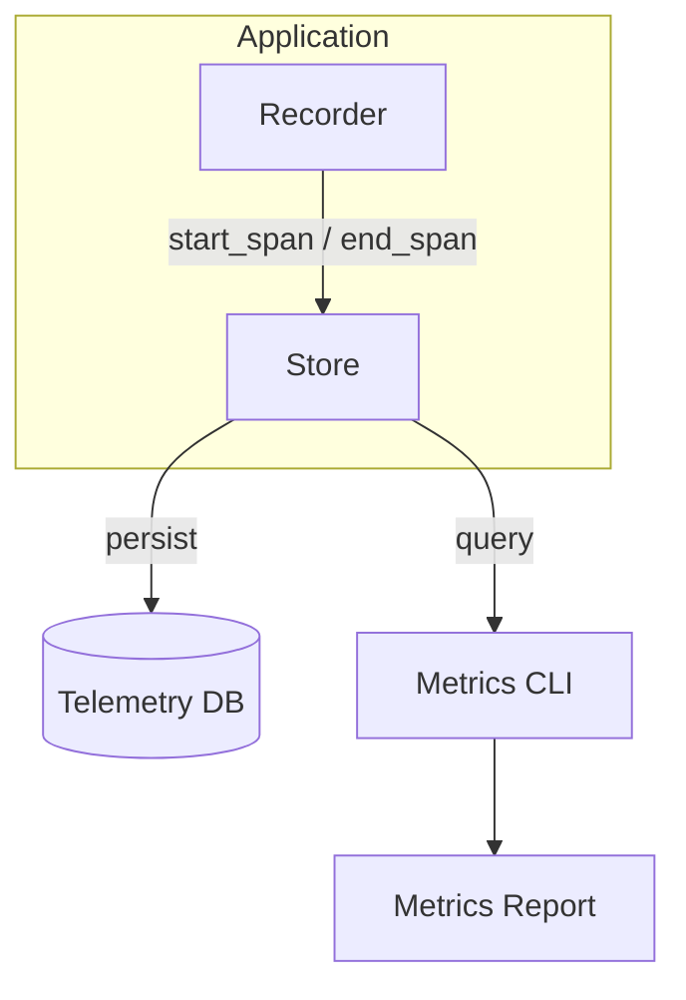

# Operations Manual

| Field | Value |
|---|---|
| Version | 1.0-draft |
| Date | 2026-07-08 |
| Project | OpenCode Architecture Extension |
| System | Knowledge OS (logs-db) |
| Author | TBD |

## Revision History

| Version | Date | Description |
|---|---|---|
| 1.0-draft | 2026-07-08 | Initial draft from automated analysis |

---

## System Overview

This operations manual governs day-to-day operation of the Knowledge OS system comprising **448 Python source files**, **148 test files**, **30 API routers**, **30 SQLAlchemy models**, **66 database tables** (latest migration: 056), and **18 HTML templates**. Operations are organized by the six canonical functional blocks (F1–F6).

---

## 1. Startup & Shutdown

### 1.1 Startup Sequence

Bring services up in dependency order. Each step references its owning F-block.

| Order | Component | F-Block | Command | Verify |
|---|---|---|---|---|
| 1 | PostgreSQL | F5 | `systemctl start postgresql` | `pg_isready -h localhost` |
| 2 | Run migrations | F5 | `alembic upgrade head` | Migration 056 confirmed |
| 3 | Seed/sync KB | F3 | [TBD — seed script] | Entity counts match baseline |
| 4 | Uvicorn (API + UI) | F4 | `uvicorn app.main:app --host 0.0.0.0 --port 8000` | HTTP 200 on `/health` |
| 5 | Ingestion scheduler | F1 | [TBD — scheduler start command] | Scheduler heartbeat log |
| 6 | Enrichment pipeline | F2 | [TBD — pipeline start command] | LLM relay connectivity check |

### 1.2 Shutdown Sequence

Reverse dependency order to prevent data loss:

1. **F1 — Stop ingestion scheduler** to halt new data intake.
2. **F2 — Drain enrichment pipeline** — wait for in-flight LLM calls to complete (timeout: 60s).
3. **F4 — Graceful uvicorn shutdown** — send `SIGTERM`, allow 30s drain for active HTTP connections.
4. **F3 — Flush KB write buffers** — confirm pending entity writes committed.
5. **F5 — PostgreSQL shutdown** — `systemctl stop postgresql` only after all application connections closed.
6. **F6 — No persistent process** — generation pipeline runs on-demand; confirm no active `regen_loop` processes via `ps aux | grep regen_loop`.

### 1.3 Emergency Shutdown

If system instability detected:
1. Kill uvicorn immediately: `kill -9 $(pgrep uvicorn)`
2. Stop scheduler and pipeline processes.
3. PostgreSQL remains running for forensic queries unless data corruption suspected.
4. Document incident per SOP-006.

---

## 2. Daily Operations

### 2.1 Daily Workflow

### 2.2 Standard Operating Procedures (Quick Reference)

| SOP-ID | Title | F-Block | Frequency |
|---|---|---|---|
| SOP-001 | Morning Health Check | F4, F5 | Daily |
| SOP-002 | Ingestion Pipeline Verification | F1 | Daily |
| SOP-003 | Enrichment Queue Drain Confirmation | F2 | Daily |
| SOP-004 | Entity Reconciliation | F3 | Weekly |
| SOP-005 | Telemetry Review & Pruning | F6 | Weekly |
| SOP-006 | Incident Documentation | All | As needed |
| SOP-007 | Learning Loop Lesson Curation | F6 | Weekly |
| SOP-008 | Benchmark Regression Check | F6 | Per release |
| SOP-009 | Migration Verification | F5 | Per deployment |
| SOP-010 | Prompt Template Version Audit | F6 | Monthly |

---

## 3. Process Execution

### 3.1 Architecture Extraction (F6 — Extraction State)

**Owner:** F6 Generate Documentation
**Operational State:** Extraction
**Related Use Cases:** [TBD — UC-IDs]

| Step | Action | Tool/Code |
|---|---|---|
| 1 | Invoke extraction CLI | `opencode-arch extract` → `src/opencode_arch/cli/extract.py` |
| 2 | MCP tool alternative | ExtractTool → `src/opencode_arch/mcp/tools/extract.py` |
| 3 | Source scan | ScanTool → `src/opencode_arch/mcp/tools/scan.py` |
| 4 | Telemetry recording | Recorder.start_span / end_span |
| 5 | Verify output | ValidateTool → `src/opencode_arch/mcp/tools/validate.py` |

### 3.2 Regeneration Loop (F6 — Regeneration State)

**Owner:** F6 Generate Documentation
**Operational State:** Regeneration

**Key files:** `src/opencode_arch/cli/regen_loop.py`, `src/opencode_arch/prompts/regen.py`, `src/opencode_arch/runner/opencode.py`

### 3.3 Gap Analysis (F6 — Validation State)

| Step | Action | Code Reference |
|---|---|---|
| 1 | Run gap analyzer | `opencode-arch analyze-gaps` → `src/opencode_arch/cli/gap_analyzer.py` |
| 2 | Validate artifacts | ValidateTool → `src/opencode_arch/mcp/tools/validate.py` |
| 3 | Report gaps | Output to stdout / telemetry store |
| 4 | Feed into regen loop | Gaps inform next regeneration cycle |

### 3.4 Benchmarking (F6 — Benchmarking State)

| Step | Action | Code Reference |
|---|---|---|
| 1 | CLI invocation | `opencode-arch bench` → `src/opencode_arch/cli/bench.py` |
| 2 | Script execution | `scripts/run_benchmark.py` |
| 3 | Metrics collection | Telemetry Recorder + Store |
| 4 | Reporting | `opencode-arch metrics` → `src/opencode_arch/cli/metrics.py` |

---

## 4. Entity / Data Management

### 4.1 Knowledge Base Entity CRUD (F3)

The system manages **66 database tables** via **30 SQLAlchemy models** with migration state at version **056**.

| Operation | Method | Notes |
|---|---|---|
| Create entity | API router POST / KB seed script | Validated via Pydantic schemas |
| Read entity | API router GET / SliceTool | SliceTool: `src/opencode_arch/mcp/tools/slice.py` |
| Update entity | API router PUT/PATCH | Audit trail via log entries |
| Delete entity | API router DELETE (soft-delete) | Cascade rules per FK constraints |

### 4.2 Entity Lifecycle

### 4.3 Learning Data Management (F6)

| Component | Operation | File |
|---|---|---|
| Lessons | record_lesson, retrieve_lessons | `src/opencode_arch/learning/lessons.py` |
| Patterns | register_pattern, match_pattern | `src/opencode_arch/learning/patterns.py` |
| Maintainer | prune, consolidate | `src/opencode_arch/learning/maintainer.py` |

Lesson curation follows **SOP-007**. The Maintainer consolidates stale patterns weekly.

---

## 5. Monitoring & Observability

### 5.1 Metrics by F-Block

| F-Block | Key Metrics | Source | Alert Threshold |
|---|---|---|---|
| F1 Ingest | Ingestion rate (records/min), sync lag | Scheduler logs | Lag > 15 min |
| F2 Enrich | Queue depth, LLM response latency, error rate | Pipeline telemetry | Latency > 10s, errors > 5% |
| F3 KB | Entity count drift, validation failures | API health endpoint | Drift > 2% from baseline |
| F4 API/UI | Request latency (p95), HTTP 5xx rate, active connections | Uvicorn access logs | p95 > 500ms, 5xx > 1% |
| F5 Data | Connection pool usage, migration state, disk usage | PostgreSQL `pg_stat` | Pool > 80%, disk > 85% |
| F6 Generate | Token usage per generation, regen iterations, quality score | Telemetry Store | Iterations > 5, score < 0.7 |

### 5.2 Telemetry Architecture

**Key files:** `src/opencode_arch/telemetry/recorder.py`, `src/opencode_arch/telemetry/store.py`

### 5.3 Health Check Endpoints

| Endpoint | Checks | Expected |
|---|---|---|
| `/health` | DB connectivity, service uptime | HTTP 200, JSON body |
| [TBD] | Enrichment pipeline status | [TBD] |
| [TBD] | LLM relay connectivity | [TBD] |

---

## 6. Standard Operating Procedures

### SOP-001: Morning Health Check

| Field | Value |
|---|---|
| Frequency | Daily, within 30 min of shift start |
| F-Block | F4, F5 |

1. Verify `/health` returns HTTP 200.
2. Check PostgreSQL connection count: `SELECT count(*) FROM pg_stat_activity;`
3. Confirm migration version matches expected (056): `alembic current`.
4. Review uvicorn error log for overnight 5xx events.
5. Document anomalies in incident log per SOP-006.

### SOP-002: Ingestion Pipeline Verification

| Field | Value |
|---|---|
| Frequency | Daily |
| F-Block | F1 |

1. Confirm scheduler process is running.
2. Check ingestion rate against baseline (records/min).
3. Verify OneNote sync timestamp is within 15-minute tolerance.
4. Escalate if sync lag exceeds threshold.

### SOP-003: Enrichment Queue Drain Confirmation

| Field | Value |
|---|---|
| Frequency | Daily |
| F-Block | F2 |

1. Query enrichment queue depth.
2. Confirm LLM relay service responds within 10s.
3. Check error rate in last 24h (threshold: < 5%).
4. Retry failed enrichments if count < 10; escalate otherwise.

### SOP-005: Telemetry Review & Pruning

| Field | Value |
|---|---|
| Frequency | Weekly |
| F-Block | F6 |

1. Run `opencode-arch metrics` to generate weekly summary.
2. Review token usage trends — flag anomalies > 2σ from mean.
3. Prune telemetry records older than retention window: [TBD days].
4. Archive pruned data to cold storage if policy requires.

### SOP-007: Learning Loop Lesson Curation

| Field | Value |
|---|---|
| Frequency | Weekly |
| F-Block | F6 |

1. Invoke Maintainer: `maintain()` → prune stale lessons, consolidate duplicates.
2. Review lesson quality via Assessor: `assess()` on recent entries.
3. Remove lessons with quality score < 0.5.
4. Register new patterns identified from this week's regeneration cycles.
5. Document curation actions in operational log.

### SOP-008: Benchmark Regression Check

| Field | Value |
|---|---|
| Frequency | Per release |
| F-Block | F6 |

1. Execute `scripts/run_benchmark.py` against current codebase.
2. Compare token metrics, latency, and quality scores against previous baseline.
3. Flag regressions > 10% degradation.
4. If regression confirmed, block release and open investigation.

### SOP-009: Migration Verification

| Field | Value |
|---|---|
| Frequency | Per deployment |
| F-Block | F5 |

1. Pre-deployment: record current migration version.
2. Run `alembic upgrade head`.
3. Confirm new version (target: 056 or later).
4. Validate table count matches expected (66 tables).
5. Run integration tests: `pytest tests/test_integration.py`.

### SOP-010: Prompt Template Version Audit

| Field | Value |
|---|---|
| Frequency | Monthly |
| F-Block | F6 |

1. List active prompt templates in `src/opencode_arch/prompts/regen.py`.
2. Compare against version registry.
3. Retire deprecated templates (> 2 versions behind).
4. Document version changes in revision history.

---

## Cross-References

| Topic | Document |
|---|---|
| Repair & corrective maintenance | See *Maintenance Manual* |
| Installation & environment setup | See *Deployment Guide* |
| Complete schema documentation | See *Data Dictionary* |
| Interface specifications | See *ICD* |
| Test strategy & coverage | See *Testing* artifact |
| System architecture decomposition | See *Functional Architecture* |

---

*End of Operations Manual v1.0-draft*