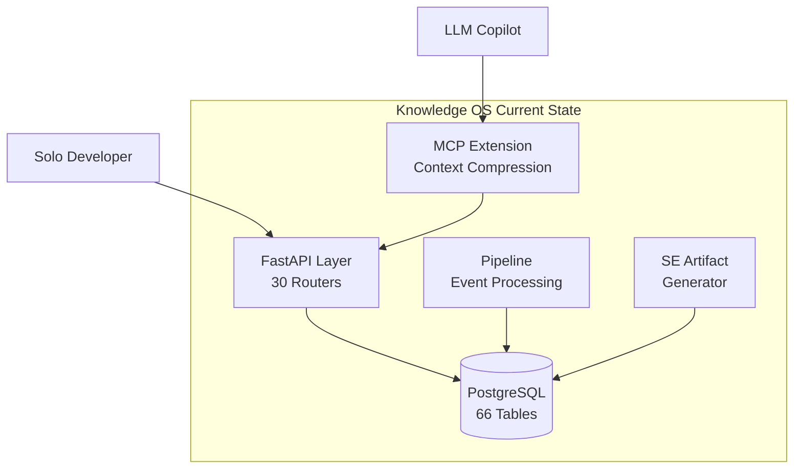
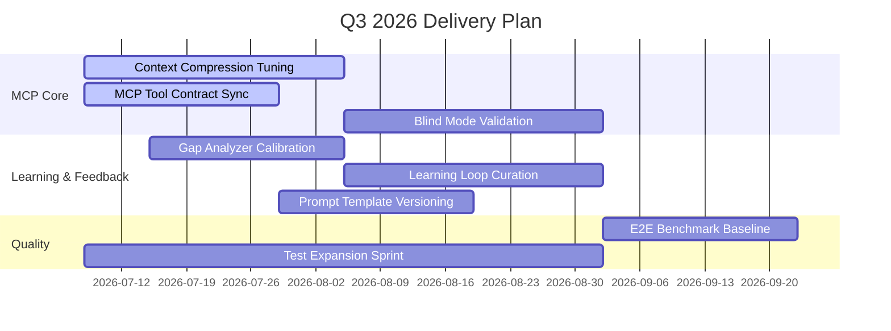
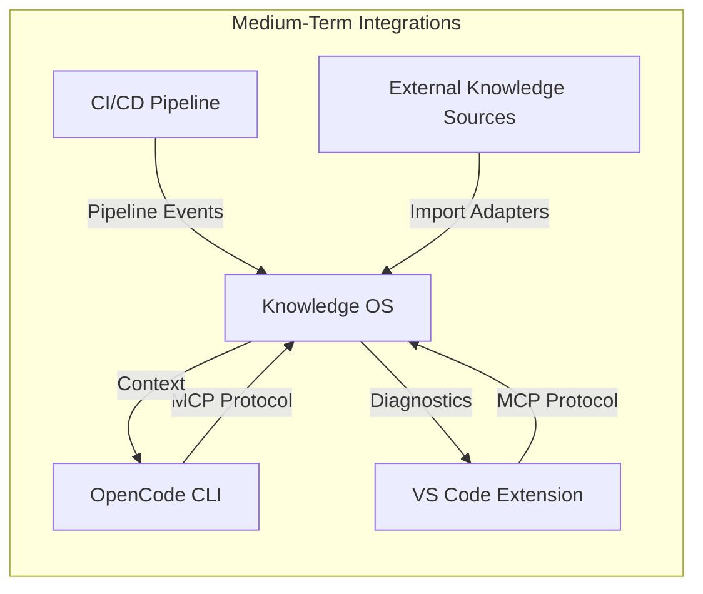
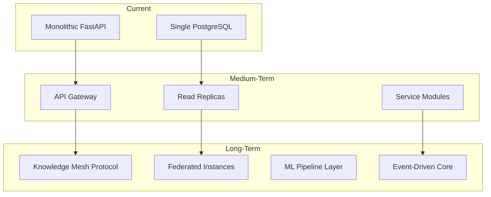
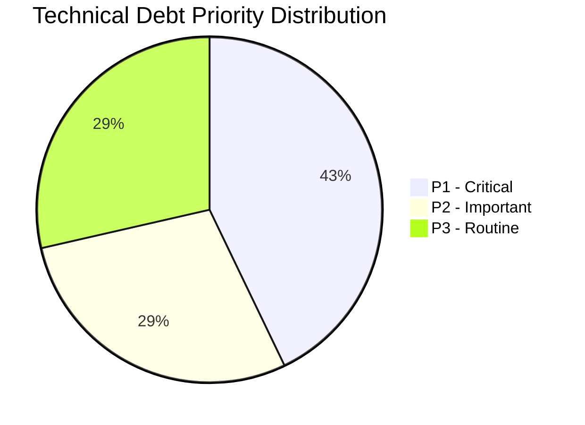
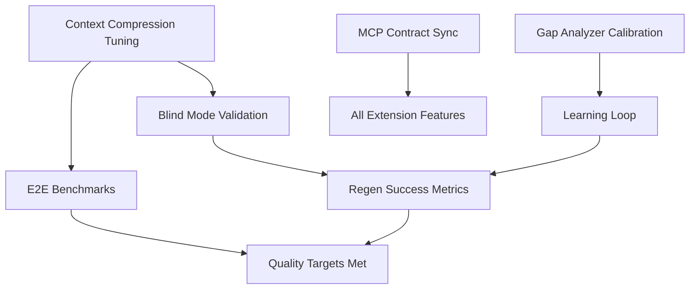

# Product Roadmap

| Field | Value |
|---|---|
| Version | 1.0-draft |
| Date | 2026-07-08 |
| Project | OpenCode Architecture Extension |
| System | Knowledge OS (logs-db) |
| Author | TBD |

## Revision History

| Version | Date | Description |
|---|---|---|
| 1.0-draft | 2026-07-08 | Initial draft from automated analysis |

## Project Profile: OpenCode Architecture Extension
Status: active | Type: new-build | Category: Developer Tooling / AI-Assisted Engineering

OpenCode MCP extension providing architecture context compression, validation tools, regen-loop orchestrator with blind mode, and learning loop for LLM-driven code regeneration.

### Live System Metrics (auto-generated at artifact build time)

| Metric | Value |
|---|---|
| Total logs | 0 |
| Database tables | 66 |
| Latest migration | 056 |
| Python source files | 448 |
| Test files | 148 |
| API routers | 30 |
| SQLAlchemy models | 30 |
| HTML templates | 18 |

---

## 1. Current State

### 1.1 System Baseline

The Knowledge OS is a functioning FastAPI/PostgreSQL application with a mature schema (66 tables across 56 Alembic migrations), 30 API routers, and 148 test files. The system captures, enriches, and retrieves knowledge from development sessions, serving both a solo developer and LLM copilot agents.

### 1.2 Delivered Capabilities

| Capability | Status | Evidence |
|---|---|---|
| Core Entity CRUD (logs, entities, projects, technologies) | ✅ Operational | 30 routers, 30 SQLAlchemy models |
| Database Schema Management | ✅ Operational | 56 migrations applied |
| Pipeline Event Processing | ✅ Operational | Pipeline architecture documented |
| LLM Feedback Capture | ✅ Operational | Feedback models in schema |
| HTML Template Rendering | ✅ Operational | 18 templates |
| Test Infrastructure | ✅ Operational | 148 test files |
| Systems Engineering Artifact Generation | ✅ Operational | 35+ artifact processes defined |
| OpenCode MCP Extension (context compression) | 🔶 In Progress | Process defined, tuning ongoing |
| Regen-Loop Orchestrator (blind mode) | 🔶 In Progress | Validation process defined |
| Learning Loop | 🔶 In Progress | Lesson curation process defined |

### 1.3 Recent Milestones

| Milestone | Completion |
|---|---|
| Schema stabilization at 66 tables | Complete |
| SE artifact pipeline (35+ process definitions) | Complete |
| MCP tool contract definition | Complete |
| Initial context compression implementation | Complete |
| Blind mode regen-loop framework | In Progress |

### 1.4 Architecture Summary

---

## 2. Near-Term (Next Quarter)

### 2.1 Priority: MCP Extension Stabilization

The immediate focus is maturing the four core OpenCode extension capabilities from in-progress to operational status.

| Deliverable | Priority | Target | Dependencies |
|---|---|---|---|
| Context Compression Tuning | P1 | Compression ratio targets met | Gap Analyzer calibrated |
| Regen-Loop Blind Mode Validation | P1 | Blind mode produces passing regenerations | Test infrastructure, validation harness |
| MCP Tool Contract Synchronization | P1 | All tool contracts versioned and tested | ICD alignment |
| Learning Loop Lesson Curation | P2 | Automated lesson extraction from regen sessions | Feedback model populated |
| Prompt Template Versioning | P2 | Templates tracked with semantic versions | [TBD] |
| Gap Analyzer Threshold Calibration | P2 | False-positive rate < 5% | E2E benchmark data |
| E2E Benchmark Regression Review | P3 | Baseline benchmarks established | Test suite expansion |

### 2.2 Quality Targets

| Metric | Current | Target |
|---|---|---|
| Test files | 148 | 180+ |
| Context compression ratio | [TBD] | [TBD — defined in System Vision] |
| Regen success rate (blind mode) | [TBD] | ≥ 80% first-pass |
| Time-to-insight | [TBD] | < 30 seconds |

### 2.3 Near-Term Roadmap Flow

---

## 3. Medium-Term (6–12 months)

### 3.1 Capability Expansion

| Initiative | Description | Success Criteria |
|---|---|---|
| Multi-Agent Orchestration | Enable multiple LLM agents to coordinate via MCP with shared context | Concurrent agent sessions without context collision |
| Knowledge Graph Enrichment | Automated entity relationship discovery from log patterns | Entity linkage coverage > 80% |
| Contributor Onboarding Automation | Self-service onboarding via generated README, guided workflows | Time-to-first-contribution < 1 day |
| Architecture Self-Healing | Regen-loop detects and proposes fixes for architecture drift | Drift detection within 1 migration of occurrence |
| Advanced Signal Path Tracing | Full observability of data flows with automated atlas updates | See Signal Path Atlas artifact |

### 3.2 Platform Hardening

| Area | Planned Work |
|---|---|
| Schema Evolution | Migration consolidation; partition strategy for high-volume tables |
| API Versioning | Introduce v2 API surface with breaking change isolation |
| Performance | Query optimization for context compression lookups; caching layer |
| Observability | Structured logging, distributed tracing for MCP tool calls |
| Security | API key rotation, rate limiting, input validation hardening |

### 3.3 Integration Expansion

---

## 4. Long-Term (1+ year)

### 4.1 Strategic Vision

> *See System Vision artifact for full strategic direction.*

The long-term trajectory positions Knowledge OS as a **self-improving knowledge substrate** for AI-assisted engineering — where architecture decisions, code patterns, and operational lessons compound over time.

### 4.2 Vision Capabilities

| Capability | Horizon | Strategic Value |
|---|---|---|
| Autonomous Architecture Governance | 18 months | System validates its own architecture decisions against ADR history |
| Cross-Project Knowledge Transfer | 18–24 months | Lessons learned automatically inform new projects |
| Predictive Technical Debt Detection | 24 months | ML-driven identification of emerging debt patterns |
| Federated Knowledge Mesh | 24+ months | Multiple Knowledge OS instances share curated knowledge |
| Natural Language System Querying | 18 months | Stakeholders query system state in plain language |

### 4.3 Target Architecture Evolution

---

## 5. Technical Debt

### 5.1 Known Debt Register

| ID | Category | Description | Impact | Priority | Mitigation |
|---|---|---|---|---|---|
| TD-001 | Schema | 66 tables with 56 migrations; potential for migration chain fragility | Deployment risk | P2 | Migration squash at stable boundary |
| TD-002 | Test Coverage | 148 test files across 448 source files; coverage gaps likely in newer features | Regression risk | P1 | Coverage measurement and gap sprints |
| TD-003 | Model-Table Divergence | 30 models vs 66 tables suggests unmapped tables (junction, metadata, system) | Maintenance burden | P3 | Complete model coverage or document exclusions |
| TD-004 | Template Maintenance | 18 HTML templates may lag API evolution | User-facing inconsistency | P3 | Template-API contract testing |
| TD-005 | MCP Contract Drift | Tool contracts may diverge from implementation during rapid development | Integration failures | P1 | Automated contract synchronization (near-term) |
| TD-006 | Documentation Freshness | 35+ SE artifacts require periodic refresh as system evolves | Stale guidance | P2 | Automated artifact rebuild pipeline |
| TD-007 | [TBD] | Logging infrastructure shows 0 total logs — indicates bootstrap or reset state | Operational blind spot | P1 | Verify log pipeline connectivity |

### 5.2 Debt Reduction Strategy

**Approach:** Allocate 20% of each sprint to debt reduction, prioritizing P1 items that directly block near-term roadmap delivery.

---

## 6. Dependencies & Risks

### 6.1 External Dependencies

| Dependency | Type | Impact if Unavailable | Mitigation |
|---|---|---|---|
| LLM API Services | Runtime | Regen-loop and context compression non-functional | Fallback prompts; cached responses; retry logic |
| PostgreSQL | Infrastructure | Full system unavailable | Backup/recovery procedures (see Maintenance Manual) |
| OpenCode / MCP Protocol | Integration | Extension capabilities disabled | Protocol version pinning; compatibility layer |
| Python Ecosystem (FastAPI, SQLAlchemy, Alembic) | Build | Cannot build or deploy | Dependency pinning; vendoring critical packages |

### 6.2 Internal Dependencies

| Dependency | Blocks | Status |
|---|---|---|
| Context Compression Tuning | Blind Mode Validation, E2E Benchmarks | In Progress |
| Gap Analyzer Calibration | Learning Loop accuracy | In Progress |
| MCP Tool Contracts | All extension integrations | In Progress |
| Test Infrastructure Expansion | Quality targets | Ongoing |

### 6.3 Risk Register Summary

| Risk | Likelihood | Impact | Response Strategy |
|---|---|---|---|
| LLM API breaking changes | Medium | High | Version-pin APIs; abstract behind adapter layer |
| Schema migration chain corruption | Low | Critical | Migration testing in CI; squash at boundaries |
| Solo-developer capacity bottleneck | High | Medium | Automate SE artifact generation; leverage LLM for boilerplate |
| Context compression quality plateau | Medium | High | Benchmark-driven tuning; alternative algorithm research |
| Scope creep from 35+ parallel processes | Medium | Medium | Strict scope management; see Scope Management artifact |
| Zero-log state masking operational issues | High | Medium | Immediate investigation of log pipeline (TD-007) |

### 6.4 Dependency Flow

---

## Cross-References

| Artifact | Relevance |
|---|---|
| System Vision | Strategic direction and design principles informing long-term roadmap |
| Functional Architecture | Detailed system decomposition (not duplicated here) |
| Requirements Analysis | Traceable requirements driving near-term priorities |
| Risk Management | Complete risk register with quantitative assessment |
| Schedule Management | Sprint-level schedule detail |
| Quality Management | Test coverage targets and quality gates |
| ICD | Interface contracts for MCP tool synchronization |
| Signal Path Atlas | Data flow documentation for observability initiatives |