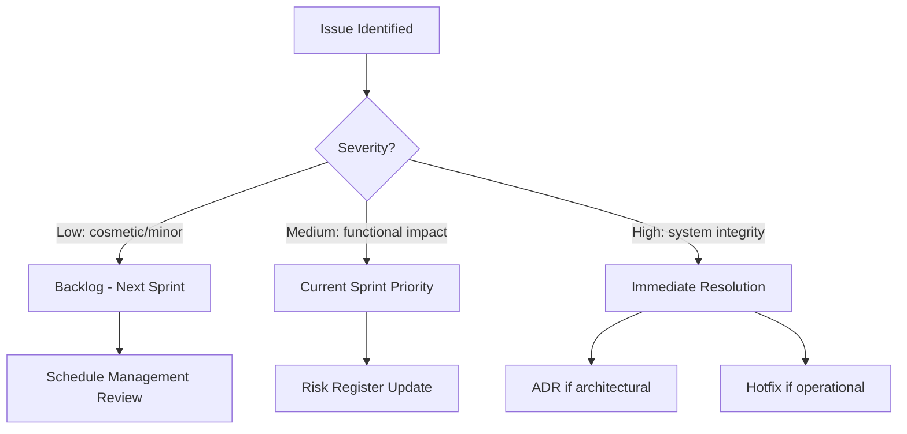
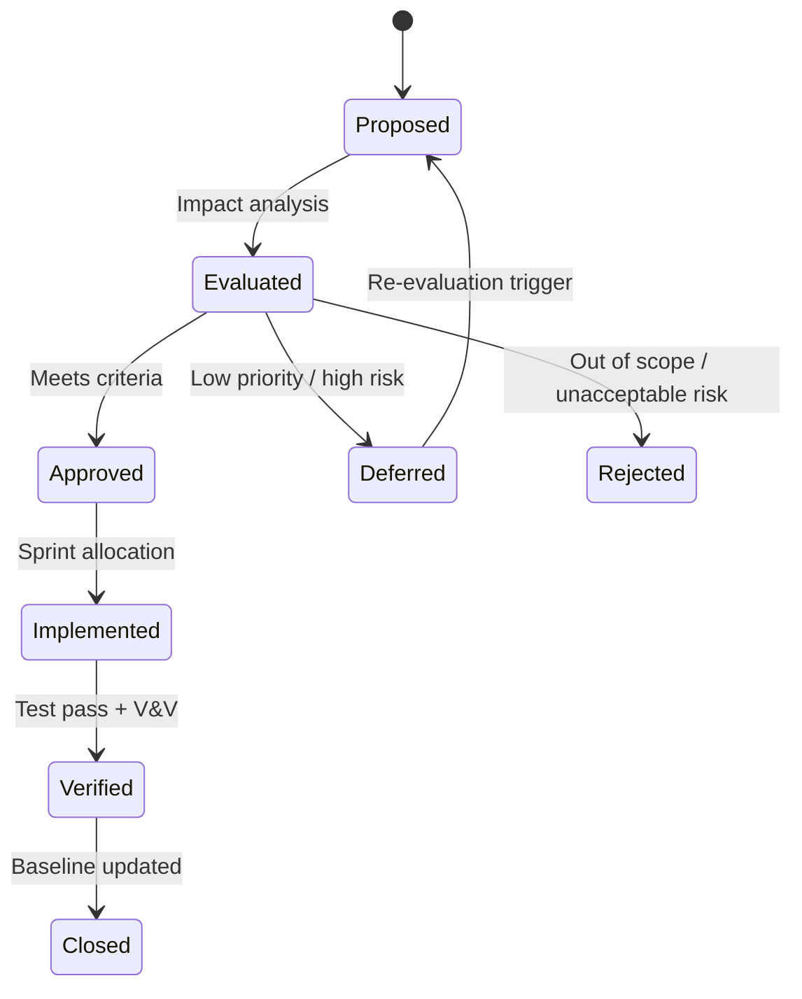
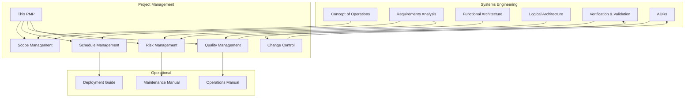

# Project Management Plan

| Field | Value |
|---|---|
| Version | 1.0-draft |
| Date | 2026-07-08 |
| Project | OpenCode Architecture Extension |
| System | Knowledge OS (logs-db) |
| Author | TBD |

## Revision History

| Version | Date | Description |
|---|---|---|
| 1.0-draft | 2026-07-08 | Initial draft from automated analysis |

## Project Profile: OpenCode Architecture Extension
Status: active | Type: new-build | Category: Developer Tooling / AI-Assisted Engineering

OpenCode MCP extension providing architecture context compression, validation tools, regen-loop orchestrator with blind mode, and learning loop for LLM-driven code regeneration.

### Live System Metrics (auto-generated at artifact build time)

| Metric | Value |
|---|---|
| Total logs | 0 |
| Database tables | 66 |
| Latest migration | 056 |
| Python source files | 448 |
| Test files | 148 |
| API routers | 30 |
| SQLAlchemy models | 30 |
| HTML templates | 18 |

---

## 1. Project Overview

### 1.1 Purpose

This Project Management Plan (PMP) is the master integration document for the OpenCode Architecture Extension project. It coordinates all project management knowledge areas into a coherent execution framework, defines governance and decision authority, establishes the development lifecycle, and specifies change control mechanisms.

### 1.2 Objectives

| ID | Objective | Success Criteria |
|---|---|---|
| OBJ-1 | Deliver architecture context compression for LLM consumption | Context compression ratio meets threshold; time-to-insight < 30s |
| OBJ-2 | Provide validation tools for architecture conformance | Automated validation passes on regenerated code |
| OBJ-3 | Implement regen-loop orchestrator with blind mode | End-to-end regeneration completes without human intervention |
| OBJ-4 | Establish learning loop for continuous improvement | Lessons captured and applied to subsequent regen cycles |
| OBJ-5 | Maintain Knowledge OS as single source of engineering truth | 66 database tables operational; 448 source files under management |

### 1.3 High-Level Scope

**In Scope:**
- Knowledge OS backend (FastAPI/PostgreSQL with 30 API routers, 30 SQLAlchemy models)
- MCP tool integration for OpenCode extension
- Architecture document generation and compression pipeline
- Regen-loop orchestration including blind mode validation
- Test infrastructure (148 test files)
- Documentation-as-code artifact system

**Out of Scope:**
- Third-party IDE plugin distribution
- Multi-tenant SaaS deployment
- Commercial licensing or monetization

### 1.4 Stakeholders

| Stakeholder | Role | Primary Interest |
|---|---|---|
| Solo Developer | Primary User / Operator | Capture and retrieve knowledge with minimal friction |
| LLM Copilot | Automated Agent | Receive well-structured context for code generation |
| Future Contributors | Secondary Users | Onboard via documentation and searchable knowledge base |
| OpenCode Extension | Integration Consumer | Access architecture context via MCP protocol |

---

## 2. Governance Structure

### 2.1 Decision Authority

Given the solo-developer resource model, governance is lightweight but formally documented to support future contributor onboarding.

| Decision Type | Authority | Mechanism |
|---|---|---|
| Architecture decisions | Solo Developer | ADR process (see ADRs artifact) |
| Scope changes | Solo Developer | Change Control Log (Section 5) |
| Technology adoption | Solo Developer | Technology Radar evaluation |
| Release approval | Solo Developer | Phase gate criteria (Section 4) |
| Risk acceptance | Solo Developer | Risk Register threshold review |

### 2.2 Escalation Path

### 2.3 Review Cadence

| Review | Frequency | Purpose |
|---|---|---|
| Sprint Review | Per sprint cycle | Deliverable assessment |
| Architecture Review | Per significant change | ADR creation/update |
| Metric Review | At artifact build time | System health validation |
| Roadmap Review | [TBD] | Priority realignment |

---

## 3. Subsidiary Plans Summary

This PMP integrates nine PM knowledge area plans. Each is maintained as a separate artifact with its own revision cycle.

| Knowledge Area | Artifact | Status | Owner | Key Deliverable |
|---|---|---|---|---|
| Scope | Scope Management | Active | Solo Developer | WBS, scope baseline, change requests |
| Schedule | Schedule Management | Active | Solo Developer | Sprint plan, milestone tracker |
| Cost | Cost Management | Active | Solo Developer | Budget baseline, earned value reports |
| Quality | Quality Management | Active | Solo Developer | Test coverage metrics, quality audits |
| Resource | Resource Management | Active | Solo Developer | Capacity plan, skill development priorities |
| Communications | Communications Management | Active | Solo Developer | Status reports, knowledge base updates |
| Risk | Risk Management | Active | Solo Developer | Risk register, response plans |
| Procurement | Procurement Management | Active | Solo Developer | Make-or-buy records, license compliance |
| Stakeholder | Stakeholder Management | Active | Solo Developer | Engagement plan, feedback summaries |

See each subsidiary plan artifact for detailed processes, tools, and procedures.

---

## 4. Lifecycle Model

### 4.1 Development Approach

The project follows an **iterative-incremental** model with continuous integration characteristics, appropriate for a solo-developer knowledge system with evolving requirements.

```mermaid
graph LR
    subgraph "Phase 1: Foundation"
        A1[Schema Design] --> A2[Core Models]
        A2 --> A3[API Scaffolding]
    end
    subgraph "Phase 2: Capability Build"
        B1[Pipeline Implementation] --> B2[MCP Integration]
        B2 --> B3[Regen Loop MVP]
    end
    subgraph "Phase 3: Intelligence"
        C1[Context Compression] --> C2[Blind Mode]
        C2 --> C3[Learning Loop]
    end
    subgraph "Phase 4: Maturity"
        D1[Optimization] --> D2[Contributor Onboarding]
        D2 --> D3[Stabilization]
    end
    A3 --> B1
    B3 --> C1
    C3 --> D1
```

### 4.2 Current State Assessment

| Indicator | Value | Interpretation |
|---|---|---|
| Migration count | 056 | Schema actively evolving (Phase 2+) |
| Source files | 448 | Substantial implementation exists |
| Test files | 148 | ~33% test-to-source ratio |
| Database tables | 66 | Rich domain model established |
| API routers | 30 | Broad API surface deployed |

### 4.3 Phase Gate Criteria

| Gate | Entry Criteria | Exit Criteria |
|---|---|---|
| G1: Foundation Complete | Schema design approved | Core CRUD operational, migrations stable |
| G2: Capability Ready | Pipeline architecture defined | MCP tools functional, regen loop executes |
| G3: Intelligence Active | Compression algorithm selected | Blind mode validated, learning loop captures lessons |
| G4: Release | All critical tests pass | Contributor docs complete, system stable under load |

### 4.4 Release Criteria

- All 148 test files pass with no regressions
- Migration chain (001–056) applies cleanly to fresh database
- API routers (30) respond with correct schemas
- Context compression meets [TBD] ratio threshold
- Blind mode regen produces valid output without human correction
- Documentation artifacts current with system state

---

## 5. Change Control

### 5.1 Change Categories

| Category | Threshold | Approval |
|---|---|---|
| Trivial | Typo, formatting, comment-only | Self-approved, no log entry required |
| Minor | New field, config change, test addition | Logged in change control, self-approved |
| Moderate | New endpoint, schema migration, new model | ADR required, logged with rationale |
| Major | New subsystem, architecture change, dependency addition | ADR + Technology Radar review + Risk assessment |

### 5.2 Change Control Process

### 5.3 Baseline Management

| Baseline | Contents | Update Trigger |
|---|---|---|
| Scope Baseline | WBS + requirements specification | Approved scope change |
| Schedule Baseline | Sprint plan + milestones | Approved schedule change |
| Cost Baseline | Infrastructure budget + compute allocation | Approved cost change |
| Technical Baseline | Schema (migration 056) + API contracts | Approved architectural change |

---

## 6. Integration Points

### 6.1 PM–SE Process Integration

This project operates with tightly coupled project management and systems engineering processes. The SE artifacts (ConOps, Requirements, Architecture, V&V) directly inform PM planning, while PM processes (schedule, risk, quality) constrain SE execution.

### 6.2 Key Integration Touchpoints

| PM Process | SE Process | Integration Mechanism |
|---|---|---|
| Scope Management | Requirements Analysis | Requirements trace to WBS elements |
| Schedule Management | Product Roadmap | Milestones align to capability phases |
| Quality Management | Verification & Validation | Test results feed quality metrics |
| Risk Management | Architecture (Functional + Logical) | Technical risks from architecture decisions |
| Change Control | ADR Process | Architectural changes trigger ADRs |
| Communications | All SE Artifacts | Documentation-as-communication strategy |
| Procurement | Technology Radar | Technology adoption governs dependency decisions |

### 6.3 Cross-Reference Index

For detailed content, refer to the following artifacts:

- **Requirements**: See Requirements Analysis for traceable requirements with acceptance criteria
- **Architecture**: See Functional Architecture and Logical Architecture for system decomposition
- **Testing**: See Testing artifact for test strategy, coverage targets, and CI automation
- **Deployment**: See Deployment Guide for installation and environment configuration
- **Interfaces**: See ICD for API contracts and protocol definitions
- **Data**: See Data Dictionary for complete schema documentation (66 tables)
- **Signals**: See Signal Path Atlas for end-to-end data flow tracing
- **Decisions**: See ADRs for architectural decision records

---

## 7. Constraints and Assumptions

### Constraints

| ID | Constraint | Impact |
|---|---|---|
| CON-1 | Solo-developer resource model | All roles consolidated; parallel work limited |
| CON-2 | LLM context window limits | Architecture compression is non-optional |
| CON-3 | PostgreSQL as primary store | Schema evolution via Alembic migrations only |

### Assumptions

| ID | Assumption | Risk if Invalid |
|---|---|---|
| ASM-1 | MCP protocol remains stable | Tool contracts require renegotiation |
| ASM-2 | LLM capabilities continue improving | Compression ratios may need adjustment |
| ASM-3 | Infrastructure costs remain within [TBD] budget | Cost Management plan triggers re-evaluation |

---

## 8. Success Metrics

| Metric | Target | Measurement Method |
|---|---|---|
| Time-to-insight | < 30 seconds | End-to-end query timing |
| Regeneration success rate | [TBD]% | Blind mode validation pass rate |
| Context compression ratio | [TBD]:1 | Token count comparison |
| Test coverage | [TBD]% | pytest-cov reporting across 148 test files |
| Onboarding time | < 1 day | First contribution by new contributor |
| Schema stability | < [TBD] migrations/month | Migration count velocity |