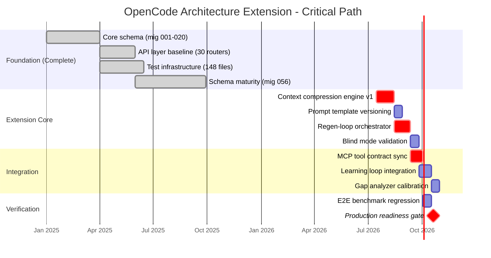
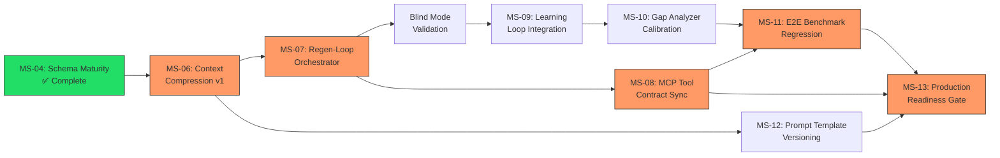

# Project Schedule

| Field | Value |
|---|---|
| Version | 1.0-draft |
| Date | 2026-07-08 |
| Project | OpenCode Architecture Extension |
| System | Knowledge OS (logs-db) |
| Author | TBD |

## Revision History

| Version | Date | Description |
|---|---|---|
| 1.0-draft | 2026-07-08 | Initial draft from automated analysis |

## Project Profile: OpenCode Architecture Extension
Status: active | Type: new-build | Category: Developer Tooling / Knowledge Management

OpenCode MCP extension providing architecture context compression, validation tools, regen-loop orchestrator with blind mode, and learning loop for LLM-driven code regeneration.

### Live System Metrics (auto-generated at artifact build time)

| Metric | Value |
|---|---|
| Total logs | 0 |
| Database tables | 66 |
| Latest migration | 056 |
| Python source files | 448 |
| Test files | 148 |
| API routers | 30 |
| SQLAlchemy models | 30 |
| HTML templates | 18 |

---

## 1. Schedule Management Approach

### 1.1 Cadence

The project operates under a **solo-developer, continuous-delivery cadence** with the following rhythm:

| Cadence Element | Duration | Purpose |
|---|---|---|
| Sprint | 1 week | Feature delivery and migration batches |
| Review gate | Bi-weekly | Artifact review, schema validation, regression check |
| Milestone checkpoint | Monthly | Capability-level progress assessment |
| Roadmap sync | Quarterly | Vision alignment and priority recalibration |

Given the solo-developer resource model (see Resource Management artifact), schedule management emphasizes **throughput visibility** over team coordination. Work-in-progress limits are enforced through the pipeline event system rather than standup ceremonies.

### 1.2 Milestone Strategy

Milestones are defined at **capability boundaries** rather than arbitrary calendar dates. Each milestone corresponds to a verifiable system state:

- **Schema milestones** — measured by migration number (currently at 056)
- **Coverage milestones** — measured by test file count relative to source files (currently 148 test files / 448 source files = 33% file coverage ratio)
- **Integration milestones** — measured by API router and model completeness (30 routers, 30 models)
- **Extension milestones** — measured by MCP tool contract completion

### 1.3 Estimation Technique

Duration estimates use **reference-class forecasting** based on historical migration velocity:

- 56 migrations delivered to date establishes the baseline throughput
- Per-migration complexity is categorized as: trivial (column add), moderate (new table + relationships), complex (data migration + schema refactor)
- Activity durations derive from the observed ratio of migrations-per-sprint

Where historical data is unavailable (e.g., OpenCode extension features), estimates use **three-point estimation** (optimistic, most likely, pessimistic) with PERT weighting.

---

## 2. Milestone Schedule

### 2.1 Achieved Milestones

| ID | Milestone | Target Date | Actual Date | Evidence |
|---|---|---|---|---|
| MS-01 | Core schema established (migrations 001–020) | [TBD] | [TBD] | 20+ tables operational |
| MS-02 | API layer baseline (30 routers operational) | [TBD] | [TBD] | 30 API routers confirmed |
| MS-03 | Test infrastructure established (148 test files) | [TBD] | [TBD] | pytest suite operational |
| MS-04 | Schema maturity gate (migration 056) | [TBD] | [TBD] | 66 tables, 30 models |
| MS-05 | Template layer complete (18 HTML templates) | [TBD] | [TBD] | UI rendering confirmed |

### 2.2 Planned Milestones

| ID | Milestone | Target Date | Dependencies | Exit Criteria |
|---|---|---|---|---|
| MS-06 | Context compression engine v1 | [TBD] | MS-04 | Architecture context compresses to <4K tokens for LLM consumption |
| MS-07 | Regen-loop orchestrator (blind mode) | [TBD] | MS-06 | Blind regeneration succeeds on 3+ validated test cases |
| MS-08 | MCP tool contract synchronization | [TBD] | MS-06, MS-07 | All MCP tools pass contract validation |
| MS-09 | Learning loop integration | [TBD] | MS-07 | Feedback from regen results flows back to context compression tuning |
| MS-10 | Gap analyzer threshold calibration | [TBD] | MS-09 | False-positive rate < 5% on known-good architectures |
| MS-11 | E2E benchmark regression baseline | [TBD] | MS-07, MS-10 | Benchmark suite passes; regression threshold defined |
| MS-12 | Prompt template versioning system | [TBD] | MS-06 | Templates versioned, rollback tested |
| MS-13 | Production readiness gate | [TBD] | MS-08 through MS-12 | All V&V criteria met (see Verification & Validation artifact) |

---

## 3. Activity Dependencies

### 3.1 Critical Path Analysis

The critical path runs through the context compression engine, as it gates both the regen-loop orchestrator and MCP tool contracts. The learning loop creates a feedback cycle that refines but does not block the primary delivery path.

### 3.2 Dependency Matrix

| Activity | Depends On | Blocks | Type |
|---|---|---|---|
| Context compression engine | Schema maturity (MS-04) | Regen-loop, MCP sync, Prompt versioning | Finish-to-Start |
| Regen-loop orchestrator | Context compression engine | Blind mode validation, Learning loop | Finish-to-Start |
| Blind mode validation | Regen-loop orchestrator | Learning loop integration | Finish-to-Start |
| MCP tool contract sync | Context compression, Regen-loop | E2E benchmark | Finish-to-Start |
| Learning loop integration | Blind mode validation | Gap analyzer calibration | Finish-to-Start |
| Gap analyzer calibration | Learning loop | E2E benchmark (partial) | Finish-to-Start |
| E2E benchmark regression | MCP sync, Gap analyzer | Production readiness | Finish-to-Start |
| Prompt template versioning | Context compression | Production readiness | Finish-to-Start |

### 3.3 Dependency Flow

> **Legend:** Green = complete | Orange = critical path

---

## 4. Schedule Performance

### 4.1 Tracking Approach

Schedule performance is measured using **milestone-based Earned Schedule (ES)** adapted for solo-developer context:

$$
SPI_t = \frac{ES}{AT}
$$

Where:
- $ES$ = Earned Schedule (time at which current progress was planned to be achieved)
- $AT$ = Actual Time elapsed

| Indicator | Formula | Threshold | Action |
|---|---|---|---|
| Schedule Performance Index (time) | $SPI_t = ES / AT$ | < 0.85 | Scope reduction or milestone re-baseline |
| Schedule Variance (time) | $SV_t = ES - AT$ | > -1 sprint | Escalate to roadmap sync |
| Migration velocity | Migrations / sprint | < 2 per sprint | Investigate blockers |
| Test-to-source ratio | Test files / Source files | Declining trend | Prioritize test debt |

### 4.2 Current Performance Snapshot

| Metric | Baseline | Current | Status |
|---|---|---|---|
| Total migrations delivered | 56 planned by current date | 56 actual | ✅ On track |
| API surface coverage | 30 routers | 30 routers | ✅ On track |
| Model completeness | 30 models for 66 tables | 30 models | ⚠️ Gap: 36 tables without dedicated models |
| Test file ratio | Target [TBD] | 148/448 = 33% | [TBD] — requires baseline |
| Extension milestones (MS-06+) | [TBD] | Not started | 🔲 Pending |

### 4.3 Variance Response Protocol

| Variance Level | Condition | Response |
|---|---|---|
| Green | $SPI_t \geq 0.95$ | Continue current cadence |
| Yellow | $0.85 \leq SPI_t < 0.95$ | Identify top blocker; adjust current sprint scope |
| Red | $SPI_t < 0.85$ | Trigger re-baseline review; defer non-critical milestones |

### 4.4 Schedule Risk Indicators

| Risk | Likelihood | Impact | Mitigation |
|---|---|---|---|
| Context compression complexity underestimated | Medium | High (gates critical path) | Spike/prototype before committing to schedule |
| Blind mode validation requires iteration cycles | High | Medium | Budget 2× estimated duration for validation phase |
| MCP contract changes from upstream | Medium | Medium | Pin contract version; decouple via adapter layer |
| Solo-developer availability variance | Medium | High | Maintain 20% schedule buffer on all estimates |

> For detailed risk analysis, see Risk Management artifact. For scope decomposition underlying this schedule, see Scope Management artifact (WBS).

---

## Cross-References

| Artifact | Relevance to Schedule |
|---|---|
| Scope Management | WBS provides activity decomposition feeding this schedule |
| Risk Management | Schedule risk register entries |
| Product Roadmap | Strategic milestone sequencing and phasing |
| Quality Management | Quality gates that constrain milestone exit criteria |
| Verification & Validation | Production readiness gate criteria (MS-13) |
| Integration Management | Change control process for schedule re-baselines |
| Resource Management | Capacity constraints informing duration estimates |