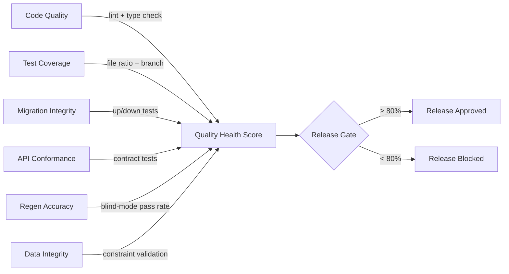
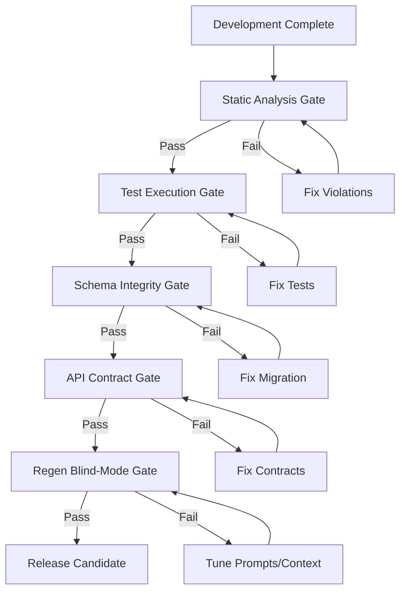
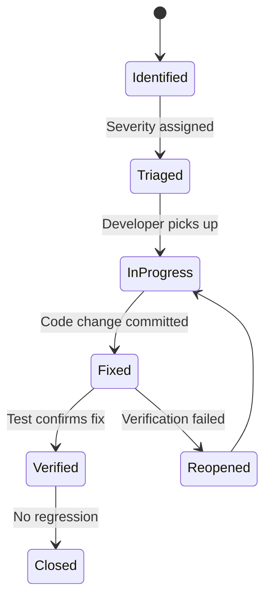
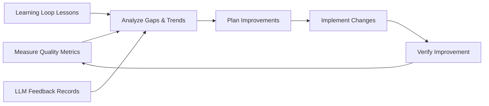

# Quality Management Plan

| Field | Value |
|---|---|
| Version | 1.0-draft |
| Date | 2026-07-08 |
| Project | OpenCode Architecture Extension |
| System | Knowledge OS (logs-db) |
| Author | TBD |

## Revision History

| Version | Date | Description |
|---|---|---|
| 1.0-draft | 2026-07-08 | Initial draft from automated analysis |

## Project Profile: OpenCode Architecture Extension
Status: active | Type: new-build | Category: Developer Tooling / Knowledge Management

OpenCode MCP extension providing architecture context compression, validation tools, regen-loop orchestrator with blind mode, and learning loop for LLM-driven code regeneration.

### Live System Metrics (auto-generated at artifact build time)

| Metric | Value |
|---|---|
| Total logs | 0 |
| Database tables | 66 |
| Latest migration | 056 |
| Python source files | 448 |
| Test files | 148 |
| API routers | 30 |
| SQLAlchemy models | 30 |
| HTML templates | 18 |

---

## 1. Quality Policy

### 1.1 Quality Objectives

The Knowledge OS quality program ensures that the system reliably captures, enriches, and retrieves development knowledge while supporting LLM-driven code regeneration with measurable accuracy. Quality objectives derive directly from stakeholder success metrics defined in the Requirements Analysis:

| Objective | Source Requirement | Target |
|---|---|---|
| Time-to-insight for historical decisions | Solo Developer needs | < 30 seconds |
| Context compression fidelity | LLM Copilot needs | Compression ratio with < 5% semantic loss |
| Regeneration success rate | Regen-loop orchestrator | ≥ 90% pass on blind-mode validation |
| Onboarding velocity | Future Contributors | Time-to-first-contribution < 1 day |
| Data integrity across 66 tables | System reliability | Zero silent data corruption |
| Test suite health | Engineering practice | All 148 test files passing in CI |

### 1.2 Applicable Standards

| Standard / Practice | Application |
|---|---|
| PEP 8 / Ruff | Python code style enforcement |
| SQLAlchemy model conventions | ORM consistency across 30 models |
| FastAPI route patterns | Consistent API contracts across 30 routers |
| Alembic migration discipline | Schema evolution integrity (056 migrations) |
| Semantic Versioning | Release and artifact version tracking |
| IEEE 730 (adapted) | Quality assurance planning structure |

### 1.3 Acceptance Criteria Framework

All deliverables must satisfy:

1. **Functional correctness** — passes associated test cases (see Testing artifact for procedures)
2. **Schema integrity** — Alembic migrations apply cleanly in both upgrade and downgrade paths
3. **API contract compliance** — responses match documented ICD specifications
4. **Context compression validity** — compressed output reconstructable to source intent
5. **Blind-mode regeneration** — generated code passes validation without human intervention

---

## 2. Quality Metrics

### 2.1 Metrics Dashboard

| Metric | Target | Current Value | Measurement Method | Frequency |
|---|---|---|---|---|
| Test file coverage | 100% of source modules | 148 test files / 448 source files (33%) | File ratio analysis | Per commit |
| Test pass rate | 100% | [TBD] | pytest CI execution | Per commit |
| Code lint violations | 0 critical, < 10 warnings | [TBD] | Ruff / static analysis | Per commit |
| Migration integrity | All 056 migrations reversible | [TBD] | Alembic upgrade/downgrade test | Per migration |
| API router test coverage | ≥ 1 test per router | 30 routers → ≥ 30 integration tests | Router-to-test mapping | Weekly |
| Model validation coverage | 100% of 30 models | [TBD] | Model-to-test traceability | Weekly |
| Context compression accuracy | ≥ 95% semantic preservation | [TBD] | Benchmark regression suite | Per release |
| Regen-loop success rate | ≥ 90% blind-mode pass | [TBD] | E2E benchmark regression review | Per release |
| Defect escape rate | < 2 per release cycle | [TBD] | Production incident tracking | Monthly |
| Mean time to defect resolution | < 48 hours (critical) | [TBD] | Issue tracker timestamps | Monthly |

### 2.2 Quality Health Indicator

---

## 3. Quality Assurance

### 3.1 QA Activity Matrix

| Activity | Scope | Responsible | Trigger | Output |
|---|---|---|---|---|
| Code review | All source changes | Developer / LLM Copilot | Pull request | Review comments, approval |
| Architecture review | New modules, schema changes | Developer | New migration or router added | ADR update |
| Static analysis | 448 Python source files | Automated (Ruff, mypy) | Pre-commit hook | Lint report |
| Dependency audit | Third-party libraries | Automated (safety/pip-audit) | Weekly scheduled | Vulnerability report |
| Schema audit | 66 database tables, 30 models | Automated + manual | Per migration | Schema conformance report |
| Documentation review | SE artifacts, README | Developer | Artifact regeneration | Completeness checklist |
| MCP tool contract sync | Extension interfaces | Automated | Interface change detected | Contract validation report |

### 3.2 Review Gates

### 3.3 Automated QA Checks

| Check | Tool | Integration Point | Blocking? |
|---|---|---|---|
| Linting | Ruff | Pre-commit, CI | Yes |
| Type checking | mypy / pyright | CI pipeline | Yes (critical errors) |
| Import sorting | isort / Ruff | Pre-commit | Yes |
| Security scan | pip-audit | Weekly CI | Yes (high/critical CVE) |
| Schema diff validation | Alembic check | PR with migration | Yes |
| Template rendering | pytest (HTML) | CI for 18 templates | No (warning) |

---

## 4. Quality Control

### 4.1 Testing Strategy Summary

Testing is the primary QC mechanism. Full test procedures and architecture are documented in the **Testing** artifact. This section defines QC governance only.

| Test Level | Scope | Current Assets | Target |
|---|---|---|---|
| Unit | Individual functions, models | 148 test files | ≥ 1 test file per source module |
| Integration | Router-to-database flows | [TBD] | All 30 routers exercised |
| System | End-to-end workflows | [TBD] | Critical path coverage |
| Acceptance | Stakeholder success criteria | [TBD] | All acceptance criteria verified |
| Regression | Regen-loop, compression | E2E Benchmark Regression Review process | Per release |

### 4.2 Defect Management

| Severity | Definition | Response SLA | Escalation |
|---|---|---|---|
| Critical | Data loss, system unavailable, silent corruption | Fix within 24 hours | Immediate |
| High | Feature broken, regen-loop failing, migration blocked | Fix within 48 hours | Next session |
| Medium | Degraded performance, non-critical UI issue | Fix within 1 week | Backlog priority |
| Low | Cosmetic, documentation gap, minor inconvenience | Fix within 1 sprint | Normal backlog |

### 4.3 Defect Tracking Workflow

### 4.4 Regression Control

| Trigger | Regression Action |
|---|---|
| New migration added | Run full Alembic up/down cycle for all 056+ migrations |
| Router modified | Execute integration tests for affected API surface |
| Context compression change | Run E2E benchmark regression suite |
| Prompt template update | Execute regen-loop blind-mode validation |
| Dependency update | Full test suite execution |

---

## 5. Continuous Improvement

### 5.1 Improvement Cycle

### 5.2 Improvement Sources

| Source | Quality Signal | Action Channel |
|---|---|---|
| Learning Loop Lesson Curation | Patterns in regen failures | Prompt/context tuning |
| Gap Analyzer Threshold Calibration | Drift in compression accuracy | Threshold adjustment |
| E2E Benchmark Regression Review | Performance trend data | Architecture decisions (ADRs) |
| Defect post-mortems | Root cause patterns | Process/tooling updates |
| Test coverage delta | Under-tested modules | Targeted test creation |
| Pipeline event logs | Processing failures | Operational procedure updates |

### 5.3 Relationship to Verification & Validation

Quality Management and V&V are complementary:

| Concern | Quality Management (this artifact) | Verification & Validation |
|---|---|---|
| Focus | Process quality, metric tracking, prevention | Evidence that system meets requirements |
| Owns | Quality policy, metrics, QA/QC activities | Traceability matrix, verification evidence records |
| Produces | Quality audit reports, defect trends | Requirements-to-test mapping, validation assessment |
| Consumes | V&V results as quality evidence | Quality metrics as validation inputs |

Cross-reference: See **Verification & Validation** artifact for the requirements traceability matrix, verification evidence records, and validation assessment methodology. See **Testing** artifact for test architecture, fixture patterns, and execution procedures.

### 5.4 Quality Maturity Targets

| Phase | Quality Focus | Key Milestone |
|---|---|---|
| Current (Migration 056) | Establish baselines, fill coverage gaps | All 30 models have test coverage |
| Near-term | Automated quality gates in CI | Zero manual intervention for pass/fail |
| Medium-term | Predictive quality (learning loop integration) | Defect prediction from pattern analysis |
| Long-term | Self-healing quality (auto-fix via regen-loop) | Regen-loop resolves low-severity defects autonomously |

---

## Appendix A: Cross-Reference Index

| Related Artifact | Relationship |
|---|---|
| Testing | Detailed test procedures, fixtures, coverage methodology |
| Verification & Validation | Requirements traceability, V&V evidence |
| Requirements Analysis | Source of acceptance criteria and success metrics |
| Systems Engineering Management Plan | QA/QC governance framework |
| Risk Management | Quality-related risks and mitigations |
| Integration Management | Change control affecting quality baselines |
| ADRs | Architectural decisions with quality implications |