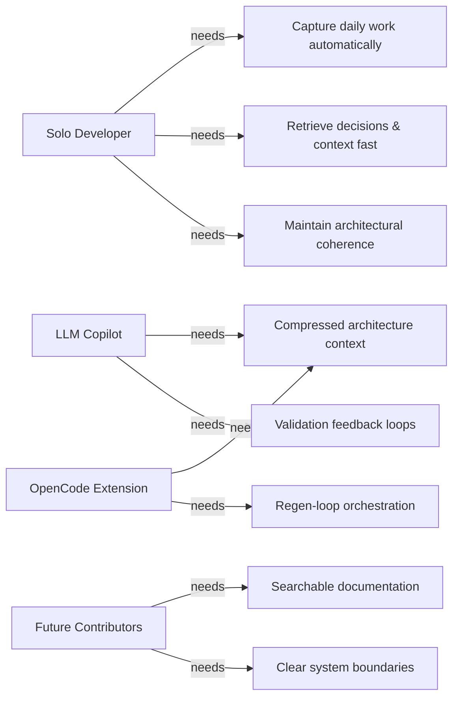
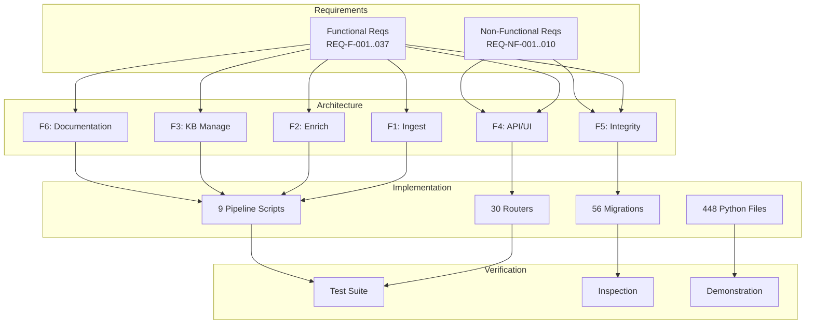

# Requirements Analysis

| Field | Value |
|---|---|
| Version | 1.0-draft |
| Date | 2026-07-08 |
| Project | OpenCode Architecture Extension |
| System | Knowledge OS (logs-db) |
| Author | TBD |

## Revision History

| Version | Date | Description |
|---|---|---|
| 1.0-draft | 2026-07-08 | Initial draft from automated analysis |

---

## 1. Stakeholder Needs

| Stakeholder | Role | Primary Goals | Success Metric |
|---|---|---|---|
| Solo Developer | Primary User / Operator | Capture, enrich, and retrieve knowledge from development sessions with minimal friction | Time-to-insight < 30s for any historical decision |
| LLM Copilot | Automated Agent | Receive well-structured context for code generation and architecture reasoning | Context compression ratio; regeneration success rate |
| Future Contributors | Secondary Users | Onboard quickly via documentation and searchable knowledge base | Time-to-first-contribution < 1 day |
| OpenCode Extension | Integration Consumer | Access architecture context via MCP tools for blind-mode regeneration | Tool call success rate; validation pass rate |

---

## 2. Functional Requirements

| Req ID | Description | Priority | Status | F-Block | UC Coverage |
|---|---|---|---|---|---|
| REQ-F-001 | Ingest OneNote journal entries via quick-parse pipeline | Must | [ACTIVE] | F1 | UC-01 |
| REQ-F-002 | Ingest OpenCode session logs and chat histories | Must | [ACTIVE] | F1 | UC-02 |
| REQ-F-003 | Execute scheduled source scans for new content | Must | [ACTIVE] | F1 | UC-03 |
| REQ-F-004 | Run folder intelligence structure assessment | Could | [ACTIVE] | F1 | UC-04 |
| REQ-F-005 | Sync Oura health data into knowledge base | Should | [ACTIVE] | F1 | UC-05 |
| REQ-F-006 | Ingest UW coursework and education materials | Should | [ACTIVE] | F1 | — |
| REQ-F-007 | Ingest goals and education essay documents | Should | [ACTIVE] | F1 | — |
| REQ-F-008 | Ingest work-related logs from source systems | Must | [ACTIVE] | F1 | UC-03 |
| REQ-F-009 | Enrich log entries via LLM with KB context | Must | [ACTIVE] | F2 | UC-06 |
| REQ-F-010 | Normalize tags across all entities | Must | [ACTIVE] | F2 | UC-07 |
| REQ-F-011 | Extract module references from log content | Must | [ACTIVE] | F2 | UC-08 |
| REQ-F-012 | Classify entities against ontology via LLM | Should | [ACTIVE] | F2 | UC-06 |
| REQ-F-013 | Batch-process entity classification | Should | [ACTIVE] | F2 | UC-06 |
| REQ-F-014 | Derive KB entities from enriched logs | Must | [ACTIVE] | F3 | UC-09 |
| REQ-F-015 | Seed and sync KB data to database | Must | [ACTIVE] | F3 | UC-10 |
| REQ-F-016 | Deduplicate tasks via LLM grouping | Should | [ACTIVE] | F3 | UC-11 |
| REQ-F-017 | Reclassify projects into systems/processes/projects | Should | [ACTIVE] | F3 | UC-12 |
| REQ-F-018 | Audit KB quality against original sources | Should | [ACTIVE] | F3 | UC-13 |
| REQ-F-019 | Browse, filter, and search logs via API/UI | Must | [ACTIVE] | F4 | UC-14 |
| REQ-F-020 | CRUD operations for all entity types (30 routers) | Must | [ACTIVE] | F4 | UC-15 |
| REQ-F-021 | Semantic vector search across content chunks | Must | [ACTIVE] | F4 | UC-16 |
| REQ-F-022 | Accept/reject LLM enrichment feedback | Must | [ACTIVE] | F4 | UC-17 |
| REQ-F-023 | Render project dashboard with health metrics | Must | [ACTIVE] | F4 | UC-18 |
| REQ-F-024 | Entity comment threads with replies | Should | [ACTIVE] | F4 | UC-19 |
| REQ-F-025 | Manage artifact patch review workflow | Should | [ACTIVE] | F4 | UC-20 |
| REQ-F-026 | Teaching flashcards with spaced repetition | Could | [ACTIVE] | F4 | UC-21 |
| REQ-F-027 | Backfill embeddings for existing content | Must | [ACTIVE] | F5 | UC-22 |
| REQ-F-028 | Propose schema migrations from model drift | Should | [ACTIVE] | F5 | UC-23 |
| REQ-F-029 | Collect training data from LLM diffs | Should | [ACTIVE] | F5 | UC-24 |
| REQ-F-030 | Generate architecture artifact documents | Must | [ACTIVE] | F6 | UC-25 |
| REQ-F-031 | Build entity relationship graph | Should | [ACTIVE] | F6 | UC-26 |
| REQ-F-032 | Export artifacts to organized knowledge folders | Should | [ACTIVE] | F6 | UC-25 |
| REQ-F-033 | Propagate enriched content to project descriptions | Should | [ACTIVE] | F6 | UC-25 |
| REQ-F-034 | Mobile knowledge capture and auto-sync | Should | [PLANNED] | F1 | UC-27 |
| REQ-F-035 | Conversational knowledge query (vector + LLM chat) | Should | [PLANNED] | F4 | UC-28 |
| REQ-F-036 | Automated staleness detection and repair | Should | [PLANNED] | F3 | UC-29 |
| REQ-F-037 | Cross-project knowledge federation | Could | [PLANNED] | F6 | UC-30 |

---

## 3. Non-Functional Requirements

| Req ID | Description | Category | Target | Verification |
|---|---|---|---|---|
| REQ-NF-001 | API response time for entity CRUD | Performance | < 200ms p95 for single-entity operations | Load test demonstration |
| REQ-NF-002 | Vector search latency | Performance | < 500ms for semantic queries over content chunks | Benchmark test |
| REQ-NF-003 | Pipeline throughput | Performance | Process 100 log entries/minute through enrichment | Pipeline timing instrumentation |
| REQ-NF-004 | Schema migration safety | Reliability | Zero data loss across 56 migrations | Migration rollback test + inspection |
| REQ-NF-005 | API surface coverage | Maintainability | 30 routers with consistent REST patterns | Code inspection; router manifest |
| REQ-NF-006 | Data model coverage | Maintainability | 30 SQLAlchemy models aligned to 66 database tables | Schema diff analysis |
| REQ-NF-007 | Codebase modularity | Maintainability | 448 Python files organized by functional block | Directory structure inspection |
| REQ-NF-008 | Template rendering | Usability | 18 HTML templates render without error | UI smoke test |
| REQ-NF-009 | LLM feedback data integrity | Reliability | All feedback records traceable to source log | Database constraint verification |
| REQ-NF-010 | Authentication boundary | Security | All mutation endpoints require valid session | Penetration test [TBD] |

---

## 4. Constraints

### Technical Constraints

| ID | Constraint | Rationale | Impact |
|---|---|---|---|
| TC-01 | PostgreSQL with pgvector extension required | Vector search (REQ-F-021) depends on pgvector embedding index | Limits deployment to PostgreSQL-compatible hosts |
| TC-02 | Alembic for all schema changes | 56 migrations enforce linear history | No manual DDL; all changes versioned |
| TC-03 | FastAPI/uvicorn runtime | Existing 30 routers built on FastAPI | Technology lock-in for API layer |
| TC-04 | LLM dependency for enrichment | F2 pipeline requires Ollama or external LLM | Offline operation limited to non-enrichment functions |

### Organizational Constraints

| ID | Constraint | Rationale | Impact |
|---|---|---|---|
| OC-01 | Solo developer resource model | Single operator for all development and ops | Serialized delivery; no parallel workstreams |
| OC-02 | Documentation-as-communication strategy | No external team; artifacts serve as communication | All decisions must be captured in system artifacts |
| OC-03 | Zero infrastructure budget target | Personal project with cost sensitivity | Prefer local-first tooling (Ollama over cloud LLM) |

---

## 5. Traceability Matrix

| Requirement | F-Block | Implementing Components | UC Coverage | Verification Method |
|---|---|---|---|---|
| REQ-F-001 | F1 | `scripts/_pipeline_ingest.py`, OneNote quick parser | UC-01 | Integration test |
| REQ-F-009 | F2 | `scripts/_pipeline_enrich.py`, LLM enrichment script | UC-06 | Pipeline output inspection |
| REQ-F-014 | F3 | `scripts/_pipeline_seed.py`, KB update script | UC-09 | DB entity count validation |
| REQ-F-020 | F4 | 30 routers in `app/routers/` | UC-15 | API endpoint test suite |
| REQ-F-021 | F4 | `app/routers/vector_search.py`, content_chunks table | UC-16 | Search recall benchmark |
| REQ-F-027 | F5 | Backfill script (migration 056 area) | UC-22 | Embedding count verification |
| REQ-F-030 | F6 | `scripts/_pipeline_artifacts.py` | UC-25 | Artifact output file inspection |
| REQ-F-035 | F4 | [PLANNED] — no implementing component | UC-28 | [TBD] |
| REQ-F-036 | F3 | [PLANNED] — no implementing component | UC-29 | [TBD] |

---

## Cross-References

- **Functional Architecture**: See Functional Architecture artifact for F-block decomposition and interface definitions.
- **Use Cases**: See Use Cases artifact for complete UC-01 through UC-30 flow descriptions.
- **Data Dictionary**: See Data Dictionary for schema details across 66 database tables.
- **Verification & Validation**: See V&V artifact for test evidence mapping and coverage analysis.