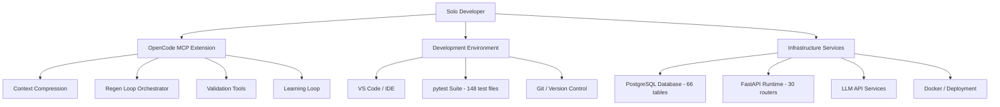

# Resource Plan

| Field | Value |
|---|---|
| Version | 1.0-draft |
| Date | 2026-07-08 |
| Project | OpenCode Architecture Extension |
| System | N/A |
| Author | TBD |

## Revision History

| Version | Date | Description |
|---|---|---|
| 1.0-draft | 2026-07-08 | Initial draft from automated analysis |

## Project Profile: OpenCode Architecture Extension
Status: active | Type: new-build | Category: 
OpenCode MCP extension providing architecture context compression, validation tools, regen-loop orchestrator with blind mode, and learning loop for LLM-driven code regeneration.

### Live System Metrics (auto-generated at artifact build time)
| Metric | Value |
|---|---|
| Total logs | 0 |
| Database tables | 66 |
| Latest migration | 056 |
| Python source files | 448 |
| Test files | 148 |
| API routers | 30 |
| SQLAlchemy models | 30 |
| HTML templates | 18 |

---

## 1. Resource Management Approach

### Strategy Overview

This project operates as a **solo-developer resource model** augmented by LLM-driven development tooling. The resource strategy centers on maximizing throughput of a single technical contributor through automation, AI-assisted code generation, and systematic capacity management.

The approach follows three principles:

1. **Automation-first** — Minimize manual repetition through pipeline automation, MCP tooling, and regen-loop orchestration
2. **Sustainable pace** — Maintain consistent velocity through timeboxed sessions and capacity-aware planning
3. **Skill leverage** — Extend effective capacity through LLM pairing, architecture context compression, and blind-mode regeneration



### Resource Governance

| Governance Area | Mechanism |
|---|---|
| Capacity tracking | Session-based activity logging |
| Skill gaps | Technology radar assessment (see Technology Radar artifact) |
| Tool selection | Make-or-buy evaluation (see Procurement Management cross-ref) |
| Workload balancing | Timeboxed sprint cadence |

For cost implications of resource decisions, see **Cost Management** artifact.

---

## 2. Resource Inventory

### Human Resources

| Resource | Role | Allocation | Skills |
|---|---|---|---|
| Solo Developer | Full-stack engineer, architect, PM | 100% | Python, FastAPI, SQLAlchemy, PostgreSQL, systems engineering |
| LLM Assistants (OpenCode) | AI pair-programmer, context-aware code generation | On-demand | Code generation, architecture reasoning, test writing |

### Compute Resources

| Resource | Type | Purpose | Capacity |
|---|---|---|---|
| Development machine | Local | IDE, testing, local database | [TBD] |
| PostgreSQL instance | Database | 66 tables, migration 056 | [TBD] |
| Docker environment | Container runtime | Deployment, service orchestration | [TBD] |
| LLM API endpoint(s) | External service | Code generation, context compression, regen-loop | [TBD — rate limits apply] |

### Software Tools

| Tool | Category | Purpose | Version |
|---|---|---|---|
| Python | Language runtime | Primary development language (448 source files) | [TBD] |
| FastAPI | Web framework | API layer (30 routers) | [TBD] |
| SQLAlchemy | ORM | Data models (30 models) | [TBD] |
| Alembic | Migration framework | Schema evolution (56 migrations) | [TBD] |
| pytest | Test framework | Test execution (148 test files) | [TBD] |
| VS Code | IDE | Primary development environment | [TBD] |
| Docker / docker-compose | Containerization | Deployment and service management | [TBD] |
| Git | Version control | Source management | [TBD] |
| Mermaid | Diagramming | Architecture documentation | [TBD] |
| OpenCode MCP | Extension | Architecture context, regen-loop, validation | Current build |

### Services

| Service | Provider | Purpose | SLA |
|---|---|---|---|
| LLM API | [TBD] | Code generation, regen-loop orchestration | [TBD] |
| PostgreSQL hosting | [TBD] | Persistent data storage | [TBD] |
| Git hosting | [TBD] | Repository, CI/CD | [TBD] |

---

## 3. Skill Development

### Current Skill Profile

| Skill Domain | Proficiency | Evidence |
|---|---|---|
| Python / FastAPI development | Advanced | 448 source files, 30 routers |
| Database design (PostgreSQL) | Advanced | 66 tables, 56 migrations |
| Test engineering | Advanced | 148 test files |
| Systems engineering documentation | Advanced | 30+ SE artifact processes active |
| LLM-assisted development | Intermediate–Advanced | MCP extension development, regen-loop design |
| MCP protocol / tool contracts | Developing | Active new-build |
| Blind-mode validation | Developing | Active new-build |
| Context compression techniques | Developing | Active new-build |

### Skills Roadmap

```mermaid
gantt
    title Skill Development Roadmap
    dateFormat YYYY-Q
    axisFormat %Y-Q%q
    
    section Core Extension Skills
    MCP Tool Contract Design       :active, 2026-Q1, 2026-Q3
    Context Compression Tuning     :active, 2026-Q2, 2026-Q4
    Blind Mode Validation Patterns :active, 2026-Q2, 2026-Q3
    
    section Advanced Capabilities
    Learning Loop Design           :2026-Q3, 2026-Q4
    Gap Analyzer Calibration       :2026-Q3, 2026-Q4
    Prompt Template Engineering    :2026-Q2, 2026-Q4
    
    section Operational Maturity
    E2E Benchmark Methodology      :2026-Q3, 2027-Q1
    Production Observability       :2026-Q4, 2027-Q1
```

### Priority Development Areas

| Priority | Skill Area | Rationale | Development Method |
|---|---|---|---|
| 1 | MCP tool contract synchronization | Core to extension delivery | Build-and-learn through implementation |
| 2 | Context compression tuning | Directly impacts LLM effectiveness | Experimental iteration, benchmarking |
| 3 | Regen-loop blind mode validation | Novel capability requiring design maturity | Prototype, validate, document patterns |
| 4 | Learning loop lesson curation | Enables continuous improvement of regen quality | Iterative refinement with feedback data |
| 5 | Gap analyzer threshold calibration | Quality gate for generated output | Statistical analysis of regen outcomes |
| 6 | Prompt template versioning | Reproducibility of LLM interactions | Version control discipline, A/B comparison |

---

## 4. Capacity Planning

### Capacity Model

The project operates on a **single-resource capacity model** where effective throughput is a function of:

- Available developer hours per sprint
- LLM API availability and rate limits
- Cognitive load management (context switching penalty)
- Automation efficiency (regen-loop reduces manual coding)

| Capacity Dimension | Baseline | With MCP Extension (Target) |
|---|---|---|
| Lines of code managed | 448 files | 448+ files (reduced manual maintenance) |
| Test coverage maintenance | 148 test files | Automated regen of test scaffolding |
| Schema evolution | Manual migration authoring | Context-aware migration suggestion |
| Documentation freshness | Manual artifact updates | Learning loop auto-detection of drift |
| Regen iterations per session | [TBD] | [TBD — blind mode target throughput] |

### Velocity Indicators

| Indicator | Measurement | Current Value |
|---|---|---|
| Migrations per period | Count of new Alembic migrations | 56 cumulative (rate [TBD]) |
| Test files growth | New test files per sprint | [TBD] |
| Source file growth | Net new Python files per sprint | [TBD] |
| Artifact freshness | Days since last artifact update | [TBD] |

### Sustainable Pace Guidelines

| Guideline | Target |
|---|---|
| Maximum focused session length | [TBD] hours |
| Sprint duration | [TBD] |
| Context-switching buffer | Minimum 1 sprint item per session |
| Technical debt allocation | ≥20% of capacity reserved for maintenance |
| Learning/experimentation allocation | ≥10% of capacity for skill development |

### Capacity Risks

| Risk | Impact | Mitigation |
|---|---|---|
| LLM API downtime | Blocks regen-loop, reduces throughput | Local fallback modes, session queue |
| Cognitive overload | Reduced quality, increased defects | Timeboxing, context compression tooling |
| Single point of failure (solo dev) | Complete project stall | Documentation-as-insurance, automated pipelines |
| Scope creep across 30+ SE processes | Diluted focus | Strict sprint scope boundaries |

---

## 5. Tool Management

### Development Environment Specification

| Layer | Tool | Configuration |
|---|---|---|
| IDE | Visual Studio Code | Extensions: Python, Mermaid, MCP client [TBD] |
| Runtime | Python | Version [TBD] |
| Framework | FastAPI + Uvicorn | 30 API routers |
| ORM | SQLAlchemy | 30 models |
| Database | PostgreSQL | 66 tables |
| Migrations | Alembic | 56 migrations applied |
| Testing | pytest | 148 test files |
| Containerization | Docker / docker-compose | [TBD] |
| MCP Extension | OpenCode Architecture Extension | Active development |

### Dependency Management Strategy

| Practice | Implementation |
|---|---|
| Dependency pinning | requirements.txt / pyproject.toml with pinned versions |
| Vulnerability scanning | [TBD — tool selection pending] |
| License compliance | Tracked per Procurement Management artifact |
| Upgrade cadence | [TBD — monthly or quarterly review cycle] |

### Upgrade Cadence

| Dependency Class | Review Frequency | Upgrade Trigger |
|---|---|---|
| Security-critical (runtime) | Weekly scan | Any CVE with CVSS ≥ 7.0 |
| Framework (FastAPI, SQLAlchemy) | Quarterly | Feature need or deprecation |
| Test tooling (pytest, plugins) | Quarterly | Compatibility or feature need |
| Database (PostgreSQL) | Semi-annually | EOL or performance requirement |
| LLM APIs | Continuous | Model updates, pricing changes |
| MCP protocol | Per release | Breaking changes, new capabilities |

### Tool Evaluation Criteria

New tools are assessed against:

| Criterion | Weight | Notes |
|---|---|---|
| Solo-developer operability | High | Must not require team coordination overhead |
| Maintenance burden | High | Prefer zero-config or self-updating |
| Integration with MCP workflow | High | Must support context compression pipeline |
| Community/support longevity | Medium | Avoid orphaned dependencies |
| License compatibility | Medium | Must be compatible with project license |

For make-or-buy decisions on tooling, see **Procurement Management** artifact.

---

## Cross-References

| Artifact | Relevance to Resource Plan |
|---|---|
| Cost Management | Budget implications of resource decisions |
| Procurement Management | Make-or-buy decisions, vendor evaluation |
| Schedule Management | Sprint cadence consuming resource capacity |
| Technology Radar | Technology adoption status driving skill needs |
| Quality Management | Test coverage targets affecting capacity allocation |
| Risk Management | Resource-related risks and mitigations |

---

## Document Constraints

- **In scope**: Resource strategy, resource inventory, skill development, capacity planning, tool management
- **Out of scope**: Detailed schedule (see Schedule Management), procurement specifics (see Procurement Management), cost figures (see Cost Management)