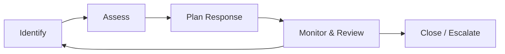
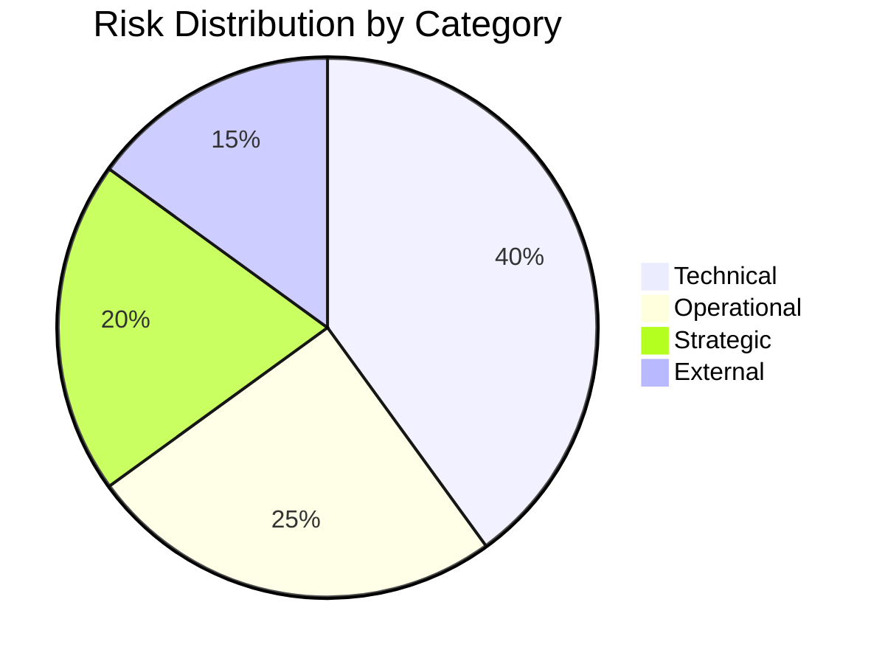
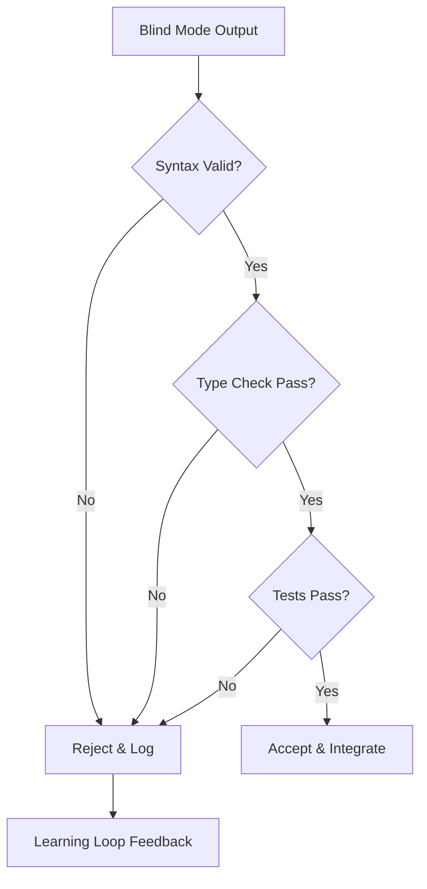
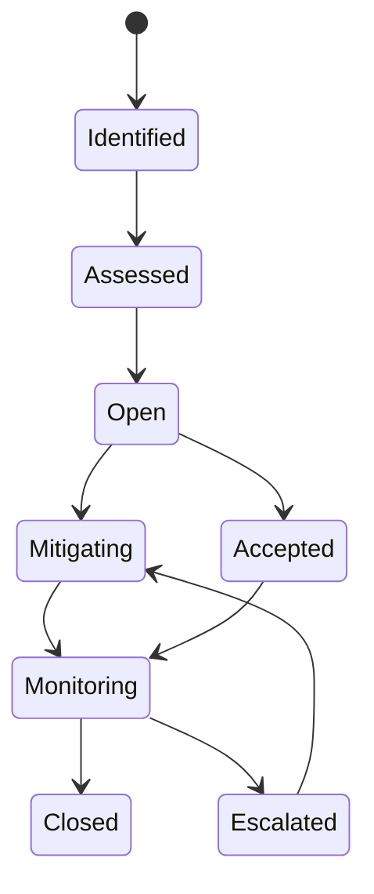

# Risk Register

| Field | Value |
|---|---|
| Version | 1.0-draft |
| Date | 2026-07-08 |
| Project | OpenCode Architecture Extension |
| System | N/A |
| Author | TBD |

## Revision History

| Version | Date | Description |
|---|---|---|
| 1.0-draft | 2026-07-08 | Initial draft from automated analysis |

## Project Profile: OpenCode Architecture Extension
Status: active | Type: new-build | Category: 
OpenCode MCP extension providing architecture context compression, validation tools, regen-loop orchestrator with blind mode, and learning loop for LLM-driven code regeneration.

### Live System Metrics (auto-generated at artifact build time)
| Metric | Value |
|---|---|
| Total logs | 0 |
| Database tables | 66 |
| Latest migration | 056 |
| Python source files | 448 |
| Test files | 148 |
| API routers | 30 |
| SQLAlchemy models | 30 |
| HTML templates | 18 |

---

## 1. Risk Management Approach

### Methodology

Risk management for the OpenCode Architecture Extension follows an iterative identification-assessment-response-monitor cycle aligned with the project's sprint cadence. Risks are identified from technical analysis, operational dependencies, and strategic alignment reviews.

### Assessment Criteria

- **Probability**: High (>70%), Medium (30–70%), Low (<30%)
- **Impact**: High (blocks delivery / data loss / critical failure), Medium (degrades capability / delays sprint), Low (minor inconvenience / workaround exists)
- **Risk Score**: Probability × Impact mapped to a 3×3 matrix (H/H=9, H/M=6, M/M=4, etc.)

### Integration with SEMP

Risk management is governed by the Systems Engineering Management Plan (see *Systems Engineering Management Plan* artifact for review gate definitions and configuration management controls). This register is the operational instantiation of risk tracking referenced therein.

---

## 2. Risk Categories

| Category | Description | Examples |
|---|---|---|
| **Technical** | Risks from architecture, code complexity, dependencies, data integrity | Schema drift, LLM API instability, blind mode output corruption |
| **Operational** | Risks from deployment, maintenance, monitoring gaps | Migration failures, test coverage regression, pipeline stalls |
| **Strategic** | Risks from scope, roadmap alignment, resource constraints | Scope creep, solo-developer bus factor, capability misalignment |
| **External** | Risks from third-party services, regulatory, or environment changes | LLM provider deprecation, license compliance, API rate limits |

---

## 3. Risk Register

| ID | Risk | Category | Prob | Impact | Score | Response Strategy | Owner | Status |
|---|---|---|---|---|---|---|---|---|
| R-001 | LLM service provider API breaking changes or deprecation disrupts regen-loop orchestrator | External | H | H | 9 | Mitigate: abstract LLM interface, maintain provider fallback | [TBD] | Open |
| R-002 | Schema drift between 66 database tables and 30 SQLAlchemy models causes data integrity failures | Technical | M | H | 6 | Prevent: enforce migration validation in CI; cross-ref Data Dictionary | [TBD] | Open |
| R-003 | Blind mode regeneration produces invalid code without detection, propagating errors downstream | Technical | M | H | 6 | Mitigate: implement validation gates and diff-based acceptance criteria | [TBD] | Open |
| R-004 | Context compression loses critical architectural semantics, causing incorrect LLM code generation | Technical | H | M | 6 | Mitigate: tuning benchmarks, threshold calibration, regression tests | [TBD] | Open |
| R-005 | Solo-developer bus factor — all project knowledge concentrated in single contributor | Strategic | H | H | 9 | Accept/Mitigate: documentation-as-communication strategy, ADR maintenance | [TBD] | Open |
| R-006 | Test coverage regression as codebase grows (448 source files vs 148 test files, ~33% ratio) | Operational | M | M | 4 | Mitigate: enforce coverage thresholds in CI, track per-sprint | [TBD] | Open |
| R-007 | Migration sequence conflicts when multiple schema changes target same tables (migration 056+) | Technical | M | M | 4 | Prevent: sequential migration discipline, pre-merge conflict detection | [TBD] | Open |
| R-008 | Learning loop accumulates stale or contradictory lessons degrading future generation quality | Technical | L | H | 3 | Mitigate: lesson curation process, periodic review and pruning | [TBD] | Open |
| R-009 | MCP tool contract drift between extension and OpenCode host causes integration failures | Technical | M | H | 6 | Prevent: contract synchronization checks, version pinning | [TBD] | Open |
| R-010 | Prompt template versioning gap causes inconsistent behavior across regen-loop invocations | Operational | M | M | 4 | Mitigate: version-controlled prompt templates with rollback capability | [TBD] | Open |
| R-011 | Gap analyzer threshold miscalibration produces false positives/negatives in architecture validation | Technical | M | M | 4 | Mitigate: calibration benchmarks, periodic threshold review | [TBD] | Open |
| R-012 | Infrastructure cost escalation from LLM API consumption during regen-loop iterations | External | M | M | 4 | Mitigate: usage monitoring, budget alerts, iteration caps | [TBD] | Open |
| R-013 | Third-party dependency license incompatibility discovered post-integration | External | L | H | 3 | Prevent: license audit in procurement process (see Procurement Management) | [TBD] | Open |
| R-014 | E2E benchmark regression undetected due to incomplete test coverage of new code paths | Operational | M | H | 6 | Mitigate: regression review process, automated benchmark suite | [TBD] | Open |
| R-015 | Scope creep from expanding MCP tool surface area beyond architectural extension boundaries | Strategic | H | M | 6 | Prevent: scope baseline enforcement, change control process | [TBD] | Open |

---

## 4. Risk Response Strategies

### R-001: LLM Service Provider Disruption (Score: 9)

**Strategy**: Mitigate + Contingency

**Response Plan**:
1. Abstract all LLM interactions behind a provider-agnostic interface layer
2. Maintain tested configurations for at least two LLM providers
3. Implement circuit-breaker pattern with graceful degradation (queue regen requests during outage)
4. Monitor provider status endpoints; alert on degradation within 5 minutes
5. **Contingency**: If primary provider deprecated with <30 days notice, activate secondary within one sprint

**Trigger**: Provider announces breaking change or measured uptime drops below 99% over rolling 7 days.

---

### R-005: Solo-Developer Bus Factor (Score: 9)

**Strategy**: Accept + Mitigate

**Response Plan**:
1. Maintain comprehensive SE artifact suite (current: 35+ process definitions) as institutional memory
2. ADRs document all key technical decisions with context and consequences
3. Operations Manual and Deployment Guide enable cold-start by new contributor
4. Automate where possible to reduce tacit knowledge dependency (CI/CD, migration scripts)
5. Learning loop lessons serve as codified engineering judgment

**Trigger**: Sustained period where documentation falls >2 sprints behind implementation.

---

### R-003: Blind Mode Invalid Code Propagation (Score: 6)

**Strategy**: Mitigate

**Response Plan**:
1. Implement multi-stage validation gate: syntax check → type check → unit test → integration test
2. Blind mode outputs quarantined until validation passes
3. Diff-based review compares regenerated code against architectural constraints
4. Automated rollback if validation gate fails after configurable retry count
5. Metrics: track blind mode acceptance rate; alert if drops below [TBD]% threshold

---

### R-004: Context Compression Semantic Loss (Score: 6)

**Strategy**: Mitigate

**Response Plan**:
1. Establish baseline semantic fidelity metrics through E2E benchmark suite
2. Context Compression Tuning process governs threshold adjustments
3. Regression tests compare compressed output against known-good reference set
4. Architecture-critical elements tagged as "non-compressible" with mandatory inclusion
5. Periodic human review of compression output for semantic drift detection

**Trigger**: E2E benchmark fidelity score drops below calibrated threshold.

---

### R-009: MCP Tool Contract Drift (Score: 6)

**Strategy**: Prevent

**Response Plan**:
1. MCP Tool Contract Synchronization process runs as pre-commit check
2. Contract definitions versioned alongside source; breaking changes require ADR
3. Integration tests validate tool registration, parameter schemas, and response formats
4. Version pinning on OpenCode host interface with explicit upgrade validation
5. **Contingency**: If breaking host change detected, freeze extension release until contract alignment confirmed

**Trigger**: Any MCP tool invocation returns schema validation error in test or production.

---

## 5. Risk Monitoring

### Review Cadence

| Activity | Frequency | Responsible |
|---|---|---|
| Risk register review | Per sprint | [TBD] |
| Top-5 risk deep review | Bi-weekly | [TBD] |
| New risk identification | Continuous (any contributor) | [TBD] |
| Risk score recalibration | Monthly | [TBD] |
| Post-incident risk update | Within 24 hours of trigger | [TBD] |

### Monitoring Mechanisms

- **Automated signals**: CI pipeline failures, test coverage delta, LLM API error rates, migration conflict detection
- **Manual signals**: Sprint retrospective findings, ADR reviews, stakeholder feedback
- **Threshold alerts**: Configured for R-001 (uptime), R-006 (coverage), R-012 (cost), R-014 (benchmark regression)

### Risk Status Lifecycle

### Reporting

Risk status is communicated through project status reports (see *Communications Management*). Critical risk escalations (score ≥ 6 with upward trend) are flagged immediately outside normal cadence.

### Cross-References

| Artifact | Relevance |
|---|---|
| Systems Engineering Management Plan | Governs risk management framework and review gates |
| Quality Management | Test coverage metrics feed R-006, R-014 |
| Data Dictionary | Schema integrity context for R-002 |
| Procurement Management | License compliance context for R-013 |
| Product Roadmap | Scope baseline for R-015 |