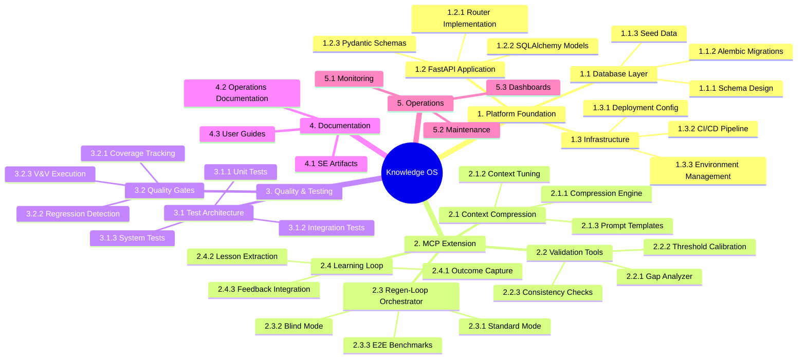

# Scope Statement & WBS

| Field | Value |
|---|---|
| Version | 1.0-draft |
| Date | 2026-07-08 |
| Project | OpenCode Architecture Extension |
| System | Knowledge OS (logs-db) |
| Author | TBD |

## Revision History

| Version | Date | Description |
|---|---|---|
| 1.0-draft | 2026-07-08 | Initial draft from automated analysis |

## Project Profile: OpenCode Architecture Extension
Status: active | Type: new-build | Category: Developer Tooling / Knowledge Management

OpenCode MCP extension providing architecture context compression, validation tools, regen-loop orchestrator with blind mode, and learning loop for LLM-driven code regeneration.

### Live System Metrics (auto-generated at artifact build time)

| Metric | Value |
|---|---|
| Total logs | 0 |
| Database tables | 66 |
| Latest migration | 056 |
| Python source files | 448 |
| Test files | 148 |
| API routers | 30 |
| SQLAlchemy models | 30 |
| HTML templates | 18 |

---

## 1. Project Scope Statement

### 1.1 Product Scope

The Knowledge OS is a FastAPI/PostgreSQL application providing structured knowledge capture, enrichment, retrieval, and LLM-assisted code regeneration capabilities. The product scope encompasses:

- **Architecture Context Compression** — Compresses system architecture knowledge into structured context windows suitable for LLM consumption
- **Validation Tools** — Verifies architectural consistency, data integrity, and requirement traceability
- **Regen-Loop Orchestrator (with Blind Mode)** — Orchestrates LLM-driven code regeneration cycles, including a blind mode where the LLM operates without prior file content
- **Learning Loop** — Captures regeneration outcomes, extracts lessons, and feeds improvements back into the system
- **Knowledge Management Platform** — 66-table PostgreSQL schema supporting logs, entities, pipelines, decisions, and cross-references
- **MCP Extension Interface** — Exposes tools via the Model Context Protocol for OpenCode integration

### 1.2 Project Scope

The project scope covers the design, implementation, testing, deployment, and documentation of the Knowledge OS from inception through operational capability, including:

**In-Scope:**

| Area | Description |
|---|---|
| Core Platform | FastAPI application with 30 API routers, 30 SQLAlchemy models, 66 database tables |
| MCP Tools | Architecture context, validation, regen-loop, and learning-loop tool endpoints |
| Database Layer | PostgreSQL schema through migration 056, Alembic migration management |
| Test Infrastructure | 148 test files covering unit, integration, and system testing |
| Documentation | Full SE artifact suite (ConOps, requirements, architecture, operations) |
| CI/CD Pipeline | Automated testing, deployment, and quality gates |
| UI Layer | 18 HTML templates for operational dashboards |

**Out-of-Scope:**

| Area | Rationale |
|---|---|
| Multi-tenant deployment | Solo-developer operational model; single-instance design |
| Mobile clients | Desktop IDE integration only via MCP protocol |
| Third-party marketplace distribution | Internal tooling; no public distribution planned |
| Custom LLM training/fine-tuning | Uses existing LLM APIs; no model training |
| Non-Python language support | Python-only codebase for current phase |

### 1.3 Constraints

- Solo-developer resource model constraining parallelization
- LLM API dependency for code regeneration features
- PostgreSQL as sole supported database engine
- MCP protocol compatibility requirements set by OpenCode

### 1.4 Assumptions

- LLM API services remain available and cost-effective
- OpenCode MCP protocol remains stable through development cycle
- PostgreSQL 14+ deployment environment available
- Development sessions generate sufficient knowledge data for learning loop effectiveness

---

## 2. Deliverables

| ID | Deliverable | Description | Acceptance Criteria |
|---|---|---|---|
| D-01 | Knowledge OS Core Platform | FastAPI application with all routers, models, and database schema | All 148 test files pass; 30 routers operational |
| D-02 | MCP Tool Suite | Architecture context compression, validation, regen-loop, learning-loop tools | Tools callable via MCP protocol; response time < 5s |
| D-03 | Context Compression Engine | Compresses architecture knowledge into LLM-optimal context windows | Compression ratio measurable; LLM regeneration success rate tracked |
| D-04 | Regen-Loop Orchestrator | Orchestration engine for LLM code regeneration including blind mode | End-to-end regeneration cycle completes; blind mode validated |
| D-05 | Learning Loop System | Feedback capture and lesson extraction from regeneration outcomes | Lessons stored; retrieval latency < 30s per ConOps requirement |
| D-06 | Validation Toolchain | Architecture consistency and data integrity verification tools | Gap detection functional; threshold calibration documented |
| D-07 | Database Schema | 66-table PostgreSQL schema with Alembic migrations (001–056) | All migrations apply cleanly; rollback tested |
| D-08 | Test Suite | 148 test files covering all quality gates | Test pass rate meets quality baseline [TBD threshold] |
| D-09 | SE Documentation Suite | Complete systems engineering artifact set | All artifacts current with system state |
| D-10 | Operational Dashboards | 18 HTML templates for system monitoring and management | Dashboards render correctly; data refresh functional |

---

## 3. Work Breakdown Structure

---

## 4. WBS Dictionary

| WBS ID | Element | Description | Acceptance Criteria | Responsible |
|---|---|---|---|---|
| 1.1 | Database Layer | PostgreSQL schema with 66 tables managed via Alembic | All 56 migrations apply; schema matches model definitions | [TBD] |
| 1.2 | FastAPI Application | Core web application with 30 routers serving API endpoints | All endpoints return correct responses; OpenAPI spec generated | [TBD] |
| 1.3 | Infrastructure | Deployment configuration, CI/CD, and environment management | One-command deployment; automated test execution on push | [TBD] |
| 2.1 | Context Compression | Engine that compresses architecture knowledge for LLM context windows | Measurable compression ratio; context fits within LLM token limits | [TBD] |
| 2.1.2 | Context Tuning | Calibration of compression parameters for optimal LLM performance | Tuning parameters documented; A/B comparison data available | [TBD] |
| 2.1.3 | Prompt Templates | Versioned templates for LLM interactions across system functions | Templates version-controlled; rollback capability demonstrated | [TBD] |
| 2.2 | Validation Tools | Architecture consistency verification and gap detection | Gaps identified match known architectural inconsistencies | [TBD] |
| 2.2.2 | Threshold Calibration | Configuration of gap analyzer sensitivity thresholds | False positive rate below [TBD]%; critical gaps never missed | [TBD] |
| 2.3 | Regen-Loop Orchestrator | Orchestrates LLM-driven code regeneration cycles | Complete regeneration cycle executes end-to-end without manual intervention | [TBD] |
| 2.3.2 | Blind Mode | Regeneration without prior file content provided to LLM | Blind mode output passes validation; comparison metrics vs. standard mode captured | [TBD] |
| 2.3.3 | E2E Benchmarks | End-to-end benchmark regression suite for regen-loop | Benchmark results tracked over time; regression detection automated | [TBD] |
| 2.4 | Learning Loop | Captures regeneration outcomes and extracts actionable lessons | Lessons queryable; time-to-insight < 30s | [TBD] |
| 2.4.2 | Lesson Curation | Review and quality control of extracted lessons | Curated lessons tagged and categorized; duplicates merged | [TBD] |
| 3.1 | Test Architecture | 148 test files organized by category with fixture management | Tests executable via `pytest`; categories clearly separated | [TBD] |
| 3.2 | Quality Gates | Automated quality checkpoints in CI pipeline | Gates block deployment on failure; metrics reported | [TBD] |
| 4.1 | SE Artifacts | Complete systems engineering documentation suite | All artifacts at version 1.0+; cross-references valid | [TBD] |
| 5.1 | Monitoring | Operational health checks and performance tracking | Health endpoints respond; alert thresholds configured | [TBD] |
| 5.3 | Dashboards | 18 HTML templates providing operational visibility | All templates render; data freshness within [TBD] interval | [TBD] |

---

## 5. Scope Baseline

### 5.1 Current Baseline

| Attribute | Value |
|---|---|
| Baseline Version | 1.0 |
| Established Date | 2026-07-08 |
| Total WBS Elements | 5 Level-1, 14 Level-2, 25 Level-3 |
| Database Scope | 66 tables, migration 056 |
| Code Scope | 448 Python source files |
| Test Scope | 148 test files |
| API Scope | 30 routers |
| UI Scope | 18 HTML templates |

### 5.2 Scope Change Log

| Change ID | Date | Description | Status | Impact |
|---|---|---|---|---|
| — | — | No changes recorded against baseline | — | — |

### 5.3 Scope Verification Process

Scope changes are managed through the Integration Management process (see *Integration Management* artifact). Changes require:

1. Change request documentation with impact analysis
2. Assessment against WBS dictionary acceptance criteria
3. Baseline update with version increment
4. Traceability update in requirements matrix (see *Requirements Analysis*)

### 5.4 Cross-References

| Artifact | Relationship |
|---|---|
| Requirements Analysis | Requirements traced to WBS elements; MoSCoW prioritization drives scope decisions |
| Concept of Operations | Operational scenarios define product scope boundaries |
| System Vision | Mission and target architecture constrain scope ceiling |
| Functional Architecture | Functional decomposition maps to WBS Level-2 elements |
| Integration Management | Governs scope change control process |
| Verification & Validation | Confirms deliverables meet acceptance criteria from WBS Dictionary |

---

*Document generated from live system analysis. All metrics reflect authoritative system state at build time. See Requirements Analysis for detailed requirement specifications and traceability.*